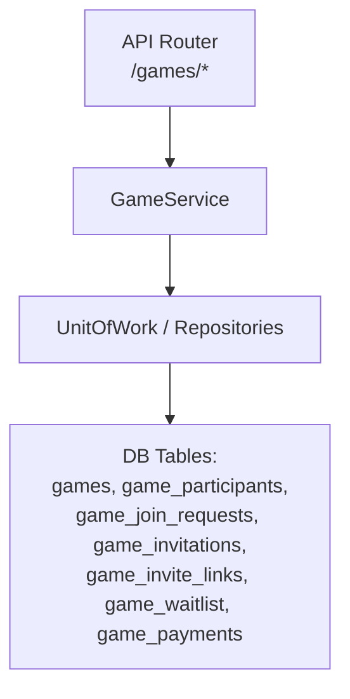
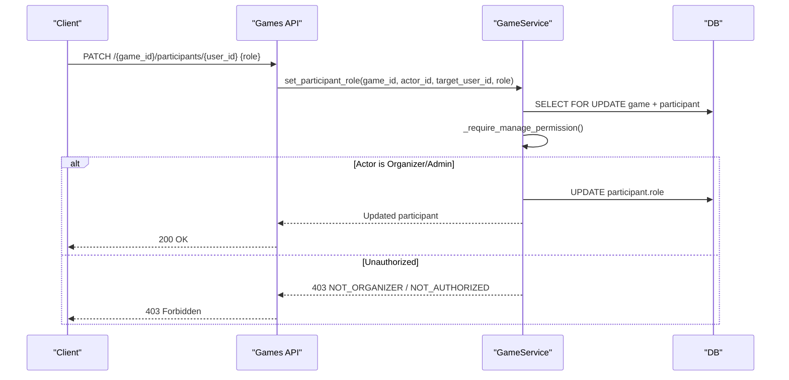
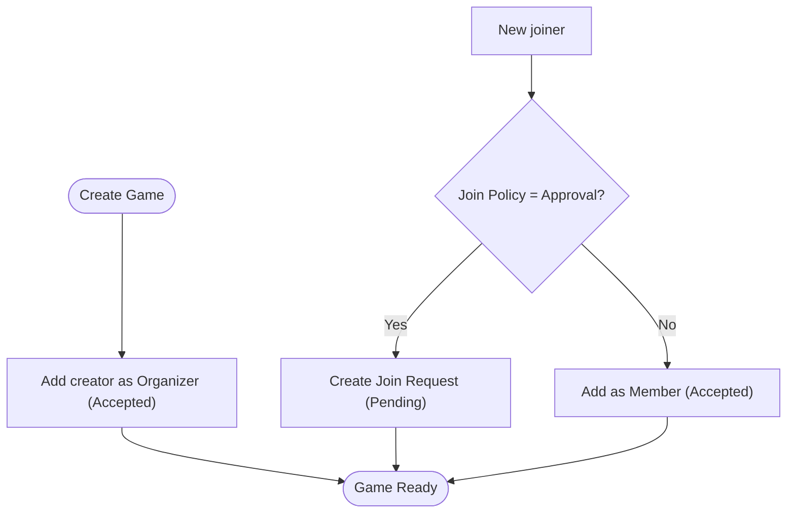
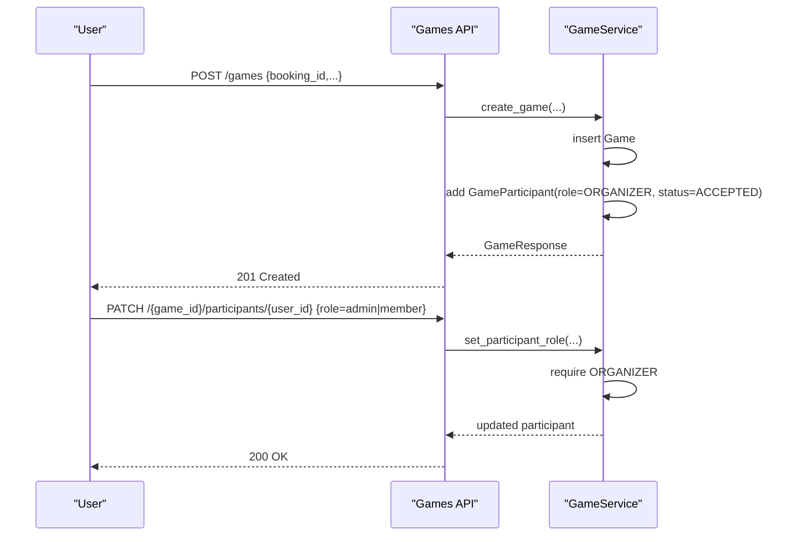
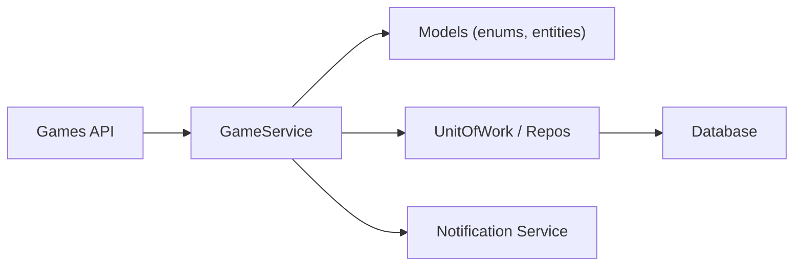

# Participant Roles and Permissions

<cite>
**Referenced Files in This Document**
- [game.py](file://app/models/game.py)
- [games.py](file://app/api/v1/games.py)
- [game_service.py](file://app/services/game_service.py)
- [game schemas](file://app/schemas/game.py)
</cite>

## Table of Contents
1. Introduction
2. Project Structure
3. Core Components
4. Architecture Overview
5. Detailed Component Analysis
6. Dependency Analysis
7. Performance Considerations
8. Troubleshooting Guide
9. Conclusion

## Introduction
This document explains the participant roles and permission system for the game management module. It covers three role types:
- Organizer: the game creator with full control over the game
- Admin: an appointed manager with elevated permissions
- Member: a regular participant

It details what each role can do (join/leave, manage participants, approve join requests, send invitations, modify settings), how roles are assigned at creation and later, examples of role-based access control scenarios, and error handling when users attempt unauthorized actions.

## Project Structure
The role and permission logic spans models, API routes, and service methods:
- Models define roles, statuses, and relationships for games, participants, invitations, and waitlist
- API routes enforce authentication and delegate to the service layer
- Service implements business rules, permission checks, and state transitions

**Diagram sources**
- [games.py:63-482](file://app/api/v1/games.py#L63-L482)
- [game_service.py:47-1214](file://app/services/game_service.py#L47-L1214)
- [game.py:97-258](file://app/models/game.py#L97-L258)

**Section sources**
- [games.py:1-482](file://app/api/v1/games.py#L1-L482)
- [game_service.py:1-1214](file://app/services/game_service.py#L1-L1214)
- [game.py:1-258](file://app/models/game.py#L1-L258)

## Core Components
- Role definitions and states:
  - Roles: Organizer, Admin, Member
  - Participant statuses: Invited, Pending, Accepted, Rejected, Left, Removed
  - Join policy: Open or Approval
  - Visibility: Private, Public, Public Approval
- Key entities:
  - Game: owns booking, organizer, visibility/join_policy, status
  - GameParticipant: links user to game with role/status
  - GameJoinRequest: pending join requests requiring approval
  - GameInvitation: direct invites to specific users
  - GameInviteLink: token-based join links
  - GameWaitlist: overflow queue
  - GamePayment: per-participant share payments

**Section sources**
- [game.py:20-85](file://app/models/game.py#L20-L85)
- [game.py:97-258](file://app/models/game.py#L97-L258)
- [game schemas:37-49](file://app/schemas/game.py#L37-L49)

## Architecture Overview
Role-based access is enforced primarily in the service layer using a centralized helper that requires “manage” permission (Organizer or Admin). The API routes depend on authenticated users and call service methods that validate roles before allowing sensitive operations.

**Diagram sources**
- [games.py:278-287](file://app/api/v1/games.py#L278-L287)
- [game_service.py:1043-1067](file://app/services/game_service.py#L1043-L1067)
- [game_service.py:68-75](file://app/services/game_service.py#L68-L75)

## Detailed Component Analysis

### Role Definitions and Assignment
- At game creation, the creator becomes the Organizer and is automatically added as an accepted participant with role Organizer.
- Regular joiners become Members with status Accepted (or Pending if approval required).
- Direct invitees receive role Member with status Invited until they accept.
- Waitlist entries become Members upon promotion.

**Diagram sources**
- [game_service.py:167-203](file://app/services/game_service.py#L167-L203)
- [game_service.py:341-429](file://app/services/game_service.py#L341-L429)
- [game_service.py:617-661](file://app/services/game_service.py#L617-L661)
- [game_service.py:127-162](file://app/services/game_service.py#L127-L162)

**Section sources**
- [game_service.py:167-203](file://app/services/game_service.py#L167-L203)
- [game_service.py:341-429](file://app/services/game_service.py#L341-L429)
- [game_service.py:617-661](file://app/services/game_service.py#L617-L661)
- [game_service.py:127-162](file://app/services/game_service.py#L127-L162)

### Permission Matrix by Role
Actions and who can perform them:

- Join a game
  - Any authenticated user can request to join if visibility allows; if approval is required, a join request is created
  - Via invite link or accepted invitation bypasses approval
  - Errors: already joined, already requested, game not open/cancelled/completed/started

- Leave a game
  - Members can leave if game is not started/completed/cancelled
  - Organizer cannot leave directly; must cancel or transfer admin
  - Errors: game started/completed/cancelled, not a participant

- Manage participants (remove, promote/demote)
  - Only Organizer and Admin can remove participants
  - Only Organizer can change roles (promote/demote); cannot change Organizer’s role
  - Errors: not authorized, not a participant, cannot remove organizer

- Approve/reject join requests
  - Only Organizer and Admin can decide join requests
  - Errors: request not found or already reviewed, game full

- Send invitations
  - Only Organizer and Admin can send direct invitations
  - Errors: game cancelled/started/completed, user not found, already joined, already invited

- Modify game settings (name, description, max_players, skill_level, visibility)
  - Only Organizer and Admin can update game fields via PATCH
  - Status changes must go through dedicated start/complete endpoints
  - Errors: invalid status transition, not authorized

- Set game result (winners)
  - Only Organizer and Admin can set results
  - Errors: not authorized

- Invite links (create/list/disable/regenerate)
  - Only Organizer and Admin can manage invite links
  - Errors: link not found, not authorized

- Payment reminders and share payment
  - Reminders: Organizer/Admin only
  - Pay share: only the participant themselves
  - Errors: rate limiting for reminders, not authorized for pay

**Section sources**
- [game_service.py:68-86](file://app/services/game_service.py#L68-L86)
- [game_service.py:431-462](file://app/services/game_service.py#L431-L462)
- [game_service.py:501-539](file://app/services/game_service.py#L501-L539)
- [game_service.py:543-613](file://app/services/game_service.py#L543-L613)
- [game_service.py:617-661](file://app/services/game_service.py#L617-L661)
- [game_service.py:712-773](file://app/services/game_service.py#L712-L773)
- [game_service.py:1043-1067](file://app/services/game_service.py#L1043-L1067)
- [game_service.py:1156-1188](file://app/services/game_service.py#L1156-L1188)
- [games.py:179-237](file://app/api/v1/games.py#L179-L237)
- [games.py:242-333](file://app/api/v1/games.py#L242-L333)
- [games.py:338-407](file://app/api/v1/games.py#L338-L407)
- [games.py:452-481](file://app/api/v1/games.py#L452-L481)

### How Role Assignment Works
- Creation:
  - The API POST /games creates a game and inserts the creator as Organizer (Accepted)
  - If visibility is public_approval, join_policy becomes approval; otherwise open
- Subsequent appointments:
  - Organizer can promote/demote any accepted participant to Admin or Member via PATCH /{game_id}/participants/{user_id}
  - Organizer cannot change their own role or remove themselves; they must cancel the game or transfer responsibilities externally

**Diagram sources**
- [games.py:63-71](file://app/api/v1/games.py#L63-L71)
- [game_service.py:167-203](file://app/services/game_service.py#L167-L203)
- [games.py:278-287](file://app/api/v1/games.py#L278-L287)
- [game_service.py:1043-1067](file://app/services/game_service.py#L1043-L1067)

**Section sources**
- [games.py:63-71](file://app/api/v1/games.py#L63-L71)
- [game_service.py:167-203](file://app/services/game_service.py#L167-L203)
- [games.py:278-287](file://app/api/v1/games.py#L278-L287)
- [game_service.py:1043-1067](file://app/services/game_service.py#L1043-L1067)

### Examples of Role-Based Access Control Scenarios
- Scenario 1: Member tries to remove another member
  - Expected: 403 NOT_AUTHORIZED because only Organizer/Admin can remove
  - Relevant path: DELETE /{game_id}/participants/{user_id}
- Scenario 2: Non-Organizer tries to promote someone to Admin
  - Expected: 403 NOT_ORGANIZER because only Organizer can change roles
  - Relevant path: PATCH /{game_id}/participants/{user_id}
- Scenario 3: Member joins a private game without invite
  - Expected: 403 PRIVATE_GAME
  - Relevant path: POST /{game_id}/join
- Scenario 4: Organizer leaves a started game
  - Expected: 409 GAME_STARTED; also Organizer cannot leave at all unless canceled or admin transferred
  - Relevant path: POST /{game_id}/leave
- Scenario 5: Admin approves a join request when game is full
  - Expected: 409 GAME_FULL
  - Relevant path: POST /{game_id}/join-requests/{request_id}/approve

**Section sources**
- [game_service.py:501-539](file://app/services/game_service.py#L501-L539)
- [game_service.py:1043-1067](file://app/services/game_service.py#L1043-L1067)
- [game_service.py:341-429](file://app/services/game_service.py#L341-L429)
- [game_service.py:431-462](file://app/services/game_service.py#L431-L462)
- [game_service.py:555-613](file://app/services/game_service.py#L555-L613)

### Error Handling Summary
Errors are structured with a code and message. Common codes include:
- NOT_AUTHORIZED: Not a participant or insufficient role
- NOT_ORGANIZER: Only Organizer can change roles
- PRIVATE_GAME: Attempting to view/join a private game without permission
- ALREADY_JOINED / ALREADY_REQUESTED / ALREADY_WAITLISTED: Duplicate action
- GAME_CANCELLED / GAME_STARTED / GAME_COMPLETED / GAME_NOT_OPEN: Invalid state transitions
- REQUEST_NOT_FOUND: Join request not found or already reviewed
- INVITE_INVALID / INVITE_EXPIRED: Invite link issues
- INVALID_ROLE: Disallowed role value
- PAYMENT_NOT_REQUIRED / PAYMENT_ALREADY_PAID: Payment flow errors
- RATE_LIMITED: Reminder cooldown exceeded

These are raised from service helpers and returned via FastAPI HTTPException.

**Section sources**
- [game_service.py:43-45](file://app/services/game_service.py#L43-L45)
- [game_service.py:68-86](file://app/services/game_service.py#L68-L86)
- [game_service.py:341-429](file://app/services/game_service.py#L341-L429)
- [game_service.py:555-613](file://app/services/game_service.py#L555-L613)
- [game_service.py:776-800](file://app/services/game_service.py#L776-L800)
- [game_service.py:1043-1067](file://app/services/game_service.py#L1043-L1067)
- [game_service.py:1092-1152](file://app/services/game_service.py#L1092-L1152)
- [games.py:179-192](file://app/api/v1/games.py#L179-L192)
- [games.py:452-468](file://app/api/v1/games.py#L452-L468)

## Dependency Analysis
- API depends on service for all business logic and permission enforcement
- Service depends on models for enums and data structures
- Service uses UnitOfWork to lock rows during critical operations (SELECT ... FOR UPDATE) to prevent race conditions on capacity and promotions
- Notifications are dispatched asynchronously after successful operations

**Diagram sources**
- [games.py:63-482](file://app/api/v1/games.py#L63-L482)
- [game_service.py:47-1214](file://app/services/game_service.py#L47-L1214)
- [game.py:97-258](file://app/models/game.py#L97-L258)

**Section sources**
- [games.py:63-482](file://app/api/v1/games.py#L63-L482)
- [game_service.py:47-1214](file://app/services/game_service.py#L47-L1214)
- [game.py:97-258](file://app/models/game.py#L97-L258)

## Performance Considerations
- Capacity-sensitive operations lock the game row to avoid race conditions when joining/waitlisting/promoting
- Refreshing game status (OPEN/FULL) occurs after join/leave/remove to keep counts consistent
- Notification dispatch is asynchronous and does not block core flows
- Rate limiting protects reminder endpoints to reduce load

[No sources needed since this section provides general guidance]

## Troubleshooting Guide
Common issues and resolutions:
- Cannot change roles: Ensure you are the Organizer; only Organizer can promote/demote
- Cannot remove participant: Ensure you have Organizer or Admin role; Organizer cannot be removed
- Cannot join: Check visibility and join policy; private games require invite/link; approval games require acceptance
- Cannot leave: Game must not be started/completed/cancelled; Organizer cannot leave directly
- Invite link invalid/expired: Regenerate or check usage limits
- Payment errors: Confirm split payment mode and that you are paying your own share

When debugging, inspect the error code and message returned by the API. These map to specific validation and permission checks in the service layer.

**Section sources**
- [game_service.py:68-86](file://app/services/game_service.py#L68-L86)
- [game_service.py:431-462](file://app/services/game_service.py#L431-L462)
- [game_service.py:501-539](file://app/services/game_service.py#L501-L539)
- [game_service.py:776-800](file://app/services/game_service.py#L776-L800)
- [game_service.py:1092-1152](file://app/services/game_service.py#L1092-L1152)

## Conclusion
The game management module enforces a clear three-tier role model:
- Organizer: full control including role assignment and game lifecycle
- Admin: elevated management capabilities but cannot assign roles
- Member: participates and pays shares

Permissions are consistently enforced in the service layer with explicit checks and structured errors. Use the provided endpoints to manage participants, approvals, invitations, and settings while respecting role boundaries and game state constraints.