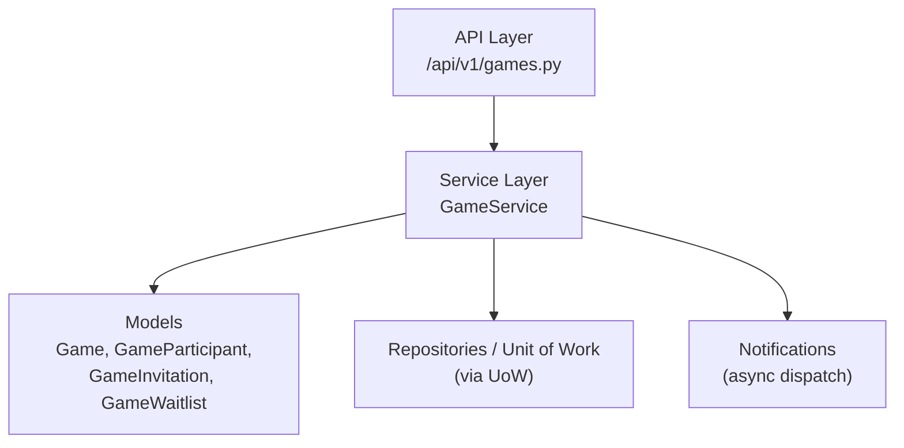
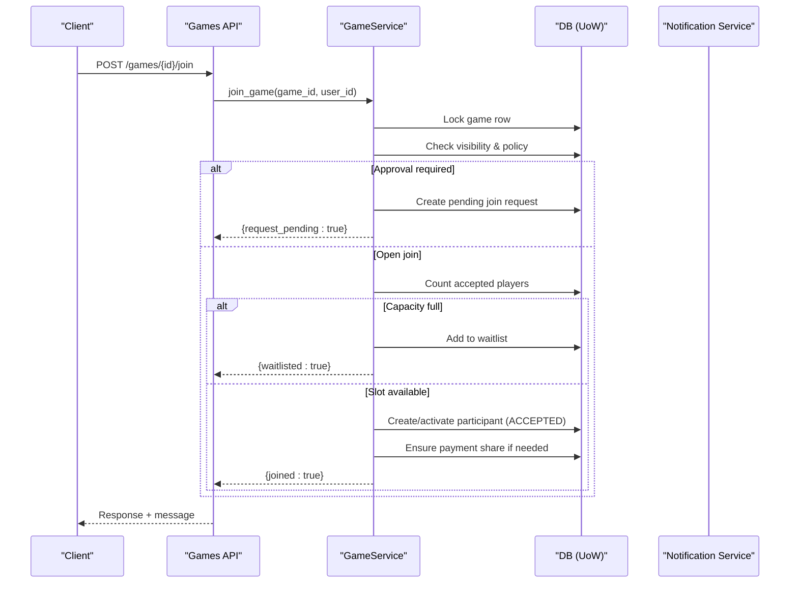
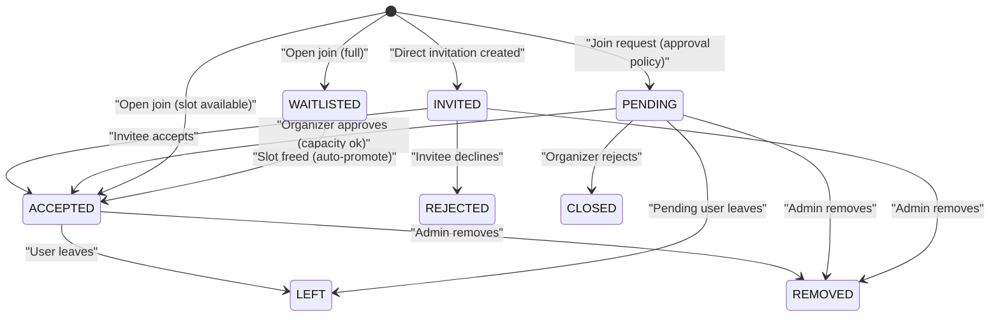
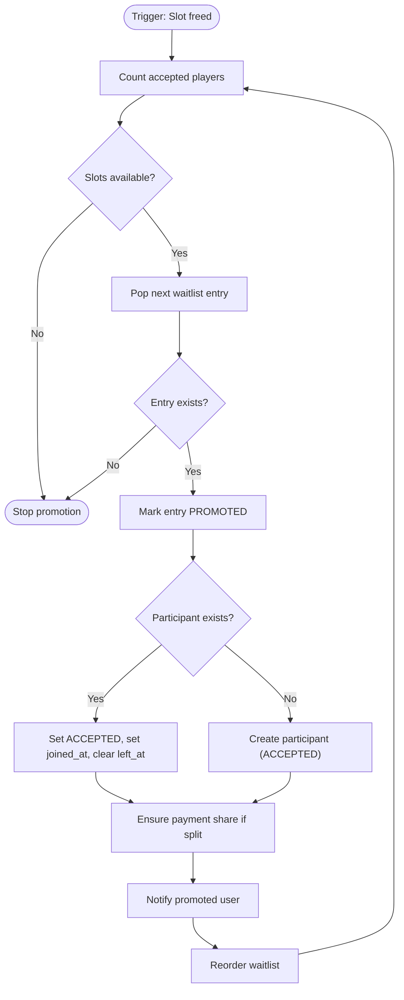
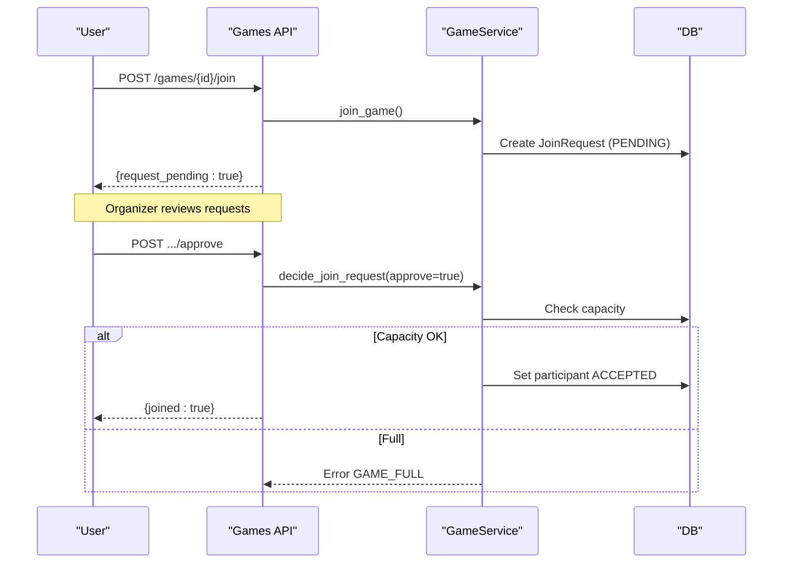
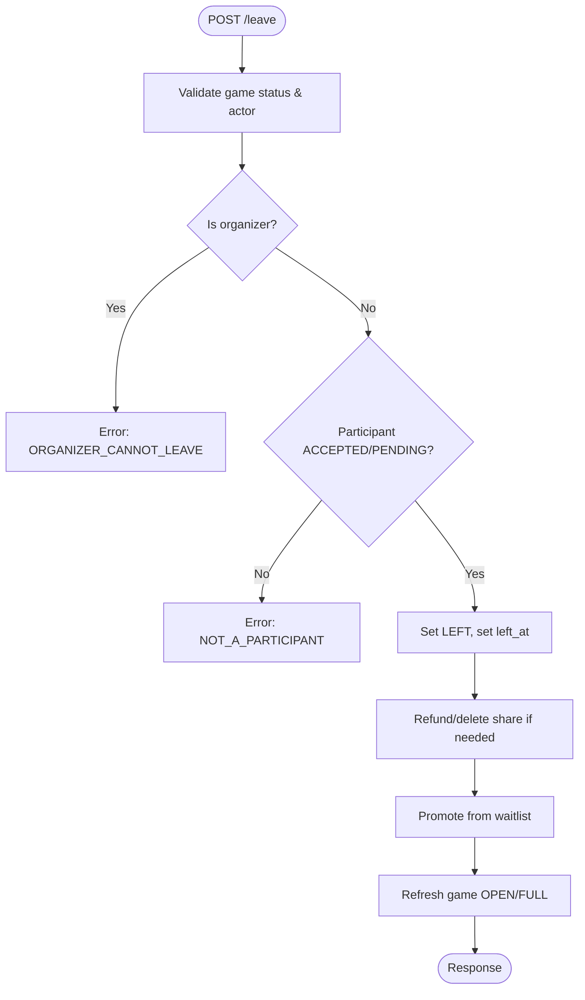
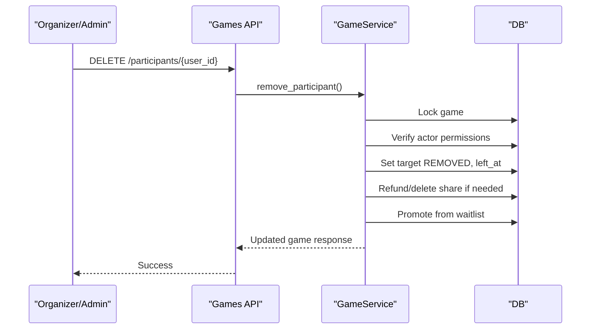
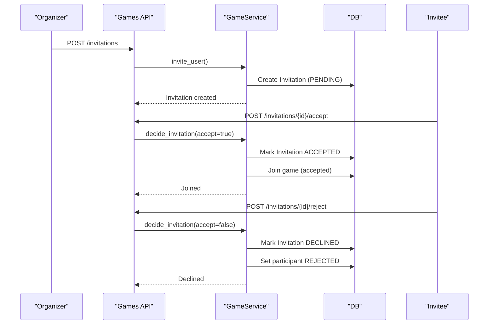
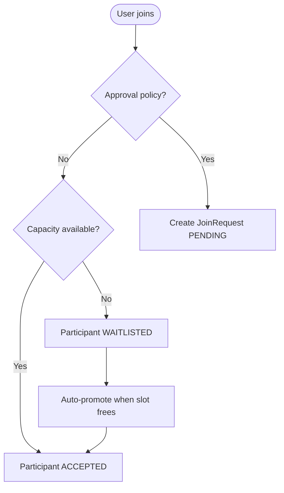
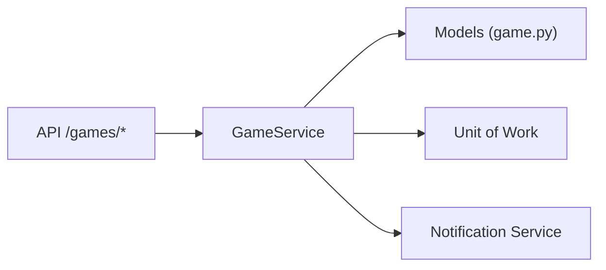

# Participant Status Workflow

<cite>
**Referenced Files in This Document**
- [game.py](file://app/models/game.py)
- [game_service.py](file://app/services/game_service.py)
- [games.py](file://app/api/v1/games.py)
- [test_games_join.py](file://tests/test_games_join.py)
- [test_games_invitations.py](file://tests/test_games_invitations.py)
</cite>

## Table of Contents
1. [Introduction](#introduction)
2. [Project Structure](#project-structure)
3. [Core Components](#core-components)
4. [Architecture Overview](#architecture-overview)
5. [Detailed Component Analysis](#detailed-component-analysis)
6. [Dependency Analysis](#dependency-analysis)
7. [Performance Considerations](#performance-considerations)
8. [Troubleshooting Guide](#troubleshooting-guide)
9. [Conclusion](#conclusion)

## Introduction
This document explains the participant status workflow for group games, focusing on how participants move through statuses such as Pending (awaiting approval), Accepted (active member), Invited (received invitation), Left (voluntarily departed), Removed (removed by organizer), and Rejected (invitation declined). It covers triggers like automatic waitlist promotions, manual approvals, user-initiated leaves, and administrative removals, and documents the state machine logic that prevents invalid transitions and maintains data consistency.

## Project Structure
Participant status transitions are implemented across:
- Data models defining statuses and entities
- Service layer enforcing business rules and state transitions
- API endpoints exposing operations to clients
- Tests validating behavior under various scenarios

**Diagram sources**
- [games.py:240-333](file://app/api/v1/games.py#L240-L333)
- [game_service.py:341-462](file://app/services/game_service.py#L341-L462)
- [game_service.py:617-708](file://app/services/game_service.py#L617-L708)
- [game_service.py:805-842](file://app/services/game_service.py#L805-L842)
- [game.py:59-85](file://app/models/game.py#L59-L85)

**Section sources**
- [game.py:59-85](file://app/models/game.py#L59-L85)
- [game_service.py:341-462](file://app/services/game_service.py#L341-L462)
- [game_service.py:617-708](file://app/services/game_service.py#L617-L708)
- [game_service.py:805-842](file://app/services/game_service.py#L805-L842)
- [games.py:240-333](file://app/api/v1/games.py#L240-L333)

## Core Components
- ParticipantStatus defines the lifecycle states for a participant in a game: INVITED, PENDING, ACCEPTED, REJECTED, LEFT, REMOVED.
- JoinRequestStatus tracks join requests when join policy requires approval.
- InvitationStatus tracks direct invitations sent to users.
- WaitlistStatus tracks positions and outcomes for users waiting for an open slot.
- GameService implements all transitions with concurrency-safe locking and consistent updates to game capacity and notifications.

Key responsibilities:
- Enforce visibility and join policy before allowing joins or creating requests.
- Maintain accurate accepted player counts and game status (OPEN/FULL).
- Promote from waitlist automatically when slots free up.
- Handle payments per participant share when split payment is enabled.
- Provide admin controls to remove participants and manage roles.

**Section sources**
- [game.py:59-85](file://app/models/game.py#L59-L85)
- [game_service.py:112-162](file://app/services/game_service.py#L112-L162)
- [game_service.py:341-462](file://app/services/game_service.py#L341-L462)
- [game_service.py:501-539](file://app/services/game_service.py#L501-L539)
- [game_service.py:617-708](file://app/services/game_service.py#L617-L708)
- [game_service.py:805-842](file://app/services/game_service.py#L805-L842)

## Architecture Overview
The workflow spans three layers:
- API routes accept user actions (join, leave, invite, approve request, remove participant).
- Service methods enforce business rules, update database records via Unit of Work, and emit notifications.
- Models define enums and relationships that constrain valid states and ensure referential integrity.

**Diagram sources**
- [games.py:242-264](file://app/api/v1/games.py#L242-L264)
- [game_service.py:341-429](file://app/services/game_service.py#L341-L429)

## Detailed Component Analysis

### Participant Statuses and Valid Transitions
- INVITED: Created when a direct invitation is issued; awaiting acceptance.
- PENDING: Created when a user requests to join a game with approval policy; awaiting organizer/admin decision.
- ACCEPTED: Active participant with a slot; can leave or be removed.
- REJECTED: Invitation declined by invitee; not an active participant.
- LEFT: User voluntarily left; eligible to rejoin later.
- REMOVED: Admin/organizer removed the participant; eligible to rejoin later.

Valid transitions enforced by service logic:
- Direct invitation flow:
  - INVITED → ACCEPTED upon acceptance (joins directly, bypassing approval policy).
  - INVITED → REJECTED upon decline.
- Join request flow:
  - PENDING → ACCEPTED upon organizer/admin approval (if capacity allows).
  - PENDING → effectively closed after rejection (no participant created).
- Normal join flow:
  - Non-participant → ACCEPTED if capacity allows.
  - Non-participant → WAITLISTED if capacity full.
- Leave flow:
  - ACCEPTED → LEFT (user-initiated).
  - PENDING → LEFT (pending joiner leaves before approval).
- Removal flow:
  - ACCEPTED/PENDING/INVITED → REMOVED (admin/organizer action).
- Waitlist promotion:
  - WAITLISTED → ACCEPTED automatically when a slot frees up.

**Diagram sources**
- [game_service.py:341-462](file://app/services/game_service.py#L341-L462)
- [game_service.py:501-539](file://app/services/game_service.py#L501-L539)
- [game_service.py:617-708](file://app/services/game_service.py#L617-L708)
- [game_service.py:805-842](file://app/services/game_service.py#L805-L842)

**Section sources**
- [game_service.py:341-462](file://app/services/game_service.py#L341-L462)
- [game_service.py:501-539](file://app/services/game_service.py#L501-L539)
- [game_service.py:617-708](file://app/services/game_service.py#L617-L708)
- [game_service.py:805-842](file://app/services/game_service.py#L805-L842)

### Automatic Promotions from Waitlist
When a participant leaves or is removed, the system promotes the first eligible waitlisted user to ACCEPTED, creates or reactivates their participant record, ensures payment share creation if applicable, and reorders the waitlist. The game status remains FULL until no more waitlisted users can be promoted.

**Diagram sources**
- [game_service.py:127-162](file://app/services/game_service.py#L127-L162)
- [game_service.py:431-462](file://app/services/game_service.py#L431-L462)
- [game_service.py:501-539](file://app/services/game_service.py#L501-L539)

**Section sources**
- [game_service.py:127-162](file://app/services/game_service.py#L127-L162)
- [game_service.py:431-462](file://app/services/game_service.py#L431-L462)
- [game_service.py:501-539](file://app/services/game_service.py#L501-L539)

### Manual Approvals (Join Requests)
For games with approval policy:
- Users create a join request (status PENDING).
- Organizer/admin lists pending requests and approves or rejects.
- On approval, if capacity allows, participant becomes ACCEPTED; otherwise, error indicates full capacity.
- On rejection, request is marked rejected and no participant is created.

**Diagram sources**
- [game_service.py:341-429](file://app/services/game_service.py#L341-L429)
- [game_service.py:555-613](file://app/services/game_service.py#L555-L613)
- [games.py:303-333](file://app/api/v1/games.py#L303-L333)

**Section sources**
- [game_service.py:341-429](file://app/services/game_service.py#L341-L429)
- [game_service.py:555-613](file://app/services/game_service.py#L555-L613)
- [games.py:303-333](file://app/api/v1/games.py#L303-L333)

### User-Initiated Leaves
A participant can leave if:
- The game is not started/completed/cancelled.
- The user is not the organizer.
- The user is currently ACCEPTED or PENDING.

On leave:
- Participant status becomes LEFT with timestamp.
- Payment share is refunded or deleted depending on its status.
- Waitlist promotion runs to fill the vacancy.

**Diagram sources**
- [game_service.py:431-462](file://app/services/game_service.py#L431-L462)
- [game_service.py:484-499](file://app/services/game_service.py#L484-L499)

**Section sources**
- [game_service.py:431-462](file://app/services/game_service.py#L431-L462)
- [game_service.py:484-499](file://app/services/game_service.py#L484-L499)

### Administrative Removals
Organizers/admins can remove participants who are ACCEPTED, PENDING, or INVITED. On removal:
- Participant status becomes REMOVED with timestamp.
- Payment share is refunded or deleted based on status.
- Waitlist promotion runs to fill the vacancy.

**Diagram sources**
- [game_service.py:501-539](file://app/services/game_service.py#L501-L539)
- [games.py:289-298](file://app/api/v1/games.py#L289-L298)

**Section sources**
- [game_service.py:501-539](file://app/services/game_service.py#L501-L539)
- [games.py:289-298](file://app/api/v1/games.py#L289-L298)

### Invitation Flow (Direct Invite)
- Organizer/admin invites a user; a GameInvitation is created (PENDING) and a participant record may be created with status INVITED.
- Invitee can accept or reject:
  - Accept: Joins directly (bypassing approval policy), participant becomes ACCEPTED.
  - Reject: Invitation marked DECLINED; participant status becomes REJECTED.

**Diagram sources**
- [game_service.py:617-708](file://app/services/game_service.py#L617-L708)
- [games.py:112-139](file://app/api/v1/games.py#L112-L139)

**Section sources**
- [game_service.py:617-708](file://app/services/game_service.py#L617-L708)
- [games.py:112-139](file://app/api/v1/games.py#L112-L139)

### Common Participant Journey Scenarios

#### Scenario A: Public Open Join
- User joins an open game; if capacity available, becomes ACCEPTED; otherwise added to waitlist.
- If later a slot opens, waitlisted user is promoted to ACCEPTED automatically.

**Diagram sources**
- [game_service.py:341-429](file://app/services/game_service.py#L341-L429)
- [game_service.py:127-162](file://app/services/game_service.py#L127-L162)

#### Scenario B: Approval Required Join
- User requests to join; request is PENDING.
- Organizer approves only if capacity allows; otherwise error.
- Approved user becomes ACCEPTED.

**Diagram sources**
- [game_service.py:341-429](file://app/services/game_service.py#L341-L429)
- [game_service.py:555-613](file://app/services/game_service.py#L555-L613)

#### Scenario C: Direct Invitation Accepted
- Organizer sends invitation; invitee accepts and joins directly regardless of visibility/approval policy.

**Diagram sources**
- [game_service.py:617-708](file://app/services/game_service.py#L617-L708)

#### Scenario D: User Leaves and Rejoins
- User leaves (ACCEPTED → LEFT); can rejoin later if game still open.

**Diagram sources**
- [game_service.py:431-462](file://app/services/game_service.py#L431-L462)
- [test_games_join.py:161-169](file://tests/test_games_join.py#L161-L169)

#### Error States
- Private game without token: access denied.
- Already joined/waitlisted/requested: duplicate action prevented.
- Game started/completed/cancelled: join/leave restricted.
- Invalid role changes: only organizer can change roles.

**Section sources**
- [game_service.py:68-86](file://app/services/game_service.py#L68-L86)
- [game_service.py:341-429](file://app/services/game_service.py#L341-L429)
- [game_service.py:431-462](file://app/services/game_service.py#L431-L462)
- [test_games_join.py:22-82](file://tests/test_games_join.py#L22-L82)
- [test_games_invitations.py:105-171](file://tests/test_games_invitations.py#L105-L171)

## Dependency Analysis
- API endpoints depend on GameService methods for all participant-related operations.
- GameService depends on:
  - Models for enums and entity definitions.
  - Unit of Work for transactional access to repositories.
  - Notification service for async delivery.
- Concurrency control uses row-level locks on game rows to prevent race conditions during capacity checks and promotions.

**Diagram sources**
- [games.py:240-333](file://app/api/v1/games.py#L240-L333)
- [game_service.py:341-462](file://app/services/game_service.py#L341-L462)

**Section sources**
- [games.py:240-333](file://app/api/v1/games.py#L240-L333)
- [game_service.py:341-462](file://app/services/game_service.py#L341-L462)

## Performance Considerations
- Row-level locking on game rows prevents concurrent modifications during join/leave/promotion flows.
- Efficient counting of accepted players drives game status updates (OPEN/FULL).
- Notifications are batched and dispatched asynchronously to avoid blocking main flows.
- Payment share handling is idempotent and avoids redundant ledger entries.

[No sources needed since this section provides general guidance]

## Troubleshooting Guide
Common errors and their causes:
- PRIVATE_GAME: Attempting to join a private game without a valid invite link or existing participation.
- ALREADY_JOINED: Duplicate join attempt while already ACCEPTED.
- ALREADY_WAITLISTED: Duplicate waitlist registration.
- ALREADY_REQUESTED: Duplicate join request under approval policy.
- GAME_STARTED/GAME_COMPLETED/GAME_CANCELLED: Restricted actions on non-open games.
- NOT_A_PARTICIPANT: User attempting to leave or modify status without being a participant.
- ORGANIZER_CANNOT_LEAVE: Organizer cannot leave; must cancel or transfer management.
- INVALID_STATUS_TRANSITION: Attempting invalid game status transition (separate from participant status).

Validation points:
- Visibility and join policy checks before join or request creation.
- Capacity checks before approving join requests or promoting from waitlist.
- Permission checks for admin/organizer-only actions.

**Section sources**
- [game_service.py:68-86](file://app/services/game_service.py#L68-L86)
- [game_service.py:341-429](file://app/services/game_service.py#L341-L429)
- [game_service.py:431-462](file://app/services/game_service.py#L431-L462)
- [game_service.py:501-539](file://app/services/game_service.py#L501-L539)
- [test_games_join.py:22-169](file://tests/test_games_join.py#L22-L169)
- [test_games_invitations.py:105-171](file://tests/test_games_invitations.py#L105-L171)

## Conclusion
The participant status workflow enforces a robust state machine that supports multiple entry paths (open join, approval-based join, direct invitation) and exit paths (leave, removal). Automatic waitlist promotion ensures efficient use of capacity, while strict validation prevents invalid transitions and maintains data consistency. The design separates concerns across API, service, and model layers, with concurrency safeguards and asynchronous notifications to keep the system responsive and reliable.