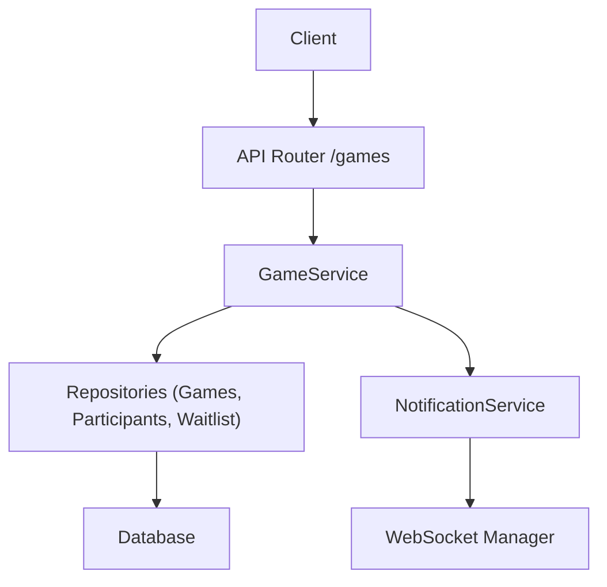
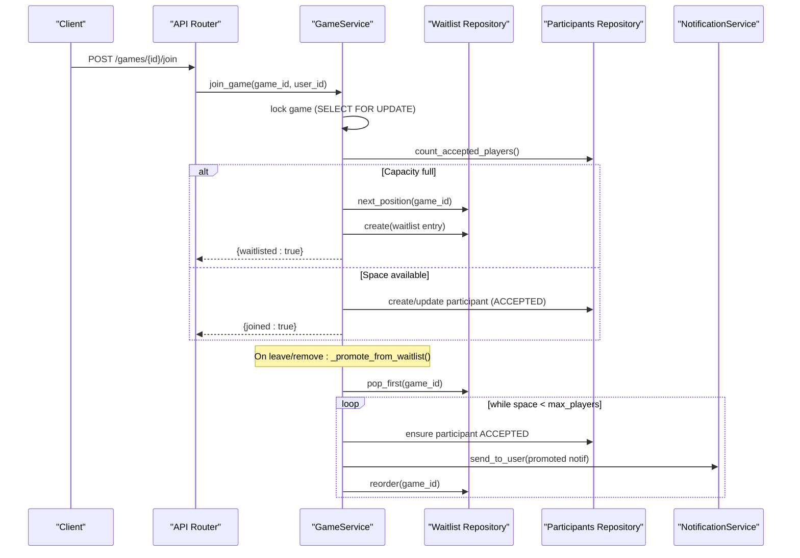
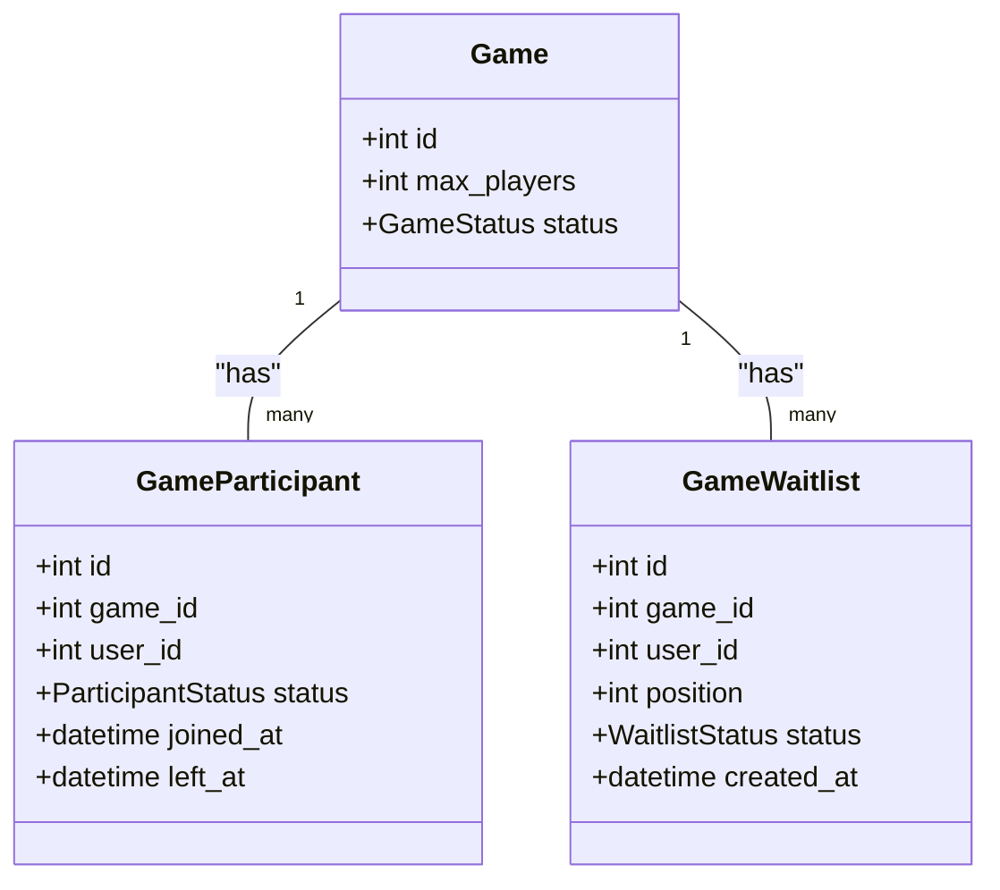
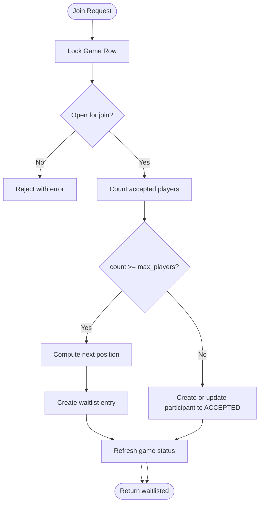
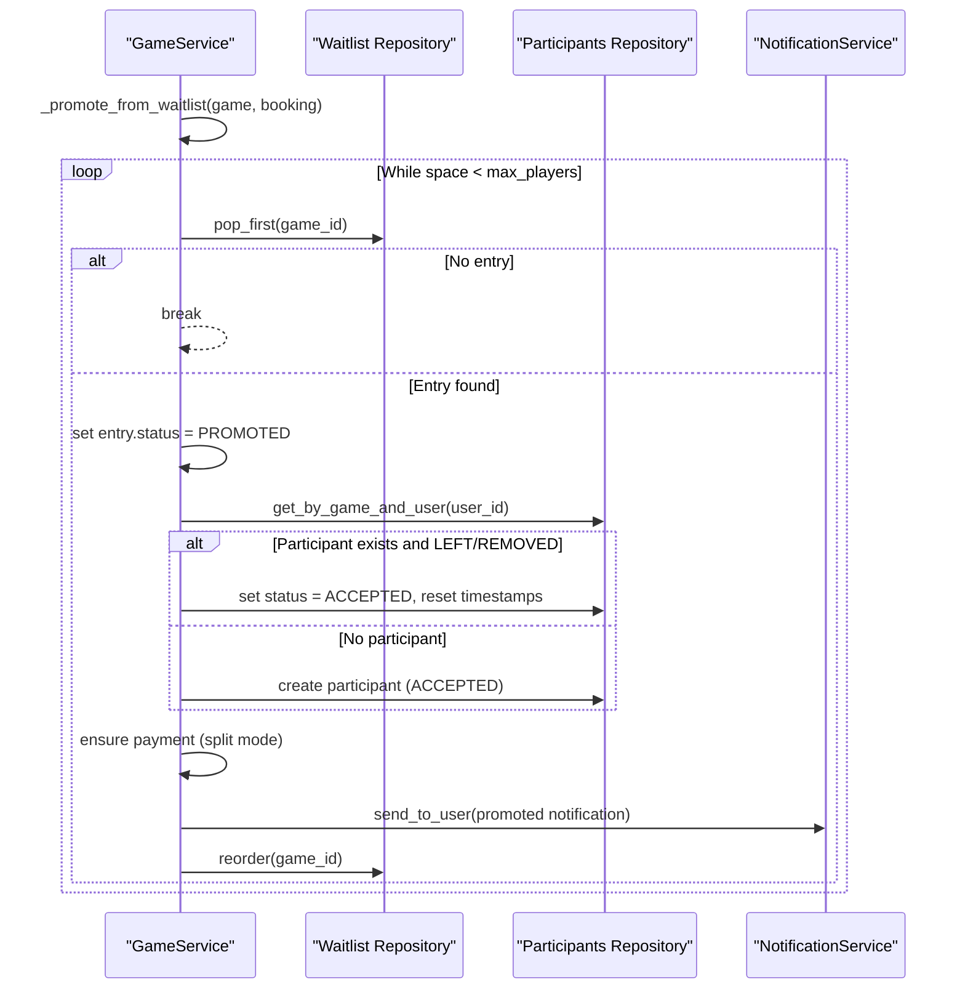
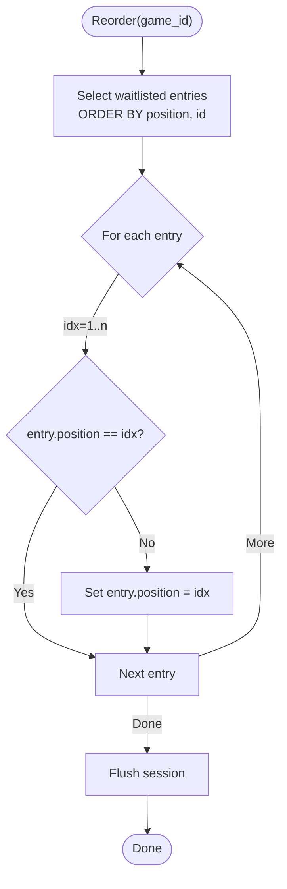
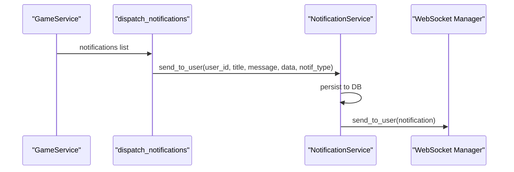
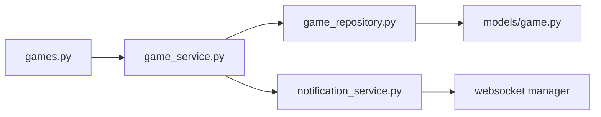

# Waitlist Management

<cite>
**Referenced Files in This Document**
- [game.py](file://app/models/game.py)
- [game_service.py](file://app/services/game_service.py)
- [game_repository.py](file://app/repositories/game_repository.py)
- [games.py](file://app/api/v1/games.py)
- [notification_service.py](file://app/services/notification_service.py)
</cite>

## Table of Contents
1. [Introduction](#introduction)
2. [Project Structure](#project-structure)
3. [Core Components](#core-components)
4. [Architecture Overview](#architecture-overview)
5. [Detailed Component Analysis](#detailed-component-analysis)
6. [Dependency Analysis](#dependency-analysis)
7. [Performance Considerations](#performance-considerations)
8. [Troubleshooting Guide](#troubleshooting-guide)
9. [Conclusion](#conclusion)
10. [Appendices](#appendices)

## Introduction
This document explains the waitlist system for group games when capacity is reached. It covers how users are added to the waitlist, how positions are assigned and maintained, how automatic promotion moves waitlisted users into accepted status when spots open, and how notifications are delivered to promoted users. It also includes scenarios such as multiple simultaneous departures, priority handling, and edge cases where promoted users may have already left or been removed.

## Project Structure
The waitlist feature spans models, services, repositories, API routes, and a notification service:
- Models define game entities, participants, and the waitlist table with position and status fields.
- The game service implements join logic, waitlist enrollment, promotion, reordering, and status refresh.
- Repositories provide safe queries for counting players, next position assignment, popping the first waitlisted user, and stable reordering.
- API routes expose endpoints to join, leave, list, and manage the waitlist.
- Notification service persists and delivers notifications via WebSocket.

**Diagram sources**
- [games.py:242-264](file://app/api/v1/games.py#L242-L264)
- [game_service.py:341-429](file://app/services/game_service.py#L341-L429)
- [game_repository.py:281-336](file://app/repositories/game_repository.py#L281-L336)
- [notification_service.py:50-64](file://app/services/notification_service.py#L50-L64)

**Section sources**
- [game.py:219-236](file://app/models/game.py#L219-L236)
- [game_service.py:127-162](file://app/services/game_service.py#L127-L162)
- [game_repository.py:281-336](file://app/repositories/game_repository.py#L281-L336)
- [games.py:410-439](file://app/api/v1/games.py#L410-L439)
- [notification_service.py:50-64](file://app/services/notification_service.py#L50-L64)

## Core Components
- Game model defines statuses including FULL and OPEN, and relationships to participants and waitlist entries.
- GameParticipant tracks acceptance and lifecycle states.
- GameWaitlist stores each user’s position and status (waitlisted, promoted, left).
- GameService orchestrates joining, waitlisting, promotion, reordering, and status refresh.
- GameWaitlistRepository provides atomic operations for next_position, pop_first, reorder, and listing by game.
- NotificationService persists and sends notifications to users.

**Section sources**
- [game.py:26-33](file://app/models/game.py#L26-L33)
- [game.py:138-154](file://app/models/game.py#L138-L154)
- [game.py:219-236](file://app/models/game.py#L219-L236)
- [game_service.py:113-162](file://app/services/game_service.py#L113-L162)
- [game_repository.py:281-336](file://app/repositories/game_repository.py#L281-L336)
- [notification_service.py:50-64](file://app/services/notification_service.py#L50-L64)

## Architecture Overview
The waitlist flow ensures that when a game reaches capacity, additional join attempts are placed on the waitlist in strict order. When a spot opens due to departure or removal, the system automatically promotes the earliest waitlisted user(s), updates participant records, handles payments if needed, and notifies promoted users.

**Diagram sources**
- [games.py:242-264](file://app/api/v1/games.py#L242-L264)
- [game_service.py:341-429](file://app/services/game_service.py#L341-L429)
- [game_service.py:127-162](file://app/services/game_service.py#L127-L162)
- [game_repository.py:301-336](file://app/repositories/game_repository.py#L301-L336)
- [notification_service.py:50-64](file://app/services/notification_service.py#L50-L64)

## Detailed Component Analysis

### Data Model: Waitlist and Related Entities
- GameWaitlist stores per-user entries with a monotonically increasing position and status transitions (waitlisted → promoted/left).
- Unique constraints prevent duplicate waitlist entries per game/user; positive position constraint enforces ordering integrity.
- GameStatus reflects capacity state (OPEN/FULL) and is refreshed after changes.

**Diagram sources**
- [game.py:97-133](file://app/models/game.py#L97-L133)
- [game.py:138-154](file://app/models/game.py#L138-L154)
- [game.py:219-236](file://app/models/game.py#L219-L236)

**Section sources**
- [game.py:219-236](file://app/models/game.py#L219-L236)
- [game.py:26-33](file://app/models/game.py#L26-L33)

### Joining and Adding to Waitlist
When a user tries to join:
- The game row is locked to avoid race conditions.
- If the game is not open/cancelled/started/completed, join is allowed based on policy.
- If capacity is reached, the user is added to the waitlist with the next available position.
- If space is available, the user becomes an accepted participant immediately.
- The game status is refreshed to OPEN or FULL accordingly.

**Diagram sources**
- [game_service.py:341-429](file://app/services/game_service.py#L341-L429)
- [game_repository.py:301-307](file://app/repositories/game_repository.py#L301-L307)

**Section sources**
- [game_service.py:341-429](file://app/services/game_service.py#L341-L429)
- [game_repository.py:301-307](file://app/repositories/game_repository.py#L301-L307)

### Automatic Promotion Mechanism
Promotion occurs whenever a spot opens:
- Triggered by participant leaving or being removed.
- The service repeatedly pops the first waitlisted user until no more spots are available.
- For each promoted user:
  - Their waitlist entry status is set to PROMOTED.
  - A participant record is created or updated to ACCEPTED; timestamps are adjusted if they had previously left or been removed.
  - Payment share is ensured for split-payment mode.
  - A notification is generated for the promoted user.
- After promotions, waitlist positions are reordered to be contiguous starting from 1.

**Diagram sources**
- [game_service.py:127-162](file://app/services/game_service.py#L127-L162)
- [game_repository.py:309-336](file://app/repositories/game_repository.py#L309-L336)
- [notification_service.py:50-64](file://app/services/notification_service.py#L50-L64)

**Section sources**
- [game_service.py:127-162](file://app/services/game_service.py#L127-L162)
- [game_repository.py:309-336](file://app/repositories/game_repository.py#L309-L336)

### Waitlist Reordering Algorithm
Reordering ensures positions remain contiguous and stable:
- Queries all waitlisted entries ordered by position then id.
- Assigns sequential positions starting at 1.
- Updates only those whose position changed to minimize writes.
- Flushes changes within the same transaction context.

**Diagram sources**
- [game_repository.py:322-336](file://app/repositories/game_repository.py#L322-L336)

**Section sources**
- [game_repository.py:322-336](file://app/repositories/game_repository.py#L322-L336)

### Notification System for Promotions
Promoted users receive notifications:
- The service builds a notification payload with title, message, data, and type.
- Notifications are dispatched asynchronously through the notification service.
- The notification service persists the message to the database and sends it via WebSocket to the user.

**Diagram sources**
- [game_service.py:1192-1214](file://app/services/game_service.py#L1192-L1214)
- [notification_service.py:50-64](file://app/services/notification_service.py#L50-L64)

**Section sources**
- [game_service.py:1192-1214](file://app/services/game_service.py#L1192-L1214)
- [notification_service.py:50-64](file://app/services/notification_service.py#L50-L64)

### API Endpoints for Waitlist
- List waitlist: GET /games/{game_id}/waitlist
- Join waitlist: POST /games/{game_id}/waitlist
- Leave waitlist: DELETE /games/{game_id}/waitlist
- Join game: POST /games/{game_id}/join (adds to waitlist if full)
- Leave game: POST /games/{game_id}/leave (triggers promotion)
- Remove participant: DELETE /games/{game_id}/participants/{user_id} (triggers promotion)

These endpoints call into GameService methods which implement the waitlist logic described above.

**Section sources**
- [games.py:242-264](file://app/api/v1/games.py#L242-L264)
- [games.py:410-439](file://app/api/v1/games.py#L410-L439)
- [game_service.py:805-842](file://app/services/game_service.py#L805-L842)

## Dependency Analysis
- GameService depends on:
  - GameRepository for locking and counts.
  - GameParticipantRepository for participant reads/writes.
  - GameWaitlistRepository for waitlist operations.
  - NotificationService for delivering notifications.
- Repositories depend on SQLAlchemy sessions and models.
- API routes depend on GameService and UnitOfWork.

**Diagram sources**
- [games.py:242-264](file://app/api/v1/games.py#L242-L264)
- [game_service.py:127-162](file://app/services/game_service.py#L127-L162)
- [game_repository.py:281-336](file://app/repositories/game_repository.py#L281-L336)
- [notification_service.py:50-64](file://app/services/notification_service.py#L50-L64)

**Section sources**
- [game_service.py:127-162](file://app/services/game_service.py#L127-L162)
- [game_repository.py:281-336](file://app/repositories/game_repository.py#L281-L336)
- [games.py:242-264](file://app/api/v1/games.py#L242-L264)

## Performance Considerations
- Concurrency safety: Game rows are locked during join/leave/promotion to prevent race conditions.
- Efficient counting: Accepted player counts are computed server-side using repository queries.
- Minimal updates: Reordering updates only entries whose position changed.
- Batch notifications: Promotions generate notifications per user; dispatch is asynchronous to avoid blocking.

[No sources needed since this section provides general guidance]

## Troubleshooting Guide
Common issues and resolutions:
- Already joined: Attempting to join again returns an error; check participant status before joining.
- Already waitlisted: Duplicate waitlist entries are prevented; verify current waitlist status.
- Cannot leave started/completed/cancelled games: Respect game status restrictions.
- Organizer cannot leave: Transfer management or cancel the game instead.
- Capacity below current players: Adjusting max_players must not go below accepted count.
- Invalid status transitions: Use appropriate endpoints to start/complete/cancel games.

**Section sources**
- [game_service.py:341-429](file://app/services/game_service.py#L341-L429)
- [game_service.py:431-539](file://app/services/game_service.py#L431-L539)
- [game_service.py:846-887](file://app/services/game_service.py#L846-L887)
- [game_service.py:890-917](file://app/services/game_service.py#L890-L917)

## Conclusion
The waitlist system ensures fair and deterministic access to games when capacity is reached. Users are added to the waitlist in order, and automatic promotion fills vacancies promptly while maintaining consistent state and notifying affected users. Robust locking, efficient queries, and clear APIs make the system reliable under concurrent usage.

[No sources needed since this section summarizes without analyzing specific files]

## Appendices

### Waitlist Scenarios and Edge Cases
- Multiple simultaneous departures: Each departure triggers promotion; the loop continues until no more spots are available, promoting multiple waitlisted users in order.
- Priority handling: Position-based FIFO; ties broken by waitlist id to ensure stability.
- Promoted user already left or removed: The promotion logic detects LEFT/REMOVED participant status and reactivates them as ACCEPTED with updated timestamps.
- Capacity change: Increasing max_players can trigger promotions if the game was FULL; decreasing is guarded to prevent dropping below accepted count.

**Section sources**
- [game_service.py:127-162](file://app/services/game_service.py#L127-L162)
- [game_service.py:846-887](file://app/services/game_service.py#L846-L887)
- [game_repository.py:309-336](file://app/repositories/game_repository.py#L309-L336)