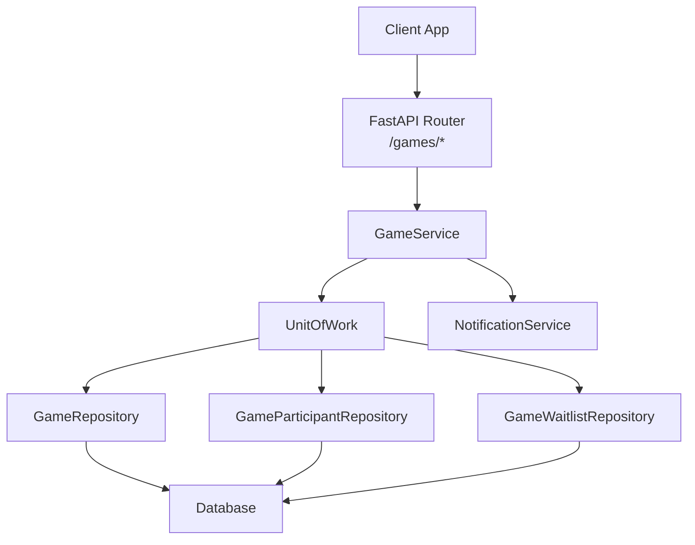
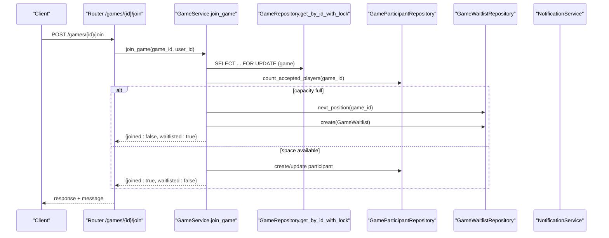
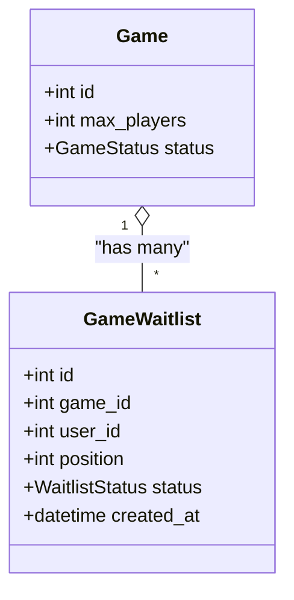
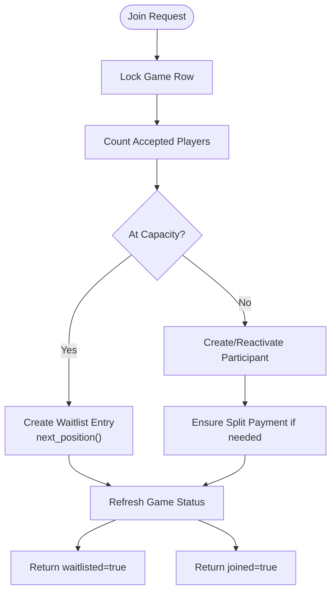
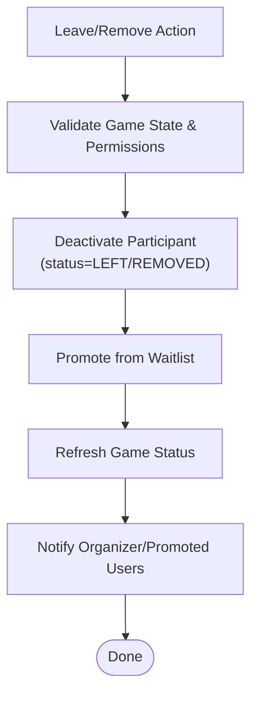
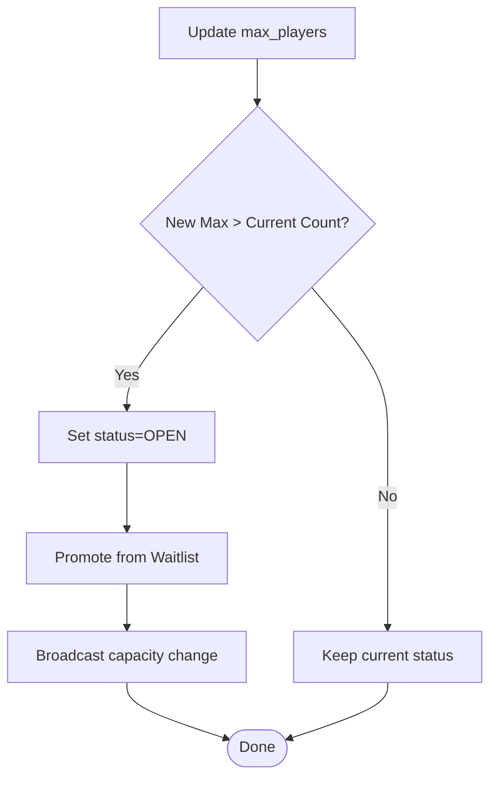
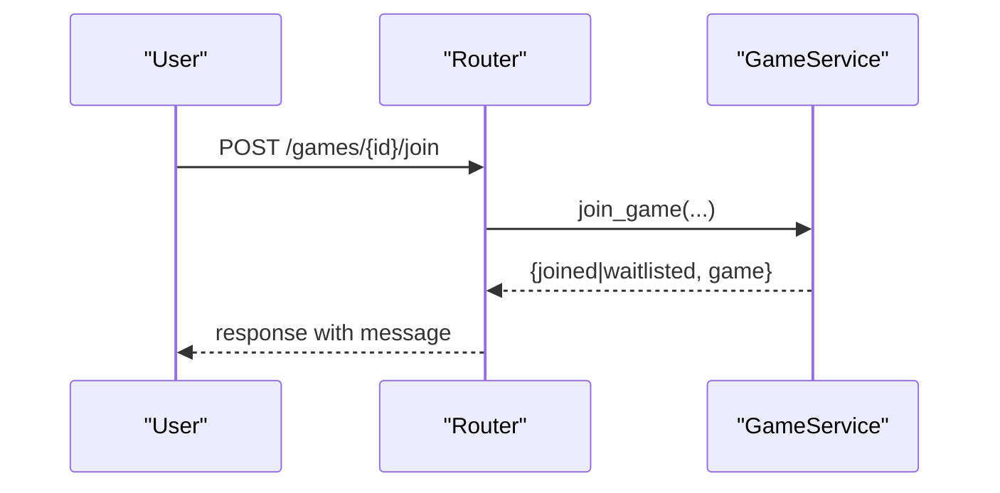
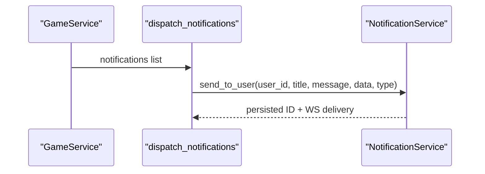
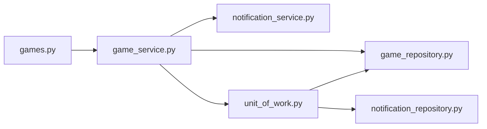

# Waitlist & Capacity Management

<cite>
**Referenced Files in This Document**
- [game.py](file://app/models/game.py)
- [booking.py](file://app/models/booking.py)
- [game_service.py](file://app/services/game_service.py)
- [games.py](file://app/api/v1/games.py)
- [game_repository.py](file://app/repositories/game_repository.py)
- [unit_of_work.py](file://app/unit_of_work.py)
- [notification_service.py](file://app/services/notification_service.py)
</cite>

## Table of Contents
1. Introduction
2. Project Structure
3. Core Components
4. Architecture Overview
5. Detailed Component Analysis
6. Dependency Analysis
7. Performance Considerations
8. Troubleshooting Guide
9. Conclusion

## Introduction
This document explains how the system manages waitlists and capacity for group games. It covers:
- How participants are added to a waitlist when a game reaches capacity
- Waitlist positioning and automatic promotion when spots open
- Notification flow for waitlisted users
- Capacity checking, real-time availability updates, and reordering logic
- Interaction between waitlists and participant management (leave/remove triggers promotions)
- Examples of workflows and scenarios with user notifications

## Project Structure
The waitlist and capacity features span models, services, repositories, API endpoints, and notification utilities:
- Models define Game, GameParticipant, GameWaitlist, and related enums
- Services implement business logic for joining, leaving, promotions, and status refresh
- Repositories provide data access with locking and ordering guarantees
- API endpoints expose join/waitlist operations and return structured responses
- Unit of Work coordinates transactions and repository access
- Notifications persist messages and deliver them via WebSocket



**Diagram sources**
- [games.py:240-265](file://app/api/v1/games.py#L240-L265)
- [game_service.py:341-429](file://app/services/game_service.py#L341-L429)
- [game_repository.py:281-336](file://app/repositories/game_repository.py#L281-L336)
- [unit_of_work.py:160-200](file://app/unit_of_work.py#L160-L200)
- [notification_service.py:50-64](file://app/services/notification_service.py#L50-L64)

**Section sources**
- [game.py:97-133](file://app/models/game.py#L97-L133)
- [game.py:221-236](file://app/models/game.py#L221-L236)
- [game_service.py:112-162](file://app/services/game_service.py#L112-L162)
- [game_repository.py:281-336](file://app/repositories/game_repository.py#L281-L336)
- [games.py:240-265](file://app/api/v1/games.py#L240-L265)
- [unit_of_work.py:160-200](file://app/unit_of_work.py#L160-L200)
- [notification_service.py:50-64](file://app/services/notification_service.py#L50-L64)

## Core Components
- Game model: holds max_players, status (OPEN/FULL), and relationships to participants and waitlist entries
- GameParticipant: tracks accepted members and their roles/status
- GameWaitlist: ordered queue with position and status (waitlisted/promoted/left)
- GameService: orchestrates join/leave, waitlist enrollment, promotion, capacity refresh, and notifications
- GameWaitlistRepository: provides next_position, pop_first, reorder, and list_by_game
- API router: exposes /join, /waitlist, /leave, and returns messages indicating waitlist status
- NotificationService: persists and delivers notifications to users or broadcast to participants

Key behaviors:
- When count >= max_players, new join attempts go to the waitlist
- On leave or removal, the first waitlisted user is promoted automatically
- Game status is refreshed to OPEN/FULL based on actual accepted counts
- Real-time notifications inform users of promotions and capacity changes

**Section sources**
- [game.py:26-33](file://app/models/game.py#L26-L33)
- [game.py:59-66](file://app/models/game.py#L59-L66)
- [game.py:81-85](file://app/models/game.py#L81-L85)
- [game.py:138-153](file://app/models/game.py#L138-L153)
- [game.py:221-236](file://app/models/game.py#L221-L236)
- [game_service.py:112-162](file://app/services/game_service.py#L112-L162)
- [game_repository.py:281-336](file://app/repositories/game_repository.py#L281-L336)
- [games.py:240-265](file://app/api/v1/games.py#L240-L265)
- [notification_service.py:50-64](file://app/services/notification_service.py#L50-L64)

## Architecture Overview
The system uses database row-level locks to prevent race conditions during capacity-sensitive operations. The service layer enforces business rules and triggers promotions and notifications atomically within a unit of work.



**Diagram sources**
- [games.py:242-253](file://app/api/v1/games.py#L242-L253)
- [game_service.py:341-429](file://app/services/game_service.py#L341-L429)
- [game_repository.py:34-44](file://app/repositories/game_repository.py#L34-L44)
- [game_repository.py:301-320](file://app/repositories/game_repository.py#L301-L320)

**Section sources**
- [game_service.py:341-429](file://app/services/game_service.py#L341-L429)
- [game_repository.py:34-44](file://app/repositories/game_repository.py#L34-L44)
- [game_repository.py:301-320](file://app/repositories/game_repository.py#L301-L320)
- [games.py:242-253](file://app/api/v1/games.py#L242-L253)

## Detailed Component Analysis

### Waitlist Model and Positioning
- GameWaitlist stores game_id, user_id, position (1-based), and status (waitlisted/promoted/left)
- Unique constraint prevents duplicate entries per game/user
- Position is computed by next_position and maintained by reorder after changes



**Diagram sources**
- [game.py:221-236](file://app/models/game.py#L221-L236)
- [game.py:97-133](file://app/models/game.py#L97-L133)

**Section sources**
- [game.py:221-236](file://app/models/game.py#L221-L236)
- [game_repository.py:281-336](file://app/repositories/game_repository.py#L281-L336)

### Join Flow and Capacity Check
- join_game acquires a lock on the game row
- Counts accepted participants; if at capacity, creates a waitlist entry with next_position
- Otherwise, creates or reactivates a participant record
- Refreshes game status to OPEN/FULL based on current counts
- Returns a structured response indicating joined or waitlisted status



**Diagram sources**
- [game_service.py:341-429](file://app/services/game_service.py#L341-L429)
- [game_repository.py:38-44](file://app/repositories/game_repository.py#L38-L44)

**Section sources**
- [game_service.py:341-429](file://app/services/game_service.py#L341-L429)
- [game_repository.py:38-44](file://app/repositories/game_repository.py#L38-L44)

### Automatic Promotion from Waitlist
- Triggered when a participant leaves or is removed
- _promote_from_waitlist loops while there is room, promoting the first waitlisted user
- Reinstates or creates participant, ensures payment share creation, and marks waitlist entry promoted
- After promotions, reorder is called to compact positions

```mermaid
sequenceDiagram
participant L as "Leave/Remove"
participant S as "GameService._promote_from_waitlist"
participant W as "GameWaitlistRepository"
participant P as "GameParticipantRepository"
participant N as "NotificationService"
L->>S : trigger on leave/remove
loop While space available
S->>W : pop_first(game_id)
alt Found entry
S->>P : create/activate participant
S->>N : notify user promoted
S->>W : reorder(game_id)
else No entry
break
end
end
```

**Diagram sources**
- [game_service.py:127-162](file://app/services/game_service.py#L127-L162)
- [game_repository.py:309-336](file://app/repositories/game_repository.py#L309-L336)
- [notification_service.py:50-64](file://app/services/notification_service.py#L50-L64)

**Section sources**
- [game_service.py:127-162](file://app/services/game_service.py#L127-L162)
- [game_repository.py:309-336](file://app/repositories/game_repository.py#L309-L336)
- [notification_service.py:50-64](file://app/services/notification_service.py#L50-L64)

### Leave and Remove Flows
- leave_game: validates state, deactivates participant, triggers promotions, refreshes status, and notifies organizer and promoted users
- remove_participant: admin action to remove a participant, handles refunds/payment adjustments, triggers promotions, and notifies the removed user



**Diagram sources**
- [game_service.py:431-462](file://app/services/game_service.py#L431-L462)
- [game_service.py:501-539](file://app/services/game_service.py#L501-L539)
- [game_service.py:127-162](file://app/services/game_service.py#L127-L162)

**Section sources**
- [game_service.py:431-462](file://app/services/game_service.py#L431-L462)
- [game_service.py:501-539](file://app/services/game_service.py#L501-L539)
- [game_service.py:127-162](file://app/services/game_service.py#L127-L162)

### Capacity Updates and Real-Time Availability
- Game status is updated to FULL or OPEN based on accepted participant counts
- When max_players is increased, the system may transition from FULL to OPEN and promote waitlisted users
- Responses include current player counts and waitlist position for the requesting user



**Diagram sources**
- [game_service.py:846-887](file://app/services/game_service.py#L846-L887)
- [game_service.py:112-124](file://app/services/game_service.py#L112-L124)
- [game_service.py:1192-1214](file://app/services/game_service.py#L1192-L1214)

**Section sources**
- [game_service.py:846-887](file://app/services/game_service.py#L846-L887)
- [game_service.py:112-124](file://app/services/game_service.py#L112-L124)
- [game_service.py:1192-1214](file://app/services/game_service.py#L1192-L1214)

### API Integration Points
- /games/{id}/join: returns joined or waitlisted with a contextual message
- /games/{id}/waitlist: lists waitlist (admin only)
- /games/{id}/leave: removes participant and triggers promotions
- /games/{id}/participants/{user_id}: admin removal triggers promotions



**Diagram sources**
- [games.py:242-253](file://app/api/v1/games.py#L242-L253)
- [games.py:412-439](file://app/api/v1/games.py#L412-L439)
- [games.py:256-265](file://app/api/v1/games.py#L256-L265)
- [games.py:289-299](file://app/api/v1/games.py#L289-L299)

**Section sources**
- [games.py:242-253](file://app/api/v1/games.py#L242-L253)
- [games.py:412-439](file://app/api/v1/games.py#L412-L439)
- [games.py:256-265](file://app/api/v1/games.py#L256-L265)
- [games.py:289-299](file://app/api/v1/games.py#L289-L299)

### Notification System for Waitlist Events
- Promotions generate a notification to the promoted user
- Capacity changes broadcast to all accepted participants
- Notifications are persisted and delivered via WebSocket



**Diagram sources**
- [game_service.py:1192-1214](file://app/services/game_service.py#L1192-L1214)
- [notification_service.py:50-64](file://app/services/notification_service.py#L50-L64)

**Section sources**
- [game_service.py:1192-1214](file://app/services/game_service.py#L1192-L1214)
- [notification_service.py:50-64](file://app/services/notification_service.py#L50-L64)

## Dependency Analysis
- GameService depends on:
  - GameRepository for locked reads and counts
  - GameParticipantRepository for participant CRUD and listing
  - GameWaitlistRepository for queue operations and reordering
  - NotificationService for delivering events
- UnitOfWork aggregates repositories and ensures transactional boundaries
- API routes depend on GameService for all game-related actions



**Diagram sources**
- [games.py:240-265](file://app/api/v1/games.py#L240-L265)
- [game_service.py:19-36](file://app/services/game_service.py#L19-L36)
- [unit_of_work.py:160-200](file://app/unit_of_work.py#L160-L200)

**Section sources**
- [game_service.py:19-36](file://app/services/game_service.py#L19-L36)
- [unit_of_work.py:160-200](file://app/unit_of_work.py#L160-L200)
- [games.py:240-265](file://app/api/v1/games.py#L240-L265)

## Performance Considerations
- Database locks (SELECT ... FOR UPDATE) protect against race conditions during join/leave and token joins
- Counting accepted players is done server-side inside transactions to avoid stale reads
- Reorder runs after promotions to keep positions compact and stable
- Batch queries for explore listings avoid N+1 issues
- Notifications are dispatched asynchronously to avoid blocking request flows

[No sources needed since this section provides general guidance]

## Troubleshooting Guide
Common issues and resolutions:
- Already joined: User cannot join again; check participant status
- Already waitlisted: Duplicate waitlist prevention; verify existing entry
- Game started/completed/cancelled: Join/leave blocked; ensure valid game state
- Capacity below players: Cannot reduce max_players below current accepted count
- Invalid status transitions: Use start/complete endpoints to change game lifecycle
- Notification failures: Non-fatal; logged but do not block main flow

**Section sources**
- [game_service.py:76-86](file://app/services/game_service.py#L76-L86)
- [game_service.py:341-429](file://app/services/game_service.py#L341-L429)
- [game_service.py:846-887](file://app/services/game_service.py#L846-L887)
- [game_service.py:1192-1214](file://app/services/game_service.py#L1192-L1214)

## Conclusion
The waitlist and capacity management system ensures fair, consistent, and real-time handling of game participation. It uses robust locking, accurate counting, and automated promotions to maintain integrity under concurrency. Notifications keep users informed about waitlist status changes and capacity updates. The modular design separates concerns across models, services, repositories, and APIs, making it maintainable and extensible.

[No sources needed since this section summarizes without analyzing specific files]