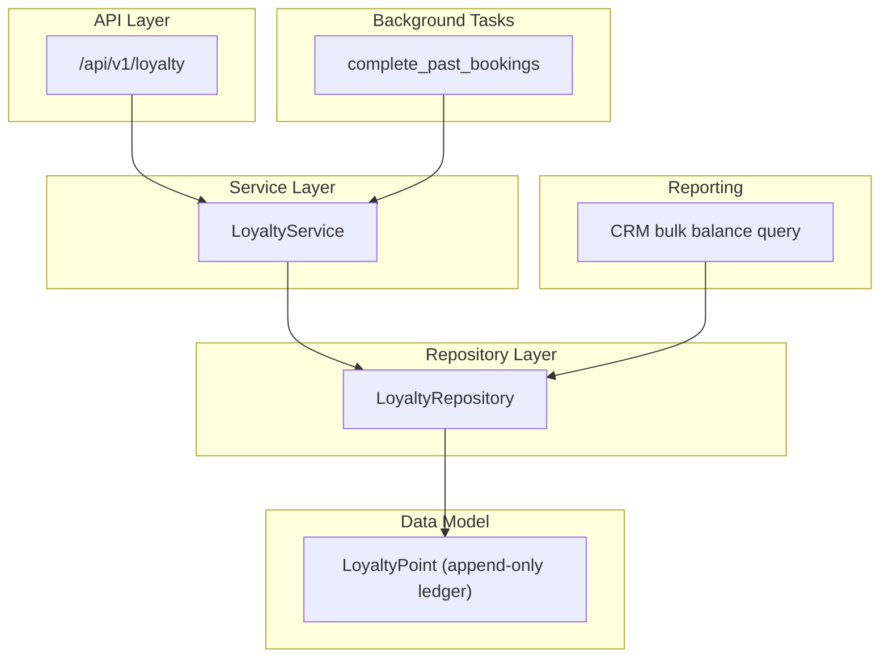
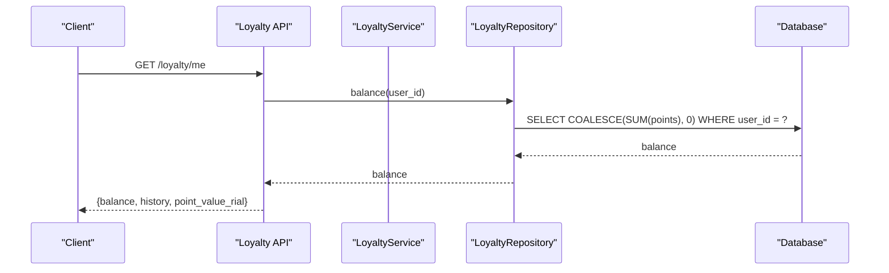
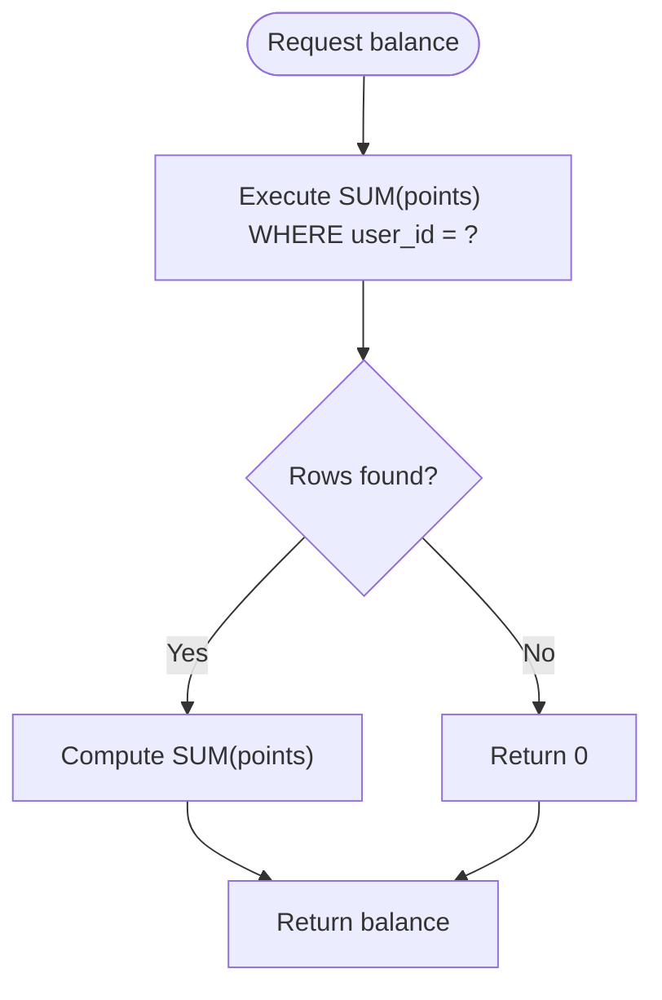
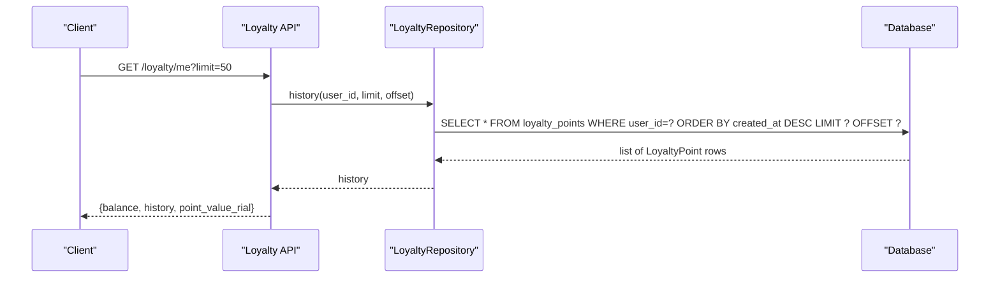
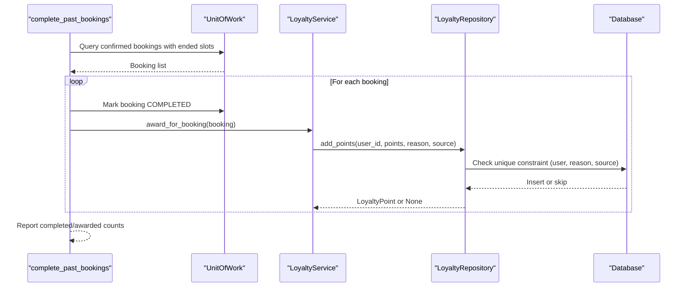
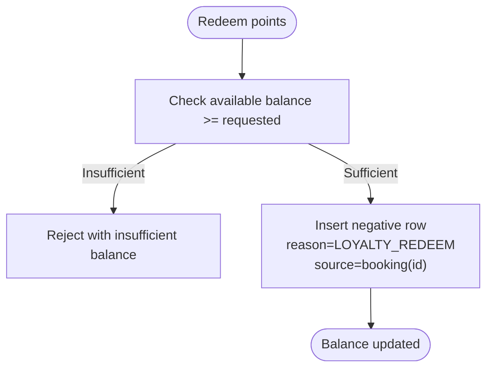
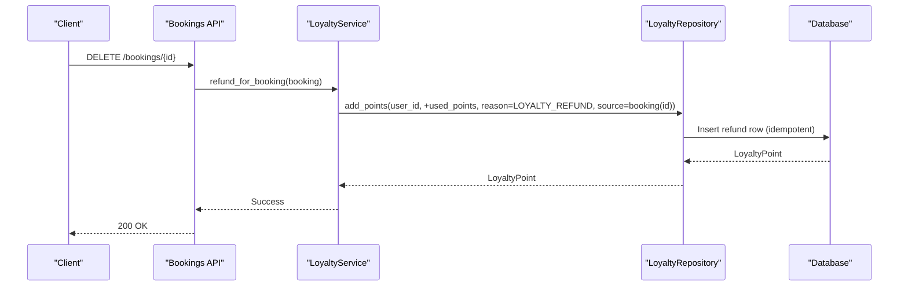
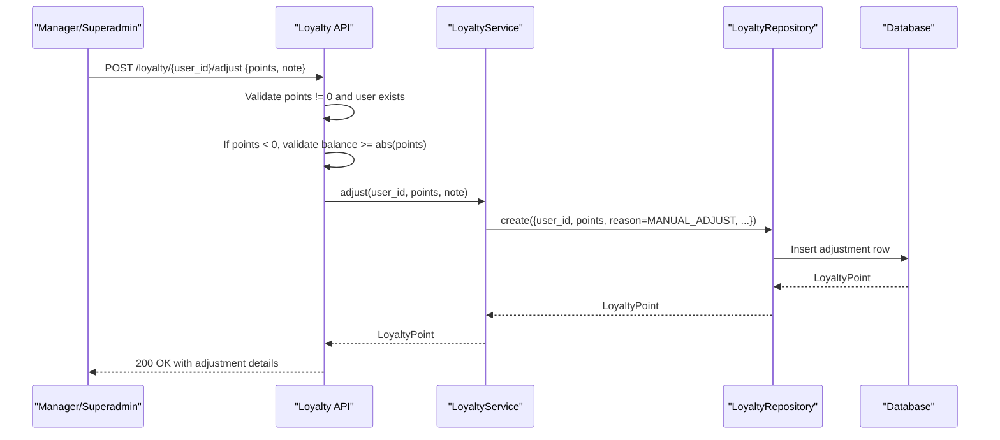
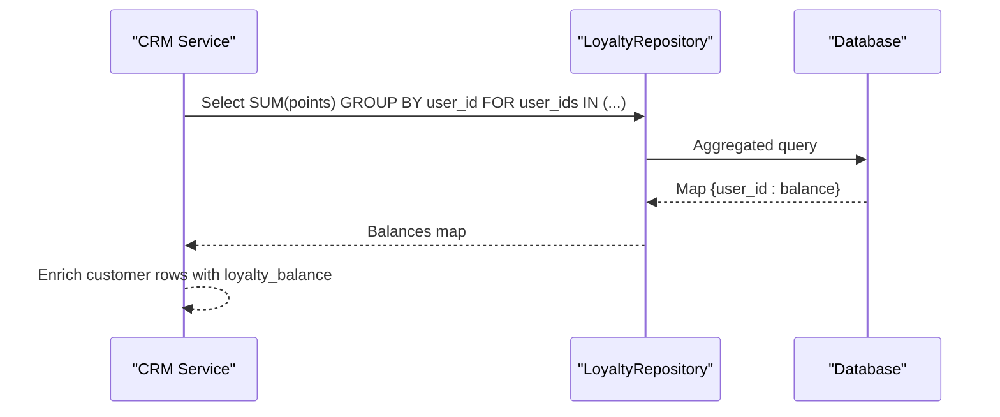
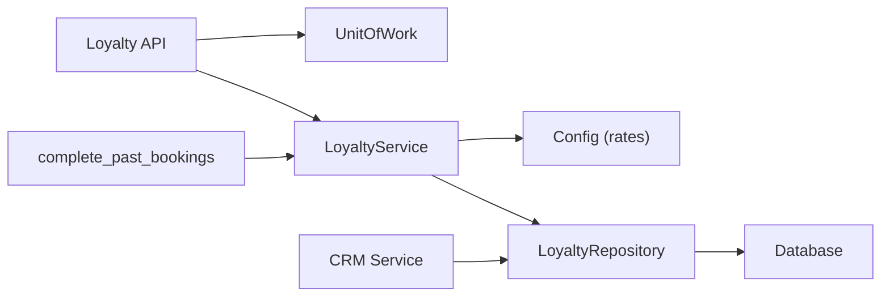

# Balance Management & Tracking

<cite>
**Referenced Files in This Document**
- [loyalty.py](file://app/models/loyalty.py)
- [loyalty_service.py](file://app/services/loyalty_service.py)
- [loyalty_repository.py](file://app/repositories/loyalty_repository.py)
- [loyalty.py (API)](file://app/api/v1/loyalty.py)
- [loyalty.py (schemas)](file://app/schemas/loyalty.py)
- [loyalty_tasks.py](file://app/tasks/loyalty_tasks.py)
- [transaction.py](file://app/models/transaction.py)
- [crm_service.py](file://app/services/crm_service.py)
- [test_loyalty.py](file://tests/test_loyalty.py)
</cite>

## Table of Contents
1. [Introduction](#introduction)
2. [Project Structure](#project-structure)
3. [Core Components](#core-components)
4. [Architecture Overview](#architecture-overview)
5. [Detailed Component Analysis](#detailed-component-analysis)
6. [Dependency Analysis](#dependency-analysis)
7. [Performance Considerations](#performance-considerations)
8. [Troubleshooting Guide](#troubleshooting-guide)
9. [Conclusion](#conclusion)
10. [Appendices](#appendices)

## Introduction
This document explains how the loyalty program manages and tracks user balances. The system uses an append-only ledger: a user’s balance is computed as the SUM of all their loyalty point transactions rather than being stored directly on a user record. This design ensures data integrity, full auditability, and idempotent operations across awarding, redeeming, refunding, and manual adjustments. It also covers performance considerations for balance queries, administrator adjustment workflows with audit logging, transaction history tracking, and reporting capabilities.

## Project Structure
The loyalty subsystem spans models, services, repositories, API endpoints, tasks, and schemas:
- Models define the append-only ledger table and reasons for point movements.
- Services implement business logic for awarding, redeeming, refunding, and manual adjustments.
- Repositories encapsulate SQL queries for balance calculation, history retrieval, and idempotency checks.
- API endpoints expose balance/history to users and manual adjustment to managers.
- Background tasks complete past bookings and award points idempotently.
- Schemas define request/response contracts.

**Diagram sources**
- [loyalty.py (API):25-58](file://app/api/v1/loyalty.py#L25-L58)
- [loyalty_service.py:25-110](file://app/services/loyalty_service.py#L25-L110)
- [loyalty_repository.py:14-46](file://app/repositories/loyalty_repository.py#L14-L46)
- [loyalty.py:29-43](file://app/models/loyalty.py#L29-L43)
- [loyalty_tasks.py:16-51](file://app/tasks/loyalty_tasks.py#L16-L51)
- [crm_service.py:69-79](file://app/services/crm_service.py#L69-L79)

**Section sources**
- [loyalty.py (API):25-58](file://app/api/v1/loyalty.py#L25-L58)
- [loyalty_service.py:25-110](file://app/services/loyalty_service.py#L25-L110)
- [loyalty_repository.py:14-46](file://app/repositories/loyalty_repository.py#L14-L46)
- [loyalty.py:29-43](file://app/models/loyalty.py#L29-L43)
- [loyalty_tasks.py:16-51](file://app/tasks/loyalty_tasks.py#L16-L51)
- [crm_service.py:69-79](file://app/services/crm_service.py#L69-L79)

## Core Components
- Append-only ledger model: Each row represents a signed point movement with reason and source linkage. No rows are deleted or mutated; corrections are new rows.
- Balance computation: A single SQL SUM over all rows per user yields the current balance.
- Idempotency: Unique constraints on (user_id, reason, source_type, source_id) prevent duplicate awards/redemptions/refunds tied to the same source.
- Manual adjustments: Managers can add or subtract points with audit fields (reason and optional note).
- History: Paginated history returns recent point movements ordered by creation time.

Key implementation references:
- Model and reasons: [loyalty.py:18-43](file://app/models/loyalty.py#L18-L43)
- Balance query: [loyalty_repository.py:14-17](file://app/repositories/loyalty_repository.py#L14-L17)
- History query: [loyalty_repository.py:19-21](file://app/repositories/loyalty_repository.py#L19-L21)
- Idempotency check: [loyalty_repository.py:23-32](file://app/repositories/loyalty_repository.py#L23-L32)
- Add points: [loyalty_repository.py:34-46](file://app/repositories/loyalty_repository.py#L34-L46)
- Service methods: [loyalty_service.py:27-110](file://app/services/loyalty_service.py#L27-L110)
- API endpoints: [loyalty.py (API):25-58](file://app/api/v1/loyalty.py#L25-L58)
- Background task: [loyalty_tasks.py:16-51](file://app/tasks/loyalty_tasks.py#L16-L51)
- CRM bulk balance: [crm_service.py:69-79](file://app/services/crm_service.py#L69-L79)

**Section sources**
- [loyalty.py:18-43](file://app/models/loyalty.py#L18-L43)
- [loyalty_repository.py:14-46](file://app/repositories/loyalty_repository.py#L14-L46)
- [loyalty_service.py:27-110](file://app/services/loyalty_service.py#L27-L110)
- [loyalty.py (API):25-58](file://app/api/v1/loyalty.py#L25-L58)
- [loyalty_tasks.py:16-51](file://app/tasks/loyalty_tasks.py#L16-L51)
- [crm_service.py:69-79](file://app/services/crm_service.py#L69-L79)

## Architecture Overview
The system follows a layered architecture:
- API layer exposes endpoints for balance/history and admin adjustments.
- Service layer orchestrates business rules (award, redeem, refund, adjust).
- Repository layer performs efficient SQL operations (SUM, pagination, idempotency checks).
- Data layer stores immutable rows in the loyalty_points table.
- Background tasks ensure delayed completion and awarding without blocking requests.

**Diagram sources**
- [loyalty.py (API):25-38](file://app/api/v1/loyalty.py#L25-L38)
- [loyalty_repository.py:14-17](file://app/repositories/loyalty_repository.py#L14-L17)

**Section sources**
- [loyalty.py (API):25-38](file://app/api/v1/loyalty.py#L25-L38)
- [loyalty_repository.py:14-17](file://app/repositories/loyalty_repository.py#L14-L17)

## Detailed Component Analysis

### Balance Calculation and Query Method
- Balance is computed via a single SQL aggregation: SUM(points) grouped by user_id, using COALESCE to default to zero when no rows exist.
- This approach avoids storing mutable state and guarantees that balance always reflects the exact sum of recorded movements.
- Performance: The query filters by user_id and aggregates a single integer column. Indexes on user_id and created_at support efficient lookups and history pagination.

**Diagram sources**
- [loyalty_repository.py:14-17](file://app/repositories/loyalty_repository.py#L14-L17)

**Section sources**
- [loyalty_repository.py:14-17](file://app/repositories/loyalty_repository.py#L14-L17)

### Transaction History Tracking
- History is retrieved with pagination (limit/offset) and ordered by creation time descending.
- Each history item includes signed points, reason, source linkage, and timestamp, providing a complete audit trail.
- The API endpoint returns both balance and history in one response for convenience.

**Diagram sources**
- [loyalty.py (API):25-38](file://app/api/v1/loyalty.py#L25-L38)
- [loyalty_repository.py:19-21](file://app/repositories/loyalty_repository.py#L19-L21)

**Section sources**
- [loyalty.py (API):25-38](file://app/api/v1/loyalty.py#L25-L38)
- [loyalty_repository.py:19-21](file://app/repositories/loyalty_repository.py#L19-L21)

### Awarding Points (Booking Completion)
- Completed bookings trigger point awards based on payment amount and configured conversion rate.
- The background task completes eligible bookings and awards points idempotently using source linkage.
- Idempotency is enforced by unique constraints and repository-level checks to avoid duplicate entries.

**Diagram sources**
- [loyalty_tasks.py:16-51](file://app/tasks/loyalty_tasks.py#L16-L51)
- [loyalty_service.py:41-50](file://app/services/loyalty_service.py#L41-L50)
- [loyalty_repository.py:34-46](file://app/repositories/loyalty_repository.py#L34-L46)
- [loyalty.py:29-35](file://app/models/loyalty.py#L29-L35)

**Section sources**
- [loyalty_tasks.py:16-51](file://app/tasks/loyalty_tasks.py#L16-L51)
- [loyalty_service.py:41-50](file://app/services/loyalty_service.py#L41-L50)
- [loyalty_repository.py:34-46](file://app/repositories/loyalty_repository.py#L34-L46)
- [loyalty.py:29-35](file://app/models/loyalty.py#L29-L35)

### Redeeming Points at Checkout
- Redemption creates a negative point row linked to the final booking, ensuring traceability.
- The service validates sufficient balance before deducting points.
- Tests demonstrate capping redemption to a percentage of total price and recording the corresponding negative row.

**Diagram sources**
- [loyalty_service.py:53-64](file://app/services/loyalty_service.py#L53-L64)
- [test_loyalty.py:99-124](file://tests/test_loyalty.py#L99-L124)

**Section sources**
- [loyalty_service.py:53-64](file://app/services/loyalty_service.py#L53-L64)
- [test_loyalty.py:99-124](file://tests/test_loyalty.py#L99-L124)

### Refunding Points on Cancellation
- When a booking is cancelled, any previously redeemed points are refunded by inserting a compensating positive row.
- The refund is idempotent due to source linkage and unique constraints.

**Diagram sources**
- [loyalty_service.py:67-75](file://app/services/loyalty_service.py#L67-L75)
- [test_loyalty.py:187-205](file://tests/test_loyalty.py#L187-L205)

**Section sources**
- [loyalty_service.py:67-75](file://app/services/loyalty_service.py#L67-L75)
- [test_loyalty.py:187-205](file://tests/test_loyalty.py#L187-L205)

### Manual Adjustment Capability (Admin)
- Administrators can add or subtract points via a dedicated endpoint.
- Validation prevents zero adjustments and enforces balance sufficiency for debits.
- Adjustments are recorded with reason MANUAL_ADJUST and optional note/source metadata for audit purposes.

**Diagram sources**
- [loyalty.py (API):41-58](file://app/api/v1/loyalty.py#L41-L58)
- [loyalty_service.py:102-110](file://app/services/loyalty_service.py#L102-L110)
- [loyalty_repository.py:34-46](file://app/repositories/loyalty_repository.py#L34-L46)
- [test_loyalty.py:68-95](file://tests/test_loyalty.py#L68-L95)

**Section sources**
- [loyalty.py (API):41-58](file://app/api/v1/loyalty.py#L41-L58)
- [loyalty_service.py:102-110](file://app/services/loyalty_service.py#L102-L110)
- [loyalty_repository.py:34-46](file://app/repositories/loyalty_repository.py#L34-L46)
- [test_loyalty.py:68-95](file://tests/test_loyalty.py#L68-L95)

### Reporting Capabilities
- CRM dashboard retrieves loyalty balances for multiple users efficiently using a single aggregated query grouped by user_id, avoiding N+1 calls.
- This supports bulk reporting and analytics without degrading performance.

**Diagram sources**
- [crm_service.py:69-79](file://app/services/crm_service.py#L69-L79)

**Section sources**
- [crm_service.py:69-79](file://app/services/crm_service.py#L69-L79)

## Dependency Analysis
- API depends on UnitOfWork to access repositories and commit changes.
- Service depends on configuration for conversion rates and on repositories for persistence.
- Repository depends on SQLAlchemy/SQLModel constructs and indexes for performance.
- Background tasks depend on services and unit-of-work patterns to process batches safely.

**Diagram sources**
- [loyalty.py (API):25-58](file://app/api/v1/loyalty.py#L25-L58)
- [loyalty_service.py:25-110](file://app/services/loyalty_service.py#L25-L110)
- [loyalty_repository.py:1-46](file://app/repositories/loyalty_repository.py#L1-46)
- [loyalty_tasks.py:16-51](file://app/tasks/loyalty_tasks.py#L16-L51)
- [crm_service.py:69-79](file://app/services/crm_service.py#L69-L79)

**Section sources**
- [loyalty.py (API):25-58](file://app/api/v1/loyalty.py#L25-L58)
- [loyalty_service.py:25-110](file://app/services/loyalty_service.py#L25-L110)
- [loyalty_repository.py:1-46](file://app/repositories/loyalty_repository.py#L1-46)
- [loyalty_tasks.py:16-51](file://app/tasks/loyalty_tasks.py#L16-L51)
- [crm_service.py:69-79](file://app/services/crm_service.py#L69-L79)

## Performance Considerations
- Balance query uses a single aggregation with a filter on user_id; this is O(N) over the user’s rows but typically small per user. Ensure indexes on user_id exist for optimal performance.
- History retrieval is paginated and ordered by created_at; ensure indexes on (user_id, created_at) to optimize sorting and limiting.
- Bulk CRM balance retrieval groups by user_id in a single query, avoiding N+1 issues when computing balances for many users.
- Idempotency checks use unique constraints; database-level enforcement prevents duplicates even under concurrency.

[No sources needed since this section provides general guidance]

## Troubleshooting Guide
Common issues and resolutions:
- Duplicate awards/redemptions/refunds: Verify unique constraints on (user_id, reason, source_type, source_id) and ensure source identifiers are consistent.
- Insufficient balance errors during redemption or debit adjustments: Confirm current balance via balance query and validate requested deduction does not exceed it.
- Zero adjustment attempts: The API rejects zero-point adjustments; ensure non-zero values are provided.
- Missing user: Adjustments require a valid user_id; verify existence before calling the endpoint.
- Idempotency failures: Re-run background tasks should be safe; they will skip already awarded sources.

**Section sources**
- [loyalty.py (API):41-58](file://app/api/v1/loyalty.py#L41-L58)
- [loyalty_service.py:53-64](file://app/services/loyalty_service.py#L53-L64)
- [loyalty_repository.py:23-32](file://app/repositories/loyalty_repository.py#L23-L32)
- [test_loyalty.py:68-95](file://tests/test_loyalty.py#L68-L95)

## Conclusion
The loyalty program implements a robust, auditable balance management system using an append-only ledger. Balances are derived from SUM aggregations of immutable point movements, ensuring accuracy and transparency. Administrator adjustments are logged with reasons and notes, while background tasks handle delayed completions and awards idempotently. Efficient queries and bulk operations support scalable reporting and user experiences.

[No sources needed since this section summarizes without analyzing specific files]

## Appendices

### Example Scenarios

- Balance calculation example:
  - User receives 25 points for a completed booking (payment_amount ÷ rials_per_point).
  - User redeems 20 points for checkout; a negative row is inserted.
  - Current balance = 25 + (-20) = 5.
  - References: [loyalty_service.py:41-64](file://app/services/loyalty_service.py#L41-L64), [test_loyalty.py:99-124](file://tests/test_loyalty.py#L99-L124)

- Adjustment workflow example:
  - Manager adds 100 points with note “هدیه”; a positive row with reason MANUAL_ADJUST is inserted.
  - Manager subtracts 50 points if balance allows; a negative row is inserted.
  - References: [loyalty.py (API):41-58](file://app/api/v1/loyalty.py#L41-L58), [test_loyalty.py:68-95](file://tests/test_loyalty.py#L68-L95)

- Reporting example:
  - CRM computes loyalty balances for a set of users using a single grouped query.
  - References: [crm_service.py:69-79](file://app/services/crm_service.py#L69-L79)

### Data Integrity Measures
- Append-only ledger: No deletions or updates to cleared rows; corrections are new rows.
- Unique constraints: Prevent duplicate entries for the same source and reason combination.
- Idempotent operations: Background tasks and APIs rely on source linkage to avoid double-processing.
- Audit fields: Reasons and optional notes provide context for every movement.

**Section sources**
- [loyalty.py:29-43](file://app/models/loyalty.py#L29-L43)
- [loyalty_repository.py:23-46](file://app/repositories/loyalty_repository.py#L23-L46)
- [loyalty_tasks.py:16-51](file://app/tasks/loyalty_tasks.py#L16-L51)