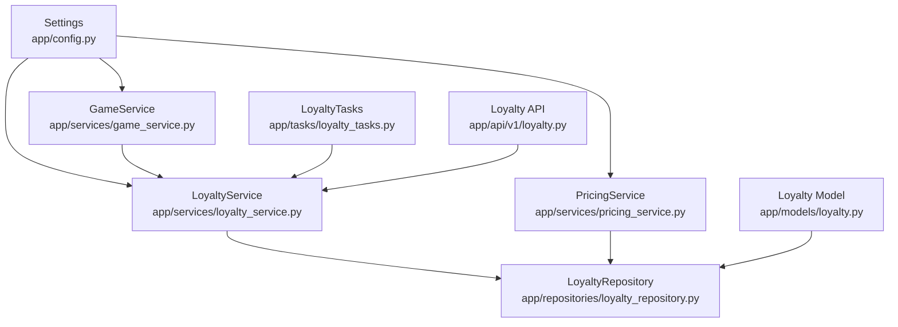
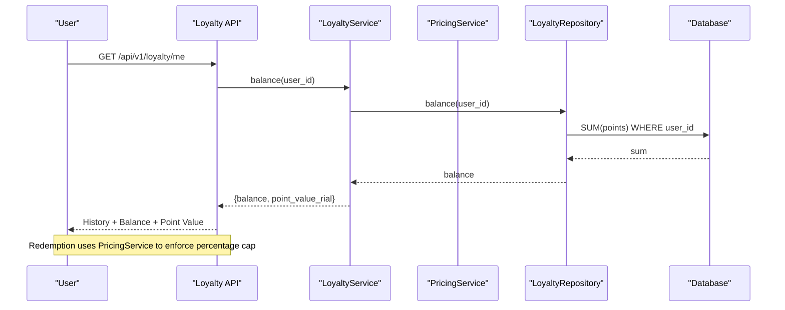
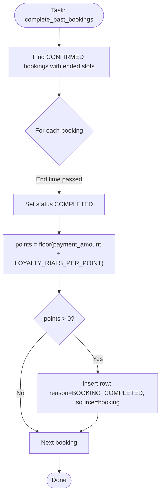
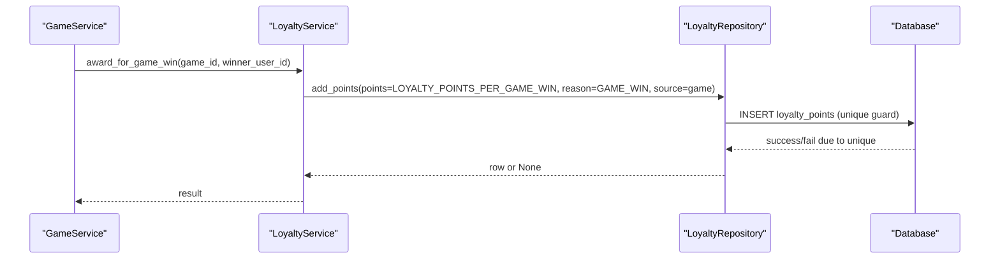
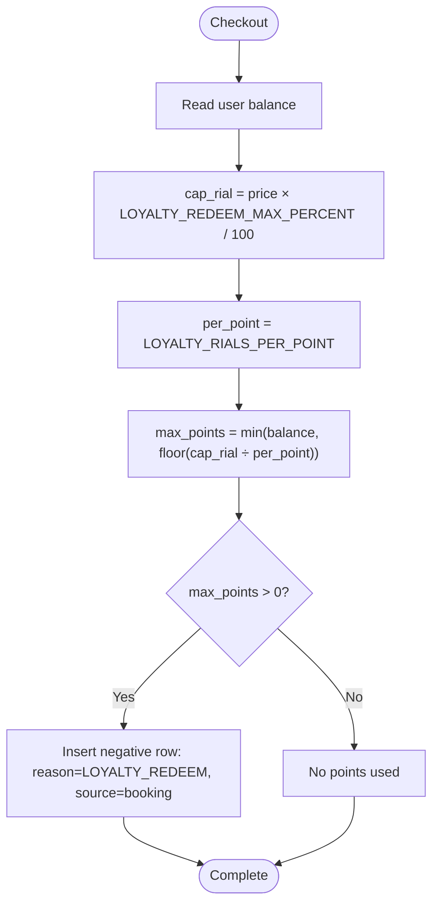
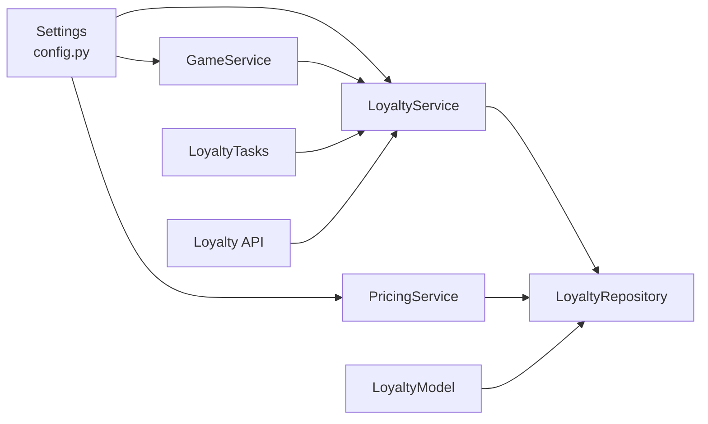

# Configuration & Settings

<cite>
**Referenced Files in This Document**
- [config.py](file://app/config.py)
- [loyalty_service.py](file://app/services/loyalty_service.py)
- [pricing_service.py](file://app/services/pricing_service.py)
- [loyalty_tasks.py](file://app/tasks/loyalty_tasks.py)
- [game_service.py](file://app/services/game_service.py)
- [loyalty.py (model)](file://app/models/loyalty.py)
- [loyalty_repository.py](file://app/repositories/loyalty_repository.py)
- [loyalty.py (API)](file://app/api/v1/loyalty.py)
- [test_loyalty.py](file://tests/test_loyalty.py)
</cite>

## Table of Contents
1. Introduction
2. Project Structure
3. Core Components
4. Architecture Overview
5. Detailed Component Analysis
6. Dependency Analysis
7. Performance Considerations
8. Troubleshooting Guide
9. Conclusion
10. Appendices

## Introduction
This document explains the loyalty program configuration and settings, focusing on how environment variables control point accrual, redemption, and rewards. It covers:
- Currency conversion via LOYALTY_RIALS_PER_POINT
- Game win rewards via LOYALTY_POINTS_PER_GAME_WIN
- Review incentives via LOYALTY_POINTS_PER_REVIEW
- Redemption cap via LOYALTY_REDEEM_MAX_PERCENT
- Validation rules, default values, idempotency guarantees, and environment-specific setup best practices

## Project Structure
The loyalty system spans configuration, services, tasks, models, repositories, API endpoints, and tests. The key files are:
- Configuration: app/config.py
- Business logic: app/services/loyalty_service.py, app/services/pricing_service.py, app/services/game_service.py
- Background processing: app/tasks/loyalty_tasks.py
- Data model and storage: app/models/loyalty.py, app/repositories/loyalty_repository.py
- User-facing API: app/api/v1/loyalty.py
- Behavioral verification: tests/test_loyalty.py

**Diagram sources**
- [config.py:1-69](file://app/config.py#L1-L69)
- [loyalty_service.py:1-110](file://app/services/loyalty_service.py#L1-L110)
- [pricing_service.py:235-244](file://app/services/pricing_service.py#L235-L244)
- [game_service.py:960-970](file://app/services/game_service.py#L960-L970)
- [loyalty_tasks.py:1-59](file://app/tasks/loyalty_tasks.py#L1-L59)
- [loyalty_repository.py:1-46](file://app/repositories/loyalty_repository.py#L1-L46)
- [loyalty.py (model):1-43](file://app/models/loyalty.py#L1-L43)
- [loyalty.py (API):1-58](file://app/api/v1/loyalty.py#L1-L58)

**Section sources**
- [config.py:1-69](file://app/config.py#L1-L69)
- [loyalty_service.py:1-110](file://app/services/loyalty_service.py#L1-L110)
- [pricing_service.py:235-244](file://app/services/pricing_service.py#L235-L244)
- [game_service.py:960-970](file://app/services/game_service.py#L960-L970)
- [loyalty_tasks.py:1-59](file://app/tasks/loyalty_tasks.py#L1-L59)
- [loyalty_repository.py:1-46](file://app/repositories/loyalty_repository.py#L1-L46)
- [loyalty.py (model):1-43](file://app/models/loyalty.py#L1-L43)
- [loyalty.py (API):1-58](file://app/api/v1/loyalty.py#L1-L58)

## Core Components
- Settings (environment-driven):
  - LOYALTY_RIALS_PER_POINT: Rials per point; used to convert payment amounts to points and to compute discount value per point.
  - LOYALTY_POINTS_PER_GAME_WIN: Points awarded per game win.
  - LOYALTY_POINTS_PER_REVIEW: Points awarded per review.
  - LOYALTY_REDEEM_MAX_PERCENT: Maximum percentage of final price that can be covered by points at checkout.
- Services:
  - LoyaltyService: Accrues points for completed bookings, awards points for game wins and reviews, handles redemption and refunds, and provides balance and conversion helpers.
  - PricingService: Computes maximum redeemable points based on user balance and percentage cap.
  - GameService: Awards points to winners using the configured per-win amount.
- Tasks:
  - LoyaltyTasks: Completes past confirmed bookings and awards points idempotently.
- Repository and Model:
  - LoyaltyRepository: Calculates balances from an append-only ledger and enforces source-based idempotency.
  - LoyaltyPoint model: Stores signed point entries with reasons and source references.
- API:
  - Loyalty API: Exposes user history/balance and manager-only manual adjustments.

**Section sources**
- [config.py:14-26](file://app/config.py#L14-L26)
- [loyalty_service.py:27-110](file://app/services/loyalty_service.py#L27-L110)
- [pricing_service.py:235-244](file://app/services/pricing_service.py#L235-L244)
- [game_service.py:960-970](file://app/services/game_service.py#L960-L970)
- [loyalty_tasks.py:16-51](file://app/tasks/loyalty_tasks.py#L16-L51)
- [loyalty_repository.py:14-46](file://app/repositories/loyalty_repository.py#L14-L46)
- [loyalty.py (model):18-43](file://app/models/loyalty.py#L18-L43)
- [loyalty.py (API):25-58](file://app/api/v1/loyalty.py#L25-L58)

## Architecture Overview
The loyalty system is driven by environment configuration and enforced through service-layer logic backed by an append-only ledger.

**Diagram sources**
- [loyalty.py (API):25-38](file://app/api/v1/loyalty.py#L25-L38)
- [loyalty_service.py:27-39](file://app/services/loyalty_service.py#L27-L39)
- [loyalty_repository.py:14-17](file://app/repositories/loyalty_repository.py#L14-L17)
- [pricing_service.py:235-244](file://app/services/pricing_service.py#L235-L244)

## Detailed Component Analysis

### Configuration Parameters and Defaults
- LOYALTY_RIALS_PER_POINT
  - Purpose: Converts monetary amounts to points and defines the rials value of a single point.
  - Default: 10000
  - Usage:
    - Points earned on booking completion = floor(payment_amount ÷ LOYALTY_RIALS_PER_POINT)
    - Redemption discount per point = LOYALTY_RIALS_PER_POINT
    - If set to zero or missing, defaults to 1 to avoid division by zero.
- LOYALTY_POINTS_PER_GAME_WIN
  - Purpose: Fixed points awarded to each winner of a game.
  - Default: 500
  - Usage: Awarded once per (user, game) pair; idempotent by source.
- LOYALTY_POINTS_PER_REVIEW
  - Purpose: Fixed points awarded for submitting a review.
  - Default: 50
  - Usage: Awarded once per review id; idempotent by source.
- LOYALTY_REDEEM_MAX_PERCENT
  - Purpose: Caps the portion of final price payable with points at checkout.
  - Default: 50
  - Usage: max_redeemable_points = min(balance, floor(price × percent ÷ LOYALTY_RIALS_PER_POINT))

Validation and safety:
- Division-by-zero protection: rials_per_point() returns at least 1 if configured value is zero or falsy.
- Non-positive point awards are skipped (no rows inserted).
- Idempotency: Source-based uniqueness prevents duplicate awards/refunds for the same event.

**Section sources**
- [config.py:14-26](file://app/config.py#L14-L26)
- [loyalty_service.py:32-39](file://app/services/loyalty_service.py#L32-L39)
- [loyalty_service.py:77-99](file://app/services/loyalty_service.py#L77-L99)
- [pricing_service.py:235-244](file://app/services/pricing_service.py#L235-L244)
- [loyalty_repository.py:23-46](file://app/repositories/loyalty_repository.py#L23-L46)
- [loyalty.py (model):29-43](file://app/models/loyalty.py#L29-L43)

### Booking Completion Rewards
- Trigger: Background task completes past CONFIRMED bookings whose slots have ended.
- Calculation: points = floor(payment_amount ÷ LOYALTY_RIALS_PER_POINT)
- Idempotency: Unique constraint on (user_id, reason, source_type="booking", source_id=booking.id) ensures one award per booking.
- Effect: Adds a positive row with reason BOOKING_COMPLETED.

**Diagram sources**
- [loyalty_tasks.py:16-51](file://app/tasks/loyalty_tasks.py#L16-L51)
- [loyalty_service.py:41-50](file://app/services/loyalty_service.py#L41-L50)
- [loyalty_repository.py:23-46](file://app/repositories/loyalty_repository.py#L23-L46)
- [loyalty.py (model):29-43](file://app/models/loyalty.py#L29-L43)

**Section sources**
- [loyalty_tasks.py:16-51](file://app/tasks/loyalty_tasks.py#L16-L51)
- [loyalty_service.py:41-50](file://app/services/loyalty_service.py#L41-L50)
- [loyalty_repository.py:23-46](file://app/repositories/loyalty_repository.py#L23-L46)
- [loyalty.py (model):29-43](file://app/models/loyalty.py#L29-L43)

### Game Win Rewards
- Trigger: After game results are processed, winners receive points.
- Amount: LOYALTY_POINTS_PER_GAME_WIN per winner.
- Idempotency: Unique constraint on (user_id, reason=GAME_WIN, source_type="game", source_id=game_id).

**Diagram sources**
- [game_service.py:960-970](file://app/services/game_service.py#L960-L970)
- [loyalty_service.py:77-87](file://app/services/loyalty_service.py#L77-L87)
- [loyalty_repository.py:23-46](file://app/repositories/loyalty_repository.py#L23-L46)
- [loyalty.py (model):29-43](file://app/models/loyalty.py#L29-L43)

**Section sources**
- [game_service.py:960-970](file://app/services/game_service.py#L960-L970)
- [loyalty_service.py:77-87](file://app/services/loyalty_service.py#L77-L87)
- [loyalty_repository.py:23-46](file://app/repositories/loyalty_repository.py#L23-L46)
- [loyalty.py (model):29-43](file://app/models/loyalty.py#L29-L43)

### Review Incentives
- Trigger: When a review is recorded.
- Amount: LOYALTY_POINTS_PER_REVIEW per review.
- Idempotency: Unique constraint on (user_id, reason=REVIEW, source_type="review", source_id=review_id).

**Section sources**
- [loyalty_service.py:89-99](file://app/services/loyalty_service.py#L89-L99)
- [loyalty_repository.py:23-46](file://app/repositories/loyalty_repository.py#L23-L46)
- [loyalty.py (model):29-43](file://app/models/loyalty.py#L29-L43)

### Redemption Cap and Checkout Flow
- Cap: At most LOYALTY_REDEEM_MAX_PERCENT of the final price can be paid with points.
- Conversion: Each point equals LOYALTY_RIALS_PER_POINT rials toward discount.
- Result: max_redeemable_points = min(balance, floor(price × percent ÷ LOYALTY_RIALS_PER_POINT)).

**Diagram sources**
- [pricing_service.py:235-244](file://app/services/pricing_service.py#L235-L244)
- [loyalty_service.py:52-64](file://app/services/loyalty_service.py#L52-L64)
- [loyalty_repository.py:34-46](file://app/repositories/loyalty_repository.py#L34-L46)
- [loyalty.py (model):29-43](file://app/models/loyalty.py#L29-L43)

**Section sources**
- [pricing_service.py:235-244](file://app/services/pricing_service.py#L235-L244)
- [loyalty_service.py:52-64](file://app/services/loyalty_service.py#L52-L64)
- [loyalty_repository.py:34-46](file://app/repositories/loyalty_repository.py#L34-L46)
- [loyalty.py (model):29-43](file://app/models/loyalty.py#L29-L43)

### Manual Adjustments and Refunds
- Manual adjustment: Managers/superusers can add or deduct points via API; non-negative checks apply when deducting.
- Refund on cancellation: If a booking is cancelled after points were used, a compensating positive row is inserted with reason LOYALTY_REFUND.

**Section sources**
- [loyalty.py (API):41-58](file://app/api/v1/loyalty.py#L41-L58)
- [loyalty_service.py:66-75](file://app/services/loyalty_service.py#L66-L75)
- [loyalty_service.py:101-110](file://app/services/loyalty_service.py#L101-L110)

### Environment-Specific Behavior
- APP_ENV controls database initialization behavior (production skips auto-create).
- AUTO_CREATE_ALL allows disabling table creation even in development.
- DEBUG_ALLOW_DEV_CODE gates exposure of sensitive debug codes in API responses.

Best practices:
- Production: Set APP_ENV=production and ensure migrations run via Alembic; keep AUTO_CREATE_ALL=false.
- Development: Use APP_ENV=development and AUTO_CREATE_ALL=true for convenience.
- Security: Keep DEBUG_ALLOW_DEV_CODE=false outside development.

**Section sources**
- [config.py:30-37](file://app/config.py#L30-L37)
- [database.py:24-30](file://app/database.py#L24-L30)

## Dependency Analysis
Configuration drives all loyalty calculations. Services read settings directly; repository enforces data integrity; tasks orchestrate background work; API exposes state and admin actions.

**Diagram sources**
- [config.py:14-26](file://app/config.py#L14-L26)
- [loyalty_service.py:15-110](file://app/services/loyalty_service.py#L15-L110)
- [pricing_service.py:235-244](file://app/services/pricing_service.py#L235-L244)
- [game_service.py:960-970](file://app/services/game_service.py#L960-L970)
- [loyalty_tasks.py:16-51](file://app/tasks/loyalty_tasks.py#L16-L51)
- [loyalty_repository.py:1-46](file://app/repositories/loyalty_repository.py#L1-L46)
- [loyalty.py (model):18-43](file://app/models/loyalty.py#L18-L43)
- [loyalty.py (API):1-58](file://app/api/v1/loyalty.py#L1-L58)

**Section sources**
- [config.py:14-26](file://app/config.py#L14-L26)
- [loyalty_service.py:15-110](file://app/services/loyalty_service.py#L15-L110)
- [pricing_service.py:235-244](file://app/services/pricing_service.py#L235-L244)
- [game_service.py:960-970](file://app/services/game_service.py#L960-L970)
- [loyalty_tasks.py:16-51](file://app/tasks/loyalty_tasks.py#L16-L51)
- [loyalty_repository.py:1-46](file://app/repositories/loyalty_repository.py#L1-L46)
- [loyalty.py (model):18-43](file://app/models/loyalty.py#L18-L43)
- [loyalty.py (API):1-58](file://app/api/v1/loyalty.py#L1-L58)

## Performance Considerations
- Ledger design: Balance is computed as SUM(points); this is O(n) over user rows but avoids complex updates and ensures auditability.
- Idempotency: Unique constraints prevent duplicate inserts and reduce retry overhead.
- Task batching: Background task processes many bookings in one run; consider indexing on slot dates and booking status for large datasets.
- Redemption math: Integer arithmetic avoids floating-point issues; ensure LOYALTY_RIALS_PER_POINT is tuned to minimize rounding losses.

[No sources needed since this section provides general guidance]

## Troubleshooting Guide
Common issues and resolutions:
- Zero or missing LOYALTY_RIALS_PER_POINT: System defaults to 1 to avoid division errors; verify your environment variable is set correctly.
- No points awarded on completion: Ensure the background task runs and that the booking’s slot end time has passed; check logs for completed vs awarded counts.
- Duplicate awards suspected: Verify unique constraints on (user_id, reason, source_type, source_id); duplicates should not occur.
- Redemption capped unexpectedly: Confirm LOYALTY_REDEEM_MAX_PERCENT and LOYALTY_RIALS_PER_POINT; calculate expected cap manually.
- Manager adjustment rejected: Negative adjustments require sufficient balance; zero-value adjustments are rejected.

**Section sources**
- [loyalty_service.py:32-39](file://app/services/loyalty_service.py#L32-L39)
- [loyalty_tasks.py:16-51](file://app/tasks/loyalty_tasks.py#L16-L51)
- [loyalty_repository.py:23-46](file://app/repositories/loyalty_repository.py#L23-L46)
- [pricing_service.py:235-244](file://app/services/pricing_service.py#L235-L244)
- [loyalty.py (API):41-58](file://app/api/v1/loyalty.py#L41-L58)

## Conclusion
The loyalty program is fully configurable via environment variables. LOYALTY_RIALS_PER_POINT governs currency-to-point conversion and redemption value; LOYALTY_POINTS_PER_GAME_WIN and LOYALTY_POINTS_PER_REVIEW define incentive amounts; LOYALTY_REDEEM_MAX_PERCENT protects against excessive discounts. The system enforces idempotency and auditability through an append-only ledger and unique constraints. Follow environment-specific best practices to deploy safely across development and production.

[No sources needed since this section summarizes without analyzing specific files]

## Appendices

### Configuration Reference Table
- LOYALTY_RIALS_PER_POINT
  - Type: integer
  - Default: 10000
  - Role: Conversion factor between rials and points; used in earning and redemption.
- LOYALTY_POINTS_PER_GAME_WIN
  - Type: integer
  - Default: 500
  - Role: Points awarded per game win (idempotent per game).
- LOYALTY_POINTS_PER_REVIEW
  - Type: integer
  - Default: 50
  - Role: Points awarded per review (idempotent per review).
- LOYALTY_REDEEM_MAX_PERCENT
  - Type: integer
  - Default: 50
  - Role: Percentage cap on redemption relative to final price.

**Section sources**
- [config.py:14-26](file://app/config.py#L14-L26)

### Example Scenarios and Impact
- Scenario A: LOYALTY_RIALS_PER_POINT = 10000
  - Booking payment 250000 → 25 points awarded upon completion.
  - Redemption: With 50% cap on a 400000 price, max redeemable = 20 points (discount 200000).
- Scenario B: LOYALTY_POINTS_PER_GAME_WIN = 500
  - Each winner receives 500 points once per game.
- Scenario C: LOYALTY_POINTS_PER_REVIEW = 50
  - Each review yields 50 points once per review.
- Scenario D: LOYALTY_REDEEM_MAX_PERCENT = 50
  - Ensures users cannot pay more than half the final price with points.

Behavioral validation is demonstrated in tests covering balance, history, redemption caps, idempotent completion, and refund on cancellation.

**Section sources**
- [test_loyalty.py:68-78](file://tests/test_loyalty.py#L68-L78)
- [test_loyalty.py:99-124](file://tests/test_loyalty.py#L99-L124)
- [test_loyalty.py:126-148](file://tests/test_loyalty.py#L126-L148)
- [test_loyalty.py:152-174](file://tests/test_loyalty.py#L152-L174)
- [test_loyalty.py:187-205](file://tests/test_loyalty.py#L187-L205)