# Loyalty Program

<cite>
**Referenced Files in This Document**
- [loyalty.py](file://app/models/loyalty.py)
- [loyalty.py](file://app/schemas/loyalty.py)
- [loyalty_service.py](file://app/services/loyalty_service.py)
- [loyalty_repository.py](file://app/repositories/loyalty_repository.py)
- [loyalty_tasks.py](file://app/tasks/loyalty_tasks.py)
- [loyalty.py](file://app/api/v1/loyalty.py)
- [booking.py](file://app/models/booking.py)
- [pricing_service.py](file://app/services/pricing_service.py)
- [config.py](file://app/config.py)
- [test_loyalty.py](file://tests/test_loyalty.py)
</cite>

## Table of Contents
1. Introduction
2. Project Structure
3. Core Components
4. Architecture Overview
5. Detailed Component Analysis
6. Dependency Analysis
7. Performance Considerations
8. Troubleshooting Guide
9. Conclusion
10. Appendices

## Introduction
This document explains the Loyalty Program module for the futsal booking system backend. It covers how points are earned (bookings, reviews, game wins), how they are redeemed (discounts at checkout and refunds on cancellation), how balances are tracked with an append-only ledger, and how the system integrates with bookings and pricing. It also documents point calculation rules, idempotency and fraud prevention mechanisms, audit logging via history, and example workflows.

## Project Structure
The loyalty feature spans models, schemas, services, repositories, API endpoints, background tasks, and configuration:
- Models define the append-only ledger and reasons for point changes.
- Schemas define API request/response shapes.
- Service encapsulates business logic for earning, redeeming, refunding, and adjusting points.
- Repository provides data access, balance computation, and idempotency checks.
- API exposes user-facing endpoints to view history/balance and perform manual adjustments.
- Tasks automate completion of past bookings and awarding points.
- Pricing service integrates loyalty redemption into booking cost calculations.
- Configuration centralizes rates and caps.

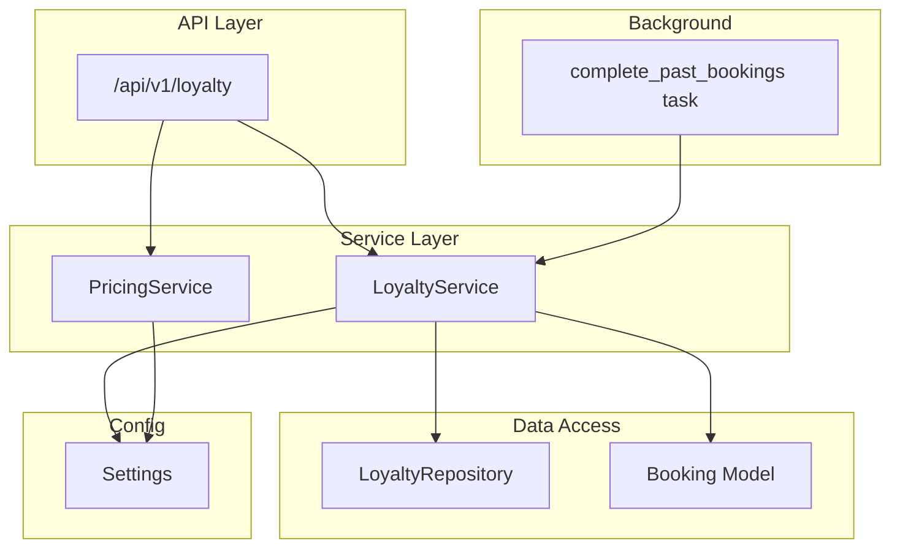

**Diagram sources**
- [loyalty.py](file://app/api/v1/loyalty.py)
- [loyalty_service.py](file://app/services/loyalty_service.py)
- [pricing_service.py](file://app/services/pricing_service.py)
- [loyalty_repository.py](file://app/repositories/loyalty_repository.py)
- [booking.py](file://app/models/booking.py)
- [loyalty_tasks.py](file://app/tasks/loyalty_tasks.py)
- [config.py](file://app/config.py)

**Section sources**
- [loyalty.py](file://app/models/loyalty.py)
- [loyalty.py](file://app/schemas/loyalty.py)
- [loyalty_service.py](file://app/services/loyalty_service.py)
- [loyalty_repository.py](file://app/repositories/loyalty_repository.py)
- [loyalty_tasks.py](file://app/tasks/loyalty_tasks.py)
- [loyalty.py](file://app/api/v1/loyalty.py)
- [booking.py](file://app/models/booking.py)
- [pricing_service.py](file://app/services/pricing_service.py)
- [config.py](file://app/config.py)

## Core Components
- Append-only ledger: Each point change is a row with signed values; balance equals the sum of rows per user.
- Reasons: Booking completed, review, game win, manual adjustment, redemption, refund, etc.
- Idempotency: Unique constraint on (user_id, reason, source_type, source_id) prevents duplicate awards/redemptions for the same source.
- Redemption cap: Maximum percentage of final price that can be covered by points.
- Auditability: History endpoint returns all point movements with reasons and timestamps.

Key behaviors:
- Earning: Points awarded after booking completion or on review/game win.
- Redemption: Points deducted at checkout subject to cap and available balance.
- Refund: On cancellation, previously used points are refunded as a compensatory positive entry.
- Manual adjustment: Managers can add or subtract points with validation.

**Section sources**
- [loyalty.py](file://app/models/loyalty.py)
- [loyalty_service.py](file://app/services/loyalty_service.py)
- [loyalty_repository.py](file://app/repositories/loyalty_repository.py)
- [pricing_service.py](file://app/services/pricing_service.py)
- [config.py](file://app/config.py)

## Architecture Overview
The system uses a layered architecture:
- API layer exposes endpoints for users and managers.
- Service layer implements business rules for earning, redeeming, refunding, and adjusting points.
- Repository handles persistence, balance calculation, and idempotency checks.
- Background tasks complete past bookings and trigger point awards.
- Pricing service integrates loyalty redemption into booking cost calculations.

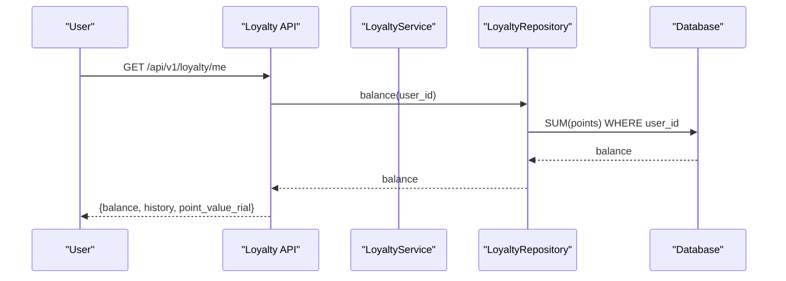

**Diagram sources**
- [loyalty.py](file://app/api/v1/loyalty.py)
- [loyalty_service.py](file://app/services/loyalty_service.py)
- [loyalty_repository.py](file://app/repositories/loyalty_repository.py)

## Detailed Component Analysis

### Data Model and Ledger Design
- LoyaltyPoint: Append-only record with signed points, reason, optional source reference, and timestamp.
- Unique constraint ensures one award/redemption per source per reason per user.
- Balance is computed as SUM(points) per user.

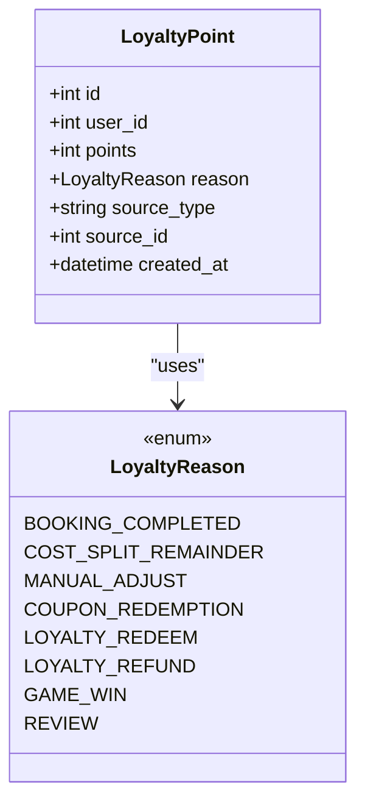

**Diagram sources**
- [loyalty.py](file://app/models/loyalty.py)

**Section sources**
- [loyalty.py](file://app/models/loyalty.py)

### Point Earning Mechanisms
- Booking rewards: Awarded when a confirmed booking’s slot has ended; amount derived from payment_amount divided by rials-per-point.
- Review incentives: Fixed points per review, one per review id.
- Game win bonuses: Fixed points per game win, one per (user, game).

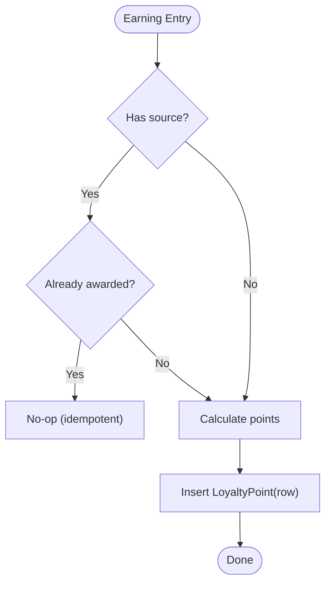

**Diagram sources**
- [loyalty_service.py](file://app/services/loyalty_service.py)
- [loyalty_repository.py](file://app/repositories/loyalty_repository.py)
- [loyalty.py](file://app/models/loyalty.py)

**Section sources**
- [loyalty_service.py](file://app/services/loyalty_service.py)
- [loyalty_tasks.py](file://app/tasks/loyalty_tasks.py)
- [config.py](file://app/config.py)

### Points Redemption and Discounts
- Redemption occurs during booking creation when the client opts to use points.
- Max redeemable points are capped by a configurable percentage of the final price.
- Actual deduction is recorded as a negative row linked to the booking.

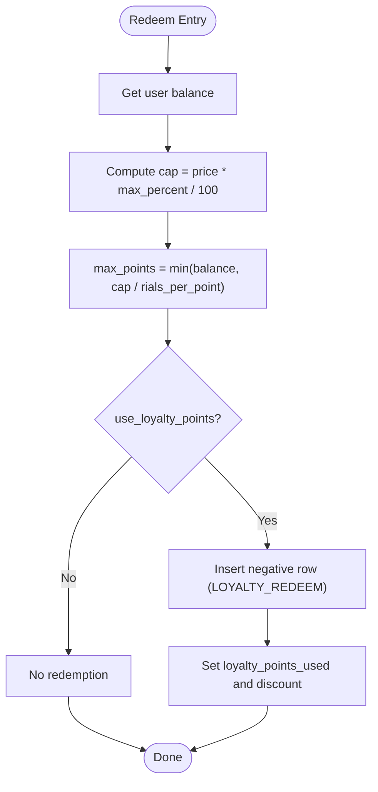

**Diagram sources**
- [pricing_service.py](file://app/services/pricing_service.py)
- [loyalty_service.py](file://app/services/loyalty_service.py)
- [booking.py](file://app/models/booking.py)
- [config.py](file://app/config.py)

**Section sources**
- [pricing_service.py](file://app/services/pricing_service.py)
- [booking.py](file://app/models/booking.py)
- [config.py](file://app/config.py)

### Refunds on Cancellation
- When a booking is cancelled, any points used are refunded as a compensatory positive row.
- The refund is tied to the original booking source for traceability.

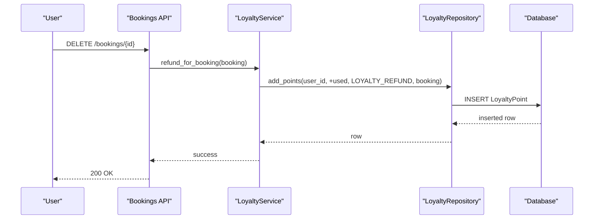

**Diagram sources**
- [loyalty_service.py](file://app/services/loyalty_service.py)
- [loyalty_repository.py](file://app/repositories/loyalty_repository.py)

**Section sources**
- [loyalty_service.py](file://app/services/loyalty_service.py)

### Manual Adjustments and Admin Controls
- Managers can add or subtract points for a user with validation:
  - Zero value is rejected.
  - Negative adjustments require sufficient balance.
  - Non-existent user results in 404.
- All adjustments are recorded with reason and optional note.

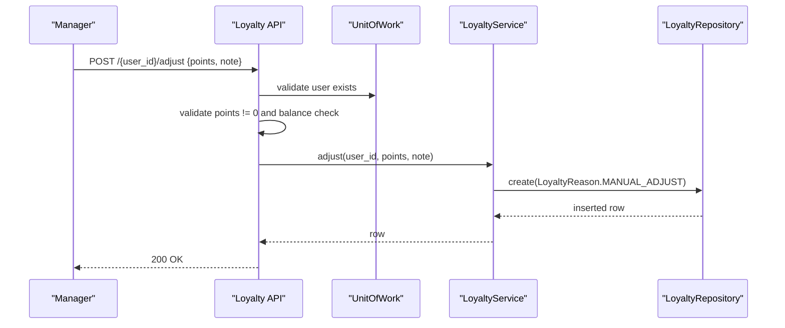

**Diagram sources**
- [loyalty.py](file://app/api/v1/loyalty.py)
- [loyalty_service.py](file://app/services/loyalty_service.py)
- [loyalty_repository.py](file://app/repositories/loyalty_repository.py)

**Section sources**
- [loyalty.py](file://app/api/v1/loyalty.py)
- [loyalty_service.py](file://app/services/loyalty_service.py)

### Background Task: Complete Past Bookings and Award Points
- Scheduled daily task finds CONFIRMED bookings whose slots have ended and marks them COMPLETED.
- For each completed booking, it awards points based on payment_amount and rials-per-point.
- Idempotency ensures no duplicate awards for the same booking.

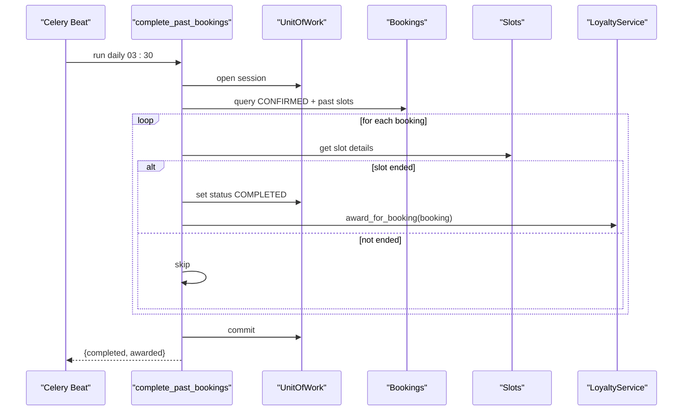

**Diagram sources**
- [loyalty_tasks.py](file://app/tasks/loyalty_tasks.py)
- [loyalty_service.py](file://app/services/loyalty_service.py)

**Section sources**
- [loyalty_tasks.py](file://app/tasks/loyalty_tasks.py)
- [loyalty_service.py](file://app/services/loyalty_service.py)

### Integration with Booking System
- Booking model stores payment_amount, discount_amount, coupon_code, and loyalty_points_used.
- Pricing service computes maximum redeemable points and applies discount accordingly.
- Redemption records are linked to the booking source for auditing and refunds.

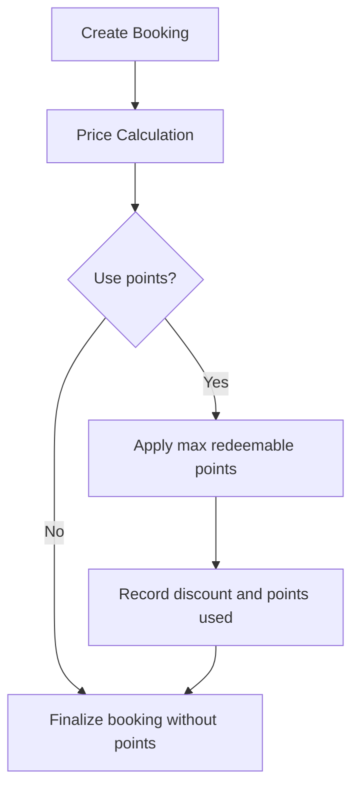

**Diagram sources**
- [booking.py](file://app/models/booking.py)
- [pricing_service.py](file://app/services/pricing_service.py)
- [loyalty_service.py](file://app/services/loyalty_service.py)

**Section sources**
- [booking.py](file://app/models/booking.py)
- [pricing_service.py](file://app/services/pricing_service.py)

### Point Calculation Rules and Configuration
- Rials per point: Configurable rate determines how many rials equal one point.
- Booking reward: floor(payment_amount / rials_per_point).
- Redemption cap: percentage of final price that can be covered by points.
- Review and game win: fixed points per event.

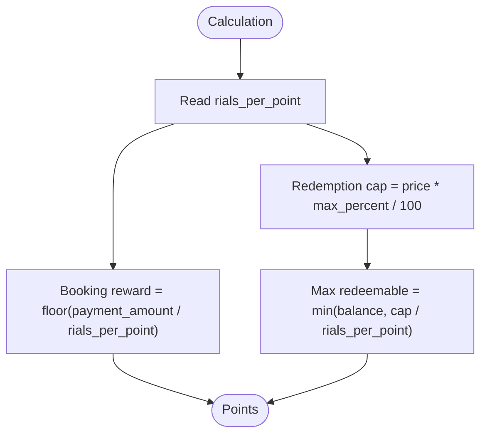

**Diagram sources**
- [config.py](file://app/config.py)
- [loyalty_service.py](file://app/services/loyalty_service.py)
- [pricing_service.py](file://app/services/pricing_service.py)

**Section sources**
- [config.py](file://app/config.py)
- [loyalty_service.py](file://app/services/loyalty_service.py)
- [pricing_service.py](file://app/services/pricing_service.py)

### Fraud Prevention and Audit Logging
- Fraud prevention:
  - Unique constraint on (user_id, reason, source_type, source_id) prevents duplicate awards/redemptions.
  - Redemption requires sufficient balance and respects the configured cap.
  - Manual adjustments validated for zero and negative amounts against balance.
- Audit logging:
  - Every point movement is stored as a row with reason, source, and timestamp.
  - History endpoint returns recent movements for transparency.

**Section sources**
- [loyalty.py](file://app/models/loyalty.py)
- [loyalty_repository.py](file://app/repositories/loyalty_repository.py)
- [loyalty.py](file://app/api/v1/loyalty.py)

### Example Workflows

#### Workflow: Earn Points on Booking Completion
- Past confirmed booking with ended slot is marked completed by scheduled task.
- Points are awarded based on payment_amount and rials_per_point.
- Idempotency ensures no double award.

**Section sources**
- [loyalty_tasks.py](file://app/tasks/loyalty_tasks.py)
- [loyalty_service.py](file://app/services/loyalty_service.py)
- [test_loyalty.py](file://tests/test_loyalty.py)

#### Workflow: Redeem Points at Checkout
- Client requests booking with use_loyalty_points enabled.
- System computes max redeemable points using balance and cap.
- Deduction recorded as negative row linked to booking; discount applied.

**Section sources**
- [pricing_service.py](file://app/services/pricing_service.py)
- [loyalty_service.py](file://app/services/loyalty_service.py)
- [booking.py](file://app/models/booking.py)
- [test_loyalty.py](file://tests/test_loyalty.py)

#### Workflow: Refund Points on Cancellation
- Booking cancellation triggers refund of used points.
- Positive compensatory row recorded with reason and booking source.

**Section sources**
- [loyalty_service.py](file://app/services/loyalty_service.py)
- [test_loyalty.py](file://tests/test_loyalty.py)

#### Workflow: Manager Manual Adjustment
- Manager adds or subtracts points for a user.
- Validation enforces non-zero values and sufficient balance for deductions.
- Adjustment recorded with reason and optional note.

**Section sources**
- [loyalty.py](file://app/api/v1/loyalty.py)
- [loyalty_service.py](file://app/services/loyalty_service.py)
- [test_loyalty.py](file://tests/test_loyalty.py)

## Dependency Analysis
- API depends on service and unit-of-work for transactions.
- Service depends on repository for persistence and config for rates.
- Repository depends on SQLModel and database session.
- Tasks depend on service and unit-of-work to process bookings and award points.
- Pricing service depends on repository and config to compute redemption limits.

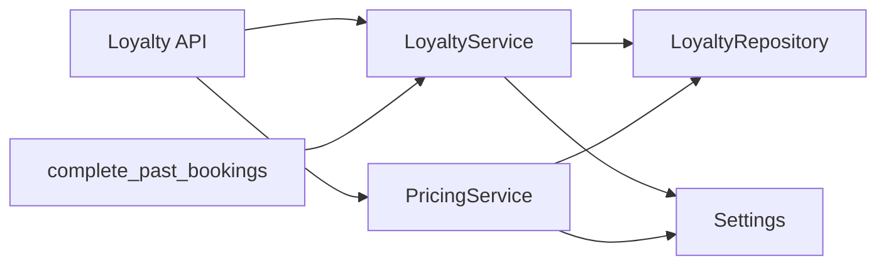

**Diagram sources**
- [loyalty.py](file://app/api/v1/loyalty.py)
- [loyalty_service.py](file://app/services/loyalty_service.py)
- [pricing_service.py](file://app/services/pricing_service.py)
- [loyalty_repository.py](file://app/repositories/loyalty_repository.py)
- [loyalty_tasks.py](file://app/tasks/loyalty_tasks.py)
- [config.py](file://app/config.py)

**Section sources**
- [loyalty.py](file://app/api/v1/loyalty.py)
- [loyalty_service.py](file://app/services/loyalty_service.py)
- [pricing_service.py](file://app/services/pricing_service.py)
- [loyalty_repository.py](file://app/repositories/loyalty_repository.py)
- [loyalty_tasks.py](file://app/tasks/loyalty_tasks.py)
- [config.py](file://app/config.py)

## Performance Considerations
- Balance computation uses SUM aggregation; ensure indexing on user_id for performance.
- History queries support limit/offset to avoid large payloads.
- Idempotency checks prevent redundant inserts and reduce contention.
- Scheduled task batches processing of past bookings; consider pagination for very large datasets.

[No sources needed since this section provides general guidance]

## Troubleshooting Guide
Common issues and resolutions:
- Duplicate award detected: Ensure unique constraint on (user_id, reason, source_type, source_id) is enforced; verify source references are correct.
- Insufficient balance on redemption: Confirm user balance and cap settings; check for pending adjustments or uncommitted transactions.
- No points awarded on completion: Verify scheduled task runs and slot end time; confirm booking status transitions to COMPLETED.
- Manual adjustment rejected: Validate non-zero points and sufficient balance for negative adjustments; ensure user exists.

**Section sources**
- [loyalty.py](file://app/api/v1/loyalty.py)
- [loyalty_service.py](file://app/services/loyalty_service.py)
- [loyalty_repository.py](file://app/repositories/loyalty_repository.py)
- [loyalty_tasks.py](file://app/tasks/loyalty_tasks.py)

## Conclusion
The Loyalty Program module implements a robust, auditable, and idempotent points system integrated with bookings and pricing. It supports earning through completed bookings, reviews, and game wins; redemption with configurable caps; and refunds upon cancellation. The append-only ledger design ensures integrity and transparency, while scheduled tasks and validations provide reliability and fraud prevention.

[No sources needed since this section summarizes without analyzing specific files]

## Appendices

### Configuration Keys
- LOYALTY_RIALS_PER_POINT: Conversion rate between rials and points.
- LOYALTY_REDEEM_MAX_PERCENT: Maximum percentage of final price that can be covered by points.
- LOYALTY_POINTS_PER_GAME_WIN: Fixed points awarded for a game win.
- LOYALTY_POINTS_PER_REVIEW: Fixed points awarded for a review.

**Section sources**
- [config.py](file://app/config.py)