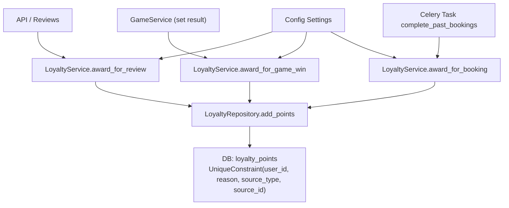
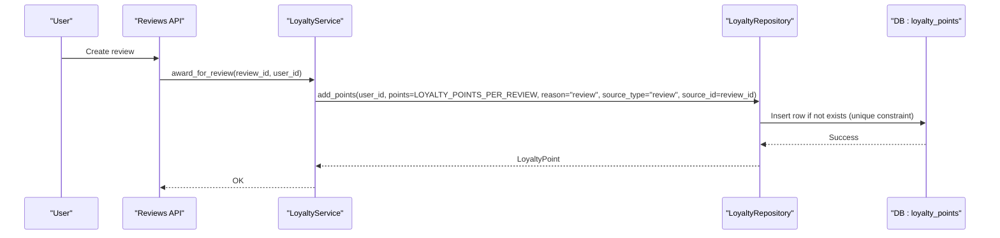
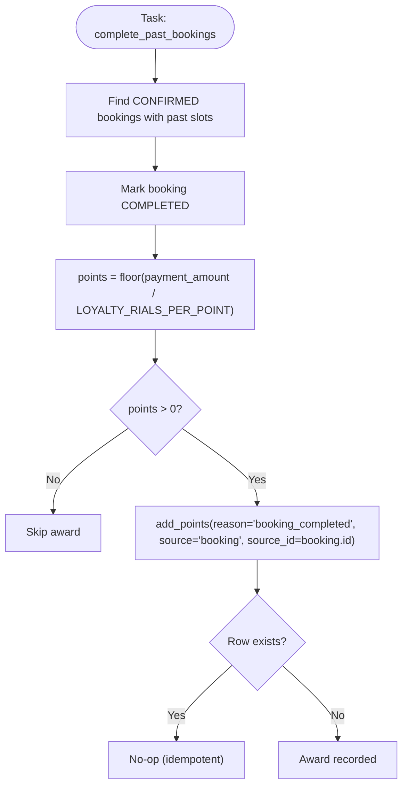
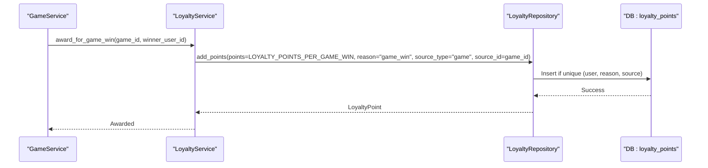
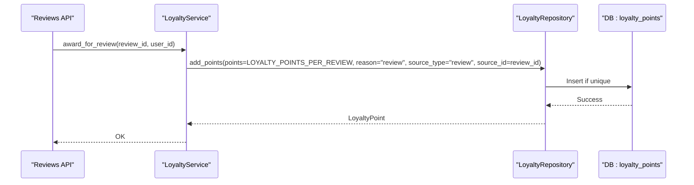
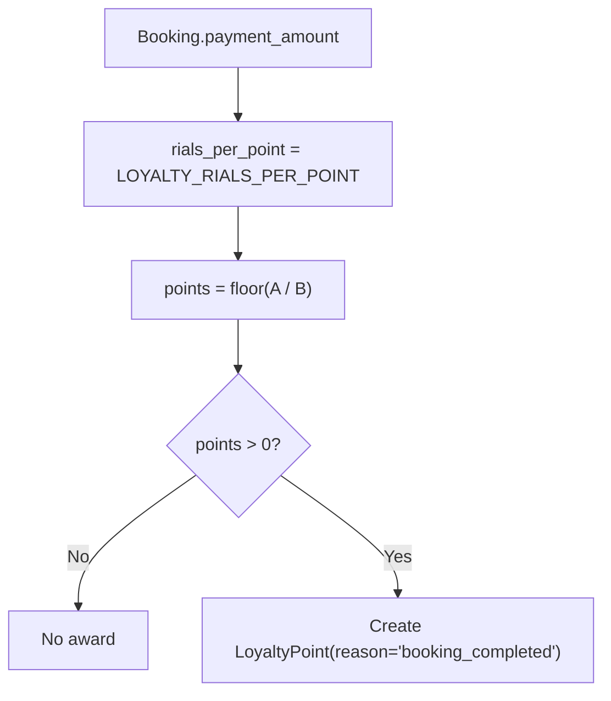
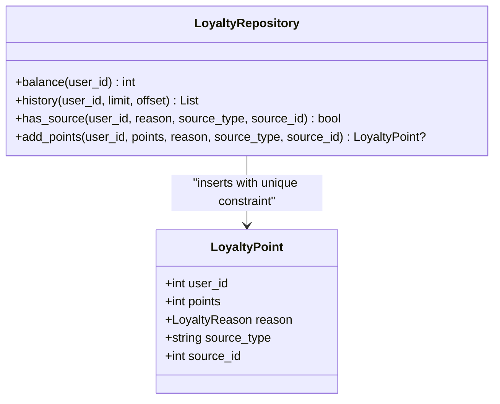
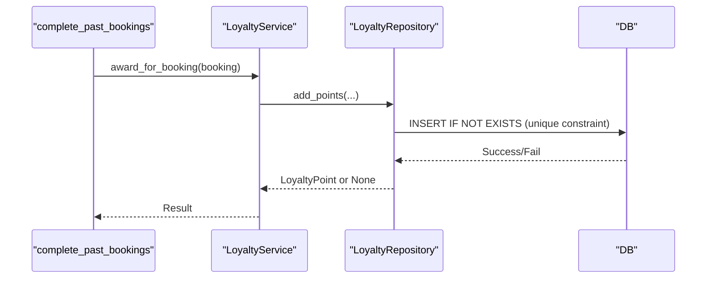
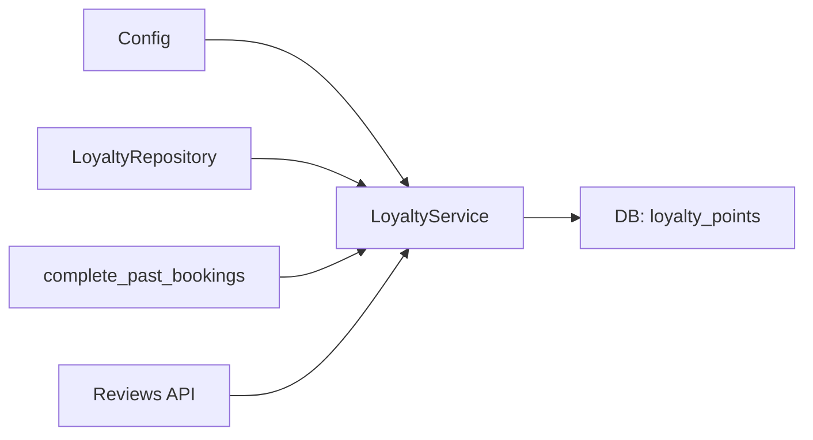

# Points Earning System

<cite>
**Referenced Files in This Document**
- [loyalty.py](file://app/models/loyalty.py)
- [loyalty_service.py](file://app/services/loyalty_service.py)
- [loyalty_repository.py](file://app/repositories/loyalty_repository.py)
- [config.py](file://app/config.py)
- [loyalty_tasks.py](file://app/tasks/loyalty_tasks.py)
- [reviews.py](file://app/api/v1/reviews.py)
- [game_service.py](file://app/services/game_service.py)
- [booking.py](file://app/models/booking.py)
- [m0s014_points_gamewin.py](file://migrations/versions/m0s014_points_gamewin.py)
</cite>

## Table of Contents
1. [Introduction](#introduction)
2. [Project Structure](#project-structure)
3. [Core Components](#core-components)
4. [Architecture Overview](#architecture-overview)
5. [Detailed Component Analysis](#detailed-component-analysis)
6. [Dependency Analysis](#dependency-analysis)
7. [Performance Considerations](#performance-considerations)
8. [Troubleshooting Guide](#troubleshooting-guide)
9. [Conclusion](#conclusion)

## Introduction
This document explains the points earning system for the loyalty program. It covers how points are awarded for booking completion, game wins, and reviews; how automatic point calculation uses a rials-per-point conversion rate; how idempotency is enforced via source-based deduplication to prevent duplicate rewards; and how configuration controls different earning rates. It also details the award_for_booking, award_for_game_win, and award_for_review methods and provides examples of workflows and fraud prevention through source tracking.

## Project Structure
The loyalty points system spans models, services, repositories, tasks, API endpoints, and configuration:
- Model defines the append-only ledger and uniqueness constraints for idempotency.
- Service encapsulates business logic for awards, redemption, refunds, and adjustments.
- Repository handles persistence, balance computation, history retrieval, and source-based deduplication checks.
- Tasks run scheduled jobs to complete past bookings and award points.
- APIs trigger review-based awards and expose user balances/history.
- Configuration centralizes earning rates and conversion factors.

**Diagram sources**
- [reviews.py:100-111](file://app/api/v1/reviews.py#L100-L111)
- [game_service.py:950-970](file://app/services/game_service.py#L950-L970)
- [loyalty_tasks.py:16-51](file://app/tasks/loyalty_tasks.py#L16-L51)
- [loyalty_service.py:41-99](file://app/services/loyalty_service.py#L41-L99)
- [loyalty_repository.py:34-46](file://app/repositories/loyalty_repository.py#L34-L46)
- [loyalty.py:29-35](file://app/models/loyalty.py#L29-L35)
- [config.py:15-26](file://app/config.py#L15-L26)

**Section sources**
- [loyalty.py:18-43](file://app/models/loyalty.py#L18-L43)
- [loyalty_service.py:1-110](file://app/services/loyalty_service.py#L1-L110)
- [loyalty_repository.py:1-46](file://app/repositories/loyalty_repository.py#L1-L46)
- [config.py:1-69](file://app/config.py#L1-L69)
- [loyalty_tasks.py:1-59](file://app/tasks/loyalty_tasks.py#L1-L59)
- [reviews.py:100-111](file://app/api/v1/reviews.py#L100-L111)
- [game_service.py:950-970](file://app/services/game_service.py#L950-L970)

## Core Components
- LoyaltyPoint model: Append-only ledger with a unique constraint on (user_id, reason, source_type, source_id) to enforce idempotent awards per source.
- LoyaltyService: Implements awarding logic for bookings, game wins, and reviews; redemption and refund flows; manual adjustments; and conversion calculations.
- LoyaltyRepository: Provides balance calculation, history listing, and add_points with source-based deduplication.
- Config: Centralized settings for rials_per_point, points per game win, and points per review.
- Tasks: Scheduled job to transition eligible bookings to completed and award points.
- APIs: Review creation triggers review-based awards; admin endpoints adjust points.

Key responsibilities:
- Automatic point calculation from booking amounts using LOYALTY_RIALS_PER_POINT.
- Fixed point awards for game wins and reviews using LOYALTY_POINTS_PER_GAME_WIN and LOYALTY_POINTS_PER_REVIEW.
- Idempotency via source tracking prevents duplicate rewards.

**Section sources**
- [loyalty.py:18-43](file://app/models/loyalty.py#L18-L43)
- [loyalty_service.py:27-110](file://app/services/loyalty_service.py#L27-L110)
- [loyalty_repository.py:14-46](file://app/repositories/loyalty_repository.py#L14-L46)
- [config.py:15-26](file://app/config.py#L15-L26)
- [loyalty_tasks.py:16-51](file://app/tasks/loyalty_tasks.py#L16-L51)
- [reviews.py:100-111](file://app/api/v1/reviews.py#L100-L111)

## Architecture Overview
The system follows an append-only ledger pattern:
- Every award or spend creates a new row with signed points and a reason.
- Balance is computed as the sum of all rows for a user.
- Source-based uniqueness ensures each event (booking, game, review) can be rewarded exactly once per user.

**Diagram sources**
- [reviews.py:100-111](file://app/api/v1/reviews.py#L100-L111)
- [loyalty_service.py:90-99](file://app/services/loyalty_service.py#L90-L99)
- [loyalty_repository.py:34-46](file://app/repositories/loyalty_repository.py#L34-L46)
- [loyalty.py:29-35](file://app/models/loyalty.py#L29-L35)

## Detailed Component Analysis

### Booking Completion Rewards
- Trigger: A scheduled task transitions eligible confirmed bookings to completed and calls award_for_booking.
- Calculation: Points = floor(payment_amount / LOYALTY_RIALS_PER_POINT). If points <= 0, no award is created.
- Idempotency: Awarded once per booking due to unique constraint on (user_id, reason="booking_completed", source_type="booking", source_id=booking.id).

**Diagram sources**
- [loyalty_tasks.py:16-51](file://app/tasks/loyalty_tasks.py#L16-L51)
- [loyalty_service.py:41-50](file://app/services/loyalty_service.py#L41-L50)
- [loyalty_repository.py:34-46](file://app/repositories/loyalty_repository.py#L34-L46)
- [loyalty.py:29-35](file://app/models/loyalty.py#L29-L35)
- [config.py:15-17](file://app/config.py#L15-L17)

**Section sources**
- [loyalty_tasks.py:16-51](file://app/tasks/loyalty_tasks.py#L16-L51)
- [loyalty_service.py:31-50](file://app/services/loyalty_service.py#L31-L50)
- [loyalty_repository.py:34-46](file://app/repositories/loyalty_repository.py#L34-L46)
- [booking.py:21-35](file://app/models/booking.py#L21-L35)
- [config.py:15-17](file://app/config.py#L15-L17)

### Game Win Bonuses
- Trigger: When a game result is set, winners receive points.
- Calculation: Points = LOYALTY_POINTS_PER_GAME_WIN.
- Idempotency: One award per (user, game) via unique constraint on (user_id, reason="game_win", source_type="game", source_id=game.id).

**Diagram sources**
- [game_service.py:950-970](file://app/services/game_service.py#L950-L970)
- [loyalty_service.py:78-87](file://app/services/loyalty_service.py#L78-L87)
- [loyalty_repository.py:34-46](file://app/repositories/loyalty_repository.py#L34-L46)
- [loyalty.py:29-35](file://app/models/loyalty.py#L29-L35)
- [config.py:24-26](file://app/config.py#L24-L26)

**Section sources**
- [game_service.py:950-970](file://app/services/game_service.py#L950-L970)
- [loyalty_service.py:78-87](file://app/services/loyalty_service.py#L78-L87)
- [config.py:24-26](file://app/config.py#L24-L26)
- [loyalty.py:18-35](file://app/models/loyalty.py#L18-L35)

### Review Incentives
- Trigger: Creating a review triggers an award.
- Calculation: Points = LOYALTY_POINTS_PER_REVIEW.
- Idempotency: One award per (user, review) via unique constraint on (user_id, reason="review", source_type="review", source_id=review.id).

**Diagram sources**
- [reviews.py:100-111](file://app/api/v1/reviews.py#L100-L111)
- [loyalty_service.py:90-99](file://app/services/loyalty_service.py#L90-L99)
- [loyalty_repository.py:34-46](file://app/repositories/loyalty_repository.py#L34-L46)
- [loyalty.py:29-35](file://app/models/loyalty.py#L29-L35)
- [config.py:24-26](file://app/config.py#L24-L26)

**Section sources**
- [reviews.py:100-111](file://app/api/v1/reviews.py#L100-L111)
- [loyalty_service.py:90-99](file://app/services/loyalty_service.py#L90-L99)
- [config.py:24-26](file://app/config.py#L24-L26)
- [loyalty.py:18-35](file://app/models/loyalty.py#L18-L35)

### Automatic Point Calculation Based on Booking Amounts
- Conversion rate: LOYALTY_RIALS_PER_POINT defines how many rials equal one point.
- Formula: points = floor(payment_amount / LOYALTY_RIALS_PER_POINT).
- Applied only when points > 0; otherwise no award is created.

**Diagram sources**
- [loyalty_service.py:31-38](file://app/services/loyalty_service.py#L31-L38)
- [config.py:15-17](file://app/config.py#L15-L17)

**Section sources**
- [loyalty_service.py:31-38](file://app/services/loyalty_service.py#L31-L38)
- [config.py:15-17](file://app/config.py#L15-L17)

### Idempotency and Source-Based Deduplication
- The database enforces a unique constraint on (user_id, reason, source_type, source_id).
- Each award method attaches a source type and source id:
  - Booking: source_type="booking", source_id=booking.id
  - Game win: source_type="game", source_id=game.id
  - Review: source_type="review", source_id=review.id
- Repository checks existence before insert; returns None if already present.

**Diagram sources**
- [loyalty.py:29-35](file://app/models/loyalty.py#L29-L35)
- [loyalty_repository.py:23-46](file://app/repositories/loyalty_repository.py#L23-L46)

**Section sources**
- [loyalty.py:29-35](file://app/models/loyalty.py#L29-L35)
- [loyalty_repository.py:23-46](file://app/repositories/loyalty_repository.py#L23-L46)

### Configuration Settings for Earning Rates
- LOYALTY_RIALS_PER_POINT: Controls conversion from rials to points for booking rewards.
- LOYALTY_POINTS_PER_GAME_WIN: Fixed points awarded per game win.
- LOYALTY_POINTS_PER_REVIEW: Fixed points awarded per review.

These values are read at runtime by the service methods to compute or assign points.

**Section sources**
- [config.py:15-26](file://app/config.py#L15-L26)
- [loyalty_service.py:31-38](file://app/services/loyalty_service.py#L31-L38)
- [loyalty_service.py:78-99](file://app/services/loyalty_service.py#L78-L99)

### Implementation Details of Award Methods
- award_for_booking(session, booking):
  - Computes points from booking.payment_amount using rials_per_point.
  - Creates a point row with reason="booking_completed" and source="booking".
  - Returns None if points <= 0 or if already awarded for this booking.
- award_for_game_win(session, game_id, user_id):
  - Uses LOYALTY_POINTS_PER_GAME_WIN.
  - Creates a point row with reason="game_win" and source="game".
  - Returns None if points <= 0 or if already awarded for this user+game.
- award_for_review(session, review_id, user_id):
  - Uses LOYALTY_POINTS_PER_REVIEW.
  - Creates a point row with reason="review" and source="review".
  - Returns None if points <= 0 or if already awarded for this user+review.

**Section sources**
- [loyalty_service.py:41-99](file://app/services/loyalty_service.py#L41-L99)
- [loyalty_repository.py:34-46](file://app/repositories/loyalty_repository.py#L34-L46)
- [loyalty.py:18-35](file://app/models/loyalty.py#L18-L35)

### Example Workflows
- Booking completion:
  - Nightly task scans confirmed bookings whose slots have ended, marks them completed, and awards points based on payment amount.
  - Idempotent: repeated runs do not double-award because of source uniqueness.
- Game win:
  - When a game result is finalized, winners receive fixed points per game.
  - Idempotent: each winner receives points once per game.
- Review incentive:
  - On review creation, the reviewer receives fixed points.
  - Idempotent: each review yields points once per user.

**Diagram sources**
- [loyalty_tasks.py:16-51](file://app/tasks/loyalty_tasks.py#L16-L51)
- [loyalty_service.py:41-50](file://app/services/loyalty_service.py#L41-L50)
- [loyalty_repository.py:34-46](file://app/repositories/loyalty_repository.py#L34-L46)
- [loyalty.py:29-35](file://app/models/loyalty.py#L29-L35)

**Section sources**
- [loyalty_tasks.py:16-51](file://app/tasks/loyalty_tasks.py#L16-L51)
- [loyalty_service.py:41-50](file://app/services/loyalty_service.py#L41-L50)

## Dependency Analysis
- Services depend on repository for persistence and on config for rates.
- Tasks depend on services to perform business actions within unit-of-work transactions.
- APIs trigger service methods that persist changes and commit.

**Diagram sources**
- [config.py:15-26](file://app/config.py#L15-L26)
- [loyalty_service.py:1-110](file://app/services/loyalty_service.py#L1-L110)
- [loyalty_repository.py:1-46](file://app/repositories/loyalty_repository.py#L1-L46)
- [loyalty_tasks.py:16-51](file://app/tasks/loyalty_tasks.py#L16-L51)
- [reviews.py:100-111](file://app/api/v1/reviews.py#L100-L111)

**Section sources**
- [loyalty_service.py:1-110](file://app/services/loyalty_service.py#L1-L110)
- [loyalty_repository.py:1-46](file://app/repositories/loyalty_repository.py#L1-L46)
- [config.py:15-26](file://app/config.py#L15-L26)
- [loyalty_tasks.py:16-51](file://app/tasks/loyalty_tasks.py#L16-L51)
- [reviews.py:100-111](file://app/api/v1/reviews.py#L100-L111)

## Performance Considerations
- Append-only ledger: Balance is computed as SUM(points), which scales with number of rows. For high-volume users, consider indexing and periodic aggregation strategies if needed.
- Unique constraint enforcement: Database-level uniqueness avoids expensive application-side checks but still requires index usage; ensure indexes exist on (user_id, reason, source_type, source_id).
- Batch processing: The nightly task processes eligible bookings in a single transaction; monitor batch size and timeouts.
- Configuration tuning: Adjust LOYALTY_RIALS_PER_POINT to control point inflation; higher values reduce point issuance per monetary amount.

[No sources needed since this section provides general guidance]

## Troubleshooting Guide
- Duplicate awards prevented:
  - If a reward appears duplicated, verify the unique constraint on (user_id, reason, source_type, source_id) and confirm source identifiers are correct.
- Zero points awarded:
  - For bookings, ensure payment_amount divided by LOYALTY_RIALS_PER_POINT yields at least 1 point.
  - For games and reviews, ensure corresponding configuration values are positive.
- Missing awards after retries:
  - Re-running award methods is safe due to idempotency; check logs for has_source returning True and resulting None.
- Redemption failures:
  - Ensure sufficient balance before redeeming; the service validates available points.

**Section sources**
- [loyalty_repository.py:23-46](file://app/repositories/loyalty_repository.py#L23-L46)
- [loyalty_service.py:53-64](file://app/services/loyalty_service.py#L53-L64)
- [loyalty_service.py:31-38](file://app/services/loyalty_service.py#L31-L38)
- [loyalty_service.py:78-99](file://app/services/loyalty_service.py#L78-L99)

## Conclusion
The points earning system uses an append-only ledger with strict source-based idempotency to ensure fair and accurate rewards. Booking completion rewards are calculated automatically using a configurable rials-to-points conversion, while game wins and reviews grant fixed points. The design prevents fraud and duplication through database-enforced uniqueness and careful source tracking. Configuration allows flexible tuning of earning rates without code changes.

[No sources needed since this section summarizes without analyzing specific files]