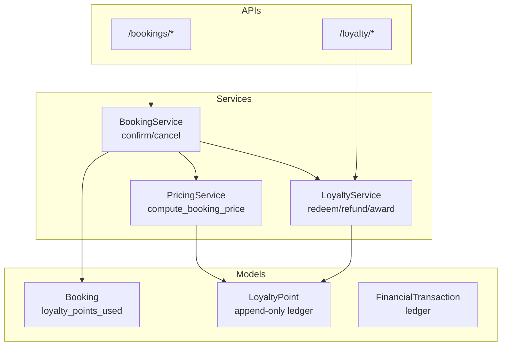
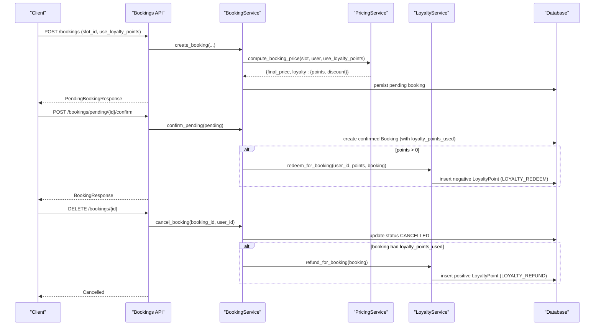
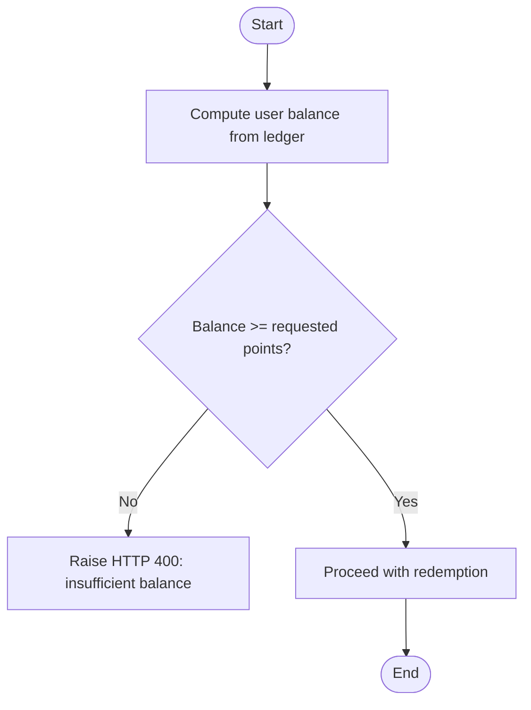
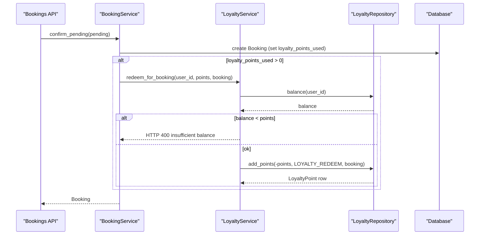
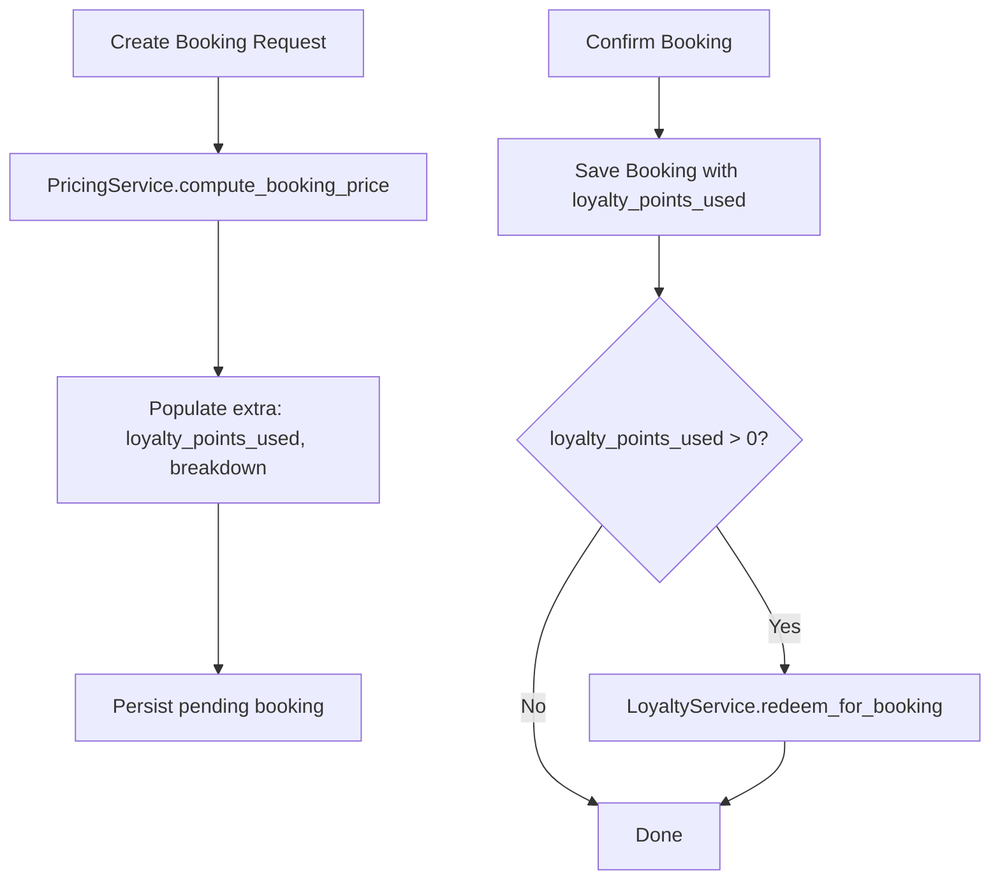
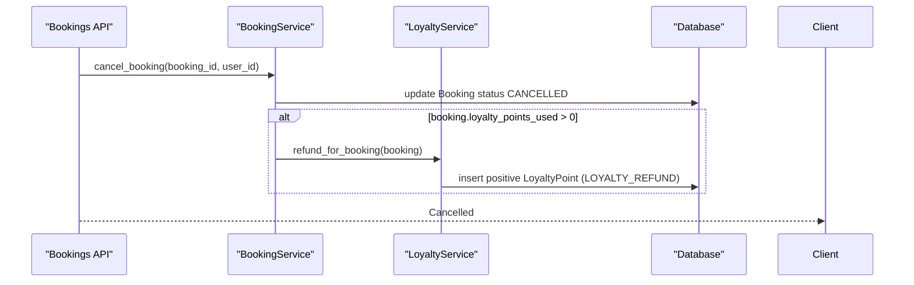
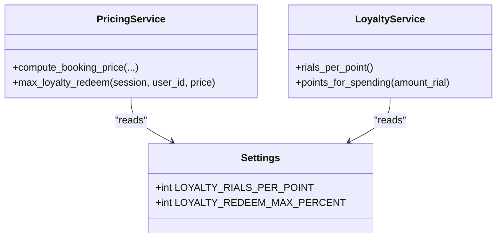
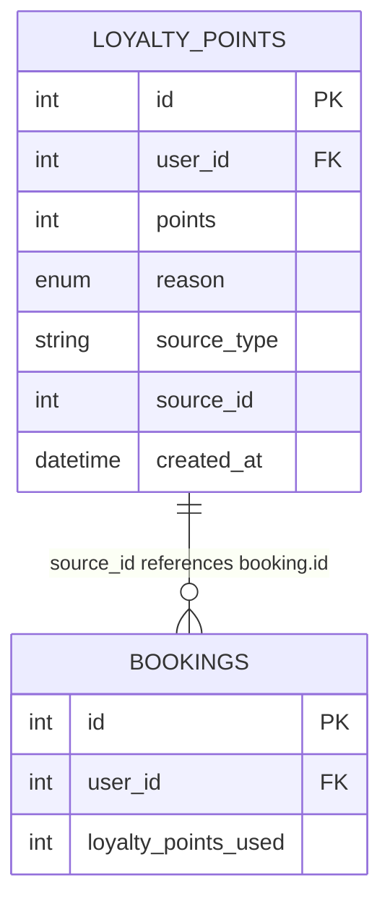
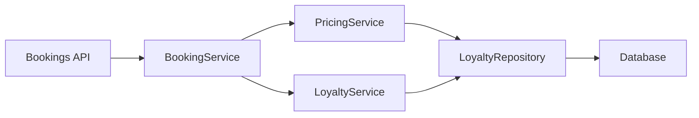

# Points Redemption System

<cite>
**Referenced Files in This Document**
- [loyalty.py](file://app/models/loyalty.py)
- [booking.py](file://app/models/booking.py)
- [transaction.py](file://app/models/transaction.py)
- [loyalty_service.py](file://app/services/loyalty_service.py)
- [pricing_service.py](file://app/services/pricing_service.py)
- [booking_service.py](file://app/services/booking_service.py)
- [bookings.py](file://app/api/v1/bookings.py)
- [loyalty.py](file://app/api/v1/loyalty.py)
- [config.py](file://app/config.py)
</cite>

## Table of Contents
1. Introduction
2. Project Structure
3. Core Components
4. Architecture Overview
5. Detailed Component Analysis
6. Dependency Analysis
7. Performance Considerations
8. Troubleshooting Guide
9. Conclusion

## Introduction
This document explains the points redemption system that allows users to redeem loyalty points for bookings, how balances are checked before redemption, how redeemed points are tracked on bookings, and how refunds automatically return redeemed points when bookings are cancelled. It also covers the relationship between points and monetary value, error handling for insufficient balance, and the audit trail created for each redemption transaction.

## Project Structure
The points redemption system spans models, services, repositories, and API endpoints:
- Models define append-only ledgers for loyalty points and financial transactions, plus booking fields that track redeemed points.
- Services implement business logic for awarding, redeeming, and refunding points, as well as pricing calculations that include loyalty discounts.
- Repositories provide data access with idempotency and balance computation.
- APIs expose endpoints for viewing loyalty history and adjusting points (admin), while booking flows integrate point redemption at confirmation time.

**Diagram sources**
- [booking.py:21-35](file://app/models/booking.py#L21-L35)
- [loyalty.py:29-43](file://app/models/loyalty.py#L29-L43)
- [transaction.py:84-119](file://app/models/transaction.py#L84-L119)
- [pricing_service.py:147-229](file://app/services/pricing_service.py#L147-L229)
- [loyalty_service.py:25-75](file://app/services/loyalty_service.py#L25-L75)
- [booking_service.py:119-192](file://app/services/booking_service.py#L119-L192)
- [bookings.py:99-131](file://app/api/v1/bookings.py#L99-L131)
- [loyalty.py:25-58](file://app/api/v1/loyalty.py#L25-L58)

**Section sources**
- [booking.py:21-35](file://app/models/booking.py#L21-L35)
- [loyalty.py:29-43](file://app/models/loyalty.py#L29-L43)
- [transaction.py:84-119](file://app/models/transaction.py#L84-L119)
- [pricing_service.py:147-229](file://app/services/pricing_service.py#L147-L229)
- [loyalty_service.py:25-75](file://app/services/loyalty_service.py#L25-L75)
- [booking_service.py:119-192](file://app/services/booking_service.py#L119-L192)
- [bookings.py:99-131](file://app/api/v1/bookings.py#L99-L131)
- [loyalty.py:25-58](file://app/api/v1/loyalty.py#L25-L58)

## Core Components
- LoyaltyPoint model: Append-only ledger where balance equals the sum of signed points; unique constraints prevent duplicate source-based entries.
- Booking model: Tracks loyalty_points_used so refunds can return the exact amount used.
- PricingService: Computes final price including optional loyalty discount based on user balance and configured caps.
- LoyaltyService: Provides methods to check balance, redeem points for a confirmed booking, and refund points upon cancellation.
- BookingService: Integrates pricing and loyalty into booking confirmation and cancellation flows.
- API layer: Exposes endpoints to view loyalty history and perform admin adjustments; booking endpoints trigger redemption at confirmation.

Key configuration:
- LOYALTY_RIALS_PER_POINT defines the monetary value per point (e.g., 10,000 rial = 1 point).
- LOYALTY_REDEEM_MAX_PERCENT limits the maximum percentage of the booking price that can be covered by points.

**Section sources**
- [loyalty.py:29-43](file://app/models/loyalty.py#L29-L43)
- [booking.py:21-35](file://app/models/booking.py#L21-L35)
- [pricing_service.py:147-229](file://app/services/pricing_service.py#L147-L229)
- [loyalty_service.py:25-75](file://app/services/loyalty_service.py#L25-L75)
- [config.py:14-26](file://app/config.py#L14-L26)

## Architecture Overview
The redemption flow is integrated into the booking lifecycle:
- During booking creation, PricingService calculates potential loyalty discount based on current balance and policy caps.
- On booking confirmation, if points were applied, LoyaltyService.redeem_for_booking deducts points and records an append-only negative entry linked to the booking.
- On booking cancellation, LoyaltyService.refund_for_booking adds a compensating positive entry to restore the user’s balance.

**Diagram sources**
- [bookings.py:99-131](file://app/api/v1/bookings.py#L99-L131)
- [bookings.py:191-237](file://app/api/v1/bookings.py#L191-L237)
- [bookings.py:349-426](file://app/api/v1/bookings.py#L349-L426)
- [booking_service.py:119-192](file://app/services/booking_service.py#L119-L192)
- [booking_service.py:194-217](file://app/services/booking_service.py#L194-L217)
- [pricing_service.py:147-229](file://app/services/pricing_service.py#L147-L229)
- [loyalty_service.py:52-75](file://app/services/loyalty_service.py#L52-L75)

## Detailed Component Analysis

### Balance Checking Mechanism
- The effective balance is computed as the sum of all signed points for a user from the append-only ledger.
- Before any redemption, the service checks whether the user has sufficient balance; otherwise, it raises a client error indicating insufficient points.
- During pricing calculation, the maximum redeemable points are capped both by the user’s balance and by a configurable percentage of the booking price.

**Diagram sources**
- [loyalty_service.py:27-33](file://app/services/loyalty_service.py#L27-L33)
- [loyalty_service.py:52-64](file://app/services/loyalty_service.py#L52-L64)
- [pricing_service.py:233-244](file://app/services/pricing_service.py#L233-L244)

**Section sources**
- [loyalty_service.py:27-33](file://app/services/loyalty_service.py#L27-L33)
- [loyalty_service.py:52-64](file://app/services/loyalty_service.py#L52-L64)
- [pricing_service.py:233-244](file://app/services/pricing_service.py#L233-L244)

### Redemption via redeem_for_booking
- When a booking is confirmed and points were applied during pricing, the system calls redeem_for_booking to deduct points.
- The method validates that points are positive and that the user has sufficient balance; then it inserts a negative LoyaltyPoint row with reason LOYALTY_REDEEM and links it to the booking via source_type and source_id.
- The booking record stores loyalty_points_used to enable accurate refunds later.

**Diagram sources**
- [booking_service.py:119-192](file://app/services/booking_service.py#L119-L192)
- [loyalty_service.py:52-64](file://app/services/loyalty_service.py#L52-L64)
- [loyalty_repository.py:14-17](file://app/repositories/loyalty_repository.py#L14-L17)
- [loyalty_repository.py:34-46](file://app/repositories/loyalty_repository.py#L34-L46)

**Section sources**
- [booking_service.py:119-192](file://app/services/booking_service.py#L119-L192)
- [loyalty_service.py:52-64](file://app/services/loyalty_service.py#L52-L64)
- [loyalty_repository.py:14-17](file://app/repositories/loyalty_repository.py#L14-L17)
- [loyalty_repository.py:34-46](file://app/repositories/loyalty_repository.py#L34-L46)

### Integration with Booking System
- PricingService.compute_booking_price determines the maximum loyalty discount based on user balance and policy caps, returning the number of points and their monetary equivalent.
- BookingService.create_booking uses this result to populate extra fields including loyalty_points_used and pricing breakdown.
- Upon confirmation, BookingService persists the booking with loyalty_points_used and triggers redemption if applicable.

**Diagram sources**
- [pricing_service.py:147-229](file://app/services/pricing_service.py#L147-L229)
- [booking_service.py:27-109](file://app/services/booking_service.py#L27-L109)
- [booking_service.py:119-192](file://app/services/booking_service.py#L119-L192)

**Section sources**
- [pricing_service.py:147-229](file://app/services/pricing_service.py#L147-L229)
- [booking_service.py:27-109](file://app/services/booking_service.py#L27-L109)
- [booking_service.py:119-192](file://app/services/booking_service.py#L119-L192)

### Refund Process on Cancellation
- When a booking is cancelled, the system checks if loyalty_points_used was set; if so, it calls refund_for_booking to add a compensating positive entry with reason LOYALTY_REFUND linked to the same booking.
- This restores the user’s balance exactly as it was before redemption, maintaining idempotency through source linkage.

**Diagram sources**
- [booking_service.py:194-217](file://app/services/booking_service.py#L194-L217)
- [loyalty_service.py:66-75](file://app/services/loyalty_service.py#L66-L75)

**Section sources**
- [booking_service.py:194-217](file://app/services/booking_service.py#L194-L217)
- [loyalty_service.py:66-75](file://app/services/loyalty_service.py#L66-L75)

### Relationship Between Points and Monetary Value
- LOYALTY_RIALS_PER_POINT defines how many rials equal one point; both earning and spending use this conversion.
- Earning: points awarded for completed bookings are derived from payment_amount divided by LOYALTY_RIALS_PER_POINT.
- Spending: max redeemable points are limited by LOYALTY_REDEEM_MAX_PERCENT of the booking price and by the user’s balance.

**Diagram sources**
- [config.py:14-26](file://app/config.py#L14-L26)
- [pricing_service.py:233-244](file://app/services/pricing_service.py#L233-L244)
- [loyalty_service.py:31-38](file://app/services/loyalty_service.py#L31-L38)

**Section sources**
- [config.py:14-26](file://app/config.py#L14-L26)
- [pricing_service.py:233-244](file://app/services/pricing_service.py#L233-L244)
- [loyalty_service.py:31-38](file://app/services/loyalty_service.py#L31-L38)

### Audit Trail for Each Redemption Transaction
- Every point movement is recorded as an append-only row in the loyalty_points table with reason, source_type, and source_id.
- Unique constraints ensure idempotency per source (e.g., a specific booking cannot cause duplicate redemptions or refunds).
- Financial transactions are separately tracked in financial_transactions for monetary flows, but loyalty movements are audited in loyalty_points.

**Diagram sources**
- [loyalty.py:29-43](file://app/models/loyalty.py#L29-L43)
- [booking.py:21-35](file://app/models/booking.py#L21-L35)
- [loyalty_repository.py:23-32](file://app/repositories/loyalty_repository.py#L23-L32)

**Section sources**
- [loyalty.py:29-43](file://app/models/loyalty.py#L29-L43)
- [booking.py:21-35](file://app/models/booking.py#L21-L35)
- [loyalty_repository.py:23-32](file://app/repositories/loyalty_repository.py#L23-L32)

## Dependency Analysis
- BookingService depends on PricingService to determine eligible loyalty discounts and on LoyaltyService to apply/redemption/refund points.
- PricingService depends on LoyaltyRepository to read user balance and on configuration for conversion rates and caps.
- LoyaltyService depends on LoyaltyRepository for balance checks and append-only writes.
- API endpoints orchestrate these services within unit-of-work transactions to ensure consistency.

**Diagram sources**
- [bookings.py:99-131](file://app/api/v1/bookings.py#L99-L131)
- [booking_service.py:119-192](file://app/services/booking_service.py#L119-L192)
- [pricing_service.py:147-229](file://app/services/pricing_service.py#L147-L229)
- [loyalty_service.py:25-75](file://app/services/loyalty_service.py#L25-L75)
- [loyalty_repository.py:14-46](file://app/repositories/loyalty_repository.py#L14-L46)

**Section sources**
- [bookings.py:99-131](file://app/api/v1/bookings.py#L99-L131)
- [booking_service.py:119-192](file://app/services/booking_service.py#L119-L192)
- [pricing_service.py:147-229](file://app/services/pricing_service.py#L147-L229)
- [loyalty_service.py:25-75](file://app/services/loyalty_service.py#L25-L75)
- [loyalty_repository.py:14-46](file://app/repositories/loyalty_repository.py#L14-L46)

## Performance Considerations
- Balance computation uses a single aggregate query over the append-only ledger; keep queries efficient and avoid unnecessary scans.
- Idempotency via unique constraints prevents duplicate writes and reduces contention on repeated operations.
- Use unit-of-work transactions around booking confirmation and cancellation to ensure atomicity of point deductions/refunds alongside booking state changes.

[No sources needed since this section provides general guidance]

## Troubleshooting Guide
Common issues and resolutions:
- Insufficient balance during redemption:
  - Symptom: HTTP 400 with detail indicating insufficient points.
  - Cause: User balance less than requested points at redemption time.
  - Resolution: Reduce requested points or wait for additional points to be awarded.
  - Reference: [loyalty_service.py:52-64](file://app/services/loyalty_service.py#L52-L64)
- No points deducted on confirmation:
  - Ensure use_loyalty_points was true during booking creation and that PricingService returned points > 0.
  - Verify booking.loyalty_points_used is set before calling redeem_for_booking.
  - References: [pricing_service.py:199-209](file://app/services/pricing_service.py#L199-L209), [booking_service.py:178-181](file://app/services/booking_service.py#L178-L181)
- Points not refunded after cancellation:
  - Confirm booking.loyalty_points_used was non-zero at cancellation time.
  - Check that refund_for_booking was invoked and inserted a LOYALTY_REFUND row.
  - References: [booking_service.py:194-217](file://app/services/booking_service.py#L194-L217), [loyalty_service.py:66-75](file://app/services/loyalty_service.py#L66-L75)
- Viewing balance and history:
  - Use the loyalty endpoint to retrieve balance and recent point movements.
  - Reference: [loyalty.py:25-38](file://app/api/v1/loyalty.py#L25-L38)

**Section sources**
- [loyalty_service.py:52-64](file://app/services/loyalty_service.py#L52-L64)
- [pricing_service.py:199-209](file://app/services/pricing_service.py#L199-L209)
- [booking_service.py:178-181](file://app/services/booking_service.py#L178-L181)
- [booking_service.py:194-217](file://app/services/booking_service.py#L194-L217)
- [loyalty_service.py:66-75](file://app/services/loyalty_service.py#L66-L75)
- [loyalty.py:25-38](file://app/api/v1/loyalty.py#L25-L38)

## Conclusion
The points redemption system integrates tightly with the booking workflow to offer flexible discounts while preserving a robust, append-only audit trail. Balances are validated before redemption, and cancellations automatically restore points. Configuration controls the monetary value of points and redemption caps, ensuring predictable behavior. The design emphasizes idempotency, traceability, and consistency across booking and loyalty states.

[No sources needed since this section summarizes without analyzing specific files]