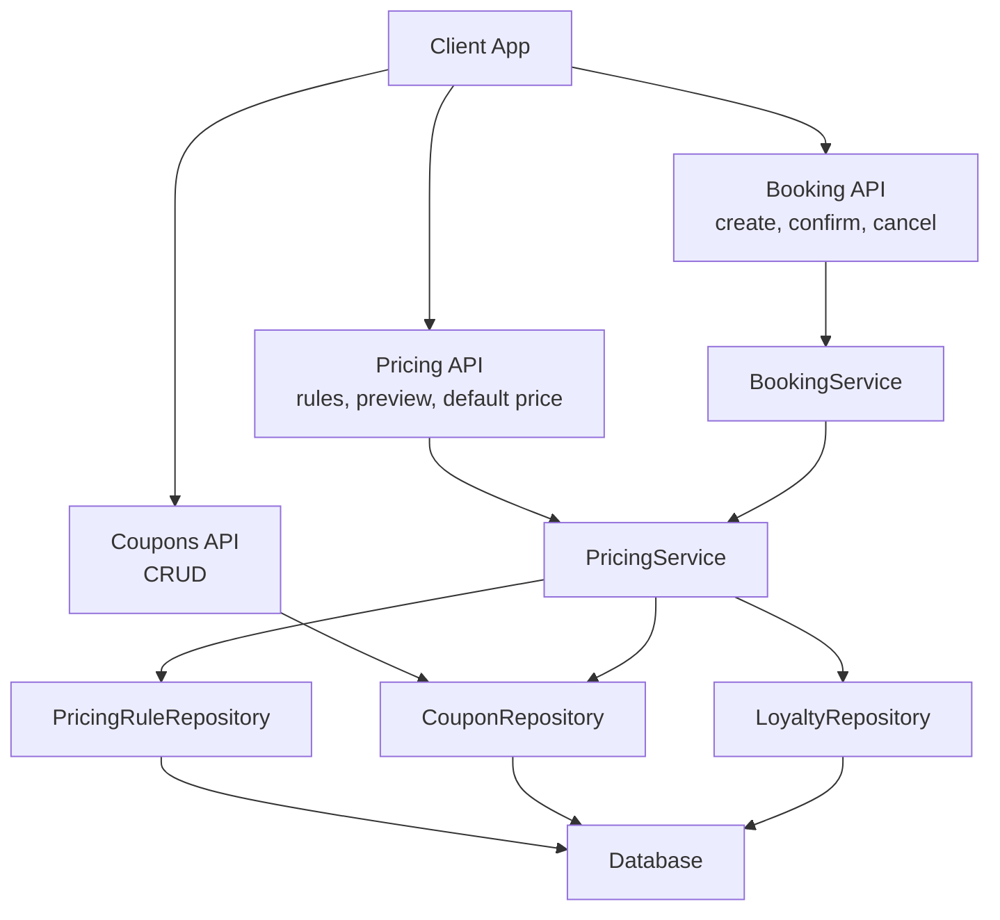
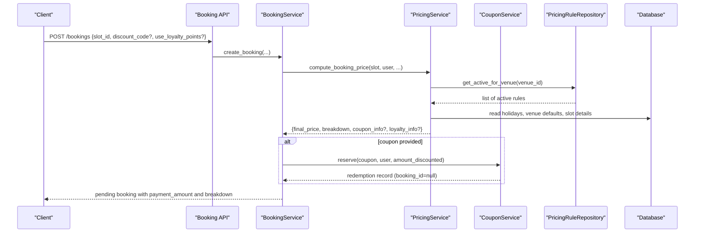
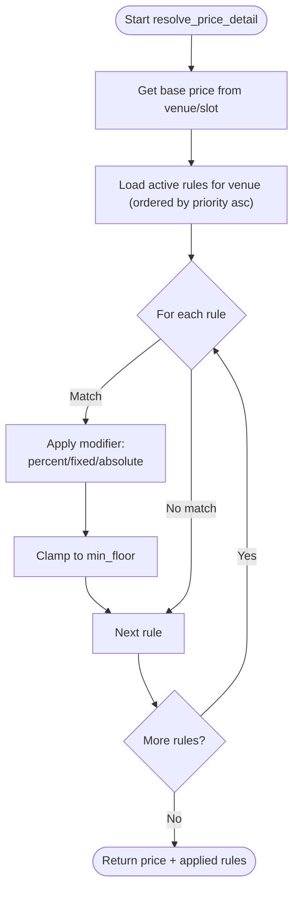
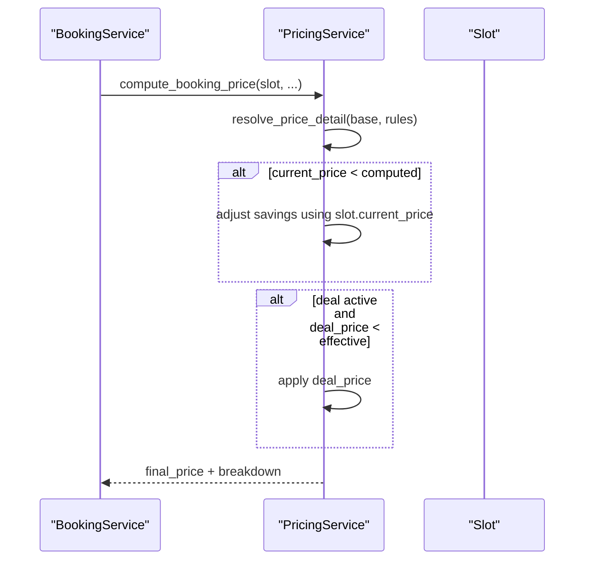
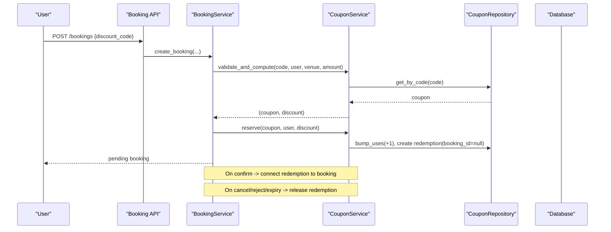
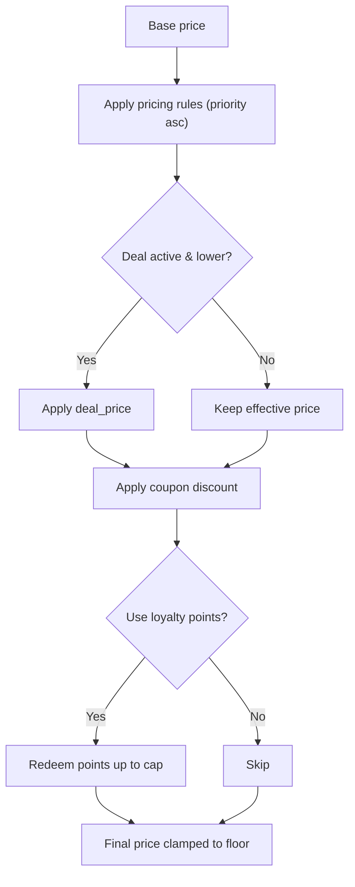
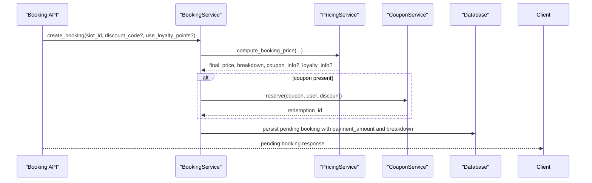
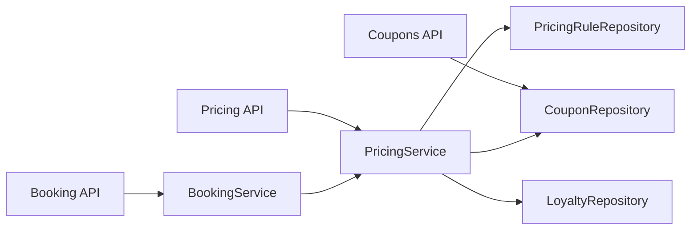

# Pricing Engine

<cite>
**Referenced Files in This Document**
- [pricing.py](file://app/api/v1/pricing.py)
- [pricing_service.py](file://app/services/pricing_service.py)
- [pricing_rule.py](file://app/models/pricing_rule.py)
- [pricing_rule_repository.py](file://app/repositories/pricing_rule_repository.py)
- [pricing.py (schemas)](file://app/schemas/pricing.py)
- [coupon_service.py](file://app/services/coupon_service.py)
- [coupons.py](file://app/api/v1/coupons.py)
- [coupon_repository.py](file://app/repositories/coupon_repository.py)
- [booking_service.py](file://app/services/booking_service.py)
- [slot.py](file://app/models/slot.py)
- [booking.py](file://app/models/booking.py)
- [test_pricing_rules.py](file://tests/test_pricing_rules.py)
- [test_pricing_engine_flow.py](file://tests/test_pricing_engine_flow.py)
- [test_coupons.py](file://tests/test_coupons.py)
</cite>

## Table of Contents
1. Introduction
2. Project Structure
3. Core Components
4. Architecture Overview
5. Detailed Component Analysis
6. Dependency Analysis
7. Performance Considerations
8. Troubleshooting Guide
9. Conclusion
10. Appendices

## Introduction
This document explains the Pricing Engine module for the futsal booking system backend. It covers dynamic pricing rules (time-based, day-of-week, holiday-aware), demand pricing via slot-level adjustments and last-minute deals, promotional pricing through coupons, and loyalty point redemption. It also documents how prices are computed at booking time, how discounts stack, how prices are validated, and how the engine integrates with the booking system to compute real-time prices and apply coupons safely.

## Project Structure
The pricing engine spans API endpoints, services, models, repositories, and tests:
- API layer exposes rule management, price preview, coupon CRUD, and integration points used by booking flows.
- Service layer implements authoritative price computation and coupon validation/redemption logic.
- Models define pricing rules, slots, bookings, and coupons.
- Repositories provide data access for rules and coupons.
- Tests validate rule matching, priority behavior, holiday semantics, end-to-end booking flow, and coupon lifecycle.

**Diagram sources**
- [pricing.py:57-201](file://app/api/v1/pricing.py#L57-L201)
- [pricing_service.py:44-244](file://app/services/pricing_service.py#L44-L244)
- [pricing_rule_repository.py:9-28](file://app/repositories/pricing_rule_repository.py#L9-L28)
- [coupon_repository.py:15-67](file://app/repositories/coupon_repository.py#L15-L67)
- [booking_service.py:27-192](file://app/services/booking_service.py#L27-L192)

**Section sources**
- [pricing.py:57-201](file://app/api/v1/pricing.py#L57-L201)
- [pricing_service.py:44-244](file://app/services/pricing_service.py#L44-L244)
- [booking_service.py:27-192](file://app/services/booking_service.py#L27-L192)

## Core Components
- PricingService: Central authority for price calculation. Computes base price, applies pricing rules, last-minute deal, coupon discount, and loyalty redemption. Returns a detailed breakdown for auditability.
- PricingRule model and repository: Define and retrieve active rules per venue, ordered by priority to ensure deterministic application order.
- Coupon system: Validates coupons against venue, validity windows, usage limits, minimum booking amount; computes discount; reserves redemptions during pending booking creation; connects to confirmed bookings or releases on cancellation/expiry.
- Booking integration: BookingService calls PricingService to compute final payable amount, persists pricing breakdown, and manages coupon reservation lifecycles.

Key responsibilities:
- Time-based and day-of-week rule matching with window overlap checks.
- Holiday-aware rule activation.
- Deterministic stacking via priority ordering and clamping to a floor price.
- Safe coupon validation and redemption tracking across pending and confirmed states.

**Section sources**
- [pricing_service.py:44-244](file://app/services/pricing_service.py#L44-L244)
- [pricing_rule.py:26-47](file://app/models/pricing_rule.py#L26-L47)
- [pricing_rule_repository.py:9-28](file://app/repositories/pricing_rule_repository.py#L9-L28)
- [coupon_service.py:30-120](file://app/services/coupon_service.py#L30-L120)
- [booking_service.py:27-192](file://app/services/booking_service.py#L27-L192)

## Architecture Overview
The engine enforces server-side price authority: clients never supply a final price. The flow is:
- Base price from venue default or slot base_price.
- Apply all matching pricing rules in ascending priority.
- Apply last-minute deal if active and lower than current effective price.
- Apply coupon discount if provided and valid.
- Optionally redeem loyalty points up to configured caps.
- Clamp to minimum floor at each step to prevent negative or below-floor prices.

**Diagram sources**
- [booking_service.py:27-109](file://app/services/booking_service.py#L27-L109)
- [pricing_service.py:147-229](file://app/services/pricing_service.py#L147-L229)
- [pricing_rule_repository.py:14-20](file://app/repositories/pricing_rule_repository.py#L14-L20)
- [coupon_service.py:82-95](file://app/services/coupon_service.py#L82-L95)

## Detailed Component Analysis

### Dynamic Pricing Rules
- Rule types: percent (multiplier ×100), fixed (signed rials), absolute (replace price).
- Matching criteria:
  - Day-of-week filter (ignored when holiday_applies=True).
  - Time window overlap between slot start+duration and rule start/end.
  - Holiday context: holiday_applies=True means rule only runs on holidays; False means disabled on holidays.
- Application order: ascending priority; later rules can override earlier ones (absolute replaces entirely).
- Floor protection: after each rule, price is clamped to min_floor (default 0).

**Diagram sources**
- [pricing_service.py:94-132](file://app/services/pricing_service.py#L94-L132)
- [pricing_rule_repository.py:14-20](file://app/repositories/pricing_rule_repository.py#L14-L20)

**Section sources**
- [pricing_service.py:57-132](file://app/services/pricing_service.py#L57-L132)
- [pricing_rule.py:26-47](file://app/models/pricing_rule.py#L26-L47)
- [test_pricing_rules.py:87-168](file://tests/test_pricing_rules.py#L87-L168)

### Demand Pricing and Last-Minute Deals
- Slot-level current_price allows downward server adjustments (e.g., competitive pricing). If current_price < computed price, it reduces payable amount.
- Deal flag on slot enables last-minute discounted price if within expiry window and lower than effective price after rules.

**Diagram sources**
- [pricing_service.py:147-229](file://app/services/pricing_service.py#L147-L229)
- [slot.py:13-42](file://app/models/slot.py#L13-L42)

**Section sources**
- [pricing_service.py:136-188](file://app/services/pricing_service.py#L136-L188)
- [slot.py:13-42](file://app/models/slot.py#L13-L42)
- [test_pricing_engine_flow.py:68-83](file://tests/test_pricing_engine_flow.py#L68-L83)

### Coupon System: Generation, Validation, Redemption Tracking
- Creation and scoping:
  - Venue-scoped coupons require venue permission; global coupons restricted to super admin.
  - Codes normalized to uppercase for case-insensitive uniqueness.
- Validation:
  - Checks existence, active status, venue scope, validity window, max uses, per-user limit, minimum booking amount, and non-zero discount.
- Redemption lifecycle:
  - Reserve on pending booking creation (uses_count incremented, redemption row created with booking_id=null).
  - Connect to confirmed booking (set booking_id).
  - Release on cancellation, rejection, or expiry (decrement uses_count, delete redemption).

**Diagram sources**
- [coupons.py:55-88](file://app/api/v1/coupons.py#L55-L88)
- [coupon_service.py:34-95](file://app/services/coupon_service.py#L34-L95)
- [coupon_repository.py:15-51](file://app/repositories/coupon_repository.py#L15-L51)
- [booking_service.py:74-109](file://app/services/booking_service.py#L74-L109)

**Section sources**
- [coupon_service.py:34-120](file://app/services/coupon_service.py#L34-L120)
- [coupon_repository.py:15-67](file://app/repositories/coupon_repository.py#L15-L67)
- [test_coupons.py:115-281](file://tests/test_coupons.py#L115-L281)

### Pricing Calculation Algorithm and Discount Stacking
- Order of operations: base → pricing rules → deal → coupon → loyalty → PAYABLE.
- Each step clamps to floor to avoid negative or below-floor amounts.
- Server adjustments (current_price) and deals can reduce payable but never increase it.
- Loyalty redemption capped by percentage of price and per-point value.

**Diagram sources**
- [pricing_service.py:147-244](file://app/services/pricing_service.py#L147-L244)

**Section sources**
- [pricing_service.py:147-244](file://app/services/pricing_service.py#L147-L244)
- [test_pricing_engine_flow.py:68-83](file://tests/test_pricing_engine_flow.py#L68-L83)

### Price Validation and Security
- All monetary inputs from clients are ignored for final price; server computes authoritative price.
- Rule payload validation prevents invalid modifiers (e.g., zero values, out-of-range percentages, invalid time ranges).
- Booking creation rejects past slots and ensures slot availability and contract protections.

**Section sources**
- [pricing.py:32-44](file://app/api/v1/pricing.py#L32-L44)
- [pricing_service.py:147-159](file://app/services/pricing_service.py#L147-L159)
- [booking_service.py:41-67](file://app/services/booking_service.py#L41-L67)
- [test_pricing_rules.py:287-317](file://tests/test_pricing_rules.py#L287-L317)

### Integration with Booking System
- BookingService orchestrates:
  - Locking slot and checking availability.
  - Snapshotting venue payment mode at booking time.
  - Calling PricingService.compute_booking_price to obtain final payable and breakdown.
  - Reserving coupon redemption for pending bookings.
  - Confirming pending bookings, connecting redemption to booking, applying loyalty redemption, and marking deal consumed.
  - Releasing promotions on cancellation or expiry.

**Diagram sources**
- [booking_service.py:27-109](file://app/services/booking_service.py#L27-L109)
- [pricing_service.py:147-229](file://app/services/pricing_service.py#L147-L229)
- [coupon_service.py:82-95](file://app/services/coupon_service.py#L82-L95)

**Section sources**
- [booking_service.py:27-192](file://app/services/booking_service.py#L27-L192)
- [booking.py:21-51](file://app/models/booking.py#L21-L51)

## Dependency Analysis
- PricingService depends on:
  - PricingRuleRepository for active rules per venue.
  - HolidayRepository for holiday detection.
  - CouponService for discount validation and redemption.
  - LoyaltyRepository for balance and redemption caps.
- BookingService depends on PricingService and CouponService to enforce server-side pricing and safe promotion handling.
- APIs depend on UnitOfWork and repositories to manage persistence and permissions.

**Diagram sources**
- [pricing.py:57-201](file://app/api/v1/pricing.py#L57-L201)
- [pricing_service.py:44-244](file://app/services/pricing_service.py#L44-L244)
- [booking_service.py:27-192](file://app/services/booking_service.py#L27-L192)
- [coupon_repository.py:15-67](file://app/repositories/coupon_repository.py#L15-L67)

**Section sources**
- [pricing_service.py:44-244](file://app/services/pricing_service.py#L44-L244)
- [booking_service.py:27-192](file://app/services/booking_service.py#L27-L192)

## Performance Considerations
- Rule evaluation loads active rules per venue and applies them in memory; ensure venues have reasonable numbers of active rules to keep evaluation fast.
- No client-side caching of prices; server recomputes at booking time to honor rule changes instantly.
- Use of database locks on slots and bookings prevents race conditions during concurrent booking attempts.
- Coupon redemption increments uses_count atomically within transactions to avoid double-use.
- Consider indexing strategies already present (e.g., venue_id, is_active, code) to optimize queries.

[No sources needed since this section provides general guidance]

## Troubleshooting Guide
Common issues and resolutions:
- Invalid rule payloads:
  - Percent outside allowed range or zero value will be rejected.
  - Time ranges must have start before end.
- Past slot booking attempts are rejected.
- Coupon not applicable:
  - Check venue scope, validity window, max uses, per-user limit, minimum booking amount, and that discount > 0.
- Coupon still “burned” after cancellation:
  - Ensure release paths are invoked on cancellation, rejection, or expiry of pending bookings.
- Unexpected final price:
  - Inspect pricing_breakdown returned by compute_booking_price to identify which steps reduced/increased price.

**Section sources**
- [pricing.py:32-44](file://app/api/v1/pricing.py#L32-L44)
- [pricing_service.py:147-159](file://app/services/pricing_service.py#L147-L159)
- [coupon_service.py:34-72](file://app/services/coupon_service.py#L34-L72)
- [test_coupons.py:143-281](file://tests/test_coupons.py#L143-L281)

## Conclusion
The Pricing Engine centralizes price computation on the server, ensuring consistent, auditable, and secure pricing across the booking system. Dynamic rules, demand pricing, coupons, and loyalty redemption compose deterministically with clear stacking and floor protections. The integration with booking workflows guarantees that promotions are reserved and released correctly throughout the lifecycle of a booking.

[No sources needed since this section summarizes without analyzing specific files]

## Appendices

### Example Scenarios
- Peak pricing:
  - Create a rule with a time window covering peak hours and a positive percent or fixed modifier.
  - Verify via preview endpoint that slots overlapping the window reflect higher prices.
- Promotional campaigns:
  - Create a coupon with a percentage or fixed discount, set validity window and minimum booking amount.
  - Book a slot with the coupon; confirm that discount is applied and redemption is tracked.
- Custom discount rules:
  - Combine multiple rules with different priorities; ensure higher-priority rules override earlier ones.
  - Use absolute rules to set a final price for special events.

**Section sources**
- [pricing.py:159-179](file://app/api/v1/pricing.py#L159-L179)
- [test_pricing_rules.py:99-128](file://tests/test_pricing_rules.py#L99-L128)
- [test_coupons.py:115-177](file://tests/test_coupons.py#L115-L177)