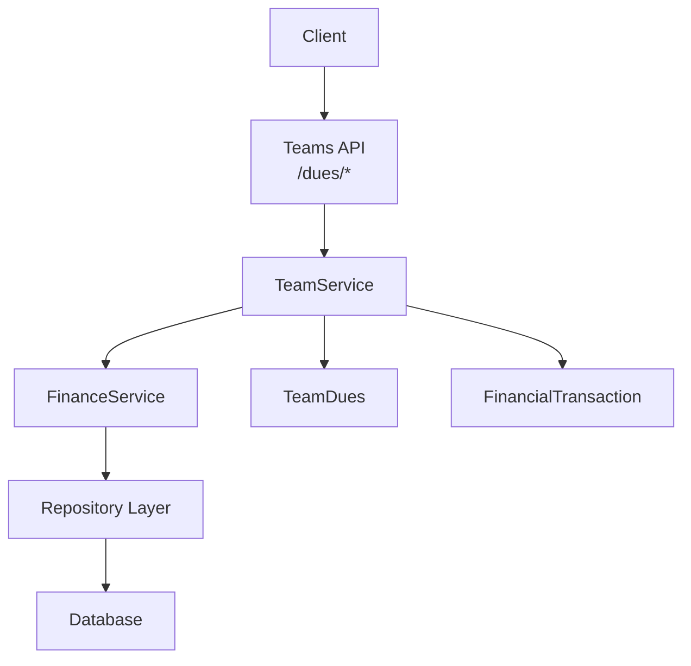
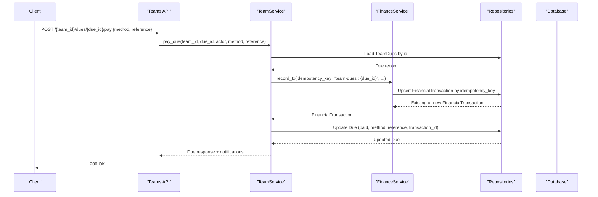
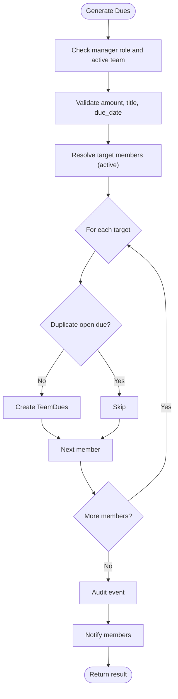
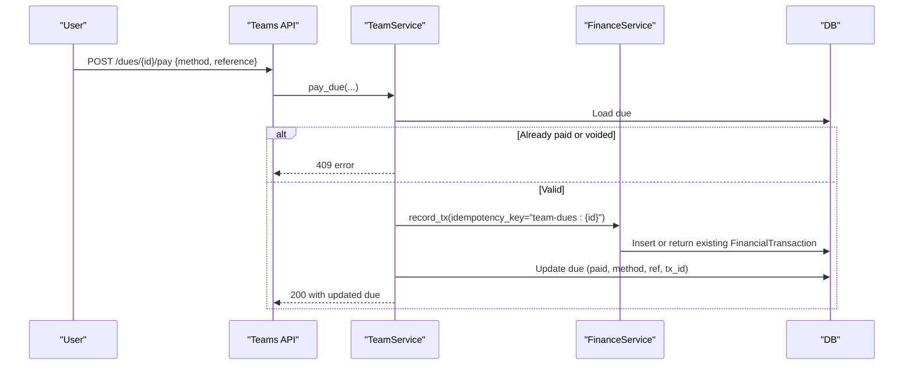
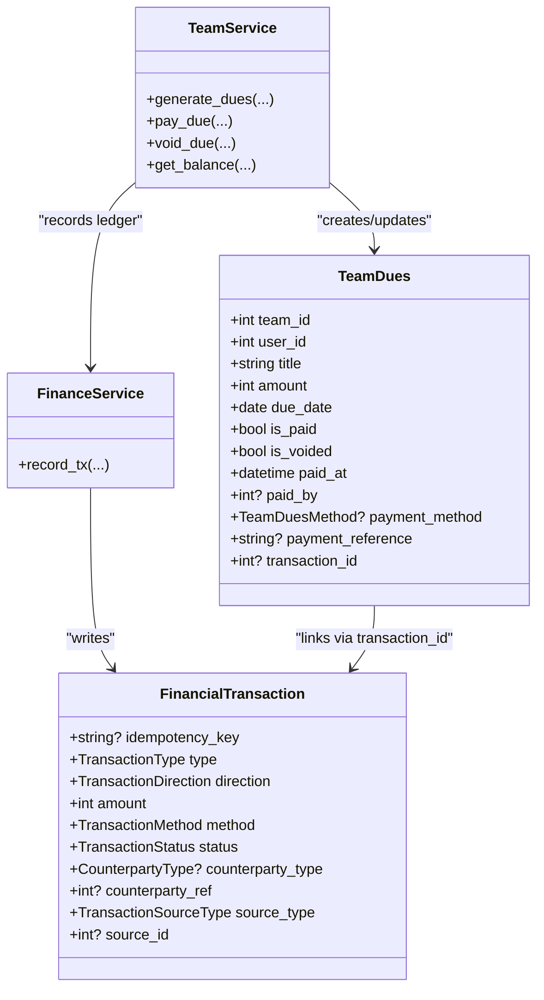

# Dues & Financial Management

<cite>
**Referenced Files in This Document**
- [team.py](file://app/models/team.py)
- [transaction.py](file://app/models/transaction.py)
- [payment.py](file://app/models/payment.py)
- [finance_service.py](file://app/services/finance_service.py)
- [team_service.py](file://app/services/team_service.py)
- [teams.py](file://app/api/v1/teams.py)
- [team.py (schemas)](file://app/schemas/team.py)
- [test_teams_dues.py](file://tests/test_teams_dues.py)
</cite>

## Table of Contents
1. Introduction
2. Project Structure
3. Core Components
4. Architecture Overview
5. Detailed Component Analysis
6. Dependency Analysis
7. Performance Considerations
8. Troubleshooting Guide
9. Conclusion
10. Appendices

## Introduction
This document explains the team dues and financial management features: how per-member dues are generated, supported payment methods, due date management, payment confirmation, ledger integration with counterparty accounting using TEAM as counterparty type, idempotency to prevent duplicate transactions, error handling for failed or invalid operations, and reporting at the team level. It also clarifies the relationship between team dues and individual member contributions.

## Project Structure
The feature spans models, services, API endpoints, schemas, and tests:
- Models define TeamDues, FinancialTransaction, CounterpartyType, TransactionMethod, and related enums.
- Services implement business logic for generating dues, collecting payments, voiding dues, and computing balances.
- API endpoints expose routes for listing, generating, paying, voiding, and querying team dues and balance.
- Schemas validate inputs and define responses.
- Tests verify correctness including idempotency, permissions, and ledger integrity.

**Diagram sources**
- [teams.py:276-339](file://app/api/v1/teams.py#L276-L339)
- [team_service.py:880-1081](file://app/services/team_service.py#L880-L1081)
- [finance_service.py:118-196](file://app/services/finance_service.py#L118-L196)
- [team.py:187-209](file://app/models/team.py#L187-L209)
- [transaction.py:84-119](file://app/models/transaction.py#L84-L119)

**Section sources**
- [team.py:187-209](file://app/models/team.py#L187-L209)
- [transaction.py:84-119](file://app/models/transaction.py#L84-L119)
- [team_service.py:880-1081](file://app/services/team_service.py#L880-L1081)
- [finance_service.py:118-196](file://app/services/finance_service.py#L118-L196)
- [teams.py:276-339](file://app/api/v1/teams.py#L276-L339)

## Core Components
- TeamDues: Per-member obligation with amount, due_date, status flags, payment metadata, and link to a ledger row via transaction_id.
- FinancialTransaction: Append-only ledger entries with idempotency_key, type/direction/method/status, counterparty_type=TEAM and counterparty_ref=team_id for team dues income.
- TeamService: Orchestrates generation, payment, voiding, and balance computation; enforces permissions and idempotency.
- FinanceService: Provides idempotent ledger recording helpers and financial utilities.
- API Endpoints: Expose /dues/generate, /dues/{id}/pay, /dues/{id}, /dues, /balance.

Key behaviors:
- Dues generation creates one row per eligible member with same title and due_date; duplicates are skipped.
- Payment records an income ledger entry with counterparty_type=TEAM and counterparty_ref=team_id; no user balance is affected.
- Idempotency key "team-dues:{due_id}" prevents duplicate ledger rows on retries.
- Voiding marks dues as voided without touching ledger; paid dues cannot be voided.

**Section sources**
- [team.py:187-209](file://app/models/team.py#L187-L209)
- [transaction.py:20-71](file://app/models/transaction.py#L20-L71)
- [team_service.py:880-1081](file://app/services/team_service.py#L880-L1081)
- [finance_service.py:118-196](file://app/services/finance_service.py#L118-L196)

## Architecture Overview
End-to-end flow from client request to ledger update:

**Diagram sources**
- [teams.py:303-315](file://app/api/v1/teams.py#L303-L315)
- [team_service.py:967-1026](file://app/services/team_service.py#L967-L1026)
- [finance_service.py:118-128](file://app/services/finance_service.py#L118-L128)
- [transaction.py:84-119](file://app/models/transaction.py#L84-L119)

## Detailed Component Analysis

### Dues Generation Workflow
- Authorization: Only captain/admin can generate dues for an active team.
- Eligibility: Defaults to all active members; optional filter to subset of active members.
- Validation: Due date must be today or later; title trimmed; amount positive.
- Duplicate prevention: Skips creation if an open due exists with the same title and due_date for that member.
- Output: Returns created count, skipped count, per-user amount, total amount, and items.

**Diagram sources**
- [team_service.py:880-929](file://app/services/team_service.py#L880-L929)

**Section sources**
- [team_service.py:880-929](file://app/services/team_service.py#L880-L929)
- [team.py:187-209](file://app/models/team.py#L187-L209)

### Payment Collection and Ledger Integration
- Authorization: Self-payment allowed for the due’s user; cash collection by non-self requires manager role.
- Ledger entry: Income with counterparty_type=TEAM and counterparty_ref=team_id; source_type=TEAM_DUES; source_id=due.id.
- Idempotency: Uses idempotency_key "team-dues:{due_id}" to avoid duplicate ledger rows.
- State updates: Marks due as paid, sets paid_at, paid_by, payment_method, payment_reference, and transaction_id.
- Notifications: Confirms payment to payer and notifies admins.

**Diagram sources**
- [team_service.py:967-1026](file://app/services/team_service.py#L967-L1026)
- [finance_service.py:118-128](file://app/services/finance_service.py#L118-L128)
- [transaction.py:84-119](file://app/models/transaction.py#L84-L119)

**Section sources**
- [team_service.py:967-1026](file://app/services/team_service.py#L967-L1026)
- [finance_service.py:118-128](file://app/services/finance_service.py#L118-L128)
- [transaction.py:20-71](file://app/models/transaction.py#L20-L71)

### Due Date Management and Overdue Status
- Due dates are validated during generation to be today or later.
- Overdue flag is computed when listing dues based on current date vs due_date.
- Status filters include overdue to help track late payments.

**Section sources**
- [team_service.py:880-929](file://app/services/team_service.py#L880-L929)
- [team_service.py:932-946](file://app/services/team_service.py#L932-L946)
- [team.py:187-209](file://app/models/team.py#L187-L209)

### Payment Methods Support
- Supported methods: cash, gateway, card_to_card.
- Mapping to ledger TransactionMethod ensures consistent accounting.
- Reference field allows storing external references (e.g., receipt numbers).

**Section sources**
- [team_service.py:52-56](file://app/services/team_service.py#L52-L56)
- [team_service.py:967-1026](file://app/services/team_service.py#L967-L1026)
- [transaction.py:36-43](file://app/models/transaction.py#L36-L43)

### Voiding Dues
- Only managers can void unpaid, non-voided dues.
- Paid dues cannot be voided; corrections should be handled via ledger adjustments.
- Voiding records reason and updates due state; audit event logged.

**Section sources**
- [team_service.py:1028-1055](file://app/services/team_service.py#L1028-L1055)

### Team Balance and Reporting
- Balance aggregates:
  - Dues totals: total, paid, unpaid, overdue amount.
  - Ledger income/expense for the team via counterparty_type=TEAM and counterparty_ref=team_id.
  - Net balance = team account balance − unpaid dues.
- Reports available through /balance endpoint; broader financial reports are accessible via finance endpoints elsewhere.

**Section sources**
- [team_service.py:1057-1081](file://app/services/team_service.py#L1057-L1081)
- [transaction.py:84-119](file://app/models/transaction.py#L84-L119)

### Relationship Between Team Dues and Individual Member Contributions
- Each TeamDues represents a member’s contribution obligation for a specific title and due_date.
- Payment records income to the team’s ledger (counterparty_type=TEAM), not to individual user accounts, so individual balances are not affected by team dues.
- The due’s transaction_id links back to the ledger entry for traceability.

**Section sources**
- [team.py:187-209](file://app/models/team.py#L187-L209)
- [transaction.py:84-119](file://app/models/transaction.py#L84-L119)
- [team_service.py:967-1026](file://app/services/team_service.py#L967-L1026)

## Dependency Analysis

**Diagram sources**
- [team.py:187-209](file://app/models/team.py#L187-L209)
- [transaction.py:84-119](file://app/models/transaction.py#L84-L119)
- [team_service.py:880-1081](file://app/services/team_service.py#L880-L1081)
- [finance_service.py:118-196](file://app/services/finance_service.py#L118-L196)

**Section sources**
- [team.py:187-209](file://app/models/team.py#L187-L209)
- [transaction.py:84-119](file://app/models/transaction.py#L84-L119)
- [team_service.py:880-1081](file://app/services/team_service.py#L880-L1081)
- [finance_service.py:118-196](file://app/services/finance_service.py#L118-L196)

## Performance Considerations
- Idempotency keys ensure safe retries without extra writes.
- Bulk generation loops over active members but skips duplicates efficiently via repository checks.
- Balance queries aggregate ledger data; consider caching or materialized views for large datasets if needed.
- Avoid unnecessary joins in listing by filtering early and limiting results.

[No sources needed since this section provides general guidance]

## Troubleshooting Guide
Common errors and resolutions:
- BAD_DUE_DATE: Due date in the past; set future date.
- NOT_A_MEMBER / NOT_AUTHORIZED: Insufficient permissions; only captains/admins can manage dues or collect cash on behalf of others.
- NO_MEMBERS: No active members to generate dues; add active members first.
- DUE_NOT_FOUND: Invalid due id; verify existence.
- DUE_ALREADY_PAID / DUE_VOIDED: Cannot pay or void already processed dues; check status before retry.
- ALREADY_LINKED / BOOKING_LINKED_ELSEWHERE: Related booking linking issues; ensure correct team association.

Verification steps:
- Check ledger entries via source_type=TEAM_DUES and source_id=due.id to confirm single row per due.
- Confirm idempotency_key equals "team-dues:{due_id}".
- Ensure counterparty_type=TEAM and counterparty_ref=team_id for team dues income.

**Section sources**
- [team_service.py:880-1081](file://app/services/team_service.py#L880-L1081)
- [test_teams_dues.py:101-123](file://tests/test_teams_dues.py#L101-L123)

## Conclusion
Team dues provide a structured way to collect per-member contributions with robust validation, permission controls, and financial integrity. Payments integrate into the main ledger using TEAM as counterparty, ensuring accurate team-level accounting while avoiding duplication through idempotency. Dues lifecycle—from generation to payment or voiding—is fully auditable and supports multiple payment methods. Team balance and reporting consolidate both dues and ledger data for clear visibility.

[No sources needed since this section summarizes without analyzing specific files]

## Appendices

### API Endpoints Summary
- GET /{team_id}/dues: List dues with optional status filter; members see own dues; managers see all.
- POST /{team_id}/dues/generate: Generate equal per-member dues for selected or all active members.
- POST /{team_id}/dues/{due_id}/pay: Pay a due (self or cash collection by managers).
- DELETE /{team_id}/dues/{due_id}: Void an unpaid, non-voided due (managers only).
- GET /{team_id}/balance: Team-level balance combining dues and ledger.

**Section sources**
- [teams.py:276-339](file://app/api/v1/teams.py#L276-L339)
- [team.py (schemas):141-197](file://app/schemas/team.py#L141-L197)

### Example Dues Lifecycle
- Generate: Captain generates dues for all active members with a title and due_date; duplicates skipped.
- Pay: Member pays self or manager collects cash; ledger entry created with idempotency key; due marked paid.
- Report: Balance reflects ledger income and unpaid dues; net balance computed.
- Error Handling: Repeated payment returns 409; voiding paid dues blocked; insufficient permissions blocked.

**Section sources**
- [test_teams_dues.py:57-97](file://tests/test_teams_dues.py#L57-L97)
- [test_teams_dues.py:101-142](file://tests/test_teams_dues.py#L101-L142)
- [test_teams_dues.py:182-222](file://tests/test_teams_dues.py#L182-L222)