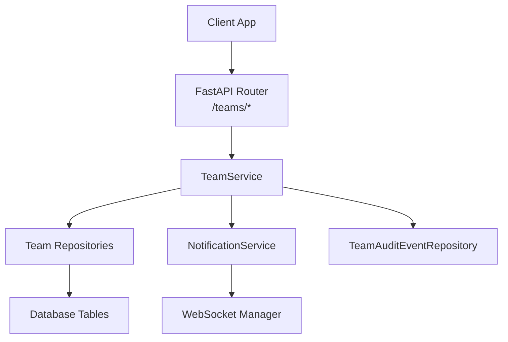
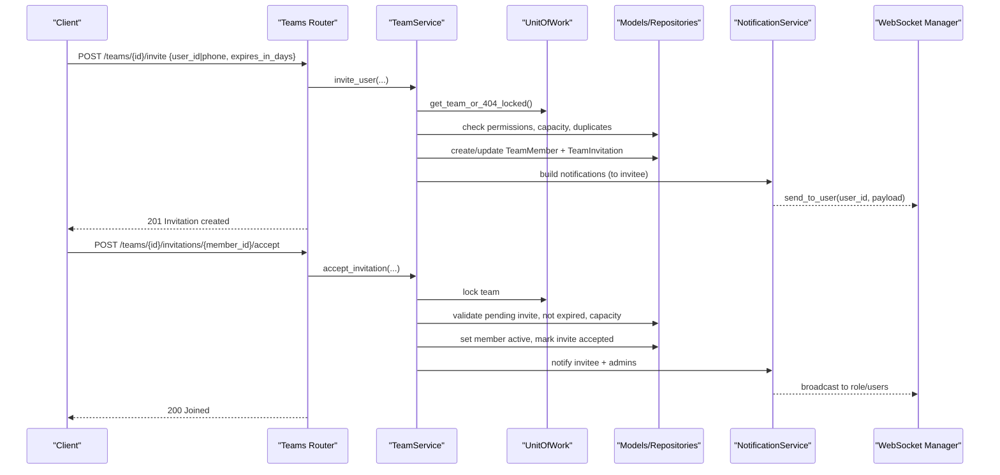
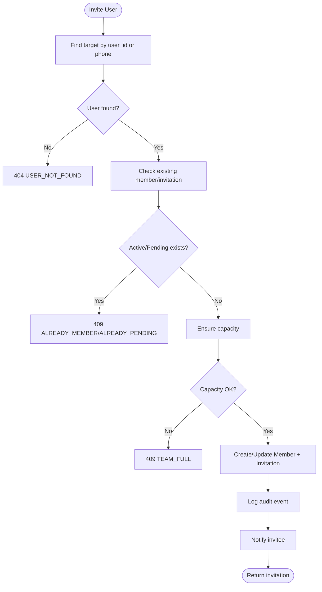
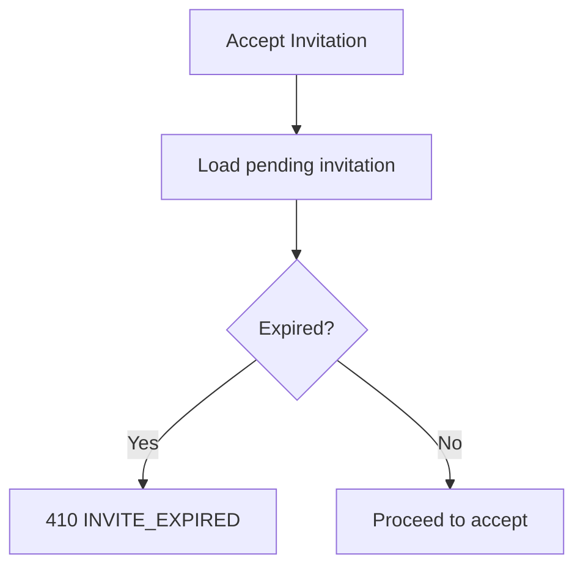
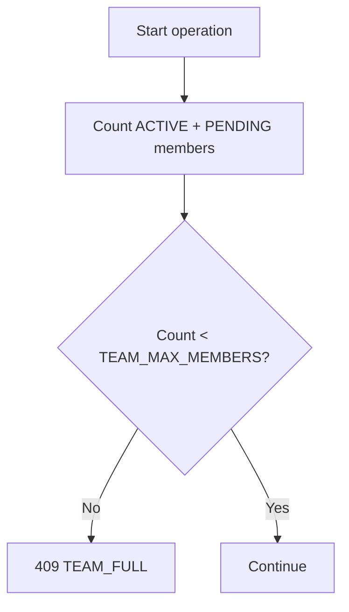
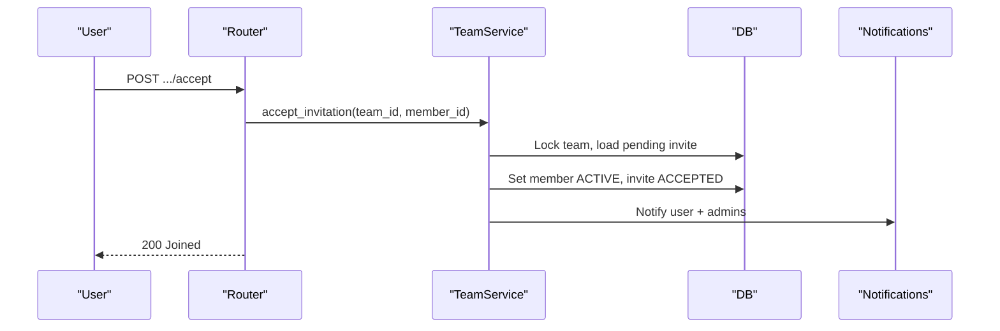
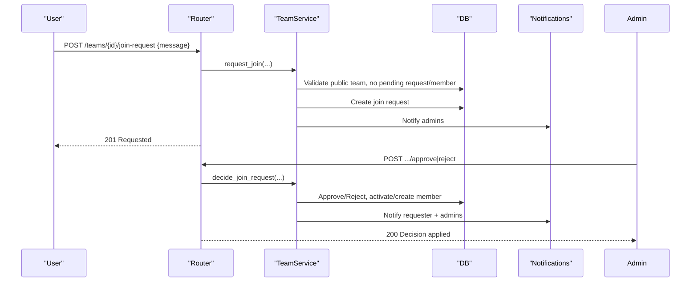
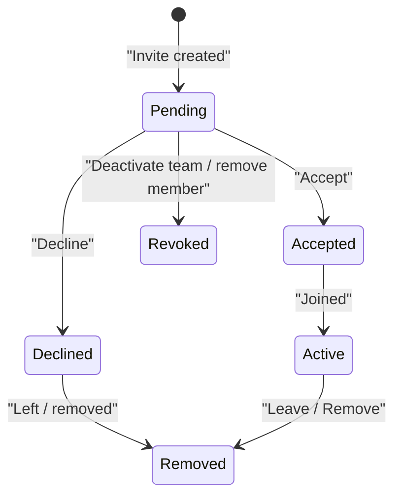
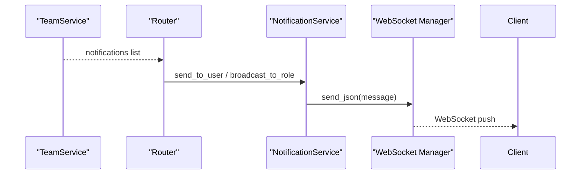
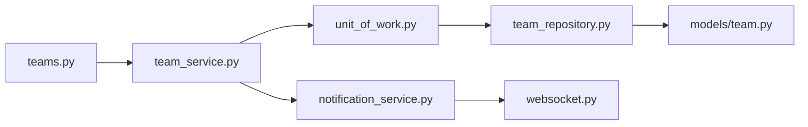

# Member Invitation System

<cite>
**Referenced Files in This Document**
- [teams.py](file://app/api/v1/teams.py)
- [team_service.py](file://app/services/team_service.py)
- [team.py](file://app/models/team.py)
- [team_repository.py](file://app/repositories/team_repository.py)
- [team_schema.py](file://app/schemas/team.py)
- [websocket.py](file://app/utils/websocket.py)
- [notification_service.py](file://app/services/notification_service.py)
- [unit_of_work.py](file://app/unit_of_work.py)
</cite>

## Table of Contents
1. [Introduction](#introduction)
2. [Project Structure](#project-structure)
3. [Core Components](#core-components)
4. [Architecture Overview](#architecture-overview)
5. [Detailed Component Analysis](#detailed-component-analysis)
6. [Dependency Analysis](#dependency-analysis)
7. [Performance Considerations](#performance-considerations)
8. [Troubleshooting Guide](#troubleshooting-guide)
9. [Conclusion](#conclusion)

## Introduction
This document explains the member invitation system for teams, focusing on:
- Direct invitations by managers to registered users via user_id or phone number
- Invitation expiration handling and capacity management
- Duplicate invitation prevention
- Acceptance and rejection workflows with status transitions and notifications
- Join request mechanism for public teams (message submission and admin review)
- State management, audit logging, and real-time notifications to inviters and invitees
- Common scenarios and error handling patterns

## Project Structure
The team invitation feature spans API routes, service logic, data models, repositories, schemas, and real-time notification utilities.

**Diagram sources**
- [teams.py:139-172](file://app/api/v1/teams.py#L139-L172)
- [team_service.py:389-520](file://app/services/team_service.py#L389-L520)
- [team_repository.py:146-184](file://app/repositories/team_repository.py#L146-L184)
- [websocket.py:12-66](file://app/utils/websocket.py#L12-L66)
- [notification_service.py:12-66](file://app/services/notification_service.py#L12-L66)

**Section sources**
- [teams.py:1-422](file://app/api/v1/teams.py#L1-L422)
- [team_service.py:1-800](file://app/services/team_service.py#L1-L800)
- [team.py:1-240](file://app/models/team.py#L1-L240)
- [team_repository.py:1-403](file://app/repositories/team_repository.py#L1-L403)
- [team_schema.py:1-294](file://app/schemas/team.py#L1-L294)
- [websocket.py:1-66](file://app/utils/websocket.py#L1-L66)
- [notification_service.py:1-193](file://app/services/notification_service.py#L1-L193)
- [unit_of_work.py:1-322](file://app/unit_of_work.py#L1-L322)

## Core Components
- API layer exposes endpoints for inviting users, accepting/declining invitations, listing open invitations, and managing join requests for public teams.
- Service layer enforces business rules: authorization, capacity checks, duplication prevention, expiration validation, state transitions, audit logging, and notification generation.
- Data models define entities for teams, members, invitations, join requests, dues, messages, and audit events.
- Repositories implement queries and mutations for invitations, join requests, membership counts, and audit logs.
- Notification subsystem persists notifications and broadcasts them via WebSocket to clients.

**Section sources**
- [teams.py:139-271](file://app/api/v1/teams.py#L139-L271)
- [team_service.py:389-751](file://app/services/team_service.py#L389-L751)
- [team.py:27-84](file://app/models/team.py#L27-L84)
- [team_repository.py:146-207](file://app/repositories/team_repository.py#L146-L207)
- [team_schema.py:70-137](file://app/schemas/team.py#L70-L137)
- [websocket.py:12-66](file://app/utils/websocket.py#L12-L66)
- [notification_service.py:12-66](file://app/services/notification_service.py#L12-L66)

## Architecture Overview
End-to-end flow for direct invitation and acceptance:

**Diagram sources**
- [teams.py:139-172](file://app/api/v1/teams.py#L139-L172)
- [team_service.py:389-499](file://app/services/team_service.py#L389-L499)
- [team_repository.py:146-184](file://app/repositories/team_repository.py#L146-L184)
- [websocket.py:12-66](file://app/utils/websocket.py#L12-L66)
- [notification_service.py:12-66](file://app/services/notification_service.py#L12-L66)

## Detailed Component Analysis

### Direct Invitation Workflow
- Input: manager invites a registered user by user_id or phone; optional expiration in days.
- Validation:
  - Target must be a registered user.
  - Prevent duplicate active membership or pending invitation.
  - Enforce team capacity (active + pending count vs limit).
- State changes:
  - Create or update TeamMember to PENDING.
  - Create or refresh TeamInvitation with optional expires_at.
  - Log audit event MEMBER_INVITED.
  - Send notification to invitee.

**Diagram sources**
- [team_service.py:389-454](file://app/services/team_service.py#L389-L454)
- [team_repository.py:85-90](file://app/repositories/team_repository.py#L85-L90)

**Section sources**
- [team_schema.py:70-80](file://app/schemas/team.py#L70-L80)
- [team_service.py:389-454](file://app/services/team_service.py#L389-L454)
- [team_repository.py:85-90](file://app/repositories/team_repository.py#L85-L90)

### Invitation Expiration Handling
- Expiration is stored on TeamInvitation.expires_at.
- Accepting an invitation validates that it has not expired; otherwise returns 410 INVITE_EXPIRED.
- Listing open invitations filters out expired ones.

**Diagram sources**
- [team_service.py:456-468](file://app/services/team_service.py#L456-L468)
- [team_repository.py:154-169](file://app/repositories/team_repository.py#L154-L169)

**Section sources**
- [team_service.py:456-468](file://app/services/team_service.py#L456-L468)
- [team_repository.py:154-169](file://app/repositories/team_repository.py#L154-L169)

### Capacity Management
- Capacity is enforced at key points: inviting, accepting, and approving join requests.
- Count includes both ACTIVE and PENDING members to prevent over-inviting.

**Diagram sources**
- [team_service.py:105-110](file://app/services/team_service.py#L105-L110)
- [team_service.py:471-477](file://app/services/team_service.py#L471-L477)
- [team_service.py:712-714](file://app/services/team_service.py#L712-L714)

**Section sources**
- [team_service.py:105-110](file://app/services/team_service.py#L105-L110)

### Duplicate Invitation Prevention
- Prevents creating a new invitation if:
  - The user is already an active member.
  - There is an existing pending invitation or pending member record.
- Re-inviting a previously removed/declined user resets their status to PENDING and refreshes invitation metadata.

**Section sources**
- [team_service.py:403-410](file://app/services/team_service.py#L403-L410)
- [team_service.py:414-439](file://app/services/team_service.py#L414-L439)

### Acceptance and Rejection Processes
- Accept:
  - Validates pending invitation and non-expired status.
  - Sets member to ACTIVE, records joined_at, marks invitation ACCEPTED.
  - Notifies invitee and team admins; may trigger official status refresh.
- Decline:
  - Marks member DECLINED and sets left_at; marks invitation DECLINED.
  - Notifies team admins.

**Diagram sources**
- [teams.py:151-160](file://app/api/v1/teams.py#L151-L160)
- [team_service.py:471-499](file://app/services/team_service.py#L471-L499)

**Section sources**
- [team_service.py:471-520](file://app/services/team_service.py#L471-L520)

### Public Team Join Requests
- Users can submit a join request to PUBLIC teams with an optional message.
- Admins list pending requests and approve or reject them.
- Approving:
  - Ensures capacity, creates or activates member, marks request APPROVED.
  - Notifies the requester and admins; may refresh official status.
- Rejecting:
  - Marks request REJECTED and notifies requester and admins.

**Diagram sources**
- [teams.py:227-271](file://app/api/v1/teams.py#L227-L271)
- [team_service.py:661-751](file://app/services/team_service.py#L661-L751)

**Section sources**
- [team_service.py:661-751](file://app/services/team_service.py#L661-L751)

### Invitation State Management
- Entities and statuses:
  - TeamMember: PENDING, ACTIVE, REMOVED, DECLINED
  - TeamInvitation: PENDING, ACCEPTED, DECLINED, REVOKED
  - TeamJoinRequest: PENDING, APPROVED, REJECTED
- Transitions are enforced in service methods; repository supports querying pending invitations and revoking when needed.

**Diagram sources**
- [team.py:39-57](file://app/models/team.py#L39-L57)
- [team_service.py:471-520](file://app/services/team_service.py#L471-L520)
- [team_repository.py:177-184](file://app/repositories/team_repository.py#L177-L184)

**Section sources**
- [team.py:39-57](file://app/models/team.py#L39-L57)
- [team_service.py:471-520](file://app/services/team_service.py#L471-L520)
- [team_repository.py:177-184](file://app/repositories/team_repository.py#L177-L184)

### Audit Logging
- All critical actions log structured audit events with actor and contextual data.
- Actions include member invited/accepted/declined/left/removed, join requested/approved/rejected, and more.

**Section sources**
- [team.py:65-84](file://app/models/team.py#L65-L84)
- [team_service.py:132-135](file://app/services/team_service.py#L132-L135)
- [team_repository.py:352-374](file://app/repositories/team_repository.py#L352-L374)

### Real-Time Notifications
- Service builds notification payloads and returns them to the router, which dispatches asynchronously.
- NotificationService persists notifications and sends them via WebSocket to targeted users or roles.
- WebSocket manager maintains per-user channels and role-based rooms for broadcasting.

**Diagram sources**
- [teams.py:139-172](file://app/api/v1/teams.py#L139-L172)
- [notification_service.py:12-66](file://app/services/notification_service.py#L12-L66)
- [websocket.py:12-66](file://app/utils/websocket.py#L12-L66)

**Section sources**
- [teams.py:139-172](file://app/api/v1/teams.py#L139-L172)
- [notification_service.py:12-66](file://app/services/notification_service.py#L12-L66)
- [websocket.py:12-66](file://app/utils/websocket.py#L12-L66)

## Dependency Analysis
Key dependencies and coupling:
- API depends on TeamService for all business logic.
- TeamService depends on UnitOfWork to access repositories and session management.
- Repositories encapsulate SQLModel queries against database tables.
- NotificationService uses WebSocket manager for real-time delivery and persists notifications independently.

**Diagram sources**
- [teams.py:139-172](file://app/api/v1/teams.py#L139-L172)
- [team_service.py:389-499](file://app/services/team_service.py#L389-L499)
- [unit_of_work.py:233-278](file://app/unit_of_work.py#L233-L278)
- [team_repository.py:146-207](file://app/repositories/team_repository.py#L146-L207)
- [team.py:136-167](file://app/models/team.py#L136-L167)
- [notification_service.py:12-66](file://app/services/notification_service.py#L12-L66)
- [websocket.py:12-66](file://app/utils/websocket.py#L12-L66)

**Section sources**
- [unit_of_work.py:233-278](file://app/unit_of_work.py#L233-L278)

## Performance Considerations
- Capacity checks use COUNT queries to avoid loading full member lists.
- Official status refresh runs only when thresholds change and is idempotent.
- Repository queries are optimized with joins and group-by for counts and lists.
- Notifications are persisted and delivered asynchronously to reduce request latency.

[No sources needed since this section provides general guidance]

## Troubleshooting Guide
Common errors and resolutions:
- USER_NOT_FOUND (404): Invite target must be a registered user; verify user_id or phone.
- ALREADY_MEMBER (409): User is already an active member; do not re-invite.
- ALREADY_PENDING (409): Invitation or membership is already pending; wait for response or cancel.
- TEAM_FULL (409): Team reached maximum members; remove inactive or decline pending before inviting.
- INVITATION_NOT_FOUND (404): Invalid member_id or not owned by current user.
- INVITATION_ALREADY_ANSWERED (409): Invitation already accepted or declined.
- INVITE_EXPIRED (410): Invitation exceeded its expires_at; request a new one.
- JOIN_NOT_ALLOWED (403): Join requests allowed only for PUBLIC teams.
- ALREADY_REQUESTED (409): User already has a pending join request.

Operational tips:
- Use /teams/invitations/me to list open invitations for the current user.
- For public teams, use /teams/{id}/join-request to submit a message and await admin decision.
- Review team audit logs via /teams/{id}/audit to trace actions and timestamps.

**Section sources**
- [team_service.py:389-520](file://app/services/team_service.py#L389-L520)
- [team_service.py:661-751](file://app/services/team_service.py#L661-L751)
- [team_repository.py:154-169](file://app/repositories/team_repository.py#L154-L169)

## Conclusion
The member invitation system provides robust support for direct invitations to registered users, strict capacity and duplication controls, clear state transitions, and comprehensive auditability. Public teams offer a join request workflow with admin oversight. Real-time notifications keep both inviters and invitees informed, while persistence ensures reliability even when clients are offline.

[No sources needed since this section summarizes without analyzing specific files]