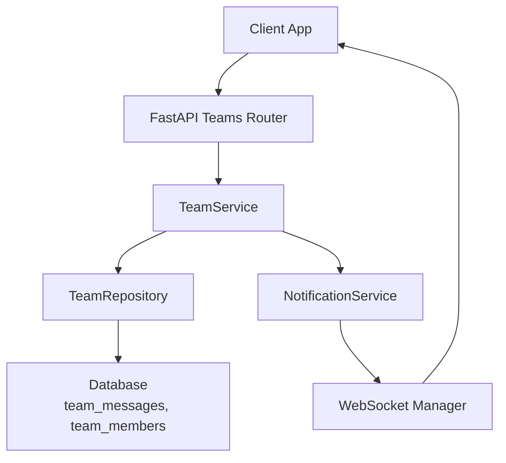
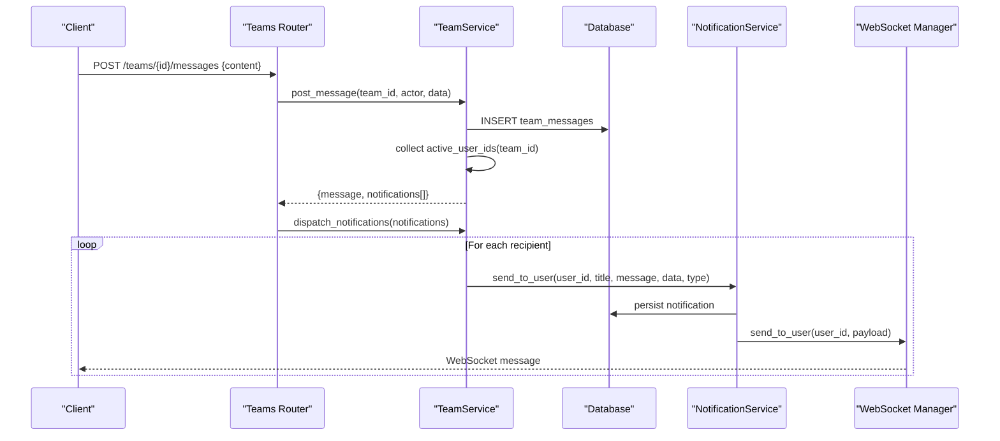
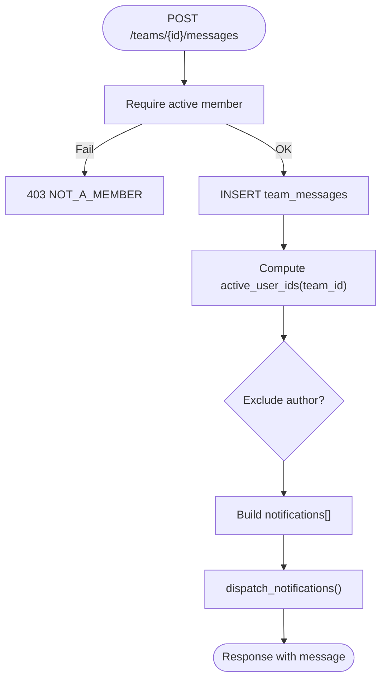
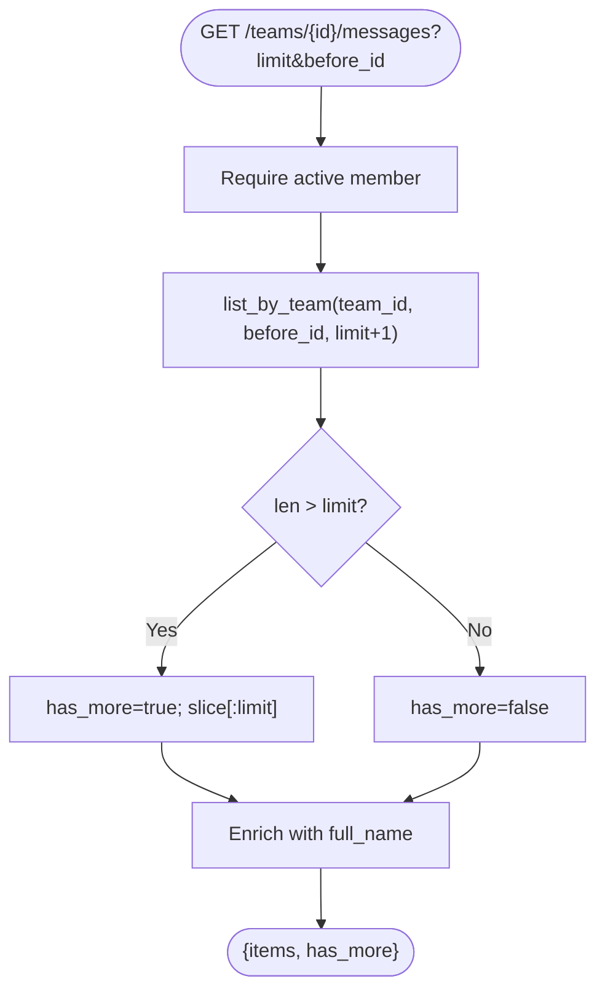
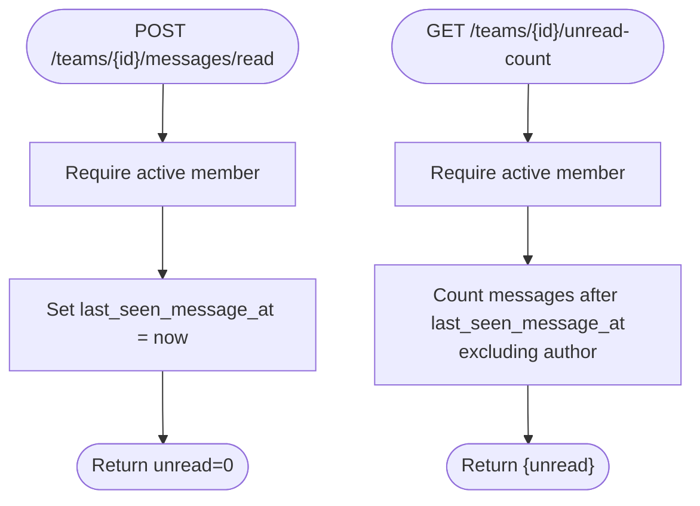
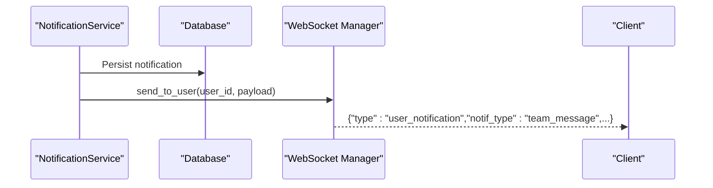
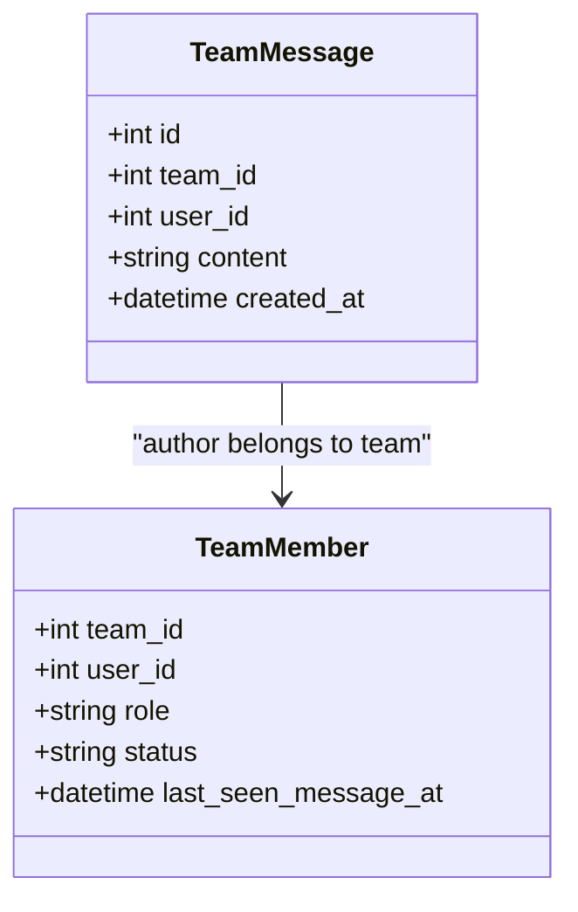
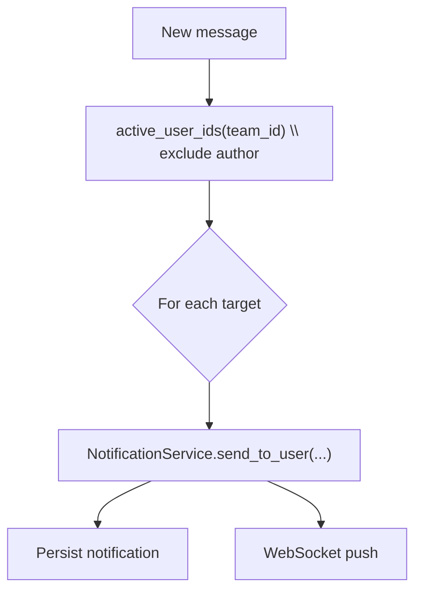
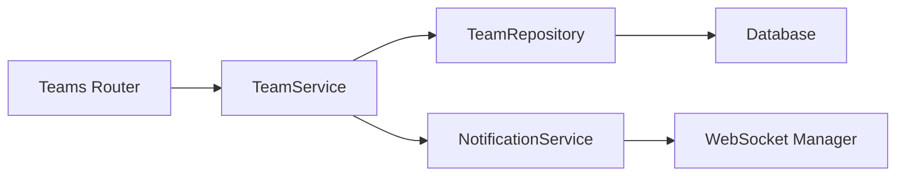

# Official Chat System

<cite>
**Referenced Files in This Document**
- [teams.py](file://app/api/v1/teams.py)
- [team_service.py](file://app/services/team_service.py)
- [team.py](file://app/models/team.py)
- [team_repository.py](file://app/repositories/team_repository.py)
- [websocket.py](file://app/utils/websocket.py)
- [notification_service.py](file://app/services/notification_service.py)
- [m0s015_team_official_chat.py](file://migrations/versions/m0s015_team_official_chat.py)
- [test_teams_official_chat.py](file://tests/test_teams_official_chat.py)
</cite>

## Table of Contents
1. Introduction
2. Project Structure
3. Core Components
4. Architecture Overview
5. Detailed Component Analysis
6. Dependency Analysis
7. Performance Considerations
8. Troubleshooting Guide
9. Conclusion
10. Appendices

## Introduction
This document explains the official team chat system: how messages are created, persisted, retrieved with pagination, and broadcast to active team members. It covers WebSocket integration for live updates, unread counting, and the relationship between chat access and team membership (only active members can participate). It also details message routing, notification triggers, and integration with the broader notification system.

## Project Structure
The chat feature spans API routes, service logic, data models, repositories, migrations, and real-time delivery utilities:
- API endpoints under teams router handle listing, posting, marking read, and unread counts.
- Service layer enforces permissions, persists messages, computes unread counts, and emits notifications.
- Data model defines team messages and member read markers; migration provisions schema changes.
- Repository provides query helpers for listing by team, cursor pagination, and unread counting.
- Notification service persists notifications and pushes them via WebSocket to users.
- WebSocket manager tracks connections and supports per-user messaging.

**Diagram sources**
- [teams.py:379-422](file://app/api/v1/teams.py#L379-L422)
- [team_service.py:796-878](file://app/services/team_service.py#L796-L878)
- [team_repository.py:1-200](file://app/repositories/team_repository.py#L1-L200)
- [notification_service.py:50-64](file://app/services/notification_service.py#L50-L64)
- [websocket.py:22-65](file://app/utils/websocket.py#L22-L65)

**Section sources**
- [teams.py:379-422](file://app/api/v1/teams.py#L379-L422)
- [team_service.py:796-878](file://app/services/team_service.py#L796-L878)
- [team.py:226-240](file://app/models/team.py#L226-L240)
- [m0s015_team_official_chat.py:52-83](file://migrations/versions/m0s015_team_official_chat.py#L52-L83)

## Core Components
- TeamMessage model: stores team_id, user_id, content, created_at with an index on (team_id, created_at).
- TeamMember.last_seen_message_at: baseline for unread counting per member.
- API endpoints:
  - GET /teams/{team_id}/messages: list recent messages with cursor pagination using before_id.
  - POST /teams/{team_id}/messages: create a message (content is trimmed; empty/whitespace rejected).
  - POST /teams/{team_id}/messages/read: mark messages as read for current user.
  - GET /teams/{team_id}/unread-count: return unread count excluding author’s own messages.
- Service methods:
  - list_messages: enforce active membership, paginate with limit + before_id, enrich with full_name.
  - post_message: persist message, build notifications for all active members except author.
  - mark_messages_read: update last_seen_message_at timestamp.
  - unread_count: compute unread since last_seen_message_at, excluding author.
  - dispatch_notifications: send per-user or broadcast notifications via NotificationService.
- NotificationService: persists notifications and delivers via WebSocket to the target user(s).
- WebSocket ConnectionManager: maintains active connections and sends JSON messages to users.

**Section sources**
- [team.py:226-240](file://app/models/team.py#L226-L240)
- [team.py:113-131](file://app/models/team.py#L113-L131)
- [teams.py:379-422](file://app/api/v1/teams.py#L379-L422)
- [team_service.py:796-878](file://app/services/team_service.py#L796-L878)
- [notification_service.py:50-64](file://app/services/notification_service.py#L50-L64)
- [websocket.py:22-65](file://app/utils/websocket.py#L22-L65)

## Architecture Overview
End-to-end flow from message creation to delivery:

**Diagram sources**
- [teams.py:393-403](file://app/api/v1/teams.py#L393-L403)
- [team_service.py:820-878](file://app/services/team_service.py#L820-L878)
- [notification_service.py:50-64](file://app/services/notification_service.py#L50-L64)
- [websocket.py:46-65](file://app/utils/websocket.py#L46-L65)

## Detailed Component Analysis

### Message Creation and Broadcasting
- Authorization: only active members can post.
- Persistence: TeamMessage created with team_id, user_id, trimmed content, created_at.
- Notifications: one per active member excluding the author; notif_type = team_message.
- Delivery: NotificationService persists and pushes via WebSocket to each recipient.

**Diagram sources**
- [team_service.py:820-878](file://app/services/team_service.py#L820-L878)
- [teams.py:393-403](file://app/api/v1/teams.py#L393-L403)

**Section sources**
- [team_service.py:820-878](file://app/services/team_service.py#L820-L878)
- [teams.py:393-403](file://app/api/v1/teams.py#L393-L403)
- [notification_service.py:50-64](file://app/services/notification_service.py#L50-L64)

### Message Retrieval and Pagination
- Authorization: only active members can list messages.
- Pagination: uses before_id cursor; fetches limit+1 to determine has_more.
- Enrichment: joins user names for display.

**Diagram sources**
- [team_service.py:798-818](file://app/services/team_service.py#L798-L818)
- [team_repository.py:1-200](file://app/repositories/team_repository.py#L1-L200)

**Section sources**
- [team_service.py:798-818](file://app/services/team_service.py#L798-L818)
- [team_repository.py:1-200](file://app/repositories/team_repository.py#L1-L200)

### Unread Counting and Mark-as-Read
- Mark as read: updates last_seen_message_at to now for the current member.
- Unread count: counts messages after last_seen_message_at for the team, excluding the author’s own messages.

**Diagram sources**
- [team_service.py:840-855](file://app/services/team_service.py#L840-L855)
- [team_repository.py:1-200](file://app/repositories/team_repository.py#L1-L200)

**Section sources**
- [team_service.py:840-855](file://app/services/team_service.py#L840-L855)
- [team_repository.py:1-200](file://app/repositories/team_repository.py#L1-L200)

### WebSocket Integration and Live Updates
- Each notification is persisted and then pushed to the user via WebSocket.
- ConnectionManager tracks active connections per role/user and sends JSON payloads.
- The client receives a user_notification with id, type, notif_type, title, message, data.

**Diagram sources**
- [notification_service.py:50-64](file://app/services/notification_service.py#L50-L64)
- [websocket.py:46-65](file://app/utils/websocket.py#L46-L65)

**Section sources**
- [notification_service.py:50-64](file://app/services/notification_service.py#L50-L64)
- [websocket.py:22-65](file://app/utils/websocket.py#L22-L65)

### Relationship to Team Membership
- Only active members can participate in official chats (post/list/unread/mark-read).
- Non-members receive 403 errors on chat endpoints.
- Broadcast recipients are limited to active members; authors are excluded from notifications.

**Diagram sources**
- [team.py:113-131](file://app/models/team.py#L113-L131)
- [team.py:226-240](file://app/models/team.py#L226-L240)

**Section sources**
- [team_service.py:798-855](file://app/services/team_service.py#L798-L855)
- [teams.py:379-422](file://app/api/v1/teams.py#L379-L422)
- [test_teams_official_chat.py:181-187](file://tests/test_teams_official_chat.py#L181-L187)

### Message Routing and Notification Triggers
- Message routing:
  - Create message → build notifications for all active members except author.
  - Dispatch iterates targets and calls NotificationService.send_to_user.
- Notification triggers:
  - New team message triggers notif_type = team_message.
  - Other team events use distinct types (e.g., team_official, team_invitation_accepted).

**Diagram sources**
- [team_service.py:820-878](file://app/services/team_service.py#L820-L878)
- [notification_service.py:50-64](file://app/services/notification_service.py#L50-L64)

**Section sources**
- [team_service.py:820-878](file://app/services/team_service.py#L820-L878)
- [notification_service.py:50-64](file://app/services/notification_service.py#L50-L64)

### Database Schema and Migration
- team_messages table: id, team_id (FK), user_id (FK), content (max 2000), created_at; composite index on (team_id, created_at).
- team_members.last_seen_message_at added for unread baseline.
- teams.is_official/min_members/official_since fields support official status (not directly used by chat but relevant to team lifecycle).

**Section sources**
- [m0s015_team_official_chat.py:52-83](file://migrations/versions/m0s015_team_official_chat.py#L52-L83)
- [team.py:226-240](file://app/models/team.py#L226-L240)
- [team.py:113-131](file://app/models/team.py#L113-L131)

## Dependency Analysis
- API depends on TeamService for business rules and persistence orchestration.
- TeamService depends on:
  - Repositories for queries (list_by_team, unread_count, active_user_ids).
  - NotificationService for persistent and real-time delivery.
  - Models for entity definitions.
- NotificationService depends on WebSocket manager for live delivery.

**Diagram sources**
- [teams.py:379-422](file://app/api/v1/teams.py#L379-L422)
- [team_service.py:796-878](file://app/services/team_service.py#L796-L878)
- [notification_service.py:50-64](file://app/services/notification_service.py#L50-L64)
- [websocket.py:22-65](file://app/utils/websocket.py#L22-L65)

**Section sources**
- [teams.py:379-422](file://app/api/v1/teams.py#L379-L422)
- [team_service.py:796-878](file://app/services/team_service.py#L796-L878)
- [notification_service.py:50-64](file://app/services/notification_service.py#L50-L64)
- [websocket.py:22-65](file://app/utils/websocket.py#L22-L65)

## Performance Considerations
- Cursor-based pagination reduces payload size and improves load times for large histories.
- Index on (team_id, created_at) optimizes message listing by team and time.
- Unread counting leverages last_seen_message_at to avoid scanning entire history.
- Notification fanout excludes the author to reduce unnecessary work.
- Batch enrichment of user names minimizes additional queries.

[No sources needed since this section provides general guidance]

## Troubleshooting Guide
- 403 on chat endpoints: ensure the user is an active member of the team.
- Validation errors on message creation: content must be non-empty after trimming; max length enforced.
- Missing notifications: verify WebSocket connection is established and authenticated; check that the user is active and not the author.
- Incorrect unread counts: confirm last_seen_message_at is updated via mark-as-read; ensure unread_count excludes author’s messages.

**Section sources**
- [teams.py:379-422](file://app/api/v1/teams.py#L379-L422)
- [team_service.py:798-855](file://app/services/team_service.py#L798-L855)
- [test_teams_official_chat.py:115-187](file://tests/test_teams_official_chat.py#L115-L187)

## Conclusion
The official team chat system provides secure, permissioned messaging with efficient pagination, accurate unread tracking, and real-time delivery through WebSocket. Messages are persisted and broadcast to all active team members except the author, integrating seamlessly with the broader notification system.

[No sources needed since this section summarizes without analyzing specific files]

## Appendices

### Common Chat-Related API Endpoints
- GET /api/v1/teams/{team_id}/messages?limit={n}&before_id={id}
  - Returns recent messages with has_more flag for cursor pagination.
- POST /api/v1/teams/{team_id}/messages
  - Creates a new message; returns the message item.
- POST /api/v1/teams/{team_id}/messages/read
  - Marks messages as read; resets unread to 0 for the user.
- GET /api/v1/teams/{team_id}/unread-count
  - Returns unread count for the current user in the team.

**Section sources**
- [teams.py:379-422](file://app/api/v1/teams.py#L379-L422)

### Example Chat Workflow
- A captain invites a player; the player accepts and becomes active.
- Captain posts a message; it is persisted and a notification is sent to the player.
- Player receives a WebSocket notification and sees the message when loading history.
- Player marks messages as read; unread count drops to zero.

**Section sources**
- [test_teams_official_chat.py:115-187](file://tests/test_teams_official_chat.py#L115-L187)
- [team_service.py:820-878](file://app/services/team_service.py#L820-L878)