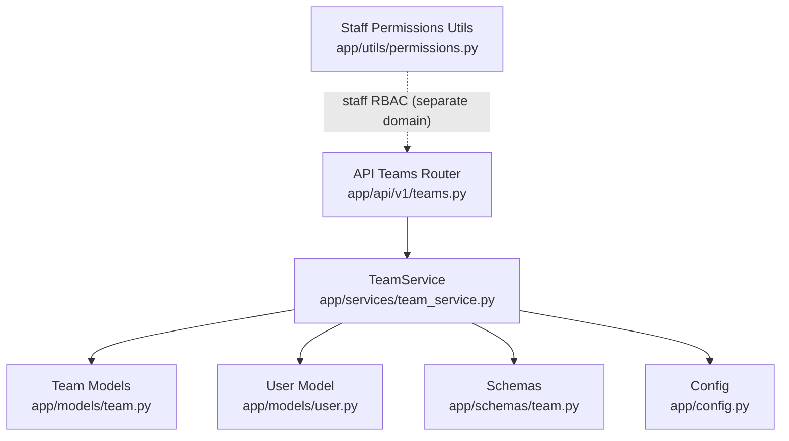
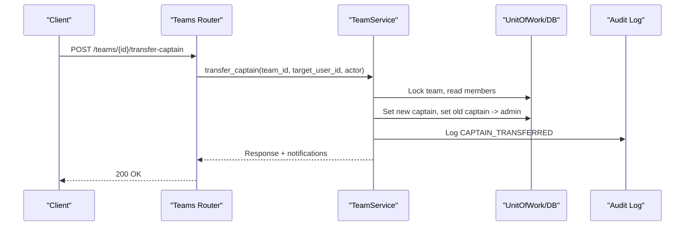
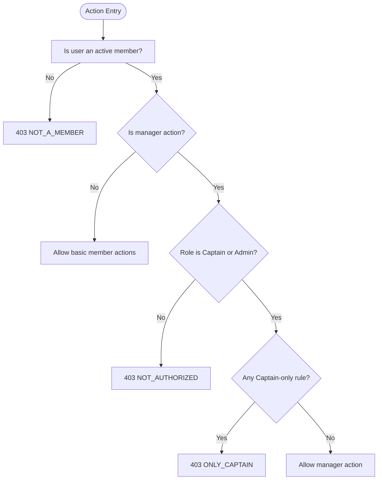
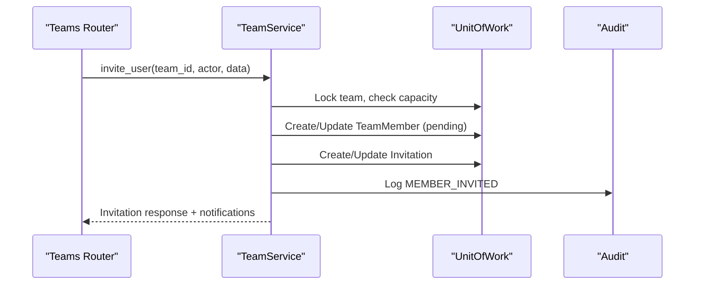
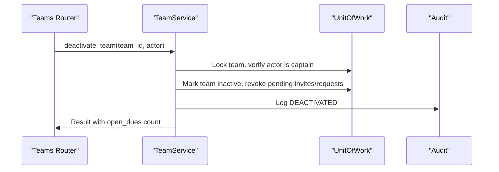
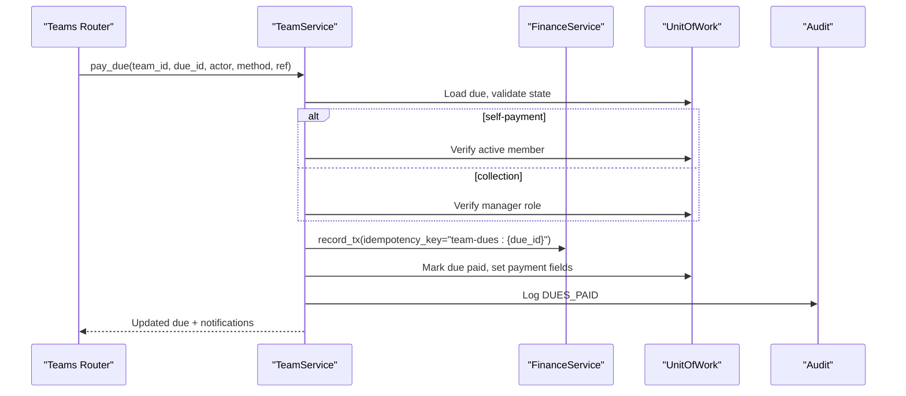
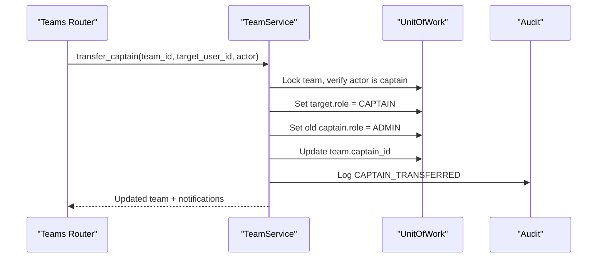
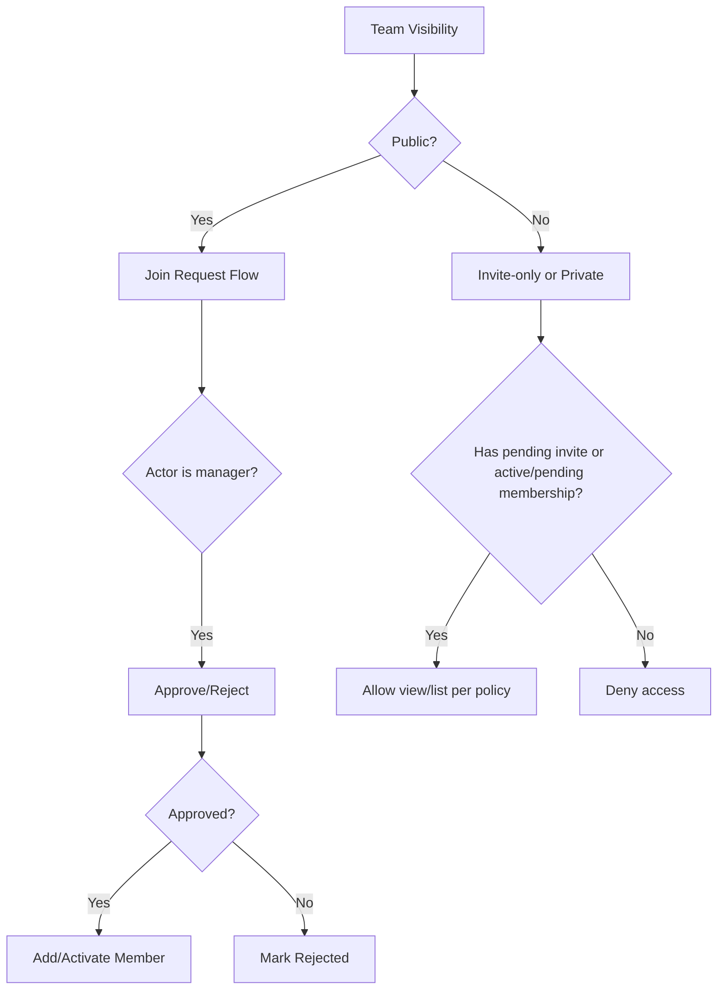
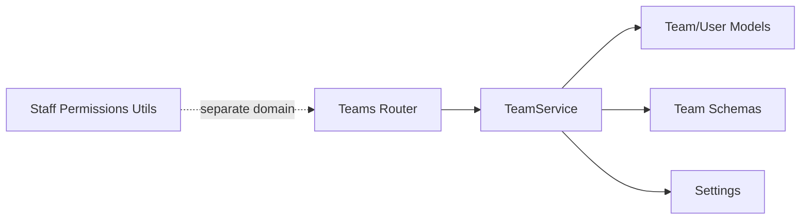

# Role & Permission System

<cite>
**Referenced Files in This Document**
- [team.py](file://app/models/team.py)
- [user.py](file://app/models/user.py)
- [permissions.py](file://app/utils/permissions.py)
- [team_service.py](file://app/services/team_service.py)
- [teams.py](file://app/api/v1/teams.py)
- [team_schemas.py](file://app/schemas/team.py)
- [config.py](file://app/config.py)
</cite>

## Table of Contents
1. Introduction
2. Project Structure
3. Core Components
4. Architecture Overview
5. Detailed Component Analysis
6. Dependency Analysis
7. Performance Considerations
8. Troubleshooting Guide
9. Conclusion

## Introduction
This document explains the team role and permission system for the booking platform. It covers the three-tier team role hierarchy (Captain, Admin, Member), role-based access control for team operations (member management, team updates, financial operations), captain transfer with automatic downgrade to Admin, permission inheritance patterns, API endpoint access rules, security considerations to prevent escalation, and audit logging of all role changes.

## Project Structure
The team RBAC spans models, services, schemas, and API routes:
- Models define roles, statuses, and audit events.
- Service methods enforce permissions and perform business logic.
- Schemas validate inputs and responses.
- API routes expose endpoints that delegate to service methods.

**Diagram sources**
- [teams.py:1-422](file://app/api/v1/teams.py#L1-L422)
- [team_service.py:59-1213](file://app/services/team_service.py#L59-L1213)
- [team.py:27-240](file://app/models/team.py#L27-L240)
- [user.py:7-34](file://app/models/user.py#L7-L34)
- [team_schemas.py:15-294](file://app/schemas/team.py#L15-L294)
- [config.py:18-21](file://app/config.py#L18-L21)
- [permissions.py:25-87](file://app/utils/permissions.py#L25-L87)

**Section sources**
- [teams.py:1-422](file://app/api/v1/teams.py#L1-L422)
- [team_service.py:59-1213](file://app/services/team_service.py#L59-L1213)
- [team.py:27-240](file://app/models/team.py#L27-L240)
- [user.py:7-34](file://app/models/user.py#L7-L34)
- [team_schemas.py:15-294](file://app/schemas/team.py#L15-L294)
- [config.py:18-21](file://app/config.py#L18-L21)
- [permissions.py:25-87](file://app/utils/permissions.py#L25-L87)

## Core Components
- TeamMemberRole defines the three-tier hierarchy: Captain (full control), Admin (management permissions), Member (basic access).
- TeamMemberStatus tracks membership lifecycle: Pending, Active, Removed, Declined.
- TeamVisibility controls discoverability and join flow: Private, Public, Invite-only.
- TeamAuditEvent logs all critical actions including role changes and captain transfers.
- Config sets team capacity and official threshold.

Key responsibilities:
- Enforce who can manage members, update teams, handle dues, and link bookings.
- Ensure only active members can act; managers must be Captain or Admin.
- Protect sensitive operations (deactivate team, void dues) to Captains or Managers where appropriate.

**Section sources**
- [team.py:27-84](file://app/models/team.py#L27-L84)
- [team.py:88-240](file://app/models/team.py#L88-L240)
- [config.py:18-21](file://app/config.py#L18-L21)

## Architecture Overview
The system separates concerns across layers:
- API layer validates requests and delegates to service methods.
- Service layer enforces RBAC, performs transactions, emits notifications, and writes audit events.
- Models define entities and enums; schemas define request/response contracts.

**Diagram sources**
- [teams.py:214-224](file://app/api/v1/teams.py#L214-L224)
- [team_service.py:588-623](file://app/services/team_service.py#L588-L623)
- [team.py:65-84](file://app/models/team.py#L65-L84)

## Detailed Component Analysis

### Three-Tier Role Hierarchy and Inheritance
- Captain: Full control over team operations, including member management, team updates, dues generation/payment/voiding, deactivation, and captain transfer.
- Admin: Management permissions for member operations, dues, and team updates; cannot transfer captain or deactivate team unless explicitly allowed by a method.
- Member: Basic access to view team info (subject to visibility), chat, pay own dues, and link own bookings.

Permission checks are centralized in service helpers:
- Active membership required for most actions.
- Manager-level actions require Captain or Admin role.
- Some actions are restricted to Captain only.

**Diagram sources**
- [team_service.py:82-116](file://app/services/team_service.py#L82-L116)

**Section sources**
- [team_service.py:82-116](file://app/services/team_service.py#L82-L116)
- [team.py:33-44](file://app/models/team.py#L33-L44)

### Member Management Access Control
- List members: Requires active membership; pending members visible only to managers.
- Invite users: Requires manager role; enforces capacity and prevents duplicates/expired invites.
- Accept/decline invitations: Requires valid pending invitation and active team.
- Remove member: Requires manager role; Captain cannot remove another Captain without transferring first; non-Captain managers cannot remove Admins.
- Leave team: Any active member except Captain; revokes pending invitations if applicable.

**Diagram sources**
- [teams.py:139-148](file://app/api/v1/teams.py#L139-L148)
- [team_service.py:389-454](file://app/services/team_service.py#L389-L454)
- [team.py:65-84](file://app/models/team.py#L65-L84)

**Section sources**
- [team_service.py:368-585](file://app/services/team_service.py#L368-L585)
- [teams.py:130-211](file://app/api/v1/teams.py#L130-L211)

### Team Updates and Deactivation
- Update team details: Requires manager role; enforces unique name per captain and records changes in audit.
- Deactivate team: Captain-only; revokes pending invitations and join requests; notifies members; reports open dues count.

**Diagram sources**
- [teams.py:116-125](file://app/api/v1/teams.py#L116-L125)
- [team_service.py:323-364](file://app/services/team_service.py#L323-L364)
- [team.py:65-84](file://app/models/team.py#L65-L84)

**Section sources**
- [team_service.py:286-364](file://app/services/team_service.py#L286-L364)
- [teams.py:104-125](file://app/api/v1/teams.py#L104-L125)

### Financial Operations (Dues)
- Generate dues: Manager-only; creates per-member dues with idempotency against duplicate title+due_date; audits creation.
- Pay due: Self-payment allowed for any active member; collection by managers requires manager role; records ledger transaction with idempotency key; audits payment.
- Void due: Manager-only; disallows voiding paid dues; audits voiding.
- List dues: Members see their own; managers see all; supports status filtering.
- Balance: Active members can view team balance; net considers ledger and unpaid dues.

**Diagram sources**
- [teams.py:303-315](file://app/api/v1/teams.py#L303-L315)
- [team_service.py:967-1026](file://app/services/team_service.py#L967-L1026)
- [team.py:65-84](file://app/models/team.py#L65-L84)

**Section sources**
- [team_service.py:880-1081](file://app/services/team_service.py#L880-L1081)
- [teams.py:276-338](file://app/api/v1/teams.py#L276-L338)

### Captain Transfer and Automatic Downgrade
- Only current Captain can transfer captaincy to an active member.
- On successful transfer:
  - New user becomes Captain.
  - Previous Captain is automatically downgraded to Admin.
  - Team.captain_id is updated.
  - Audit event CAPTAIN_TRANSFERRED is recorded.
  - Notifications sent to new captain and other admins.

**Diagram sources**
- [teams.py:214-224](file://app/api/v1/teams.py#L214-L224)
- [team_service.py:588-623](file://app/services/team_service.py#L588-L623)
- [team.py:65-84](file://app/models/team.py#L65-L84)

**Section sources**
- [team_service.py:588-623](file://app/services/team_service.py#L588-L623)
- [teams.py:214-224](file://app/api/v1/teams.py#L214-L224)

### Join Requests and Visibility
- Public teams allow join requests; private/invite-only restrict joining to direct invitations.
- Managers can list and decide (approve/reject) join requests; approval adds or activates membership and may trigger official status refresh.
- Viewability depends on visibility and membership/invitation status.

**Diagram sources**
- [team_service.py:118-129](file://app/services/team_service.py#L118-L129)
- [team_service.py:661-751](file://app/services/team_service.py#L661-L751)

**Section sources**
- [team_service.py:118-129](file://app/services/team_service.py#L118-L129)
- [team_service.py:661-751](file://app/services/team_service.py#L661-L751)

### API Endpoint Access Matrix
- GET /teams/{id}: Active member or public/invite-visible; returns enriched response with my_role/my_status.
- PUT /teams/{id}: Manager (Captain/Admin).
- DELETE /teams/{id}/deactivate: Captain only.
- POST /teams/{id}/invite: Manager.
- POST /teams/{id}/invitations/{member_id}/accept or decline: Target user with pending invitation.
- POST /teams/{id}/members/{member_id}/remove: Manager; restrictions apply for removing Admins/Captains.
- POST /teams/{id}/members/{member_id}/role: Captain only; cannot set captain via this route (use transfer-captain).
- POST /teams/{id}/leave: Active member (not Captain).
- POST /teams/{id}/transfer-captain: Captain only.
- POST /teams/{id}/join-request: Non-member requesting public team.
- GET /teams/{id}/join-requests, POST .../approve, .../reject: Manager.
- GET /teams/{id}/dues: Members see own; managers see all.
- POST /teams/{id}/dues/generate: Manager.
- POST /teams/{id}/dues/{due_id}/pay: Self-payment by member; collection by manager.
- DELETE /teams/{id}/dues/{due_id}: Manager.
- GET /teams/{id}/balance: Active member.
- GET /teams/{id}/bookings, POST .../link: Active member; link requires owner of booking.
- GET /teams/{id}/audit: Manager only.
- Chat endpoints: Active member.

**Section sources**
- [teams.py:36-422](file://app/api/v1/teams.py#L36-L422)
- [team_service.py:187-855](file://app/services/team_service.py#L187-L855)

### Security Considerations
- Role escalation prevention:
  - Captain role cannot be assigned via role update endpoint; must use transfer-captain.
  - Only current Captain can transfer captaincy.
  - Non-Captain managers cannot remove Admins.
  - Deactivation is Captain-only.
  - Payment collection requires manager role; self-payment allowed for members.
- Input validation:
  - Schemas enforce field constraints and enum values.
  - Capacity limits enforced before adding members.
- Idempotency:
  - Dues payments use idempotency keys to avoid double entries.
- Audit logging:
  - All critical actions log to TeamAuditEvent with actor, action type, and data payload.

**Section sources**
- [team_service.py:588-658](file://app/services/team_service.py#L588-L658)
- [team_service.py:967-1055](file://app/services/team_service.py#L967-L1055)
- [team.py:65-84](file://app/models/team.py#L65-L84)
- [team_schemas.py:15-294](file://app/schemas/team.py#L15-L294)

### Examples of Permission Checks in Service Methods
- Require active membership: Used across member-centric operations like chat and dues listing.
- Require manager role: Used for inviting, updating team, generating dues, voiding dues, managing join requests.
- Require captain role: Used for deactivating team, transferring captain, setting member roles.
- Ownership checks: Linking a booking requires the actor to be the booking owner.

**Section sources**
- [team_service.py:82-116](file://app/services/team_service.py#L82-L116)
- [team_service.py:286-364](file://app/services/team_service.py#L286-L364)
- [team_service.py:588-658](file://app/services/team_service.py#L588-L658)
- [team_service.py:1085-1115](file://app/services/team_service.py#L1085-L1115)

### Common Permission-Related Error Scenarios
- NOT_A_MEMBER: Attempted action by non-member or inactive member.
- NOT_AUTHORIZED: Manager-only action attempted by a member.
- ONLY_CAPTAIN: Action restricted to Captain (e.g., deactivate, transfer captain, set roles).
- TEAM_INACTIVE: Operation attempted on a deactivated team.
- ALREADY_MEMBER / ALREADY_PENDING: Duplicate membership or pending invitation.
- INVALID_ROLE: Attempt to set captain via role update endpoint.
- DUE_ALREADY_PAID / DUE_VOIDED: Invalid state transitions for dues.
- BOOKING_LINKED_ELSEWHERE: Booking already linked to another team.

**Section sources**
- [team_service.py:48-50](file://app/services/team_service.py#L48-L50)
- [team_service.py:82-116](file://app/services/team_service.py#L82-L116)
- [team_service.py:523-558](file://app/services/team_service.py#L523-L558)
- [team_service.py:588-658](file://app/services/team_service.py#L588-L658)
- [team_service.py:967-1055](file://app/services/team_service.py#L967-L1055)
- [team_service.py:1085-1115](file://app/services/team_service.py#L1085-L1115)

## Dependency Analysis
- API routes depend on service methods for authorization and business logic.
- Service methods depend on models for data structures and enums.
- Schemas provide strict input/output contracts.
- Config influences behavior (capacity, thresholds).
- Staff permissions module exists for a separate staff RBAC domain and does not directly govern team roles.

**Diagram sources**
- [teams.py:1-422](file://app/api/v1/teams.py#L1-L422)
- [team_service.py:59-1213](file://app/services/team_service.py#L59-L1213)
- [team.py:27-240](file://app/models/team.py#L27-L240)
- [team_schemas.py:15-294](file://app/schemas/team.py#L15-L294)
- [config.py:18-21](file://app/config.py#L18-L21)
- [permissions.py:25-87](file://app/utils/permissions.py#L25-L87)

**Section sources**
- [teams.py:1-422](file://app/api/v1/teams.py#L1-L422)
- [team_service.py:59-1213](file://app/services/team_service.py#L59-L1213)
- [team.py:27-240](file://app/models/team.py#L27-L240)
- [team_schemas.py:15-294](file://app/schemas/team.py#L15-L294)
- [config.py:18-21](file://app/config.py#L18-L21)
- [permissions.py:25-87](file://app/utils/permissions.py#L25-L87)

## Performance Considerations
- Use locked reads for capacity-sensitive operations to avoid race conditions during invites/joins.
- Batch enrichment queries (e.g., names, counts) to reduce N+1 queries.
- Avoid auditing high-volume messages; chat is intentionally not audited.
- Leverage idempotency keys for financial operations to prevent retries from creating duplicates.

[No sources needed since this section provides general guidance]

## Troubleshooting Guide
- If you encounter NOT_A_MEMBER, ensure the user has an active membership and the team is active.
- For NOT_AUTHORIZED, confirm the actor’s role meets the requirement (manager vs member).
- For ONLY_CAPTAIN errors, verify the actor is the current captain.
- For DUE-related errors, check due state (paid/voided) and method validity.
- For JOIN_NOT_ALLOWED, ensure the team visibility allows join requests or that an invitation exists.
- Review audit logs for the team to trace recent role changes and financial actions.

**Section sources**
- [team_service.py:48-50](file://app/services/team_service.py#L48-L50)
- [team_service.py:82-116](file://app/services/team_service.py#L82-L116)
- [team_service.py:588-658](file://app/services/team_service.py#L588-L658)
- [team_service.py:967-1055](file://app/services/team_service.py#L967-L1055)
- [team_service.py:661-751](file://app/services/team_service.py#L661-L751)

## Conclusion
The team role and permission system enforces a clear three-tier hierarchy with robust checks at the service layer. Captain transfer includes automatic downgrade to Admin, ensuring continuity of management. Financial operations are protected and audited, while member management flows support both invitations and join requests based on team visibility. The design minimizes escalation risks through explicit role checks and dedicated endpoints, and maintains comprehensive audit trails for accountability.