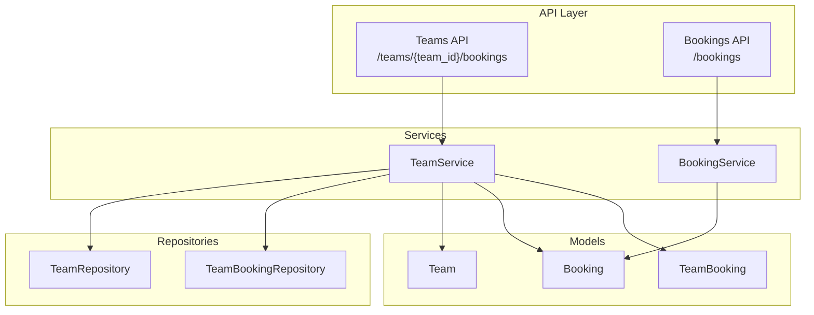
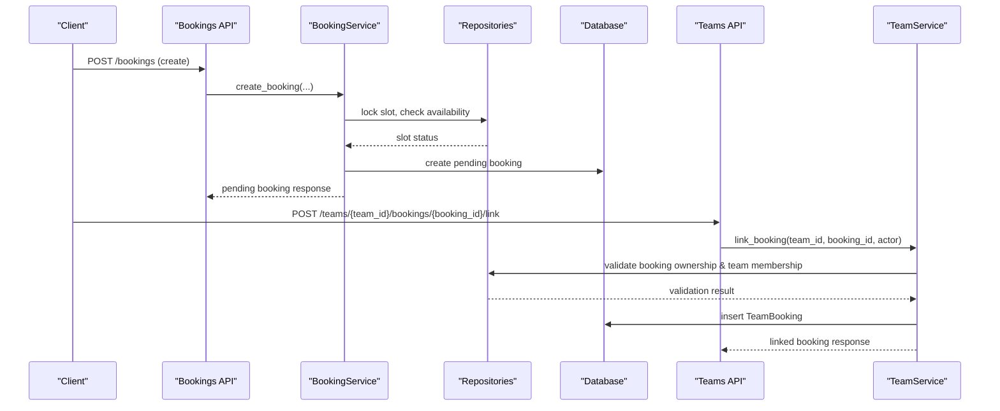
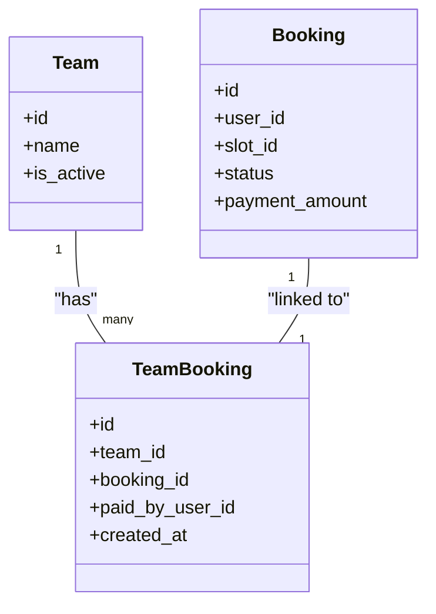
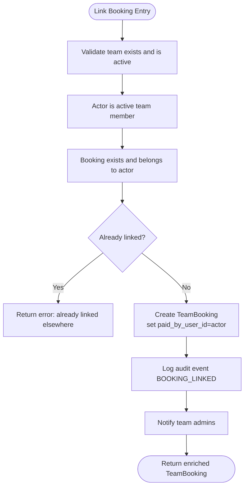
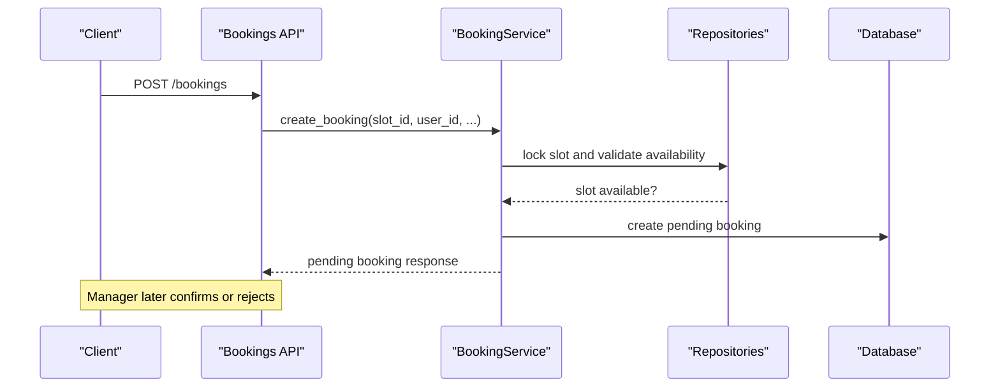
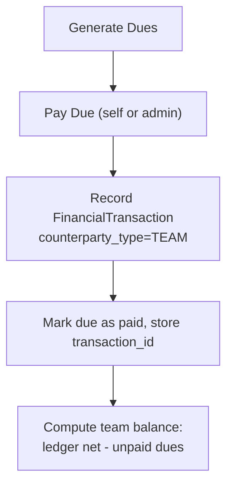
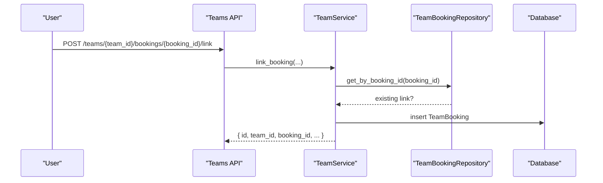
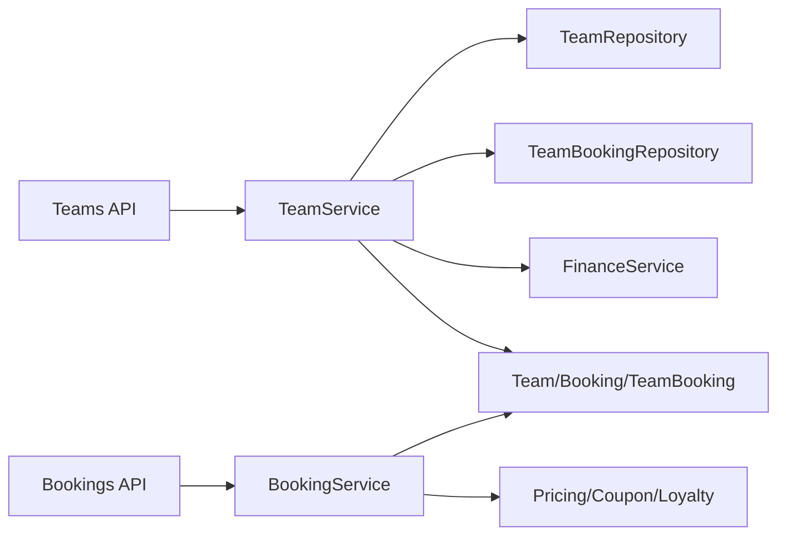

# Team Bookings Integration

<cite>
**Referenced Files in This Document**
- [team.py](file://app/models/team.py)
- [booking.py](file://app/models/booking.py)
- [team_service.py](file://app/services/team_service.py)
- [booking_service.py](file://app/services/booking_service.py)
- [teams.py](file://app/api/v1/teams.py)
- [bookings.py](file://app/api/v1/bookings.py)
- [team_repository.py](file://app/repositories/team_repository.py)
- [team.py (schemas)](file://app/schemas/team.py)
</cite>

## Table of Contents
1. [Introduction](#introduction)
2. [Project Structure](#project-structure)
3. [Core Components](#core-components)
4. [Architecture Overview](#architecture-overview)
5. [Detailed Component Analysis](#detailed-component-analysis)
6. [Dependency Analysis](#dependency-analysis)
7. [Performance Considerations](#performance-considerations)
8. [Troubleshooting Guide](#troubleshooting-guide)
9. [Conclusion](#conclusion)
10. [Appendices](#appendices)

## Introduction
This document explains how teams can attribute existing venue bookings to themselves through the TeamBooking entity, enabling team-level history, financial tracking, and member contribution calculations. It clarifies the separation between booking creation (handled by the booking service) and team association (handled by the team service), and outlines how team bookings integrate with the overall booking system architecture. It also covers limitations and scope boundaries of the current implementation.

## Project Structure
The team booking integration spans models, services, repositories, schemas, and API routes:
- Models define persistent entities for teams, members, dues, audits, and the linking table TeamBooking that associates a Booking with a Team.
- Services encapsulate business logic: BookingService creates and confirms bookings; TeamService links bookings to teams and manages team membership, dues, and audit events.
- Repositories provide data access patterns for teams, members, dues, and team bookings.
- Schemas define request/response contracts for team-related endpoints.
- API routes expose endpoints for creating bookings and linking them to teams.

**Diagram sources**
- [teams.py:343-364](file://app/api/v1/teams.py#L343-L364)
- [bookings.py:191-237](file://app/api/v1/bookings.py#L191-L237)
- [team_service.py:1084-1145](file://app/services/team_service.py#L1084-L1145)
- [booking_service.py:27-109](file://app/services/booking_service.py#L27-L109)
- [team_repository.py:210-238](file://app/repositories/team_repository.py#L210-L238)
- [team.py:171-183](file://app/models/team.py#L171-L183)
- [booking.py:21-50](file://app/models/booking.py#L21-L50)

**Section sources**
- [team.py:171-183](file://app/models/team.py#L171-L183)
- [booking.py:21-50](file://app/models/booking.py#L21-L50)
- [team_service.py:1084-1145](file://app/services/team_service.py#L1084-L1145)
- [booking_service.py:27-109](file://app/services/booking_service.py#L27-L109)
- [teams.py:343-364](file://app/api/v1/teams.py#L343-L364)
- [bookings.py:191-237](file://app/api/v1/bookings.py#L191-L237)
- [team_repository.py:210-238](file://app/repositories/team_repository.py#L210-L238)

## Core Components
- TeamBooking model: Links an existing Booking to a Team and records who performed the linking action via paid_by_user_id. Enforces one-team-per-booking uniqueness.
- TeamService.link_booking: Validates ownership and membership, prevents duplicate or cross-team linking, persists TeamBooking, and emits audit events and notifications.
- TeamService.list_bookings: Returns enriched team booking history with slot and venue details.
- BookingService.create_booking and confirm_pending: Create pending bookings, compute pricing, reserve coupons/loyalty points, and persist confirmed bookings. These are independent of team attribution.
- TeamDues and FinanceService: Provide per-member contribution accounting and team ledger balances. While not directly created by linking a booking, they form the broader financial context for team contributions.

Key responsibilities:
- Booking creation and lifecycle: BookingService + Bookings API.
- Team association and history: TeamService + Teams API.
- Data persistence: Repositories and Models.

**Section sources**
- [team.py:171-183](file://app/models/team.py#L171-L183)
- [team_service.py:1084-1145](file://app/services/team_service.py#L1084-L1145)
- [booking_service.py:27-109](file://app/services/booking_service.py#L27-L109)
- [booking_service.py:119-192](file://app/services/booking_service.py#L119-L192)
- [team_repository.py:210-238](file://app/repositories/team_repository.py#L210-L238)

## Architecture Overview
The integration separates concerns:
- The Bookings API and BookingService handle slot availability, pricing, promotions, and confirmation. They do not modify team associations.
- The Teams API and TeamService handle team membership, dues, and linking existing bookings to teams without altering the original booking record.

**Diagram sources**
- [bookings.py:191-237](file://app/api/v1/bookings.py#L191-L237)
- [booking_service.py:27-109](file://app/services/booking_service.py#L27-L109)
- [teams.py:343-364](file://app/api/v1/teams.py#L343-L364)
- [team_service.py:1084-1145](file://app/services/team_service.py#L1084-L1145)
- [team_repository.py:210-238](file://app/repositories/team_repository.py#L210-L238)

## Detailed Component Analysis

### TeamBooking Model and Constraints
- Purpose: Attribute an existing booking to a single team while preserving the original booking unchanged.
- Uniqueness: Each booking can be linked to at most one team.
- Attribution: Records paid_by_user_id to indicate which user initiated the linking action.

**Diagram sources**
- [team.py:171-183](file://app/models/team.py#L171-L183)
- [booking.py:21-50](file://app/models/booking.py#L21-L50)

**Section sources**
- [team.py:171-183](file://app/models/team.py#L171-L183)

### Team Service: Linking Bookings
- Validation:
  - Actor must be an active team member.
  - Team must be active.
  - Booking must exist and belong to the actor.
  - Prevents linking the same booking to another team or re-linking to the same team.
- Persistence:
  - Creates TeamBooking with paid_by_user_id set to the actor.
  - Emits audit event BOOKING_LINKED.
  - Notifies team admins about the linkage.
- Enrichment:
  - Returns enriched booking details including venue, slot date/time, status, and payment amount.

**Diagram sources**
- [team_service.py:1084-1145](file://app/services/team_service.py#L1084-L1145)
- [team_repository.py:210-238](file://app/repositories/team_repository.py#L210-L238)

**Section sources**
- [team_service.py:1084-1145](file://app/services/team_service.py#L1084-L1145)
- [team_repository.py:210-238](file://app/repositories/team_repository.py#L210-L238)

### Booking Service: Creation and Confirmation
- Creation:
  - Locks slot to prevent race conditions.
  - Computes price using PricingService, reserves coupon if used, and stores pricing breakdown.
  - Persists a pending booking and marks slot as booked until manager confirmation.
- Confirmation:
  - Converts pending to confirmed booking, attaches coupon redemption, redeems loyalty points, and updates slot/deal state.
- Cancellation:
  - Restores slot status and releases promotions.

**Diagram sources**
- [bookings.py:191-237](file://app/api/v1/bookings.py#L191-L237)
- [booking_service.py:27-109](file://app/services/booking_service.py#L27-L109)

**Section sources**
- [booking_service.py:27-109](file://app/services/booking_service.py#L27-L109)
- [booking_service.py:119-192](file://app/services/booking_service.py#L119-L192)

### Financial Tracking and Member Contributions
- TeamDues: Per-member obligations with due dates, payment methods, and ledger references.
- Payment flow:
  - Dues payments create ledger entries with counterparty_type=TEAM and counterparty_ref=team_id.
  - Idempotency key ensures no duplicate ledger rows for the same due.
- Balance calculation:
  - Net balance = (team ledger income - expense) - unpaid dues.
  - Provides visibility into team account health and outstanding obligations.

**Diagram sources**
- [team_service.py:880-1081](file://app/services/team_service.py#L880-L1081)
- [team_repository.py:241-337](file://app/repositories/team_repository.py#L241-L337)

**Section sources**
- [team_service.py:880-1081](file://app/services/team_service.py#L880-L1081)
- [team_repository.py:241-337](file://app/repositories/team_repository.py#L241-L337)

### Team Booking Workflows and Examples
- Example 1: Member attributes their own booking to the team
  - User calls POST /teams/{team_id}/bookings/{booking_id}/link.
  - Service validates ownership and membership, creates TeamBooking, logs audit, notifies admins.
- Example 2: Viewing team booking history
  - GET /teams/{team_id}/bookings returns enriched list of linked bookings with venue and slot details.
- Example 3: Manager partner view aggregates team spending
  - Uses confirmed/completed bookings and TeamBooking links to compute spent amounts per team at venues under manager scope.

**Diagram sources**
- [teams.py:343-364](file://app/api/v1/teams.py#L343-L364)
- [team_service.py:1084-1145](file://app/services/team_service.py#L1084-L1145)
- [team_repository.py:210-238](file://app/repositories/team_repository.py#L210-L238)

**Section sources**
- [teams.py:343-364](file://app/api/v1/teams.py#L343-L364)
- [team_service.py:1084-1145](file://app/services/team_service.py#L1084-L1145)

### Relationship Between Team Bookings and Individual Responsibilities
- Ownership rule: Only the booking owner can link their booking to a team.
- Responsibility: TeamBooking records paid_by_user_id as the actor who attributed the booking; this does not change the original booking’s user_id.
- Contribution context: TeamDues capture per-member financial obligations separate from booking attribution. Dues payments update the team ledger and contribute to net balance calculations.

**Section sources**
- [team_service.py:1084-1145](file://app/services/team_service.py#L1084-L1145)
- [team_service.py:880-1081](file://app/services/team_service.py#L880-L1081)

## Dependency Analysis
- API layer depends on services for business rules and on repositories for data access.
- TeamService depends on:
  - Team and Booking models for validation.
  - TeamBookingRepository for linking and listing.
  - Notification service for admin alerts.
  - FinanceService for team dues payments and ledger operations.
- BookingService depends on:
  - Slot, Venue, Coupon, Loyalty, and Pricing services for pricing and promotions.
  - Pending booking service for temporary storage before confirmation.

**Diagram sources**
- [teams.py:343-364](file://app/api/v1/teams.py#L343-L364)
- [bookings.py:191-237](file://app/api/v1/bookings.py#L191-L237)
- [team_service.py:1084-1145](file://app/services/team_service.py#L1084-L1145)
- [booking_service.py:27-109](file://app/services/booking_service.py#L27-L109)

**Section sources**
- [team_service.py:1084-1145](file://app/services/team_service.py#L1084-L1145)
- [booking_service.py:27-109](file://app/services/booking_service.py#L27-L109)

## Performance Considerations
- Concurrency safety:
  - Booking creation locks slots to avoid race conditions and double bookings.
  - Team operations use locked reads where necessary to ensure consistency during capacity checks and membership changes.
- Query efficiency:
  - TeamBookingRepository uses batched queries for manager partner aggregation to minimize N+1 issues.
  - Enriched responses load related slot and venue data in bulk.
- Idempotency:
  - Dues payments use idempotency keys to prevent duplicate ledger entries.

[No sources needed since this section provides general guidance]

## Troubleshooting Guide
Common errors when linking bookings:
- BOOKING_NOT_FOUND: The specified booking does not exist.
- NOT_MY_BOOKING: The actor is not the owner of the booking.
- ALREADY_LINKED: The booking is already linked to the same team.
- BOOKING_LINKED_ELSEWHERE: The booking is linked to a different team.
- TEAM_INACTIVE: The team is deactivated; linking is not allowed.
- NOT_A_MEMBER: The actor is not an active member of the team.

Resolution steps:
- Verify booking existence and ownership.
- Ensure the team is active and the actor is an active member.
- Check for prior links to other teams.

**Section sources**
- [team_service.py:1084-1145](file://app/services/team_service.py#L1084-L1145)

## Conclusion
Team bookings enable teams to attribute existing venue reservations to themselves without modifying the original booking. The design cleanly separates booking creation (BookingService) from team association (TeamService). TeamBooking captures attribution and actor information, supporting team history and financial tracking through dues and ledger entries. Limitations include one-team-per-booking linkage and explicit scope boundaries that exclude automatic contract-to-team assignment in this wave.

[No sources needed since this section summarizes without analyzing specific files]

## Appendices

### API Endpoints Summary
- Create booking: POST /bookings
- Confirm pending booking: POST /bookings/pending/{pending_id}/confirm
- Link booking to team: POST /teams/{team_id}/bookings/{booking_id}/link
- List team bookings: GET /teams/{team_id}/bookings

**Section sources**
- [bookings.py:191-237](file://app/api/v1/bookings.py#L191-L237)
- [bookings.py:99-131](file://app/api/v1/bookings.py#L99-L131)
- [teams.py:343-364](file://app/api/v1/teams.py#L343-L364)

### Data Models Summary
- TeamBooking: Links booking to team and records linking actor.
- Booking: Represents a venue reservation with pricing and receipt fields.
- TeamDues: Tracks per-member contributions and payments.

**Section sources**
- [team.py:171-183](file://app/models/team.py#L171-L183)
- [booking.py:21-50](file://app/models/booking.py#L21-L50)
- [team.py:187-209](file://app/models/team.py#L187-L209)