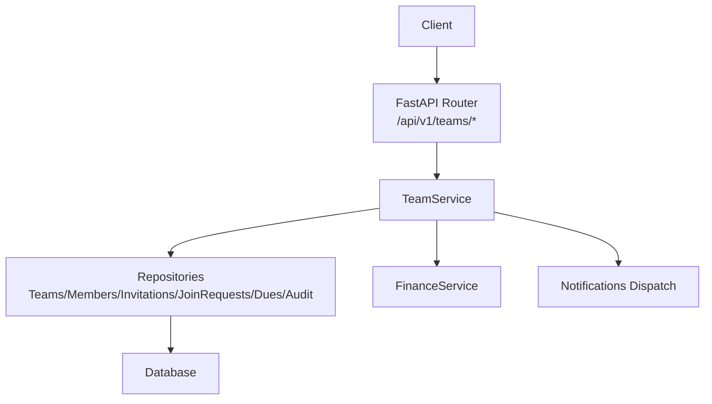
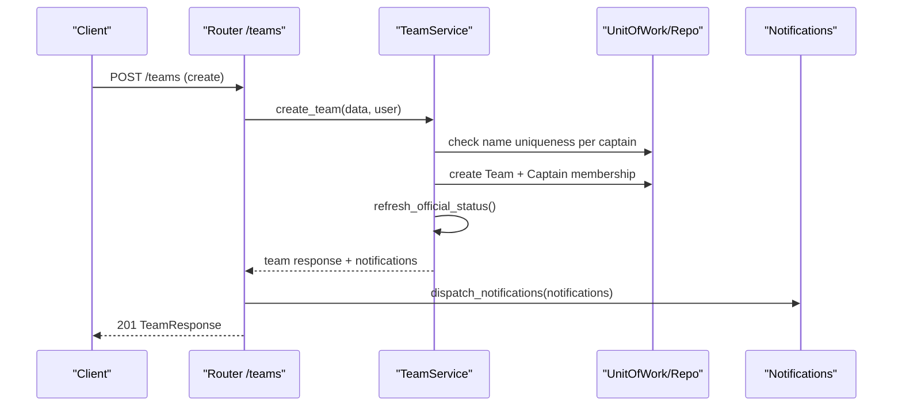
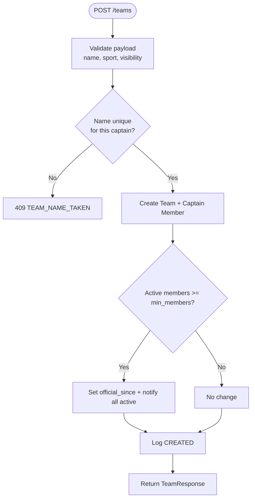
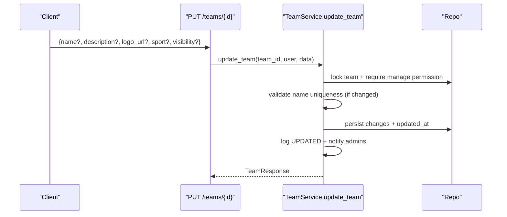
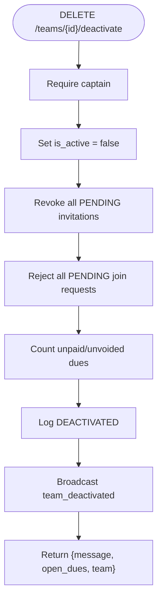
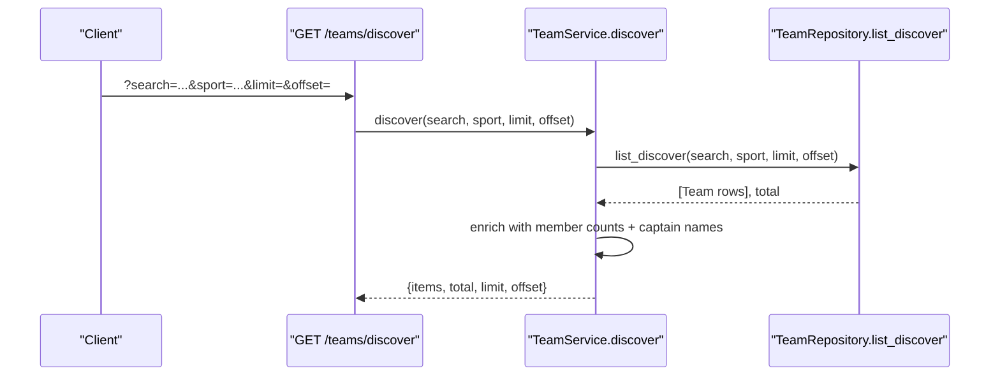
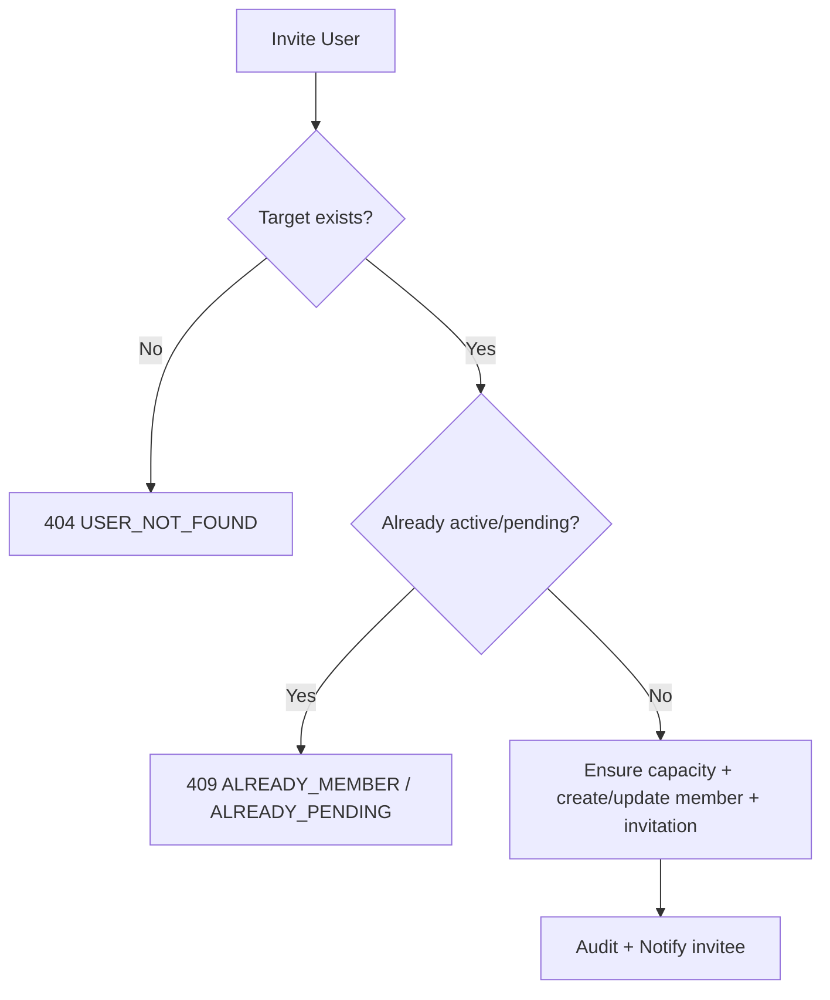
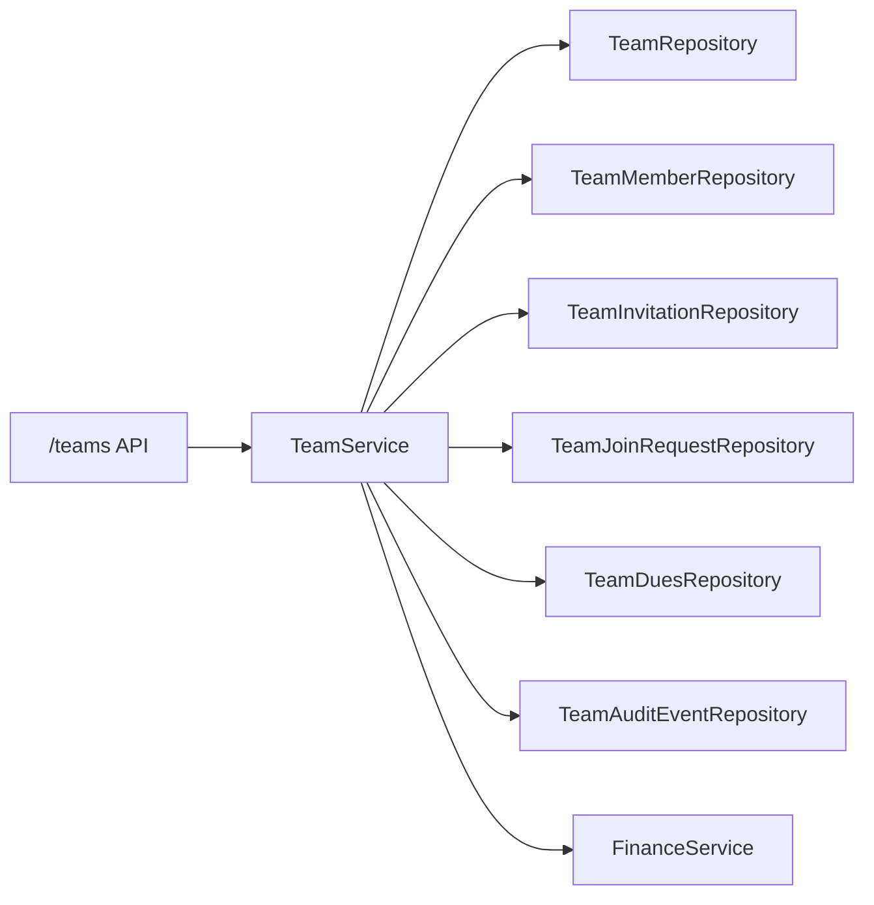

# Team Creation & Management

<cite>
**Referenced Files in This Document**
- [teams.py](file://app/api/v1/teams.py)
- [team_service.py](file://app/services/team_service.py)
- [team_repository.py](file://app/repositories/team_repository.py)
- [team.py](file://app/models/team.py)
- [team_schema.py](file://app/schemas/team.py)
- [config.py](file://app/config.py)
- [test_teams_crud.py](file://tests/test_teams_crud.py)
</cite>

## Table of Contents
1. [Introduction](#introduction)
2. [Project Structure](#project-structure)
3. [Core Components](#core-components)
4. [Architecture Overview](#architecture-overview)
5. [Detailed Component Analysis](#detailed-component-analysis)
6. [Dependency Analysis](#dependency-analysis)
7. [Performance Considerations](#performance-considerations)
8. [Troubleshooting Guide](#troubleshooting-guide)
9. [Conclusion](#conclusion)

## Introduction
This document explains the end-to-end team lifecycle: creation, updates, discovery/search, membership and invitations, join requests for public teams, deactivation with cleanup, and error handling. It focuses on validation rules (name uniqueness per captain), visibility modes (public/private/invite-only), sport configuration, captain assignment and transfer, description/logo updates, capacity limits, and proper cleanup of pending invitations and join requests during deactivation.

## Project Structure
The team feature is implemented across API routes, a service layer, repositories, models, schemas, and configuration:
- API routes define endpoints for create/list/discover/update/deactivate, members/invitations/join requests, dues, bookings, audit, and chat.
- Service layer enforces business rules, permissions, capacity checks, official status refresh, notifications, and coordination with finance.
- Repositories implement data access queries for teams, members, invitations, join requests, dues, audit events, and messages.
- Models define persistent entities and enums for visibility, roles, statuses, and audit actions.
- Schemas validate inputs and define responses.
- Configuration defines team capacity and official thresholds.

**Diagram sources**
- [teams.py:36-125](file://app/api/v1/teams.py#L36-L125)
- [team_service.py:187-364](file://app/services/team_service.py#L187-L364)
- [team_repository.py:22-60](file://app/repositories/team_repository.py#L22-L60)

**Section sources**
- [teams.py:1-125](file://app/api/v1/teams.py#L1-L125)
- [team_service.py:1-184](file://app/services/team_service.py#L1-L184)
- [team_repository.py:1-60](file://app/repositories/team_repository.py#L1-L60)

## Core Components
- Team entity and enums: visibility (private/public/invite_only), roles (captain/admin/member), statuses (pending/active/removed/declined), invitation and join request states, dues methods, and audit actions.
- Schemas: strict input validation for create/update, invites, join requests, dues, and chat; enriched responses include member counts, official status, and viewer context.
- Service: centralizes business logic including name uniqueness per captain, capacity enforcement, permission checks, visibility gating, official status refresh, and notification dispatch.
- Repository: efficient queries for discover (public + active, optional sport and search), member counts, admin lists, invitation and join request management, dues aggregation, and audit logs.
- Configuration: TEAM_MAX_MEMBERS and TEAM_MIN_MEMBERS control capacity and official threshold.

**Section sources**
- [team.py:27-105](file://app/models/team.py#L27-L105)
- [team_schema.py:15-55](file://app/schemas/team.py#L15-L55)
- [team_service.py:104-184](file://app/services/team_service.py#L104-L184)
- [team_repository.py:47-60](file://app/repositories/team_repository.py#L47-L60)
- [config.py:18-21](file://app/config.py#L18-L21)

## Architecture Overview
The API layer delegates to TeamService, which orchestrates domain operations using repositories and services. All mutations are audited and produce notifications. Discovery filters by visibility and sport; private teams restrict access to captains, active/pending members, or those with pending invitations.

**Diagram sources**
- [teams.py:36-44](file://app/api/v1/teams.py#L36-L44)
- [team_service.py:187-212](file://app/services/team_service.py#L187-L212)

**Section sources**
- [teams.py:36-44](file://app/api/v1/teams.py#L36-L44)
- [team_service.py:187-212](file://app/services/team_service.py#L187-L212)

## Detailed Component Analysis

### Team Creation Workflow
- Name validation: unique per captain; duplicate names return a conflict error.
- Visibility: defaults to private; can be set to public or invite_only at creation time.
- Sport: defaults to futsal; stored as-is after trimming.
- Captain assignment: creator becomes captain automatically; a TeamMember row is created with role captain and active status.
- Official status: if active members meet minimum threshold, team becomes official and all active members are notified.
- Audit: creation event logged with name and visibility.

**Diagram sources**
- [team_service.py:187-212](file://app/services/team_service.py#L187-L212)
- [team_repository.py:30-32](file://app/repositories/team_repository.py#L30-L32)

**Section sources**
- [team_service.py:187-212](file://app/services/team_service.py#L187-L212)
- [team_repository.py:30-32](file://app/repositories/team_repository.py#L30-L32)
- [team_schema.py:15-21](file://app/schemas/team.py#L15-L21)
- [test_teams_crud.py:28-49](file://tests/test_teams_crud.py#L28-L49)

### Team Update Operations
- Permissions: only active captain or admin can update.
- Allowed fields: name, description, logo_url, sport, visibility.
- Name uniqueness: enforced against other teams owned by the same captain.
- Empty changes: rejected with a bad request error.
- Audit: updated action recorded with changed fields.
- Notifications: admins (excluding updater) receive an update notification.

**Diagram sources**
- [teams.py:104-113](file://app/api/v1/teams.py#L104-L113)
- [team_service.py:286-321](file://app/services/team_service.py#L286-L321)

**Section sources**
- [teams.py:104-113](file://app/api/v1/teams.py#L104-L113)
- [team_service.py:286-321](file://app/services/team_service.py#L286-L321)
- [test_teams_crud.py:83-103](file://tests/test_teams_crud.py#L83-L103)

### Team Deactivation Process
- Only the captain can deactivate.
- Sets team inactive; prevents further invites/joins.
- Cleans up pending invitations by revoking them.
- Rejects all pending join requests for the team.
- Audits deactivation and reports number of open dues remaining.
- Broadcasts a team-wide notification about deactivation.

**Diagram sources**
- [team_service.py:324-364](file://app/services/team_service.py#L324-L364)
- [team_repository.py:171-183](file://app/repositories/team_repository.py#L171-L183)
- [team_repository.py:195-207](file://app/repositories/team_repository.py#L195-L207)

**Section sources**
- [team_service.py:324-364](file://app/services/team_service.py#L324-L364)
- [team_repository.py:171-183](file://app/repositories/team_repository.py#L171-L183)
- [team_repository.py:195-207](file://app/repositories/team_repository.py#L195-L207)
- [test_teams_crud.py:108-130](file://tests/test_teams_crud.py#L108-L130)

### Team Discovery and Search
- Discover endpoint returns only active, public teams.
- Filters:
  - Optional text search on team name (case-insensitive).
  - Optional sport filter.
  - Pagination via limit and offset.
- Response includes member_count, captain_name, and viewer context flags.

**Diagram sources**
- [teams.py:58-68](file://app/api/v1/teams.py#L58-L68)
- [team_service.py:268-283](file://app/services/team_service.py#L268-L283)
- [team_repository.py:47-60](file://app/repositories/team_repository.py#L47-L60)

**Section sources**
- [teams.py:58-68](file://app/api/v1/teams.py#L58-L68)
- [team_service.py:268-283](file://app/services/team_service.py#L268-L283)
- [team_repository.py:47-60](file://app/repositories/team_repository.py#L47-L60)
- [test_teams_crud.py:61-73](file://tests/test_teams_crud.py#L61-L73)

### Membership, Invitations, and Join Requests
- Direct invitations:
  - Target must be a registered user (by user_id or phone).
  - Prevents duplicates (already active, already pending, or existing pending invitation).
  - Enforces capacity before creating/reviving membership and invitation.
  - Supports optional expiration window.
- Accept/Decline invitations:
  - Validates pending state and expiry.
  - Accepting sets member active, records joined_at, and notifies admins.
  - Declining marks member declined and left_at.
- Join requests (public teams only):
  - Users can submit a message-based request; admins approve/reject.
  - Approving ensures capacity and creates or activates membership.
  - Rejecting marks request rejected.
- Role changes and captain transfer:
  - Only captain can change roles (admin/member); cannot change captain’s own role directly.
  - Captain transfer requires target to be an active member; old captain becomes admin.

**Diagram sources**
- [team_service.py:389-454](file://app/services/team_service.py#L389-L454)
- [team_service.py:470-520](file://app/services/team_service.py#L470-L520)
- [team_service.py:661-751](file://app/services/team_service.py#L661-L751)

**Section sources**
- [team_service.py:389-454](file://app/services/team_service.py#L389-L454)
- [team_service.py:470-520](file://app/services/team_service.py#L470-L520)
- [team_service.py:661-751](file://app/services/team_service.py#L661-L751)
- [team_schema.py:70-125](file://app/schemas/team.py#L70-L125)

### Error Handling Highlights
- Duplicate team name per captain: 409 TEAM_NAME_TAKEN.
- Private team access by non-member: 403 PRIVATE_TEAM.
- Inactive team operations: 409 TEAM_INACTIVE.
- Capacity exceeded: 409 TEAM_FULL.
- Not a member or not authorized: 403 NOT_A_MEMBER / NOT_AUTHORIZED.
- Empty update payload: 400 NO_CHANGES.
- Invitation expired: 410 INVITE_EXPIRED.
- Invalid role change: 400 INVALID_ROLE.

**Section sources**
- [team_service.py:48-116](file://app/services/team_service.py#L48-L116)
- [team_service.py:286-321](file://app/services/team_service.py#L286-L321)
- [team_service.py:324-364](file://app/services/team_service.py#L324-L364)
- [team_service.py:456-520](file://app/services/team_service.py#L456-L520)
- [team_service.py:626-658](file://app/services/team_service.py#L626-L658)

## Dependency Analysis
- API depends on TeamService for all business logic.
- TeamService depends on:
  - UnitOfWork and repositories for data access.
  - FinanceService for dues payments and ledger integration.
  - Notification dispatch for real-time updates.
- Repositories encapsulate SQLModel queries and aggregate counts efficiently.
- Models define constraints and indexes that enforce integrity (unique name per captain, active/public filtering).

**Diagram sources**
- [teams.py:36-125](file://app/api/v1/teams.py#L36-L125)
- [team_service.py:187-364](file://app/services/team_service.py#L187-L364)
- [team_repository.py:22-403](file://app/repositories/team_repository.py#L22-L403)

**Section sources**
- [teams.py:36-125](file://app/api/v1/teams.py#L36-L125)
- [team_service.py:187-364](file://app/services/team_service.py#L187-L364)
- [team_repository.py:22-403](file://app/repositories/team_repository.py#L22-L403)

## Performance Considerations
- Member counts are computed via COUNT queries to avoid stale caches.
- Discover uses server-side pagination and indexed filters (visibility, sport, name ilike).
- Admin notifications are sent to active captains and admins only.
- Official status refresh runs once per relevant mutation and is idempotent.
- Dues balance aggregates income/expenses in single SQL statements.

[No sources needed since this section provides general guidance]

## Troubleshooting Guide
- Cannot create team with same name under same captain: ensure a different name or use another captain account.
- Cannot update team: verify you are an active captain or admin; ensure at least one field is changed.
- Cannot invite users: confirm target exists and team has capacity; ensure no pending invitation or membership exists.
- Cannot accept invitation: check that invitation is still pending and not expired.
- Cannot join public team: ensure you have not already requested or are already a member; wait for admin approval.
- Deactivation issues: only captain can deactivate; pending invitations are revoked and join requests rejected automatically.

**Section sources**
- [team_service.py:187-212](file://app/services/team_service.py#L187-L212)
- [team_service.py:286-321](file://app/services/team_service.py#L286-L321)
- [team_service.py:389-454](file://app/services/team_service.py#L389-L454)
- [team_service.py:456-520](file://app/services/team_service.py#L456-L520)
- [team_service.py:661-751](file://app/services/team_service.py#L661-L751)
- [team_service.py:324-364](file://app/services/team_service.py#L324-L364)

## Conclusion
The team system provides robust lifecycle management with clear validation, visibility controls, and administrative workflows. Creation enforces name uniqueness per captain and supports configurable sport and visibility. Updates allow controlled modifications with audit trails. Discovery enables public team search with sport and text filters. Deactivation safely cleans up pending invitations and join requests while preserving financial records. The layered design (API → Service → Repository) ensures maintainability, performance, and consistent behavior validated by tests.

[No sources needed since this section summarizes without analyzing specific files]