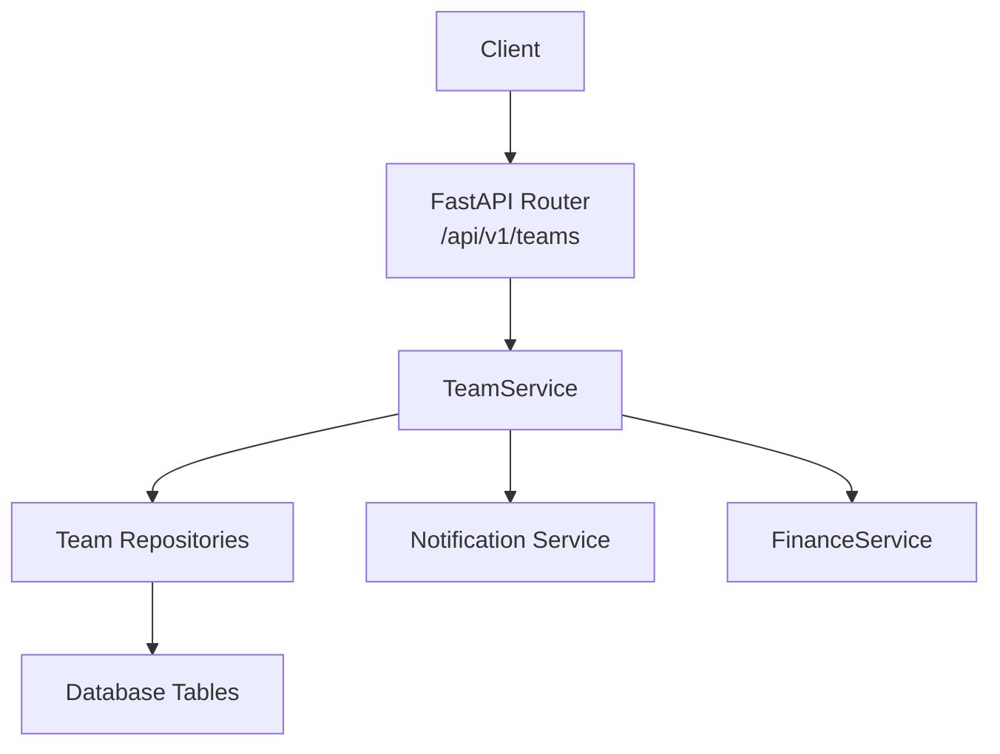
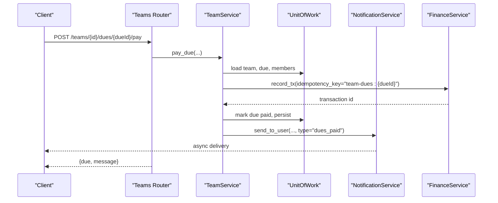
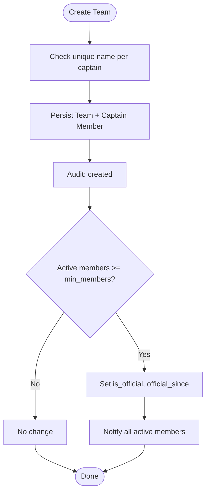
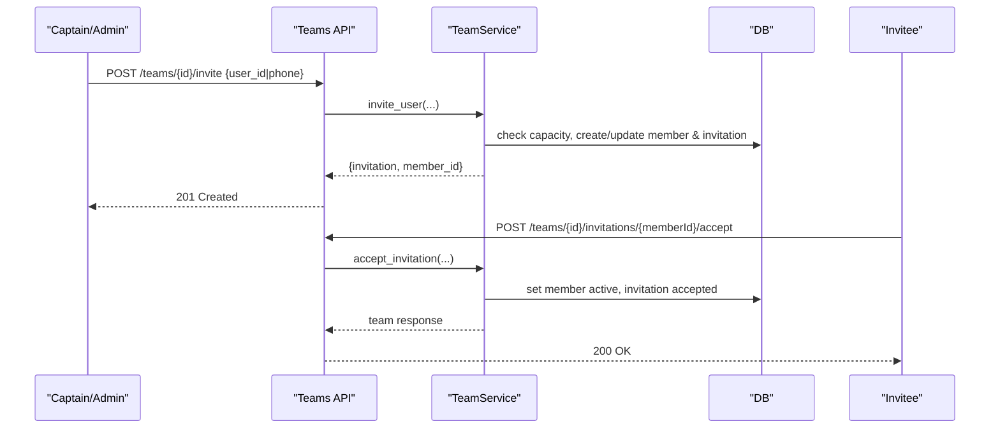
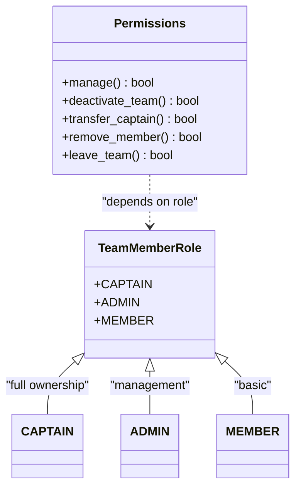
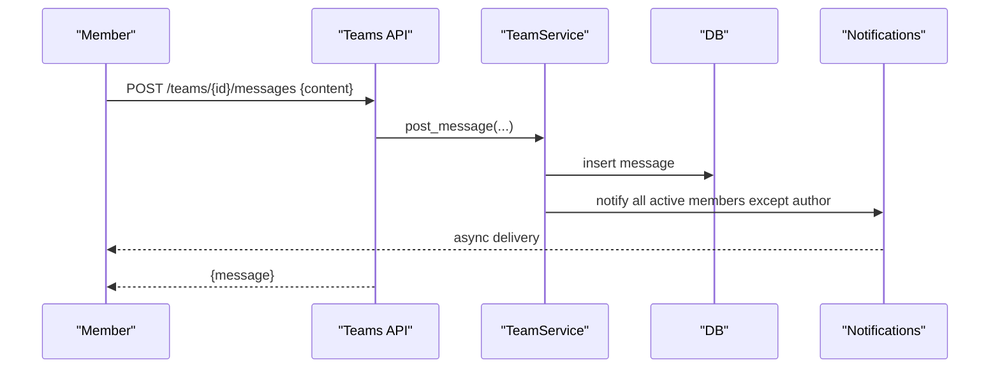
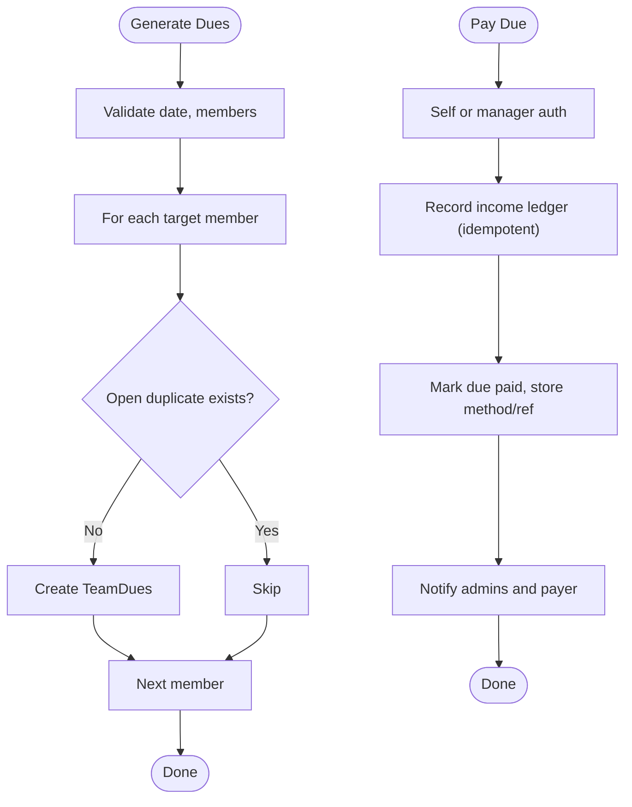
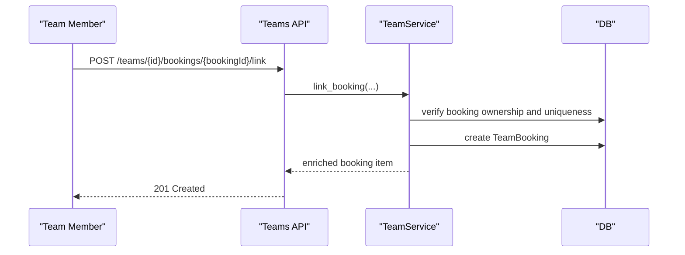
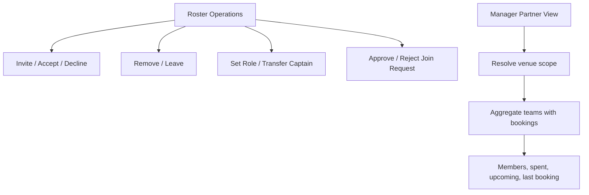
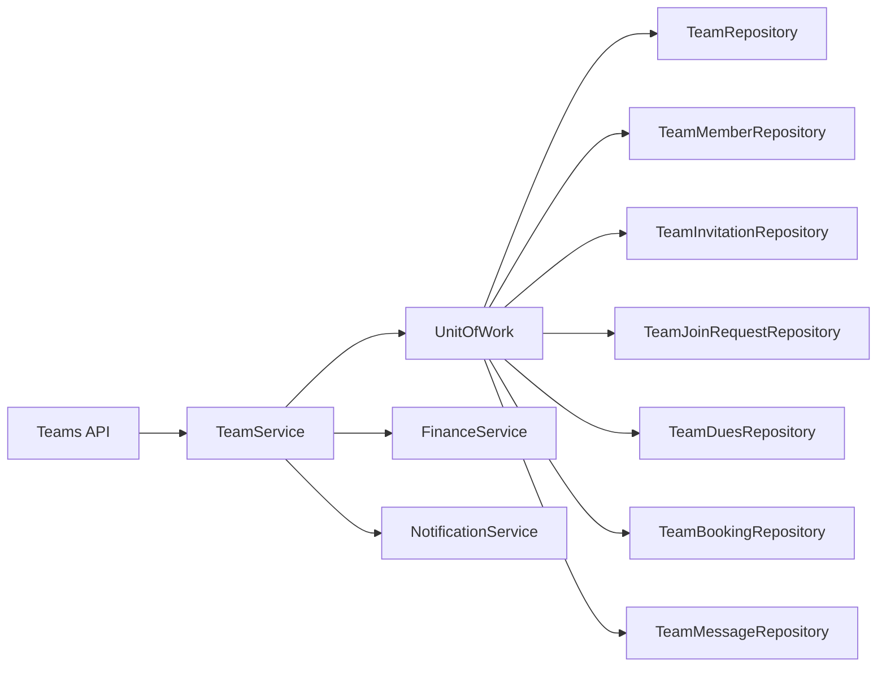

# Team Management

<cite>
**Referenced Files in This Document**
- [teams.py](file://app/api/v1/teams.py)
- [team_service.py](file://app/services/team_service.py)
- [team_repository.py](file://app/repositories/team_repository.py)
- [team.py](file://app/models/team.py)
- [transaction.py](file://app/models/transaction.py)
- [test_teams_crud.py](file://tests/test_teams_crud.py)
- [test_teams_dues.py](file://tests/test_teams_dues.py)
- [test_teams_manager_partners.py](file://tests/test_teams_manager_partners.py)
- [test_teams_official_chat.py](file://tests/test_teams_official_chat.py)
</cite>

## Table of Contents
1. Introduction
2. Project Structure
3. Core Components
4. Architecture Overview
5. Detailed Component Analysis
6. Dependency Analysis
7. Performance Considerations
8. Troubleshooting Guide
9. Conclusion

## Introduction
This document explains the Team Management module for the futsal booking system backend. It covers team creation, member invitations and join requests, role-based access control, official chat, dues calculation and payment tracking, team bookings, staff management (captain/admin roles), financial operations, hierarchy and permission inheritance, and real-time notification fan-out. It also provides practical workflows such as onboarding a new member, assigning permissions, and managing team finances.

## Project Structure
The module is implemented across API routes, service logic, repositories, models, and tests:
- API layer exposes REST endpoints for teams, members, dues, bookings, audit, and chat.
- Service layer implements business rules, permissions, notifications, and financial integration.
- Repository layer encapsulates SQL queries and data access patterns.
- Models define persistent entities and enums for teams, members, invitations, dues, messages, and transactions.
- Tests validate CRUD, dues lifecycle, manager partner view, and chat behavior.



**Diagram sources**
- [teams.py:36-44](file://app/api/v1/teams.py#L36-L44)
- [team_service.py:187-212](file://app/services/team_service.py#L187-L212)
- [team_repository.py:22-60](file://app/repositories/team_repository.py#L22-L60)
- [team_service.py:859-877](file://app/services/team_service.py#L859-L877)
- [team_service.py:967-1026](file://app/services/team_service.py#L967-L1026)

**Section sources**
- [teams.py:1-422](file://app/api/v1/teams.py#L1-L422)
- [team_service.py:1-1213](file://app/services/team_service.py#L1-L1213)
- [team_repository.py:1-403](file://app/repositories/team_repository.py#L1-L403)
- [team.py:1-240](file://app/models/team.py#L1-L240)
- [transaction.py:1-119](file://app/models/transaction.py#L1-L119)

## Core Components
- Team entity with visibility, official status, and minimum member quota.
- Member roles: captain (owner), admin (manager), member.
- Invitation flow for direct invites to registered users; join request flow for public teams.
- Dues generation per active member, payment recording into ledger, voiding by managers.
- Team bookings linking existing reservations to a team’s history.
- Official chat with pagination, unread counts, and read marking.
- Audit events for all significant team actions.
- Manager partner view aggregating team activity at venues managed by venue managers.

**Section sources**
- [team.py:27-84](file://app/models/team.py#L27-L84)
- [team.py:88-240](file://app/models/team.py#L88-L240)
- [team_service.py:158-183](file://app/services/team_service.py#L158-L183)
- [team_service.py:389-454](file://app/services/team_service.py#L389-L454)
- [team_service.py:661-751](file://app/services/team_service.py#L661-L751)
- [team_service.py:880-929](file://app/services/team_service.py#L880-L929)
- [team_service.py:967-1026](file://app/services/team_service.py#L967-L1026)
- [team_service.py:1084-1145](file://app/services/team_service.py#L1084-L1145)
- [team_service.py:798-855](file://app/services/team_service.py#L798-L855)

## Architecture Overview
The API routes delegate to TeamService methods that enforce permissions, update state, record audits, and emit notifications. Financial operations integrate with FinanceService to create append-only ledger entries. Data access is centralized in repositories using SQLModel/SQLAlchemy.



**Diagram sources**
- [teams.py:303-315](file://app/api/v1/teams.py#L303-L315)
- [team_service.py:967-1026](file://app/services/team_service.py#L967-L1026)
- [team_service.py:859-877](file://app/services/team_service.py#L859-L877)

**Section sources**
- [teams.py:1-422](file://app/api/v1/teams.py#L1-L422)
- [team_service.py:1-1213](file://app/services/team_service.py#L1-L1213)

## Detailed Component Analysis

### Team Creation, Visibility, and Official Status
- Team creation sets the creator as captain and active member, records an audit event, and triggers official status check based on min_members.
- Visibility controls discoverability and access: private requires membership or pending invitation; public is discoverable.
- Official status becomes true once active members meet or exceed min_members; it is idempotent and notifies all active members.



**Diagram sources**
- [team_service.py:187-212](file://app/services/team_service.py#L187-L212)
- [team_service.py:158-183](file://app/services/team_service.py#L158-L183)

**Section sources**
- [team_service.py:187-212](file://app/services/team_service.py#L187-L212)
- [team_service.py:158-183](file://app/services/team_service.py#L158-L183)
- [team.py:27-105](file://app/models/team.py#L27-L105)
- [test_teams_crud.py:28-73](file://tests/test_teams_crud.py#L28-L73)
- [test_teams_official_chat.py:66-110](file://tests/test_teams_official_chat.py#L66-L110)

### Member Invitation System and Join Requests
- Direct invitations target registered users via user_id or phone; capacity checks apply; invitations can expire.
- Acceptance transitions member to active and updates invitation status; admins are notified.
- Decline marks member declined and revokes invitation if needed.
- Public teams allow join requests; captains/admins approve or reject, optionally creating or activating membership.



**Diagram sources**
- [team_service.py:389-454](file://app/services/team_service.py#L389-L454)
- [team_service.py:470-499](file://app/services/team_service.py#L470-L499)
- [teams.py:139-172](file://app/api/v1/teams.py#L139-L172)

**Section sources**
- [team_service.py:389-454](file://app/services/team_service.py#L389-L454)
- [team_service.py:470-499](file://app/services/team_service.py#L470-L499)
- [team_service.py:661-751](file://app/services/team_service.py#L661-L751)
- [teams.py:139-271](file://app/api/v1/teams.py#L139-L271)
- [test_teams_crud.py:108-130](file://tests/test_teams_crud.py#L108-L130)

### Role-Based Access Control and Hierarchy
- Roles: captain (owner), admin (manager), member.
- Permission checks:
  - Manage operations require captain or admin.
  - Only captain can deactivate team or transfer captaincy.
  - Regular members cannot remove admins; only captain can remove admins.
  - Members can leave; captains must transfer first.
- Permission inheritance: admin inherits manage capabilities; captain has full ownership.



**Diagram sources**
- [team.py:33-36](file://app/models/team.py#L33-L36)
- [team_service.py:88-97](file://app/services/team_service.py#L88-L97)
- [team_service.py:522-585](file://app/services/team_service.py#L522-L585)
- [team_service.py:587-623](file://app/services/team_service.py#L587-L623)
- [team_service.py:625-658](file://app/services/team_service.py#L625-L658)

**Section sources**
- [team_service.py:88-97](file://app/services/team_service.py#L88-L97)
- [team_service.py:522-658](file://app/services/team_service.py#L522-L658)
- [teams.py:175-224](file://app/api/v1/teams.py#L175-L224)

### Official Chat Functionality
- Messages are stored per team with cursor-based pagination (newest first).
- Unread count uses last_seen_message_at per member; authors’ own messages do not count as unread for themselves.
- Posting a message fans out notifications to other active members.



**Diagram sources**
- [team_service.py:820-838](file://app/services/team_service.py#L820-L838)
- [team_service.py:840-855](file://app/services/team_service.py#L840-L855)
- [teams.py:381-422](file://app/api/v1/teams.py#L381-L422)

**Section sources**
- [team_service.py:798-855](file://app/services/team_service.py#L798-L855)
- [teams.py:381-422](file://app/api/v1/teams.py#L381-L422)
- [test_teams_official_chat.py:115-198](file://tests/test_teams_official_chat.py#L115-L198)

### Dues Calculation, Payment Tracking, and Member Contributions
- Generate dues creates one entry per eligible member (active by default; optional subset).
- Duplicate prevention ensures same title+due_date per user does not create multiple open dues.
- Payment records an income ledger row with idempotency key “team-dues:{dueId}”; self-payment allowed for members; cash collection by managers only.
- Voiding is manager-only and disallowed for already-paid dues.
- Balance aggregates dues totals vs ledger account balance to compute net balance.



**Diagram sources**
- [team_service.py:880-929](file://app/services/team_service.py#L880-L929)
- [team_service.py:967-1026](file://app/services/team_service.py#L967-L1026)
- [team_repository.py:241-350](file://app/repositories/team_repository.py#L241-L350)
- [transaction.py:20-71](file://app/models/transaction.py#L20-L71)

**Section sources**
- [team_service.py:880-929](file://app/services/team_service.py#L880-L929)
- [team_service.py:948-1081](file://app/services/team_service.py#L948-L1081)
- [team_repository.py:241-350](file://app/repositories/team_repository.py#L241-L350)
- [transaction.py:20-71](file://app/models/transaction.py#L20-L71)
- [test_teams_dues.py:57-222](file://tests/test_teams_dues.py#L57-L222)

### Team Booking Capabilities
- Linking a booking to a team is allowed only by the booking owner who is an active team member.
- Each booking can be linked to at most one team; duplicates are prevented.
- Team booking list returns enriched details (venue, slot, status, payment amount).



**Diagram sources**
- [team_service.py:1084-1145](file://app/services/team_service.py#L1084-L1145)
- [teams.py:343-364](file://app/api/v1/teams.py#L343-L364)

**Section sources**
- [team_service.py:1084-1145](file://app/services/team_service.py#L1084-L1145)
- [teams.py:343-364](file://app/api/v1/teams.py#L343-L364)
- [test_teams_manager_partners.py:68-92](file://tests/test_teams_manager_partners.py#L68-L92)

### Staff Management: Manager Roles, Partner Permissions, and Roster
- Captains and admins manage roster: invite, remove, set roles, approve join requests.
- Venue managers have a read-only partner view aggregating teams with bookings at their venues, including spent amounts and upcoming counts.



**Diagram sources**
- [team_service.py:368-751](file://app/services/team_service.py#L368-L751)
- [team_service.py:1149-1213](file://app/services/team_service.py#L1149-L1213)
- [teams.py:80-90](file://app/api/v1/teams.py#L80-L90)

**Section sources**
- [team_service.py:368-751](file://app/services/team_service.py#L368-L751)
- [team_service.py:1149-1213](file://app/services/team_service.py#L1149-L1213)
- [teams.py:80-90](file://app/api/v1/teams.py#L80-L90)
- [test_teams_manager_partners.py:94-146](file://tests/test_teams_manager_partners.py#L94-L146)

### Real-Time Notifications and Audit Trail
- All significant actions emit structured notifications via NotificationService; some broadcast to all active team members.
- Audit events log actor, action, and JSON payload for traceability; ordered newest-first for managers.

```mermaid
sequenceDiagram
participant Actor as "Actor"
participant API as "Teams API"
participant Svc as "TeamService"
participant N as "NotificationService"
Actor->>API : Action (e.g., invite, pay, link)
API->>Svc : Business method
Svc->>N : send_to_user(...) or broadcast_team
N-->>Actor : Async delivery
Svc->>Svc : Log audit event
API-->>Actor : Response
```

**Diagram sources**
- [team_service.py:859-877](file://app/services/team_service.py#L859-L877)
- [team_service.py:131-139](file://app/services/team_service.py#L131-L139)
- [teams.py:367-376](file://app/api/v1/teams.py#L367-L376)

**Section sources**
- [team_service.py:131-139](file://app/services/team_service.py#L131-L139)
- [team_service.py:859-877](file://app/services/team_service.py#L859-L877)
- [teams.py:367-376](file://app/api/v1/teams.py#L367-L376)
- [test_teams_manager_partners.py:148-176](file://tests/test_teams_manager_partners.py#L148-L176)

## Dependency Analysis
- API depends on TeamService for all business logic.
- TeamService depends on UnitOfWork to access repositories for teams, members, invitations, dues, messages, bookings, slots, venues, and users.
- Financial integration uses FinanceService to create immutable ledger rows with idempotency keys.
- Notifications depend on NotificationService for fan-out to specific users or all active team members.
- Repositories implement efficient batched queries and aggregations to avoid N+1 issues.



**Diagram sources**
- [team_service.py:1-42](file://app/services/team_service.py#L1-L42)
- [team_repository.py:22-403](file://app/repositories/team_repository.py#L22-L403)
- [team_service.py:859-877](file://app/services/team_service.py#L859-L877)
- [team_service.py:967-1026](file://app/services/team_service.py#L967-L1026)

**Section sources**
- [team_service.py:1-42](file://app/services/team_service.py#L1-L42)
- [team_repository.py:22-403](file://app/repositories/team_repository.py#L22-L403)

## Performance Considerations
- Use server-side COUNT for member quotas and lists to avoid loading large datasets.
- Batch enrichment queries (e.g., captain names, user names) to reduce N+1 calls.
- Cursor-based pagination for chat messages minimizes payload size and supports infinite scroll.
- Idempotent payment processing prevents duplicate ledger entries under retries.
- Efficient aggregation for manager partner view uses joins and group-by to compute metrics in single queries.

[No sources needed since this section provides general guidance]

## Troubleshooting Guide
Common errors and resolutions:
- TEAM_NAME_TAKEN: Choose a different team name per captain.
- PRIVATE_TEAM: Ensure you are a member or have a pending invitation; adjust visibility if appropriate.
- NOT_A_MEMBER / NOT_AUTHORIZED: Verify your role and status; only captains/admins can perform management actions.
- ALREADY_MEMBER / ALREADY_PENDING: Avoid duplicate invites or joining when already a member.
- INVITE_EXPIRED: Re-invite the user if the invitation has expired.
- DUE_ALREADY_PAID / DUE_VOIDED: Cannot pay or void again; use adjustments in ledger for corrections.
- BOOKING_LINKED_ELSEWHERE: A booking can be linked to only one team; unlink or choose another team.

**Section sources**
- [team_service.py:187-212](file://app/services/team_service.py#L187-L212)
- [team_service.py:389-454](file://app/services/team_service.py#L389-L454)
- [team_service.py:470-499](file://app/services/team_service.py#L470-L499)
- [team_service.py:967-1026](file://app/services/team_service.py#L967-L1026)
- [team_service.py:1084-1145](file://app/services/team_service.py#L1084-L1145)

## Conclusion
The Team Management module provides a robust foundation for organizing teams, managing members and permissions, facilitating communication, and handling finances through a clear separation of concerns. The design emphasizes security, auditability, and scalability with idempotent financial operations, efficient data access, and comprehensive testing coverage.

[No sources needed since this section summarizes without analyzing specific files]