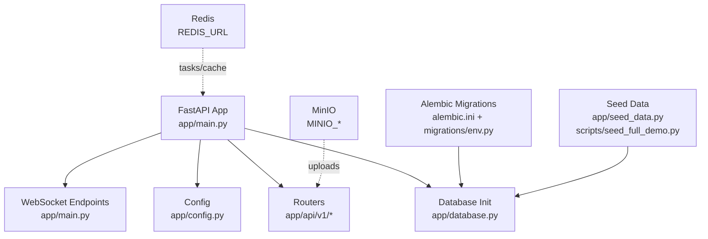
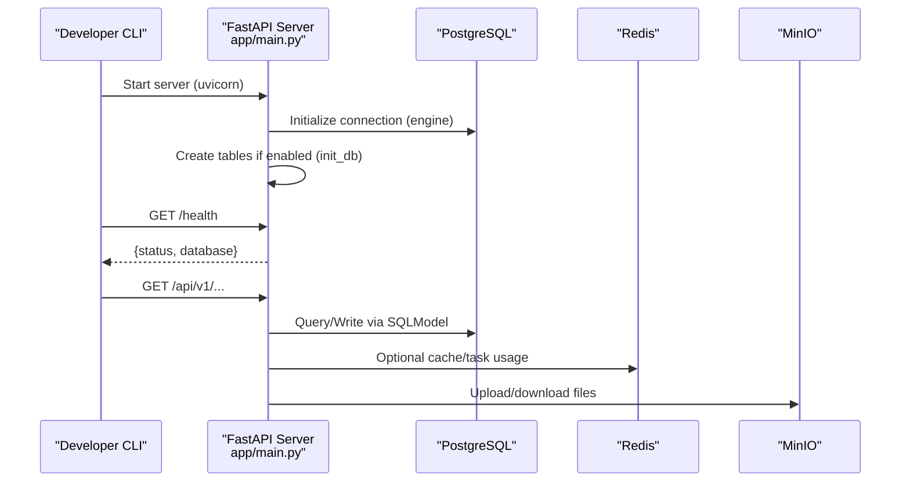
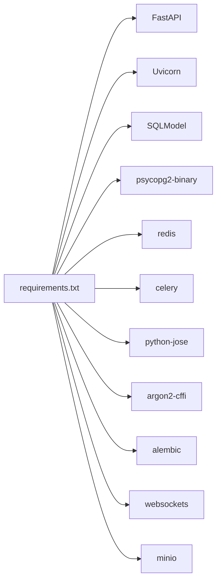

# Getting Started

<cite>
**Referenced Files in This Document**
- [app/config.py](file://app/config.py)
- [app/database.py](file://app/database.py)
- [app/main.py](file://app/main.py)
- [requirements.txt](file://requirements.txt)
- [Dockerfile](file://Dockerfile)
- [Dockerfile.celery](file://Dockerfile.celery)
- [alembic.ini](file://alembic.ini)
- [migrations/env.py](file://migrations/env.py)
- [app/seed_data.py](file://app/seed_data.py)
- [scripts/seed_full_demo.py](file://scripts/seed_full_demo.py)
- [.env.example](file://.env.example)
- [.env](file://.env)
</cite>

## Table of Contents
1. Introduction
2. Project Structure
3. Core Components
4. Architecture Overview
5. Detailed Component Analysis
6. Dependency Analysis
7. Performance Considerations
8. Troubleshooting Guide
9. Conclusion
10. Appendices

## Introduction
This guide helps you set up and run the Futsal Booking System locally or with Docker. It covers environment configuration, PostgreSQL database setup, Redis, MinIO storage, dependency installation, migrations, seed data, running the API server and Celery worker, testing connectivity, and verifying endpoints.

## Project Structure
The backend is a FastAPI application using SQLModel for ORM, Alembic for migrations, Redis for caching/tasks, and MinIO for object storage. The app exposes REST APIs under /api/v1, WebSocket endpoints for real-time features, and a health check endpoint.

**Diagram sources**
- [app/main.py:51-76](file://app/main.py#L51-L76)
- [app/config.py:4-68](file://app/config.py#L4-L68)
- [app/database.py:9-33](file://app/database.py#L9-L33)
- [alembic.ini:1-5](file://alembic.ini#L1-L5)
- [migrations/env.py:20-30](file://migrations/env.py#L20-L30)

**Section sources**
- [app/main.py:51-76](file://app/main.py#L51-L76)
- [app/config.py:4-68](file://app/config.py#L4-L68)
- [app/database.py:9-33](file://app/database.py#L9-L33)
- [alembic.ini:1-5](file://alembic.ini#L1-L5)
- [migrations/env.py:20-30](file://migrations/env.py#L20-L30)

## Core Components
- Configuration: Centralized settings loaded from environment variables and .env file.
- Database: SQLAlchemy engine via SQLModel; auto-create tables in development unless disabled.
- API: FastAPI app with routers mounted under /api/v1 and a health endpoint.
- Migrations: Alembic configured to use DATABASE_URL from env or alembic.ini.
- Seeders: Two seed scripts for demo data (simple and full).
- Storage: MinIO configuration for uploads.
- Background tasks: Celery worker image provided.

Key responsibilities:
- app/config.py: Defines all runtime settings including DB, Redis, JWT, CORS, MinIO, and feature flags.
- app/database.py: Creates engine and init_db based on APP_ENV and AUTO_CREATE_ALL.
- app/main.py: Wires middleware, routers, WebSocket endpoints, and health check.
- alembic.ini + migrations/env.py: Configure migration target and URL resolution.
- app/seed_data.py and scripts/seed_full_demo.py: Populate initial users, venues, slots, bookings, teams, finance, games, etc.

**Section sources**
- [app/config.py:4-68](file://app/config.py#L4-L68)
- [app/database.py:9-33](file://app/database.py#L9-L33)
- [app/main.py:168-210](file://app/main.py#L168-L210)
- [alembic.ini:1-5](file://alembic.ini#L1-L5)
- [migrations/env.py:20-30](file://migrations/env.py#L20-L30)
- [app/seed_data.py:33-326](file://app/seed_data.py#L33-L326)
- [scripts/seed_full_demo.py:94-115](file://scripts/seed_full_demo.py#L94-L115)

## Architecture Overview
The system runs as a FastAPI service backed by PostgreSQL, optionally using Redis for caching and background jobs, and MinIO for file storage. Alembic manages schema changes; seeders populate sample data.

**Diagram sources**
- [app/main.py:39-56](file://app/main.py#L39-L56)
- [app/database.py:9-33](file://app/database.py#L9-L33)
- [app/config.py:4-68](file://app/config.py#L4-L68)

## Detailed Component Analysis

### Environment Variables and Configuration
- All settings are defined in the Settings class and loaded from .env when present.
- Important keys include DATABASE_URL, REDIS_URL, JWT_* options, ADMIN credentials, CORS origins, MinIO settings, and feature toggles like APP_ENV and AUTO_CREATE_ALL.

What to configure:
- DATABASE_URL: PostgreSQL connection string.
- REDIS_URL: Redis connection string.
- JWT_SECRET, JWT_ALGORITHM, JWT_EXPIRY_HOURS: Authentication tokens.
- ALLOWED_ORIGINS: CORS policy for frontend clients.
- MINIO_ENDPOINT, MINIO_ACCESS_KEY, MINIO_SECRET_KEY, MINIO_BUCKET, MINIO_SECURE, MINIO_PUBLIC_URL: Object storage.
- APP_ENV and AUTO_CREATE_ALL: Control whether tables are auto-created at startup.

Where to set:
- Use .env for local development; .env.example shows required keys.
- In production, prefer environment variables injected by your platform.

**Section sources**
- [app/config.py:4-68](file://app/config.py#L4-L68)
- [.env.example:1-32](file://.env.example#L1-L32)
- [.env:1-31](file://.env#L1-L31)

### Database Setup (PostgreSQL)
- Engine creation and session handling are centralized in the database module.
- In development (APP_ENV not production), tables can be created automatically unless AUTO_CREATE_ALL is false.
- For production or strict control, use Alembic migrations only.

Steps:
1. Ensure PostgreSQL is running and accessible at the host/port in DATABASE_URL.
2. Create a database named futsal_db (or adjust DATABASE_URL accordingly).
3. Run migrations to create/update schema.
4. Optionally seed data for quick start.

Migrations:
- Alembic reads DATABASE_URL from environment if set; otherwise uses alembic.ini.
- Target metadata includes all SQLModel models.

**Section sources**
- [app/database.py:9-33](file://app/database.py#L9-L33)
- [alembic.ini:1-5](file://alembic.ini#L1-L5)
- [migrations/env.py:20-30](file://migrations/env.py#L20-L30)

### Redis Setup
- Set REDIS_URL in your environment to connect to a running Redis instance.
- Used by services and potentially Celery workers for background tasks.

Verification:
- Confirm connectivity by starting the API and ensuring no Redis-related errors appear in logs.
- If using Celery, ensure the worker can connect to the same REDIS_URL.

**Section sources**
- [app/config.py:4-68](file://app/config.py#L4-L68)
- [.env.example:4-5](file://.env.example#L4-L5)

### MinIO Storage Setup
- Configure MINIO_* variables to point to a running MinIO instance.
- Ensure the bucket exists or that the application has permissions to create it.
- MINIO_PUBLIC_URL should be reachable by clients for direct access to uploaded assets.

Verification:
- Upload an asset via the upload endpoint and confirm the returned public URL resolves.

**Section sources**
- [app/config.py:51-57](file://app/config.py#L51-L57)
- [.env:19-25](file://.env#L19-L25)

### Running Locally (Python)
Prerequisites:
- Python 3.11+
- PostgreSQL server
- Redis server (optional but recommended)
- MinIO server (optional for uploads)

Steps:
1. Install dependencies:
   - pip install -r requirements.txt
2. Configure environment:
   - Copy .env.example to .env and fill values (DATABASE_URL, REDIS_URL, JWT_*, MINIO_*, ALLOWED_ORIGINS).
3. Prepare database:
   - Create the database if needed.
   - Run Alembic migrations.
4. Seed data (optional):
   - Use the simple seeder or the full demo seeder to populate sample data.
5. Start the API server:
   - uvicorn app.main:app --host 0.0.0.0 --port 8000 --reload
6. Verify:
   - Open http://localhost:8000/docs for interactive API docs.
   - Call GET /health to check DB connectivity.

Notes:
- In development, tables may be auto-created if AUTO_CREATE_ALL is true and APP_ENV is not production.
- For strict schema management, set APP_ENV=production or AUTO_CREATE_ALL=false and rely on Alembic.

**Section sources**
- [requirements.txt:1-18](file://requirements.txt#L1-L18)
- [app/config.py:4-68](file://app/config.py#L4-L68)
- [app/database.py:20-33](file://app/database.py#L20-L33)
- [app/main.py:168-210](file://app/main.py#L168-L210)

### Running with Docker
Two images are provided:
- Main API server image
- Celery worker image

Steps:
1. Build images:
   - docker build -t futsal-api -f Dockerfile .
   - docker build -t futsal-celery -f Dockerfile.celery .
2. Run the API container:
   - docker run -p 8000:8000 --env-file .env futsal-api
3. Run the Celery worker container:
   - docker run --env-file .env futsal-celery
4. Verify:
   - Access http://localhost:8000/docs and GET /health.

Notes:
- Ensure DATABASE_URL and REDIS_URL point to services reachable from containers (e.g., postgres and redis hostnames in a compose network).
- MinIO must also be reachable from containers if used.

**Section sources**
- [Dockerfile:1-26](file://Dockerfile#L1-L26)
- [Dockerfile.celery:1-11](file://Dockerfile.celery#L1-L11)
- [.env:1-31](file://.env#L1-L31)

### Database Migrations
Use Alembic to manage schema changes:
- Migration script location is configured in alembic.ini.
- migrations/env.py sets target_metadata to SQLModel.metadata and resolves DATABASE_URL from environment.

Common commands:
- Generate a new migration after model changes.
- Apply pending migrations to the database.
- Downgrade to a previous revision if necessary.

Tip:
- When DATABASE_URL is set in the environment, Alembic will use it even if alembic.ini contains a different default.

**Section sources**
- [alembic.ini:1-5](file://alembic.ini#L1-L5)
- [migrations/env.py:20-30](file://migrations/env.py#L20-L30)

### Seed Data Loading
Two options:
- Simple seeder: app/seed_data.py creates basic users, venues, slots, bookings, and related entities.
- Full demo seeder: scripts/seed_full_demo.py builds a comprehensive dataset through the app’s unit of work and services, including finance, contracts, teams, games, and more.

Usage:
- Run the desired seeder after migrations have been applied.
- The full demo supports resetting the schema (destructive) and seeding into SQLite for quick tests.

Caution:
- Resetting drops all data except the Alembic version table. Use only on dev/demo databases.

**Section sources**
- [app/seed_data.py:33-326](file://app/seed_data.py#L33-L326)
- [scripts/seed_full_demo.py:94-115](file://scripts/seed_full_demo.py#L94-L115)

### Running the Application
Start the FastAPI server:
- Local: uvicorn app.main:app --host 0.0.0.0 --port 8000 --reload
- Docker: see Docker section above

Verify:
- Health check: GET /health
- Interactive docs: GET /docs

CORS:
- Allowed origins are read from settings and applied via middleware.

**Section sources**
- [app/main.py:58-76](file://app/main.py#L58-L76)
- [app/main.py:168-210](file://app/main.py#L168-L210)
- [app/config.py:45-49](file://app/config.py#L45-L49)

### Testing the Connection
- Health endpoint: GET /health returns status and database connectivity.
- Database: Ensure DATABASE_URL points to a reachable PostgreSQL instance.
- Redis: Ensure REDIS_URL points to a reachable Redis instance.
- MinIO: Ensure MINIO_* variables point to a reachable MinIO server and the bucket is accessible.

**Section sources**
- [app/main.py:168-175](file://app/main.py#L168-L175)
- [app/config.py:4-68](file://app/config.py#L4-L68)

### Verifying API Endpoints
- Open Swagger UI at http://localhost:8000/docs to explore available endpoints.
- Try GET /health to verify the server and database are healthy.
- Explore other endpoints under /api/v1 once authentication and data are set up.

**Section sources**
- [app/main.py:177-210](file://app/main.py#L177-L210)

## Dependency Analysis
Core runtime dependencies include FastAPI, Uvicorn, SQLModel, psycopg2-binary, Redis, Celery, Pydantic, Alembic, WebSockets, MinIO client, and others listed in requirements.

**Diagram sources**
- [requirements.txt:1-18](file://requirements.txt#L1-L18)

**Section sources**
- [requirements.txt:1-18](file://requirements.txt#L1-L18)

## Performance Considerations
- Database pool sizing is configured in the engine; tune pool_size and max_overflow according to workload.
- Disable AUTO_CREATE_ALL in production to avoid overhead and enforce migrations-only schema changes.
- Enable DB_ECHO selectively during development to debug queries; keep off in production.
- Use Redis for caching and background tasks to reduce synchronous load.
- Offload heavy operations to Celery workers where appropriate.

[No sources needed since this section provides general guidance]

## Troubleshooting Guide
Common issues and resolutions:
- Cannot connect to PostgreSQL:
  - Verify DATABASE_URL host, port, user, password, and database name.
  - Ensure the database exists and the user has privileges.
  - Check firewall/network rules if connecting remotely.
- Alembic fails to migrate:
  - Confirm DATABASE_URL is correctly set in environment or alembic.ini.
  - Ensure migrations/env.py can import app.models to register metadata.
- Tables missing at startup:
  - In development, AUTO_CREATE_ALL=true creates tables; set to false to rely on Alembic.
  - In production, create_all is skipped; always run migrations.
- Redis connection errors:
  - Verify REDIS_URL and that Redis is running and reachable.
- MinIO upload failures:
  - Check MINIO_ENDPOINT, MINIO_ACCESS_KEY, MINIO_SECRET_KEY, MINIO_BUCKET, and MINIO_SECURE.
  - Ensure MINIO_PUBLIC_URL is reachable by clients.
- CORS errors from frontend:
  - Update ALLOWED_ORIGINS to include your frontend URLs.

**Section sources**
- [app/database.py:20-33](file://app/database.py#L20-L33)
- [migrations/env.py:20-30](file://migrations/env.py#L20-L30)
- [app/config.py:4-68](file://app/config.py#L4-L68)

## Conclusion
You now have the essentials to set up, configure, and run the Futsal Booking System locally or with Docker. Use Alembic for schema management, seeders for quick data, and verify functionality via the health endpoint and Swagger UI. Adjust environment variables for your deployment targets and scale components as needed.

[No sources needed since this section summarizes without analyzing specific files]

## Appendices

### Quick Start Checklist
- Install dependencies: pip install -r requirements.txt
- Configure .env (DATABASE_URL, REDIS_URL, JWT_*, MINIO_*, ALLOWED_ORIGINS)
- Run migrations with Alembic
- Seed data (optional)
- Start API server with uvicorn
- Open /docs and test /health

**Section sources**
- [requirements.txt:1-18](file://requirements.txt#L1-L18)
- [.env.example:1-32](file://.env.example#L1-L32)
- [alembic.ini:1-5](file://alembic.ini#L1-L5)
- [app/seed_data.py:33-326](file://app/seed_data.py#L33-L326)
- [app/main.py:168-210](file://app/main.py#L168-L210)