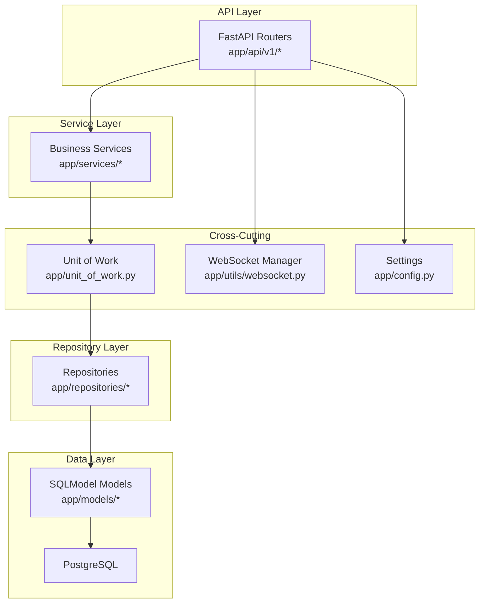
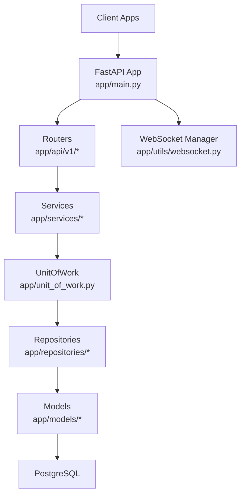
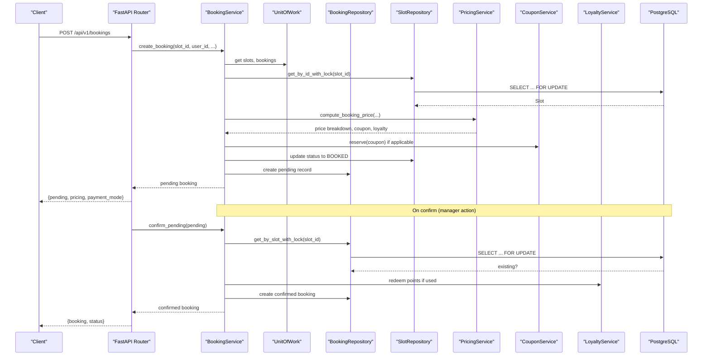
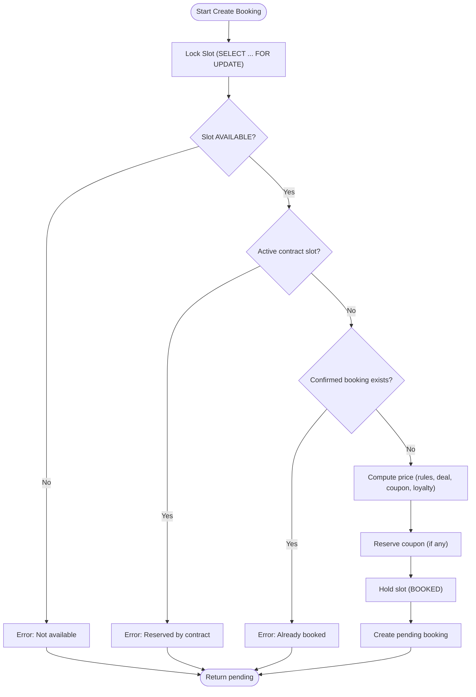
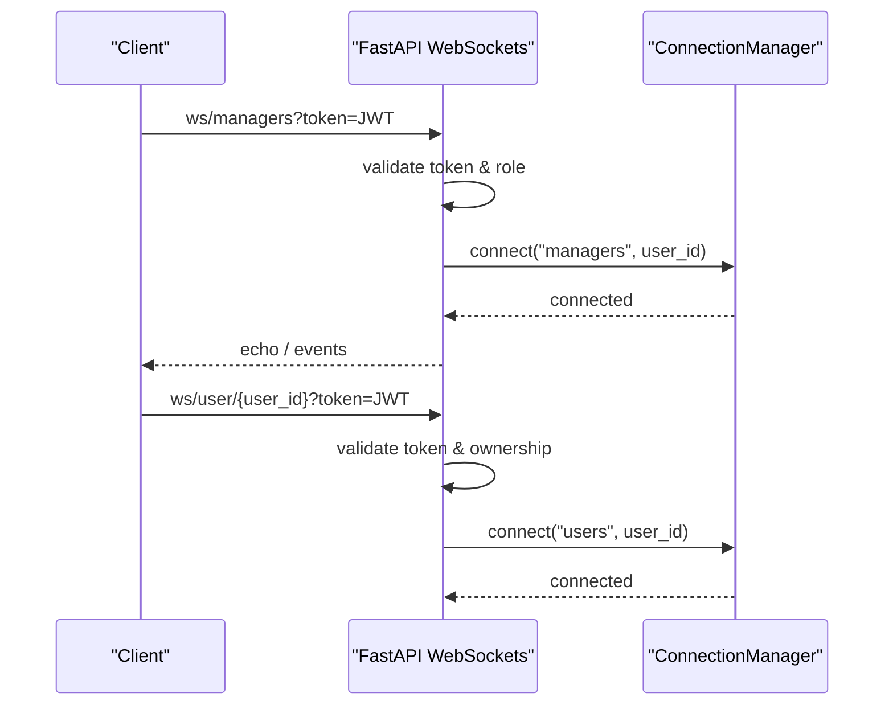
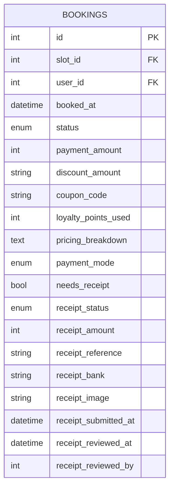
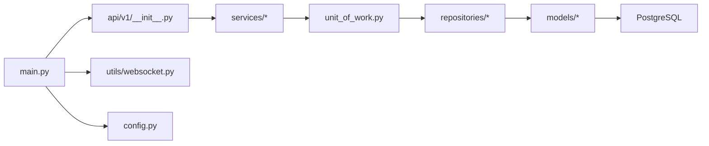

# Project Overview

<cite>
**Referenced Files in This Document**
- [main.py](file://app/main.py)
- [config.py](file://app/config.py)
- [database.py](file://app/database.py)
- [requirements.txt](file://requirements.txt)
- [Dockerfile](file://Dockerfile)
- [unit_of_work.py](file://app/unit_of_work.py)
- [base.py](file://app/repositories/base.py)
- [booking_service.py](file://app/services/booking_service.py)
- [booking_repository.py](file://app/repositories/booking_repository.py)
- [booking.py](file://app/models/booking.py)
- [websocket.py](file://app/utils/websocket.py)
- [__init__.py (API v1)](file://app/api/v1/__init__.py)
</cite>

## Table of Contents
1. Introduction
2. Project Structure
3. Core Components
4. Architecture Overview
5. Detailed Component Analysis
6. Dependency Analysis
7. Performance Considerations
8. Troubleshooting Guide
9. Conclusion

## Introduction
The Futsal Booking System is a comprehensive venue management platform that enables customers to discover venues, reserve time slots, and manage games, while empowering venue managers with tools for scheduling, contracts, pricing, finance, CRM, loyalty, teams, and real-time communication. The system is built on FastAPI with a clean architecture separating API routes, business services, repositories, and data models, backed by PostgreSQL via SQLModel and enhanced with Redis and Celery for background processing and caching needs. It serves two primary audiences:
- Venue managers and staff: schedule slots, manage contracts, process payments, run promotions, oversee teams and CRM campaigns, and monitor operations in real time.
- Customers: browse venues, book slots, join games, pay or submit receipts, use coupons and loyalty points, and communicate with teams and staff.

## Project Structure
The backend follows a layered, feature-oriented structure:
- API layer: FastAPI routers under app/api/v1 expose REST endpoints grouped by domain (auth, venues, slots, bookings, games, finance, CRM, teams, etc.).
- Service layer: Business logic encapsulated in app/services (e.g., booking, pricing, coupon, loyalty, notifications).
- Repository layer: Data access abstractions in app/repositories implementing CRUD and domain-specific queries over SQLModel sessions.
- Models layer: Domain entities defined in app/models (bookings, slots, users, venues, transactions, teams, etc.).
- Infrastructure: Database initialization, configuration, WebSocket manager, tasks (Celery), migrations (Alembic), and Docker packaging.

**Diagram sources**
- [main.py:16-24](file://app/main.py#L16-L24)
- [__init__.py (API v1):1-23](file://app/api/v1/__init__.py#L1-L23)
- [unit_of_work.py:38-302](file://app/unit_of_work.py#L38-L302)
- [base.py:8-108](file://app/repositories/base.py#L8-L108)
- [database.py:9-32](file://app/database.py#L9-L32)
- [websocket.py:12-65](file://app/utils/websocket.py#L12-L65)
- [config.py:4-68](file://app/config.py#L4-L68)

**Section sources**
- [main.py:16-24](file://app/main.py#L16-L24)
- [__init__.py (API v1):1-23](file://app/api/v1/__init__.py#L1-L23)
- [unit_of_work.py:38-302](file://app/unit_of_work.py#L38-L302)
- [base.py:8-108](file://app/repositories/base.py#L8-L108)
- [database.py:9-32](file://app/database.py#L9-L32)
- [websocket.py:12-65](file://app/utils/websocket.py#L12-L65)
- [config.py:4-68](file://app/config.py#L4-L68)

## Core Components
- Application entrypoint and routing: FastAPI app initializes lifespan, CORS, WebSocket endpoints, health check, and mounts all domain routers under /api/v1.
- Configuration: Centralized settings for database, Redis, JWT, storage, SMTP, and feature toggles.
- Database: Engine creation, session provider, and schema initialization controlled by environment flags.
- Unit of Work: Aggregates repositories per request/session, ensuring consistent commit/rollback semantics and lazy repository instantiation.
- Repositories: Generic base with common CRUD plus domain-specific methods; supports row-level locking to prevent race conditions.
- Services: Orchestrate multi-step workflows (e.g., booking lifecycle, pricing engine, coupon redemption, loyalty redemption).
- Real-time: WebSocket manager supports role-based rooms and user-scoped channels for live updates.

Key capabilities exposed include:
- Booking management: create pending bookings, confirm/cancel, receipt handling, slot reservation and release.
- Team collaboration: team membership, invitations, dues, official chat messages.
- Financial operations: transactions, expense categories, payment modes, ledger-backed flows.
- CRM: customer profiles, campaign limits, targeted outreach.
- Real-time communication: WebSocket rooms for managers/admins and per-user channels.

**Section sources**
- [main.py:39-210](file://app/main.py#L39-L210)
- [config.py:4-68](file://app/config.py#L4-L68)
- [database.py:9-32](file://app/database.py#L9-L32)
- [unit_of_work.py:38-302](file://app/unit_of_work.py#L38-L302)
- [base.py:8-108](file://app/repositories/base.py#L8-L108)
- [booking_service.py:14-200](file://app/services/booking_service.py#L14-L200)
- [websocket.py:12-65](file://app/utils/websocket.py#L12-L65)

## Architecture Overview
The system implements a clean architecture pattern with clear separation of concerns:
- API layer: Thin controllers delegating to services.
- Service layer: Business rules, orchestration, and cross-cutting concerns (pricing, coupons, loyalty).
- Repository layer: Data access abstraction with transactional boundaries via Unit of Work.
- Data layer: SQLModel models mapped to PostgreSQL; optional Redis/Celery for async tasks and caching.

**Diagram sources**
- [main.py:16-24](file://app/main.py#L16-L24)
- [unit_of_work.py:38-302](file://app/unit_of_work.py#L38-L302)
- [base.py:8-108](file://app/repositories/base.py#L8-L108)
- [websocket.py:12-65](file://app/utils/websocket.py#L12-L65)

## Detailed Component Analysis

### Booking Lifecycle (Create Pending → Confirm → Receipt Flow)
This sequence illustrates the core booking flow, including concurrency protection, pricing computation, coupon reservation, and receipt handling.

**Diagram sources**
- [booking_service.py:26-192](file://app/services/booking_service.py#L26-L192)
- [booking_repository.py:20-26](file://app/repositories/booking_repository.py#L20-L26)
- [base.py:37-40](file://app/repositories/base.py#L37-L40)

**Section sources**
- [booking_service.py:26-192](file://app/services/booking_service.py#L26-L192)
- [booking_repository.py:20-26](file://app/repositories/booking_repository.py#L20-L26)
- [base.py:37-40](file://app/repositories/base.py#L37-L40)

### Concurrency Protection and Race Conditions
- Row-level locking via SELECT ... FOR UPDATE ensures only one booking can claim a slot at a time.
- Duplicate checks are performed both on slot availability and existing confirmed bookings before creating a pending booking.
- Contract-slot protection prevents regular bookings on slots reserved by active contracts.

**Diagram sources**
- [booking_service.py:26-109](file://app/services/booking_service.py#L26-L109)
- [booking_repository.py:20-26](file://app/repositories/booking_repository.py#L20-L26)

**Section sources**
- [booking_service.py:26-109](file://app/services/booking_service.py#L26-L109)
- [booking_repository.py:20-26](file://app/repositories/booking_repository.py#L20-L26)

### Real-Time Communication (Role-Based Rooms and User Channels)
- Role-based rooms: managers and admins connect to dedicated rooms with JWT validation.
- Per-user channel: clients connect to a private channel identified by authenticated user_id.
- Connection manager tracks active connections and provides broadcast utilities.

**Diagram sources**
- [main.py:109-166](file://app/main.py#L109-L166)
- [websocket.py:12-65](file://app/utils/websocket.py#L12-L65)

**Section sources**
- [main.py:109-166](file://app/main.py#L109-L166)
- [websocket.py:12-65](file://app/utils/websocket.py#L12-L65)

### Data Model Highlights (Bookings)
- Bookings capture slot, user, amounts, discounts, coupon usage, loyalty points, pricing breakdown, payment mode snapshot, and receipt workflow states.
- Statuses support a full lifecycle from pending to completed, with explicit receipt approval/rejection flows.

**Diagram sources**
- [booking.py:7-51](file://app/models/booking.py#L7-L51)

**Section sources**
- [booking.py:7-51](file://app/models/booking.py#L7-L51)

## Dependency Analysis
- API depends on routers grouped by domain; routers depend on services for business logic.
- Services depend on Unit of Work to access repositories consistently within a transaction boundary.
- Repositories depend on SQLModel Session and models; they implement shared behavior via BaseRepository.
- Configuration drives database URL, Redis URL, JWT parameters, and feature toggles.
- Docker image packages dependencies and runs uvicorn with reload for development.

**Diagram sources**
- [main.py:16-24](file://app/main.py#L16-L24)
- [__init__.py (API v1):1-23](file://app/api/v1/__init__.py#L1-L23)
- [unit_of_work.py:38-302](file://app/unit_of_work.py#L38-L302)
- [base.py:8-108](file://app/repositories/base.py#L8-L108)
- [config.py:4-68](file://app/config.py#L4-L68)

**Section sources**
- [main.py:16-24](file://app/main.py#L16-L24)
- [__init__.py (API v1):1-23](file://app/api/v1/__init__.py#L1-L23)
- [unit_of_work.py:38-302](file://app/unit_of_work.py#L38-L302)
- [base.py:8-108](file://app/repositories/base.py#L8-L108)
- [config.py:4-68](file://app/config.py#L4-L68)

## Performance Considerations
- Use row-level locks (SELECT ... FOR UPDATE) for critical sections like slot reservation and duplicate booking checks to avoid race conditions.
- Keep API handlers thin; delegate heavy computations (pricing, promotions, notifications) to services and background tasks where appropriate.
- Configure connection pooling and echo settings based on environment to balance throughput and observability.
- Leverage Redis and Celery for offloading non-critical work (notifications, reminders, analytics) to keep request paths fast.
- Cache read-heavy data (venues, slots, pricing rules) using Redis to reduce database load during peak hours.

[No sources needed since this section provides general guidance]

## Troubleshooting Guide
- Health check: Use the /health endpoint to verify service readiness and database connectivity.
- Common errors:
  - Slot not found or already booked: Indicates concurrency issues or stale client state; re-check slot availability.
  - Slot reserved by active contract: Regular bookings cannot override contract-reserved slots.
  - Invalid or expired token on WebSocket: Ensure JWT is valid and role matches room permissions.
- Debugging tips:
  - Enable DB query echo via configuration to inspect generated SQL.
  - Review unit of work boundaries to ensure proper commit/rollback behavior.
  - Inspect WebSocket connection manager logs for disconnects and failed sends.

**Section sources**
- [main.py:169-175](file://app/main.py#L169-L175)
- [database.py:20-32](file://app/database.py#L20-L32)
- [websocket.py:22-65](file://app/utils/websocket.py#L22-L65)

## Conclusion
The Futsal Booking System provides a robust, scalable foundation for managing futsal venues with strong separation of concerns, safe concurrency controls, and rich features spanning bookings, teams, finance, CRM, loyalty, and real-time communication. Its clean architecture, powered by FastAPI, SQLModel, PostgreSQL, Redis, and Celery, supports both operational efficiency for venue managers and a seamless experience for customers.

[No sources needed since this section summarizes without analyzing specific files]