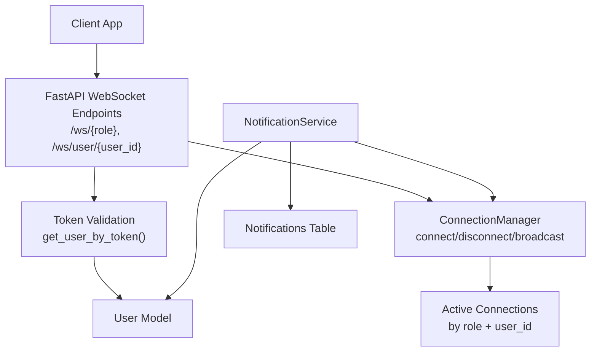
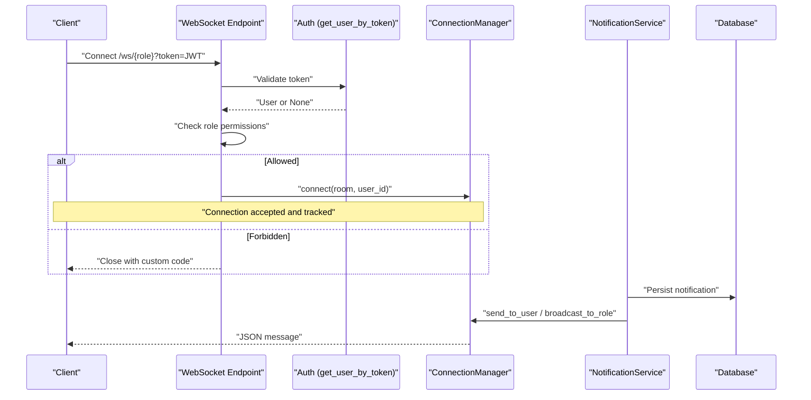
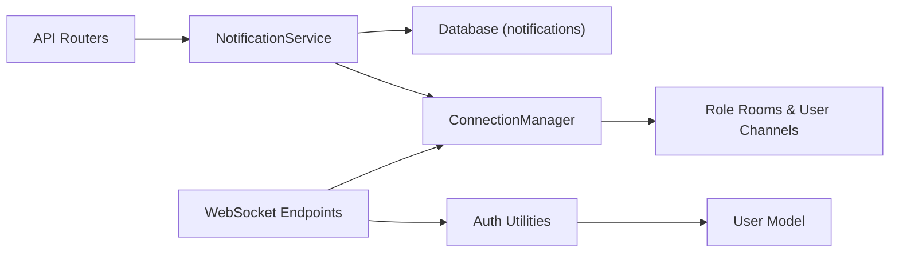

# Real-time Communication

<cite>
**Referenced Files in This Document**
- [main.py](file://app/main.py)
- [websocket.py](file://app/utils/websocket.py)
- [notification_service.py](file://app/services/notification_service.py)
- [auth.py](file://app/utils/auth.py)
- [user.py](file://app/models/user.py)
- [notification.py](file://app/models/notification.py)
- [rate_limit.py](file://app/utils/rate_limit.py)
- [config.py](file://app/config.py)
</cite>

## Table of Contents
1. [Introduction](#introduction)
2. [Project Structure](#project-structure)
3. [Core Components](#core-components)
4. [Architecture Overview](#architecture-overview)
5. [Detailed Component Analysis](#detailed-component-analysis)
6. [Dependency Analysis](#dependency-analysis)
7. [Performance Considerations](#performance-considerations)
8. [Troubleshooting Guide](#troubleshooting-guide)
9. [Conclusion](#conclusion)
10. [Appendices](#appendices)

## Introduction
This document explains the real-time communication system built with WebSockets in the backend. It covers connection management, role-based rooms, personal user channels, notification broadcasting, event patterns, lifecycle handling, error handling, reconnection strategies, message serialization, and security considerations such as token validation, room permissions, and rate limiting for sensitive endpoints.

## Project Structure
The WebSocket subsystem is implemented across a few focused modules:
- FastAPI endpoints define WebSocket routes and enforce authentication and authorization.
- A ConnectionManager maintains active connections grouped by roles and users.
- A NotificationService persists notifications to the database and broadcasts them via WebSockets.
- Authentication utilities validate JWT tokens passed through query parameters on WebSocket connections.
- Models define users and notifications used throughout the flow.
- Rate limiting utilities protect sensitive HTTP endpoints (useful context for overall security posture).

**Diagram sources**
- [main.py:109-166](file://app/main.py#L109-L166)
- [websocket.py:12-65](file://app/utils/websocket.py#L12-L65)
- [notification_service.py:12-105](file://app/services/notification_service.py#L12-L105)
- [auth.py:70-83](file://app/utils/auth.py#L70-L83)
- [user.py:7-24](file://app/models/user.py#L7-L24)
- [notification.py:6-18](file://app/models/notification.py#L6-L18)

**Section sources**
- [main.py:109-166](file://app/main.py#L109-L166)
- [websocket.py:12-65](file://app/utils/websocket.py#L12-L65)
- [notification_service.py:12-105](file://app/services/notification_service.py#L12-L105)
- [auth.py:70-83](file://app/utils/auth.py#L70-L83)
- [user.py:7-24](file://app/models/user.py#L7-L24)
- [notification.py:6-18](file://app/models/notification.py#L6-L18)

## Core Components
- WebSocket Endpoints: Role-based rooms and personal user channels with strict access control.
- ConnectionManager: In-memory store of active connections per role and per user; supports broadcast and targeted delivery.
- NotificationService: Persists notifications and pushes updates to connected clients via WebSockets.
- Authentication: Validates JWT from query parameter and resolves the active user.
- Data Models: User and Notification entities used for RBAC checks and persistence.

Key responsibilities:
- Accept or reject WebSocket connections based on token validity and role permissions.
- Track connections by role and verified user_id to enable precise messaging.
- Persist notifications and deliver them in real time to relevant recipients.

**Section sources**
- [main.py:109-166](file://app/main.py#L109-L166)
- [websocket.py:12-65](file://app/utils/websocket.py#L12-L65)
- [notification_service.py:12-105](file://app/services/notification_service.py#L12-L105)
- [auth.py:70-83](file://app/utils/auth.py#L70-L83)
- [user.py:7-24](file://app/models/user.py#L7-L24)
- [notification.py:6-18](file://app/models/notification.py#L6-L18)

## Architecture Overview
The system uses FastAPI’s WebSocket support to create two types of channels:
- Role-based rooms: /ws/{role} where only authorized roles can connect (e.g., managers, admins). Super admin has broad access.
- Personal channel: /ws/user/{user_id} where only the owner or super admin can connect.

Authentication is performed by extracting the JWT from the query string and validating it using shared JWT logic. On success, the connection is registered with the ConnectionManager under the appropriate room and verified user_id. Notifications are persisted and then broadcast to the relevant rooms or users.

**Diagram sources**
- [main.py:109-166](file://app/main.py#L109-L166)
- [auth.py:70-83](file://app/utils/auth.py#L70-L83)
- [websocket.py:22-65](file://app/utils/websocket.py#L22-L65)
- [notification_service.py:50-105](file://app/services/notification_service.py#L50-L105)

## Detailed Component Analysis

### WebSocket Endpoints and Access Control
- Role-based endpoint: /ws/{role}
  - Validates token and ensures the user’s role matches allowed roles for that room.
  - Registers the connection with the verified user_id.
  - Echoes messages back until disconnect; cleans up on exit.
- Personal endpoint: /ws/user/{user_id}
  - Validates token and enforces ownership or super admin privilege.
  - Registers the connection into the “users” room with the verified user_id.
  - Echoes messages back until disconnect; cleans up on exit.

Access control rules:
- Only specific roles may join role-based rooms.
- Super admin can access all rooms.
- Personal channel requires ownership or super admin.

Error signaling:
- Custom close codes are used to indicate invalid token or forbidden access.

**Section sources**
- [main.py:30-36](file://app/main.py#L30-L36)
- [main.py:84-106](file://app/main.py#L84-L106)
- [main.py:109-166](file://app/main.py#L109-L166)

### ConnectionManager: Rooms, Targeting, and Broadcasts
- Tracks active connections per role and per user_id.
- Provides:
  - connect: accept and register connection with room and user_id.
  - disconnect: remove connection from room.
  - broadcast_to_role: send JSON to all connections in a role room.
  - broadcast_to_all: fan-out to all role rooms.
  - send_to_user: target all connections belonging to a verified user_id across rooms without duplicates.

Robustness:
- On send errors, failed connections are removed automatically.
- Uses id(connection) to avoid duplicate sends when a user is in multiple rooms.

**Section sources**
- [websocket.py:12-65](file://app/utils/websocket.py#L12-L65)

### NotificationService: Persistence and Real-time Delivery
- Persists each notification to the database with type, title, message, and payload.
- Sends real-time updates:
  - To a specific user via send_to_user.
  - To all managers via broadcast_to_role("managers").
  - To all admins via broadcast_to_role("admins").
- Domain-specific helpers encapsulate common events (bookings, contracts, competitions, etc.).

Message format:
- JSON payloads include fields like type, notif_type, title, message, data.

**Section sources**
- [notification_service.py:12-105](file://app/services/notification_service.py#L12-L105)
- [notification_service.py:109-190](file://app/services/notification_service.py#L109-L190)
- [notification.py:6-18](file://app/models/notification.py#L6-L18)

### Authentication and Token Handling for WebSockets
- Tokens are passed via query parameter because browsers do not send Authorization headers on WebSocket handshakes.
- Shared JWT decode and user resolution functions ensure consistent validation across HTTP and WebSocket paths.
- Active user check prevents inactive accounts from connecting.

Security notes:
- Token must be valid and correspond to an active user.
- Role checks prevent unauthorized room access.

**Section sources**
- [main.py:100-106](file://app/main.py#L100-L106)
- [auth.py:57-83](file://app/utils/auth.py#L57-L83)
- [user.py:7-24](file://app/models/user.py#L7-L24)

### Message Serialization and Types
- All WebSocket messages are serialized as JSON.
- The ConnectionManager uses send_json for structured payloads.
- Notification payloads follow a consistent schema with type, notif_type, title, message, and data.

Practical guidance:
- Clients should parse JSON and handle different message types based on the type field.
- For echo endpoints, clients can test connectivity by sending any text and expecting a response.

**Section sources**
- [websocket.py:33-65](file://app/utils/websocket.py#L33-L65)
- [notification_service.py:50-78](file://app/services/notification_service.py#L50-L78)

### Connection Lifecycle Management
- Acceptance: Handled by ConnectionManager.connect after successful auth and authorization.
- Read loop: Endpoints read text messages and echo responses.
- Disconnection: On WebSocketDisconnect or exceptions, connections are removed from their rooms.

Best practices:
- Always ensure disconnect is called in finally blocks to avoid leaks.
- Handle network errors gracefully; dead connections are pruned on send failures.

**Section sources**
- [main.py:128-166](file://app/main.py#L128-L166)
- [websocket.py:22-31](file://app/utils/websocket.py#L22-L31)

### Reconnection Strategies (Client-side Guidance)
- Detect connection close and reconnect with exponential backoff.
- Include a fresh JWT in the query parameter on reconnect.
- Subscribe to the same rooms/channels after reconnection.
- Use application-level heartbeat if needed to detect stale connections.

[No sources needed since this section provides general client-side guidance]

### Error Handling and Close Codes
- Invalid or missing token: custom close code indicates authentication failure.
- Unauthorized room access: custom close code indicates permission denied.
- Send failures: ConnectionManager removes broken connections automatically.

Operational tips:
- Clients should interpret close codes to decide whether to retry with new tokens or abort.
- Log server-side errors around WebSocket handlers for debugging.

**Section sources**
- [main.py:84-106](file://app/main.py#L84-L106)
- [websocket.py:33-65](file://app/utils/websocket.py#L33-L65)

### Security Considerations
- Token validation: JWT decoded and validated against configured secret and algorithm; user resolved from database.
- Room permissions: Role-based allowlist restricts which roles can join specific rooms.
- Ownership checks: Personal channel enforces user_id ownership or super admin override.
- Rate limiting: While WebSockets themselves are not rate-limited here, sensitive HTTP endpoints use Redis-based fixed-window rate limiting to mitigate abuse. Apply similar controls at gateway/proxy level for WebSocket endpoints if needed.

Configuration:
- JWT settings (secret, algorithm, expiry) are centralized in configuration.
- CORS is configured to allow specified origins.

**Section sources**
- [auth.py:45-83](file://app/utils/auth.py#L45-L83)
- [main.py:30-36](file://app/main.py#L30-L36)
- [rate_limit.py:42-70](file://app/utils/rate_limit.py#L42-L70)
- [config.py:4-10](file://app/config.py#L4-L10)
- [main.py:70-76](file://app/main.py#L70-L76)

## Dependency Analysis
The following diagram shows how components depend on each other during a typical notification flow.

**Diagram sources**
- [notification_service.py:50-105](file://app/services/notification_service.py#L50-L105)
- [websocket.py:22-65](file://app/utils/websocket.py#L22-L65)
- [auth.py:70-83](file://app/utils/auth.py#L70-L83)
- [user.py:7-24](file://app/models/user.py#L7-L24)

**Section sources**
- [notification_service.py:50-105](file://app/services/notification_service.py#L50-L105)
- [websocket.py:22-65](file://app/utils/websocket.py#L22-L65)
- [auth.py:70-83](file://app/utils/auth.py#L70-L83)
- [user.py:7-24](file://app/models/user.py#L7-L24)

## Performance Considerations
- In-memory connection tracking: Fast but limited to a single process. For horizontal scaling, consider a pub/sub backend (e.g., Redis) to share state across processes.
- Broadcasting cost: broadcast_to_all fans out to all role rooms; prefer targeted send_to_user or role-scoped broadcasts to reduce load.
- Database writes: NotificationService persists every notification; batch or debounce where appropriate to reduce write pressure.
- Connection churn: Ensure efficient cleanup on disconnect to avoid memory growth.

[No sources needed since this section provides general guidance]

## Troubleshooting Guide
Common issues and resolutions:
- Connection rejected immediately:
  - Check token presence and validity in query parameter.
  - Verify user is active and role permits room access.
- No messages received:
  - Confirm the client subscribed to the correct room/channel.
  - Ensure the sender targets the correct user_id or role.
- Intermittent drops:
  - Inspect network stability and proxy timeouts.
  - Implement client-side reconnection with backoff.
- High CPU/memory usage:
  - Reduce broadcast scope; prefer targeted messages.
  - Investigate long-running loops or excessive logging.

**Section sources**
- [main.py:84-106](file://app/main.py#L84-L106)
- [websocket.py:33-65](file://app/utils/websocket.py#L33-L65)

## Conclusion
The real-time system combines secure WebSocket endpoints, role-based rooms, and personal channels with a robust notification pipeline. Authentication and authorization are enforced at connection time, while the ConnectionManager enables scalable targeting and broadcasting. Notifications are both persisted and delivered in real time, ensuring reliability and visibility. For production-scale deployments, consider adding a distributed pub/sub layer and applying rate limiting at the edge for WebSocket endpoints.

[No sources needed since this section summarizes without analyzing specific files]

## Appendices

### Practical Implementation Examples

- Connecting to a role-based room:
  - Open a WebSocket to /ws/managers?token=<JWT>.
  - After acceptance, subscribe to manager notifications.
  - On disconnect, reconnect with a refreshed token.

- Connecting to a personal channel:
  - Open a WebSocket to /ws/user/{user_id}?token=<JWT>.
  - Only the owner or super admin can connect.
  - Receive direct notifications addressed to that user.

- Sending and receiving messages:
  - Send any text to echo endpoints for testing.
  - Parse JSON notifications and handle by type (e.g., user_notification, manager_notification, admin_notification).

- Managing concurrency:
  - Maintain one WebSocket per logical session.
  - Avoid blocking operations inside receive loops.
  - Use background tasks for heavy work before broadcasting.

[No sources needed since this section provides general guidance]