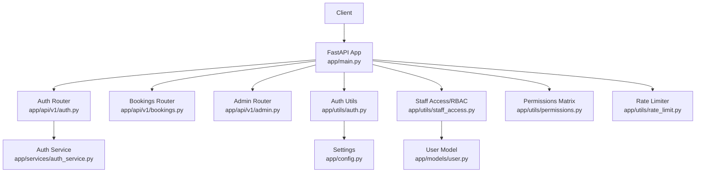
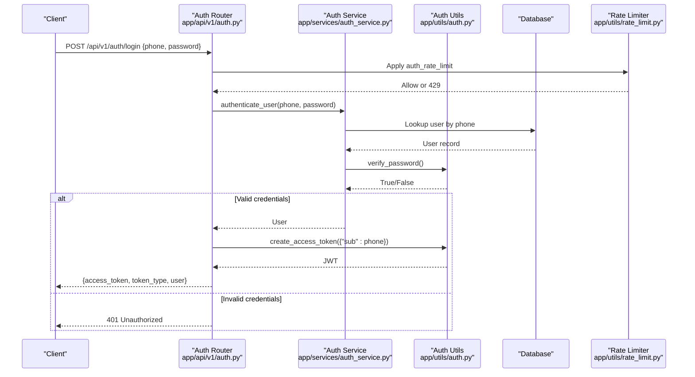
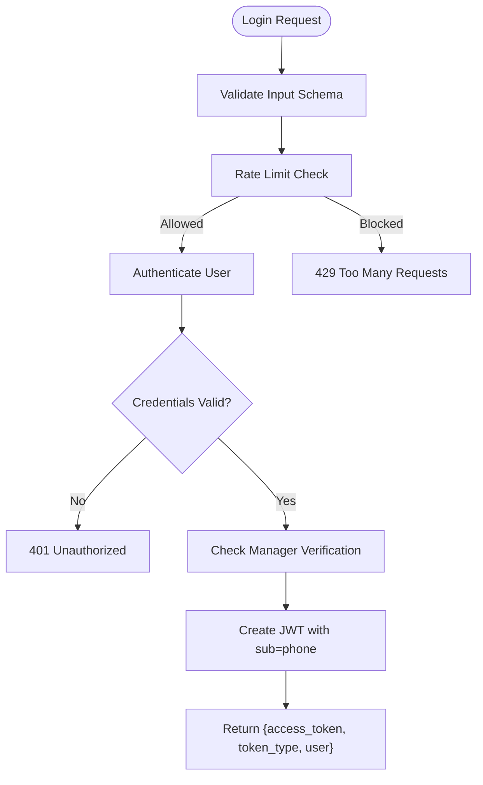
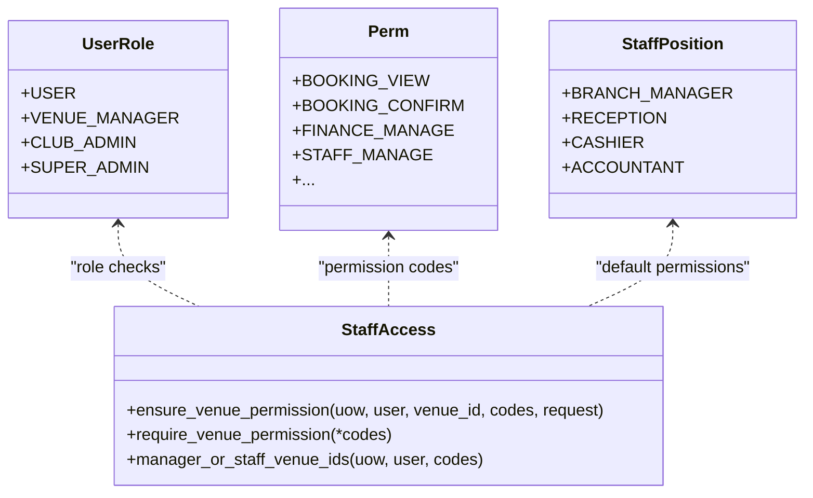
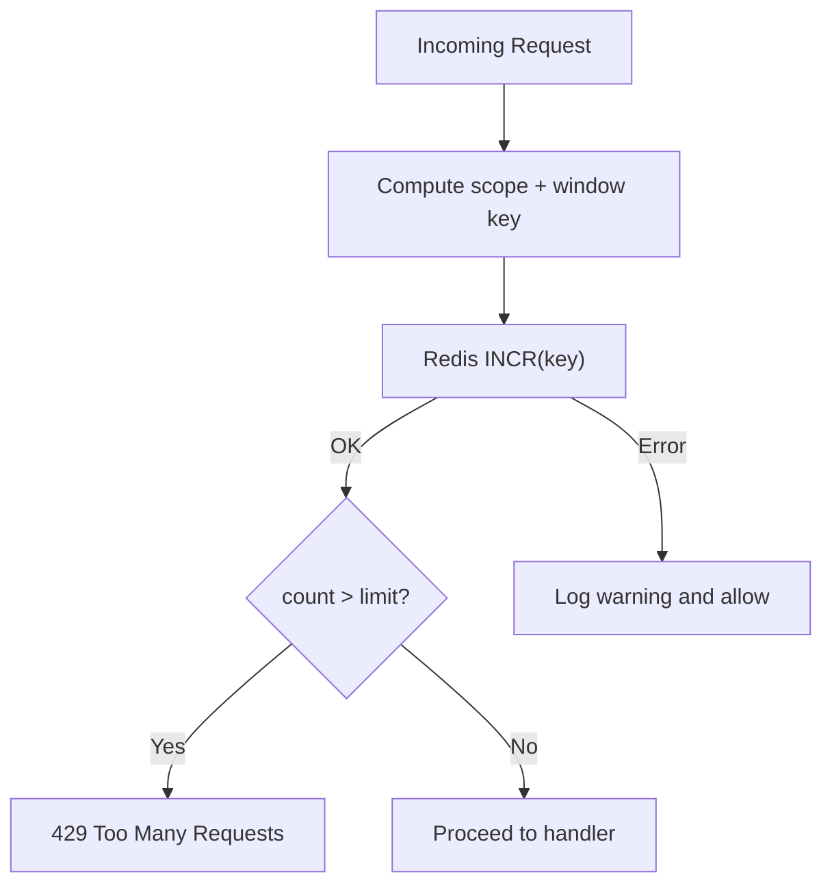
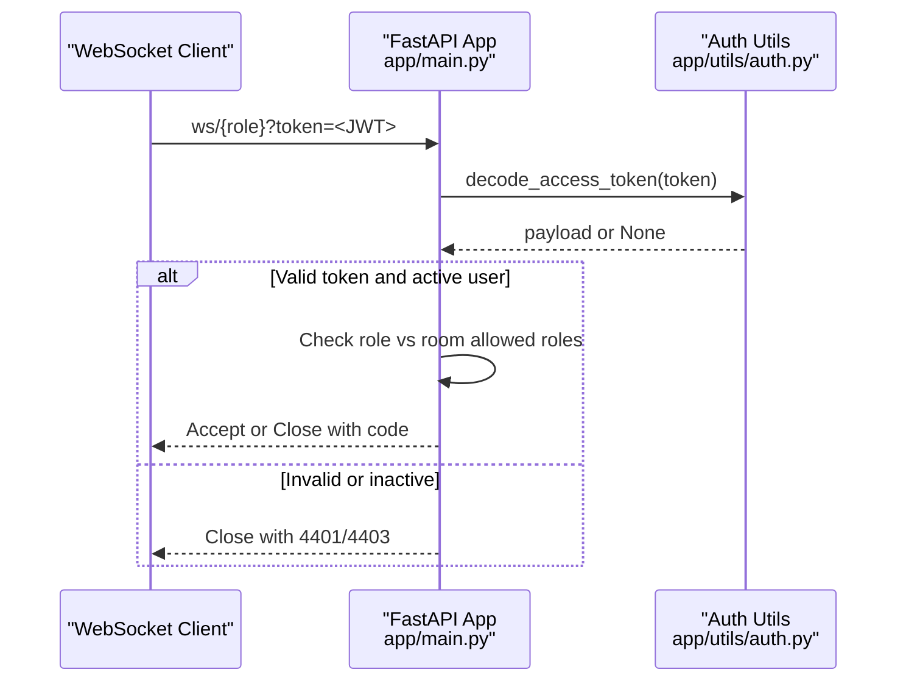
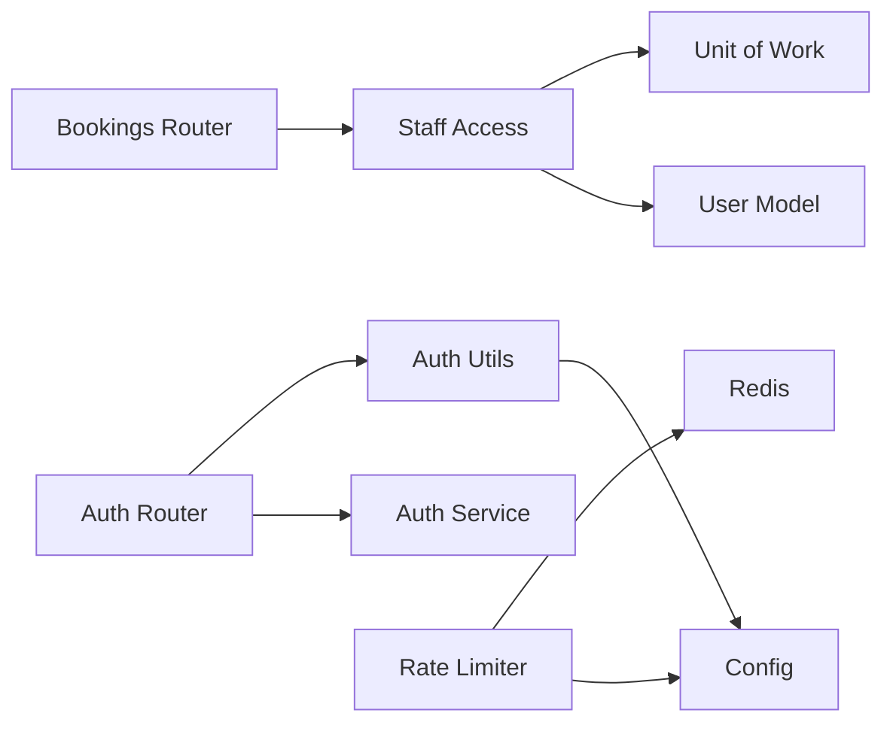

# Security & Authentication

<cite>
**Referenced Files in This Document**
- [main.py](file://app/main.py)
- [auth.py](file://app/utils/auth.py)
- [auth_service.py](file://app/services/auth_service.py)
- [auth.py](file://app/api/v1/auth.py)
- [user.py](file://app/models/user.py)
- [user.py](file://app/schemas/user.py)
- [permissions.py](file://app/utils/permissions.py)
- [staff_access.py](file://app/utils/staff_access.py)
- [rate_limit.py](file://app/utils/rate_limit.py)
- [bookings.py](file://app/api/v1/bookings.py)
- [admin.py](file://app/api/v1/admin.py)
- [config.py](file://app/config.py)
</cite>

## Table of Contents
1. Introduction
2. Project Structure
3. Core Components
4. Architecture Overview
5. Detailed Component Analysis
6. Dependency Analysis
7. Performance Considerations
8. Troubleshooting Guide
9. Conclusion

## Introduction
This document explains the security and authentication mechanisms implemented in the backend, focusing on:
- JWT-based authentication flow (token generation, validation, and refresh strategy)
- Role-based access control (RBAC) for user roles and staff permissions
- Security middleware for rate limiting, input validation, and request sanitization
- Password hashing with Argon2, session management, and secure communication practices
- Practical examples of custom authentication decorators, permission checks, and best practices for API endpoints

## Project Structure
Security-related code is organized across utilities, services, schemas, models, and API routers:
- Authentication utilities and dependencies live under app/utils/auth.py
- RBAC and staff permissions are centralized in app/utils/permissions.py and app/utils/staff_access.py
- Rate limiting is provided by app/utils/rate_limit.py
- Authentication API endpoints are defined in app/api/v1/auth.py
- Role model and schema definitions are in app/models/user.py and app/schemas/user.py
- Global middleware and WebSocket authorization are in app/main.py
- Configuration for secrets and CORS is in app/config.py

**Diagram sources**
- [main.py:51-76](file://app/main.py#L51-L76)
- [auth.py:82-101](file://app/api/v1/auth.py#L82-L101)
- [auth.py:85-112](file://app/utils/auth.py#L85-L112)
- [staff_access.py:159-178](file://app/utils/staff_access.py#L159-L178)
- [permissions.py:25-87](file://app/utils/permissions.py#L25-L87)
- [rate_limit.py:42-70](file://app/utils/rate_limit.py#L42-L70)
- [config.py:4-11](file://app/config.py#L4-L11)

**Section sources**
- [main.py:51-76](file://app/main.py#L51-L76)
- [config.py:4-11](file://app/config.py#L4-L11)

## Core Components
- JWT token lifecycle: creation, decoding, and dependency injection for protected routes
- Password hashing with Argon2 and verification
- Role-based guards for admin and manager scopes
- Staff-level RBAC with permission codes and venue scoping
- Rate limiting via Redis with graceful degradation
- Input validation via Pydantic schemas
- Secure communication through CORS configuration and HTTPS recommendations

**Section sources**
- [auth.py:26-54](file://app/utils/auth.py#L26-L54)
- [auth.py:85-112](file://app/utils/auth.py#L85-L112)
- [auth_service.py:7-33](file://app/services/auth_service.py#L7-L33)
- [permissions.py:25-87](file://app/utils/permissions.py#L25-L87)
- [staff_access.py:44-77](file://app/utils/staff_access.py#L44-L77)
- [rate_limit.py:42-70](file://app/utils/rate_limit.py#L42-L70)
- [user.py:7-25](file://app/schemas/user.py#L7-L25)
- [main.py:58-76](file://app/main.py#L58-L76)

## Architecture Overview
The system uses FastAPI with a layered approach:
- Routers define endpoints and apply dependencies for auth and permissions
- Dependencies resolve current users from JWT tokens and enforce role or permission checks
- Services encapsulate business logic (e.g., authentication, booking confirmation)
- Utilities provide cross-cutting concerns (password hashing, RBAC, rate limiting)
- Configuration centralizes secrets and runtime settings

**Diagram sources**
- [auth.py:82-101](file://app/api/v1/auth.py#L82-L101)
- [auth_service.py:7-14](file://app/services/auth_service.py#L7-L14)
- [auth.py:26-54](file://app/utils/auth.py#L26-L54)
- [rate_limit.py:67-68](file://app/utils/rate_limit.py#L67-L68)

## Detailed Component Analysis

### JWT-Based Authentication Flow
- Token creation: Encodes user identifier into a signed JWT with an expiration derived from configuration.
- Token validation: Decodes and verifies signature and expiry; returns None for invalid tokens to support optional contexts (e.g., WebSocket).
- Current user resolution: Validates token, resolves user from database, ensures account is active, and raises appropriate errors otherwise.
- Login endpoint: Authenticates user, enforces verification status for managers, updates last login, and issues JWT.

**Diagram sources**
- [auth.py:82-101](file://app/api/v1/auth.py#L82-L101)
- [auth.py:26-54](file://app/utils/auth.py#L26-L54)
- [rate_limit.py:67-68](file://app/utils/rate_limit.py#L67-L68)

**Section sources**
- [auth.py:82-101](file://app/api/v1/auth.py#L82-L101)
- [auth.py:45-67](file://app/utils/auth.py#L45-L67)
- [auth.py:85-102](file://app/utils/auth.py#L85-L102)
- [auth_service.py:7-14](file://app/services/auth_service.py#L7-L14)

### Password Hashing with Argon2
- Passwords are hashed using Argon2 with configurable cost parameters to resist brute-force attacks.
- Verification wraps exceptions to ensure safe handling and consistent responses.
- Password change flows validate old password before updating to a new hash.

Best practices:
- Enforce maximum password length at schema level to prevent oversized payloads.
- Never log or return raw passwords; only hashes are stored.

**Section sources**
- [auth.py:16-43](file://app/utils/auth.py#L16-L43)
- [auth_service.py:16-33](file://app/services/auth_service.py#L16-L33)
- [user.py:18-25](file://app/schemas/user.py#L18-L25)

### Role-Based Access Control (RBAC)
Two layers of RBAC are implemented:

1) User roles for coarse-grained access:
- Roles: user, venue_manager, club_admin, super_admin
- Guards: get_current_admin restricts to super_admin; get_current_manager allows venue_manager, club_admin, super_admin

2) Staff permissions for fine-grained, venue-scoped operations:
- Permission codes define actions (e.g., booking.view, finance.manage)
- Default matrices map staff positions to permission sets
- Venue scoping ensures users can only act within authorized venues unless they are super admins or venue owners

**Diagram sources**
- [user.py:7-12](file://app/models/user.py#L7-L12)
- [permissions.py:25-87](file://app/utils/permissions.py#L25-L87)
- [staff_access.py:123-178](file://app/utils/staff_access.py#L123-L178)

**Section sources**
- [auth.py:104-112](file://app/utils/auth.py#L104-L112)
- [permissions.py:25-87](file://app/utils/permissions.py#L25-L87)
- [staff_access.py:44-77](file://app/utils/staff_access.py#L44-L77)
- [staff_access.py:123-178](file://app/utils/staff_access.py#L123-L178)

### Security Middleware: Rate Limiting, Validation, Sanitization
- Rate limiting: Fixed-window counters per IP, path, and time window using Redis; graceful degradation if Redis is unavailable; standardized 429 responses with Retry-After header.
- Input validation: Pydantic schemas enforce patterns (e.g., phone numbers), lengths, and types; validators guard against oversized inputs like long passwords.
- Request sanitization: Centralized parsing and normalization in schemas; venue-scoped RBAC prevents unauthorized data exposure or mutation.

**Diagram sources**
- [rate_limit.py:42-70](file://app/utils/rate_limit.py#L42-L70)

**Section sources**
- [rate_limit.py:1-86](file://app/utils/rate_limit.py#L1-L86)
- [user.py:7-37](file://app/schemas/user.py#L7-L37)
- [bookings.py:85-96](file://app/api/v1/bookings.py#L85-L96)

### Session Management and Refresh Strategy
- Stateless JWTs: Tokens carry minimal claims (sub = phone) and expire based on configuration. No server-side sessions are maintained.
- Refresh mechanism: Not implemented in this codebase. Clients should re-authenticate after token expiry or implement client-side refresh using a separate refresh token flow if needed.

Recommendation:
- If long-lived sessions are required, introduce a refresh token endpoint that issues short-lived access tokens and long-lived refresh tokens, with rotation and revocation strategies.

**Section sources**
- [auth.py:45-67](file://app/utils/auth.py#L45-L67)
- [config.py:7-9](file://app/config.py#L7-L9)

### Secure Communication Practices
- CORS: Configured with explicit allowed origins and credentials enabled. Ensure production origins are restricted to trusted domains.
- Secrets: JWT secret and algorithm are loaded from settings; rotate secrets regularly and never hardcode them.
- Transport: Deploy behind HTTPS/TLS termination to protect tokens in transit.

**Section sources**
- [main.py:58-76](file://app/main.py#L58-L76)
- [config.py:4-11](file://app/config.py#L4-L11)

### Practical Examples: Custom Decorators and Permission Checks
- Protect endpoints with role-based dependencies:
  - Use get_current_admin for super_admin-only routes (e.g., admin endpoints)
  - Use get_current_manager for venue_manager, club_admin, super_admin routes
- Protect venue-scoped operations with staff RBAC:
  - Use require_venue_permission(Perm.XXX) to enforce specific permission codes
  - Combine with ensure_venue_permission for inline checks when needed

Example usage patterns:
- Admin endpoints depend on get_current_admin to restrict access to super_admin
- Booking endpoints use ensure_venue_permission with specific permission codes to authorize actions like confirm or reject pending bookings

**Section sources**
- [admin.py:23-29](file://app/api/v1/admin.py#L23-L29)
- [bookings.py:85-111](file://app/api/v1/bookings.py#L85-L111)
- [staff_access.py:159-178](file://app/utils/staff_access.py#L159-L178)

### WebSocket Authorization
- WebSocket connections accept a JWT via query parameter due to browser limitations
- Connections are validated using the same token decoding logic; inactive users are rejected
- Role-based rooms restrict access to managers and admins; personal channels enforce ownership

**Diagram sources**
- [main.py:100-153](file://app/main.py#L100-L153)
- [auth.py:57-83](file://app/utils/auth.py#L57-L83)

**Section sources**
- [main.py:30-36](file://app/main.py#L30-L36)
- [main.py:100-153](file://app/main.py#L100-L153)
- [auth.py:57-83](file://app/utils/auth.py#L57-L83)

## Dependency Analysis
Key dependencies and their relationships:
- API routers depend on auth utilities for current user resolution and role guards
- Staff access depends on user model and unit of work to resolve venue ownership and staff assignments
- Rate limiter depends on Redis and configuration for URL and limits
- Auth service depends on user repository and auth utilities for password verification and hashing

**Diagram sources**
- [auth.py:82-101](file://app/api/v1/auth.py#L82-L101)
- [auth_service.py:7-14](file://app/services/auth_service.py#L7-L14)
- [staff_access.py:123-178](file://app/utils/staff_access.py#L123-L178)
- [rate_limit.py:42-70](file://app/utils/rate_limit.py#L42-L70)
- [config.py:4-11](file://app/config.py#L4-L11)

**Section sources**
- [auth.py:82-101](file://app/api/v1/auth.py#L82-L101)
- [staff_access.py:123-178](file://app/utils/staff_access.py#L123-L178)
- [rate_limit.py:42-70](file://app/utils/rate_limit.py#L42-L70)

## Performance Considerations
- JWT decoding is lightweight; avoid storing large payloads in tokens
- Rate limiting uses Redis; ensure connection pooling and monitor latency
- RBAC checks load minimal data (venue and assignment); keep queries efficient
- Avoid logging sensitive data such as passwords or tokens

[No sources needed since this section provides general guidance]

## Troubleshooting Guide
Common issues and resolutions:
- 401 Unauthorized: Invalid or missing JWT; ensure clients send Bearer token correctly
- 403 Forbidden: Insufficient role or permission; verify user role and staff assignment for venue-scoped actions
- 429 Too Many Requests: Rate limit exceeded; back off according to Retry-After header
- Inactive user: Account not activated; requires admin approval for certain roles
- Redis unavailable: Rate limiter degrades gracefully; check logs for warnings

**Section sources**
- [auth.py:85-102](file://app/utils/auth.py#L85-L102)
- [staff_access.py:123-178](file://app/utils/staff_access.py#L123-L178)
- [rate_limit.py:42-70](file://app/utils/rate_limit.py#L42-L70)
- [auth.py:92-101](file://app/api/v1/auth.py#L92-L101)

## Conclusion
The backend implements a robust security posture with:
- Stateless JWT authentication and clear token lifecycle
- Two-layer RBAC combining user roles and staff permissions with venue scoping
- Strong password hashing with Argon2 and strict input validation
- Rate limiting with graceful degradation and standardized error responses
- Secure communication via CORS and recommended HTTPS deployment

For enhanced resilience, consider adding a refresh token flow and continuous monitoring of rate limits and security audit events.

[No sources needed since this section summarizes without analyzing specific files]