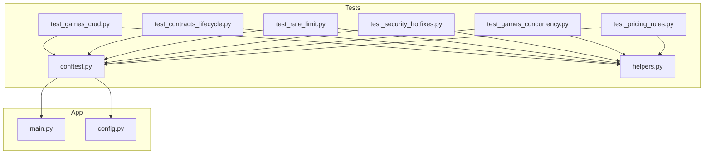
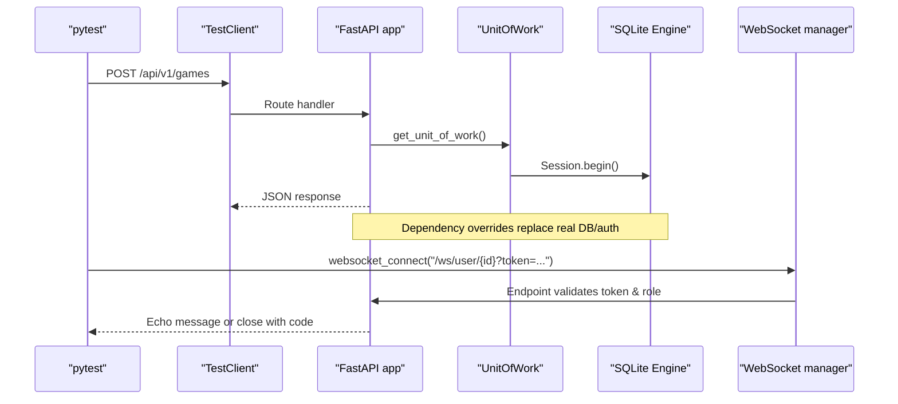
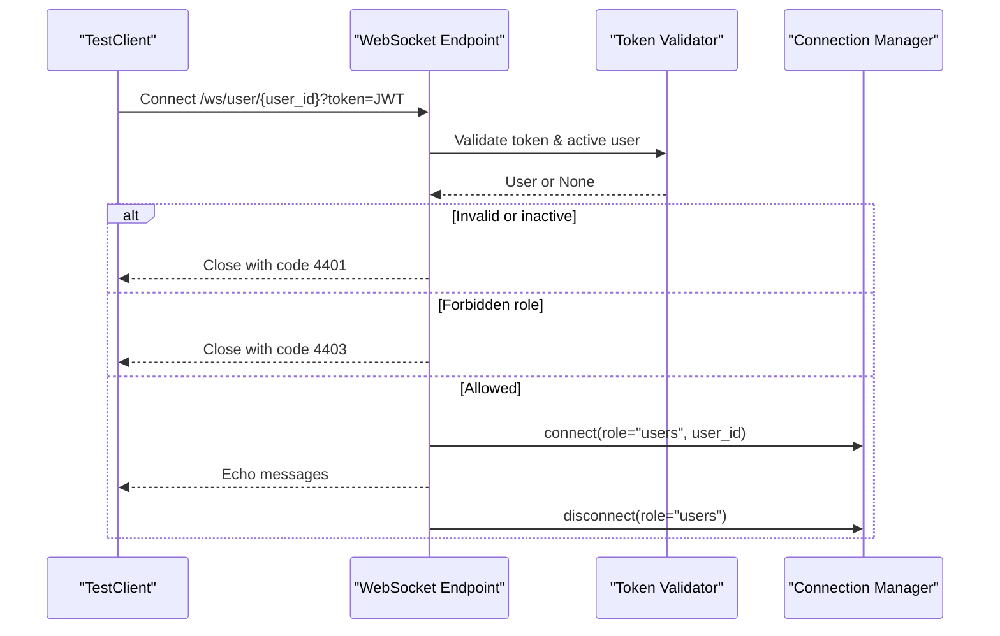
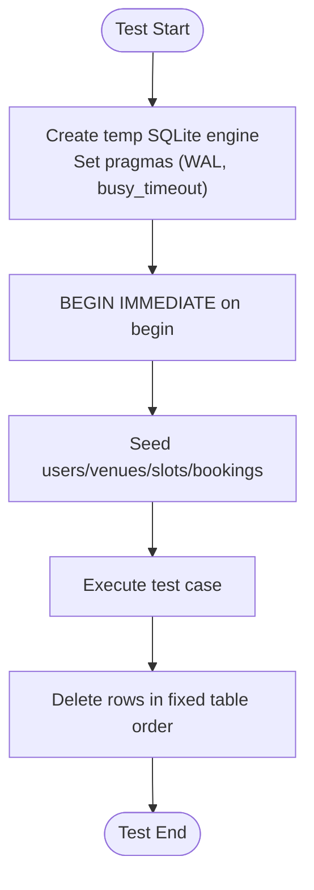
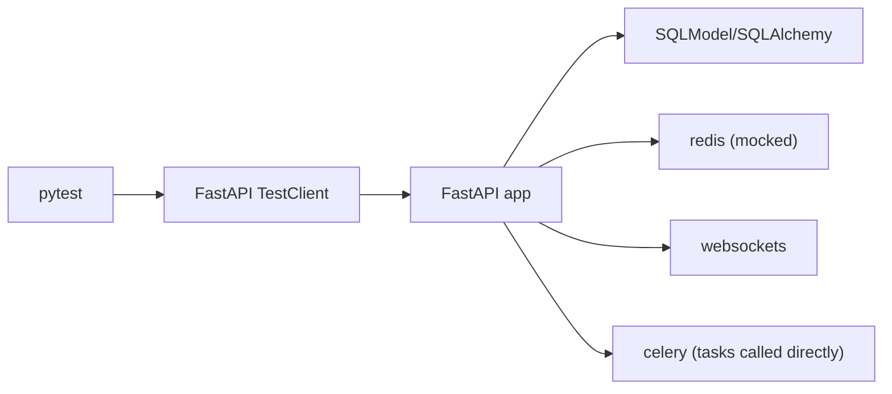

# Testing Strategy

<cite>
**Referenced Files in This Document**
- [conftest.py](file://tests/conftest.py)
- [helpers.py](file://tests/helpers.py)
- [test_games_crud.py](file://tests/test_games_crud.py)
- [test_contracts_lifecycle.py](file://tests/test_contracts_lifecycle.py)
- [test_rate_limit.py](file://tests/test_rate_limit.py)
- [test_security_hotfixes.py](file://tests/test_security_hotfixes.py)
- [test_games_concurrency.py](file://tests/test_games_concurrency.py)
- [test_pricing_rules.py](file://tests/test_pricing_rules.py)
- [main.py](file://app/main.py)
- [config.py](file://app/config.py)
- [requirements.txt](file://requirements.txt)
</cite>

## Table of Contents
1. Introduction
2. Project Structure
3. Core Components
4. Architecture Overview
5. Detailed Component Analysis
6. Dependency Analysis
7. Performance Considerations
8. Troubleshooting Guide
9. Conclusion

## Introduction
This document describes the testing strategy for the Futsal Booking System backend. It covers unit, integration, and end-to-end approaches using pytest, test fixtures and data management with an in-memory SQLite database, mocking strategies for Redis-backed services, and patterns for testing API endpoints, background tasks, and WebSocket connections. It also includes guidance on organizing tests, naming conventions, continuous integration considerations, and maintaining coverage for complex business workflows.

## Project Structure
The test suite lives under tests/ and is organized by feature area (games, contracts, pricing, security, rate limiting). A shared conftest.py configures a temporary SQLite database, dependency overrides for authentication and sessions, and seed helpers to create users, venues, slots, bookings, and games. helpers.py provides reusable utilities such as auth headers, error code extraction, and a FakeRedis implementation used to mock Redis-dependent services.

**Diagram sources**
- [conftest.py:1-268](file://tests/conftest.py#L1-L268)
- [helpers.py:1-135](file://tests/helpers.py#L1-L135)
- [main.py:1-210](file://app/main.py#L1-L210)
- [config.py:1-69](file://app/config.py#L1-L69)

**Section sources**
- [conftest.py:1-268](file://tests/conftest.py#L1-L268)
- [helpers.py:1-135](file://tests/helpers.py#L1-L135)
- [main.py:1-210](file://app/main.py#L1-L210)
- [config.py:1-69](file://app/config.py#L1-L69)

## Core Components
- Test client and dependency overrides: The test client uses FastAPI’s TestClient with overridden dependencies for user resolution, session handling, and unit-of-work to isolate tests from production DB and external services.
- In-memory SQLite engine: Tests run against a temporary SQLite database with WAL mode and explicit transaction isolation to simulate concurrency behavior safely.
- Seed helpers: Factory functions create Users, Venues, Slots, Bookings, Games, Contracts, and related entities deterministically.
- FakeRedis: An in-memory Redis-like store that supports basic operations and pipelines, used to mock Redis-dependent features like rate limiting and verification flows.
- Auth helper: Provides Authorization headers using phone numbers resolved via dependency overrides.

Key responsibilities:
- Isolation: Each test runs with a clean database state and mocked external dependencies.
- Determinism: Seeded data and predictable IDs simplify assertions.
- Realism: Concurrency and locking behaviors are validated using SQLite pragmas and BEGIN IMMEDIATE transactions.

**Section sources**
- [conftest.py:62-113](file://tests/conftest.py#L62-L113)
- [conftest.py:134-201](file://tests/conftest.py#L134-L201)
- [conftest.py:206-268](file://tests/conftest.py#L206-L268)
- [helpers.py:5-18](file://tests/helpers.py#L5-L18)
- [helpers.py:21-135](file://tests/helpers.py#L21-L135)

## Architecture Overview
The test architecture integrates with the application through dependency injection and endpoint routing. Tests send HTTP requests via TestClient and assert responses, while also inspecting the database directly when necessary. Background tasks and WebSocket endpoints are exercised through direct function calls or connection attempts.

**Diagram sources**
- [conftest.py:192-201](file://tests/conftest.py#L192-L201)
- [main.py:109-166](file://app/main.py#L109-L166)
- [main.py:168-175](file://app/main.py#L168-L175)

## Detailed Component Analysis

### Unit Testing Patterns
- Service-level logic is tested indirectly via API endpoints and directly via service methods where appropriate.
- Pricing rules and slot generation are validated by asserting computed prices and created slots.
- Rate limiting is verified by invoking limiters directly and checking exceptions and counters.

Examples:
- Pricing rule matching, peak window overlap, priority resolution, holiday semantics, and server-side price authority during booking creation.
- Rate limiter thresholds, per-IP/route scoping, graceful degradation when Redis is down, and wiring checks on routes.

**Section sources**
- [test_pricing_rules.py:87-168](file://tests/test_pricing_rules.py#L87-L168)
- [test_pricing_rules.py:173-215](file://tests/test_pricing_rules.py#L173-L215)
- [test_pricing_rules.py:226-283](file://tests/test_pricing_rules.py#L226-L283)
- [test_pricing_rules.py:287-317](file://tests/test_pricing_rules.py#L287-L317)
- [test_rate_limit.py:45-87](file://tests/test_rate_limit.py#L45-L87)
- [test_rate_limit.py:98-121](file://tests/test_rate_limit.py#L98-L121)

### Integration Testing Patterns
- End-to-end flows cover CRUD, visibility, status transitions, cascade effects, and cross-entity consistency.
- Contract lifecycle tests validate pending/reserved states, approvals with amendments, rejections freeing slots, user cancellations, audit trails, and auto-renewal/expiry tasks.
- Concurrency tests ensure capacity invariants hold under concurrent join/leave operations using threads and barriers.

Examples:
- Game creation success/failure cases, visibility filters, update constraints, start/complete flow, and cancellation cascades.
- Contract creation, manager approval/rejection, user cancel, audit trail ordering, and expiry task outcomes.
- Concurrent joins respecting capacity and waitlist ordering; leave/join race conditions preserving invariants.

**Section sources**
- [test_games_crud.py:29-80](file://tests/test_games_crud.py#L29-L80)
- [test_games_crud.py:84-105](file://tests/test_games_crud.py#L84-L105)
- [test_games_crud.py:107-143](file://tests/test_games_crud.py#L107-L143)
- [test_games_crud.py:148-183](file://tests/test_games_crud.py#L148-L183)
- [test_games_crud.py:188-207](file://tests/test_games_crud.py#L188-L207)
- [test_games_crud.py:211-264](file://tests/test_games_crud.py#L211-L264)
- [test_contracts_lifecycle.py:114-131](file://tests/test_contracts_lifecycle.py#L114-L131)
- [test_contracts_lifecycle.py:159-185](file://tests/test_contracts_lifecycle.py#L159-L185)
- [test_contracts_lifecycle.py:199-238](file://tests/test_contracts_lifecycle.py#L199-L238)
- [test_contracts_lifecycle.py:243-280](file://tests/test_contracts_lifecycle.py#L243-L280)
- [test_contracts_lifecycle.py:306-353](file://tests/test_contracts_lifecycle.py#L306-L353)
- [test_contracts_lifecycle.py:357-377](file://tests/test_contracts_lifecycle.py#L357-L377)
- [test_contracts_lifecycle.py:381-449](file://tests/test_contracts_lifecycle.py#L381-L449)
- [test_games_concurrency.py:16-69](file://tests/test_games_concurrency.py#L16-L69)
- [test_games_concurrency.py:72-118](file://tests/test_games_concurrency.py#L72-L118)

### End-to-End Testing Patterns
- Authentication flows: Tests assert login/register/verification endpoints respect rate limits and dev-code exposure gating based on configuration flags.
- WebSocket authentication: Tests verify invalid tokens, unauthorized roles, owner-only channels, and super-admin access.
- Security hotfixes: Ensure sensitive codes are not leaked unless explicitly allowed in development settings.

**Diagram sources**
- [main.py:100-166](file://app/main.py#L100-L166)
- [test_security_hotfixes.py:48-106](file://tests/test_security_hotfixes.py#L48-L106)

**Section sources**
- [test_security_hotfixes.py:19-44](file://tests/test_security_hotfixes.py#L19-L44)
- [test_security_hotfixes.py:48-106](file://tests/test_security_hotfixes.py#L48-L106)
- [test_security_hotfixes.py:110-154](file://tests/test_security_hotfixes.py#L110-L154)
- [test_rate_limit.py:111-121](file://tests/test_rate_limit.py#L111-L121)

### Background Tasks Testing
- Expiry and renewal tasks are invoked directly within tests to assert contract state changes, slot statuses, and audit events.
- Tests set up scenarios (expired terms, objections, past scheduled sessions) and call task entry points to validate outcomes.

**Section sources**
- [test_contracts_lifecycle.py:381-449](file://tests/test_contracts_lifecycle.py#L381-L449)

### Data Management and Fixtures
- Temporary SQLite database with WAL and busy timeout ensures realistic concurrency behavior.
- Transaction isolation via BEGIN IMMEDIATE serializes writes to avoid snapshot-isolation surprises.
- Clean-up fixture deletes all tables in a deterministic order before each test.
- Sent notifications captured in memory allow assertions on notification payloads without external mail systems.

**Diagram sources**
- [conftest.py:62-83](file://tests/conftest.py#L62-L83)
- [conftest.py:118-140](file://tests/conftest.py#L118-L140)

**Section sources**
- [conftest.py:62-113](file://tests/conftest.py#L62-L113)
- [conftest.py:118-140](file://tests/conftest.py#L118-L140)
- [conftest.py:143-148](file://tests/conftest.py#L143-L148)

### Mock Implementations
- FakeRedis implements a subset of Redis operations used by rate limiting, verification, and pending booking services.
- Pipelines are simulated to batch operations and execute them sequentially, enabling assertions on operation sequences.

**Section sources**
- [helpers.py:21-135](file://tests/helpers.py#L21-L135)
- [test_rate_limit.py:19-23](file://tests/test_rate_limit.py#L19-L23)
- [test_contracts_lifecycle.py:24-29](file://tests/test_contracts_lifecycle.py#L24-L29)
- [test_pricing_rules.py:25-30](file://tests/test_pricing_rules.py#L25-L30)
- [test_security_hotfixes.py:19-25](file://tests/test_security_hotfixes.py#L19-L25)

### API Endpoint Testing
- Use TestClient to issue HTTP requests with auth headers generated by helpers.auth(phone).
- Assert status codes, structured error codes extracted via helpers.err_code(response), and response payloads.
- Verify RBAC by creating multiple users with different roles and asserting access control.

**Section sources**
- [helpers.py:5-18](file://tests/helpers.py#L5-L18)
- [test_games_crud.py:29-80](file://tests/test_games_crud.py#L29-L80)
- [test_contracts_lifecycle.py:114-131](file://tests/test_contracts_lifecycle.py#L114-L131)
- [test_pricing_rules.py:226-283](file://tests/test_pricing_rules.py#L226-L283)

### Business Logic Validation
- Enforce business invariants such as game capacity, status transitions, contract slot reservation/release, pricing rule application, and server-side price authority.
- Validate cascade effects (e.g., game cancellation revoking invitations and refunding payments) and audit trails.

**Section sources**
- [test_games_crud.py:188-264](file://tests/test_games_crud.py#L188-L264)
- [test_contracts_lifecycle.py:159-238](file://tests/test_contracts_lifecycle.py#L159-L238)
- [test_pricing_rules.py:87-168](file://tests/test_pricing_rules.py#L87-L168)
- [test_pricing_rules.py:287-317](file://tests/test_pricing_rules.py#L287-L317)

### Error Handling Scenarios
- Assert specific error codes and status codes for authorization failures, invalid transitions, conflicts, and rate limiting.
- Confirm graceful degradation when Redis is unavailable for rate limiting.

**Section sources**
- [test_games_crud.py:42-80](file://tests/test_games_crud.py#L42-L80)
- [test_games_crud.py:158-183](file://tests/test_games_crud.py#L158-L183)
- [test_rate_limit.py:45-87](file://tests/test_rate_limit.py#L45-L87)
- [test_rate_limit.py:111-121](file://tests/test_rate_limit.py#L111-L121)

## Dependency Analysis
The test suite depends on:
- FastAPI and TestClient for HTTP and WebSocket testing.
- SQLModel/SQLAlchemy for database interactions and migrations.
- Redis client library for rate limiting and verification (mocked in tests).
- Celery for background tasks (invoked directly in tests).
- Websockets for WebSocket communication.

**Diagram sources**
- [requirements.txt:1-18](file://requirements.txt#L1-L18)
- [conftest.py:25-33](file://tests/conftest.py#L25-L33)
- [main.py:1-28](file://app/main.py#L1-L28)

**Section sources**
- [requirements.txt:1-18](file://requirements.txt#L1-L18)
- [conftest.py:25-33](file://tests/conftest.py#L25-L33)
- [main.py:1-28](file://app/main.py#L1-L28)

## Performance Considerations
- Use short-lived sessions and commit/refresh/close patterns to avoid holding locks across HTTP calls.
- Leverage SQLite WAL and busy timeouts to reduce contention during concurrent tests.
- Prefer targeted seeds and minimal data sets to keep tests fast and deterministic.
- Avoid unnecessary network calls; rely on FakeRedis and dependency overrides.

[No sources needed since this section provides general guidance]

## Troubleshooting Guide
Common issues and resolutions:
- Database lock contention: Ensure sessions are closed after writes and use the provided seed helpers which manage commits and refreshes appropriately.
- Redis dependency errors: Use FakeRedis fixtures to avoid real Redis requirements; confirm monkeypatching targets in tests.
- WebSocket close codes: Expect 4401 for invalid/missing tokens and 4403 for forbidden roles; verify token generation and role assignments.
- Rate limiting false positives: Confirm scope and IP separation; check that tests do not share state unintentionally.

**Section sources**
- [conftest.py:62-83](file://tests/conftest.py#L62-L83)
- [conftest.py:206-268](file://tests/conftest.py#L206-L268)
- [test_security_hotfixes.py:48-106](file://tests/test_security_hotfixes.py#L48-L106)
- [test_rate_limit.py:45-87](file://tests/test_rate_limit.py#L45-L87)

## Conclusion
The test suite employs a robust mix of unit, integration, and end-to-end strategies centered around isolated SQLite databases, dependency overrides, and FakeRedis mocks. It validates critical business workflows including games, contracts, pricing, security, and rate limiting, while ensuring concurrency invariants and correct error handling. By following the established patterns—seeded data, clear assertions, and focused fixtures—you can maintain high confidence in system behavior and extend coverage as the application evolves.

[No sources needed since this section summarizes without analyzing specific files]